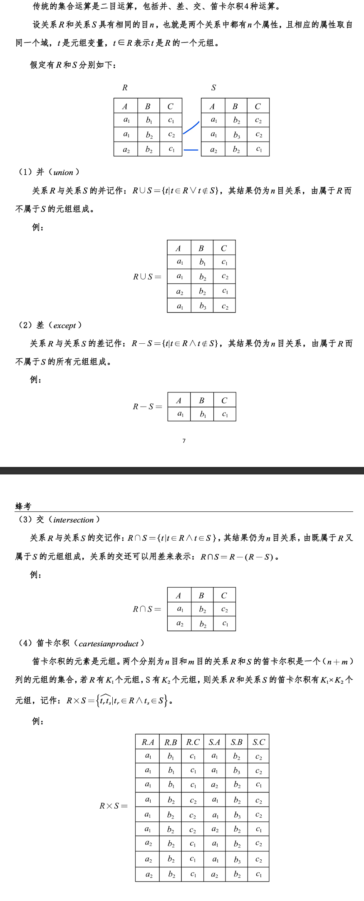
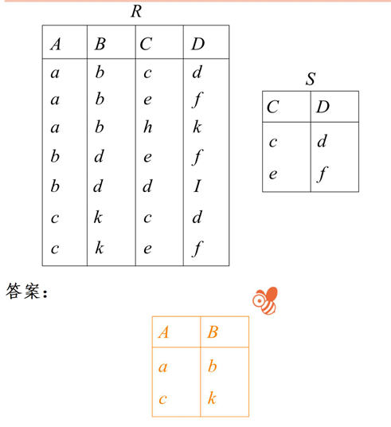
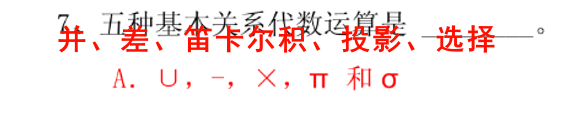
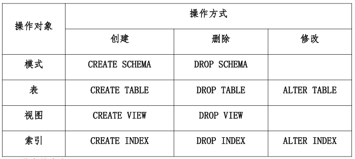
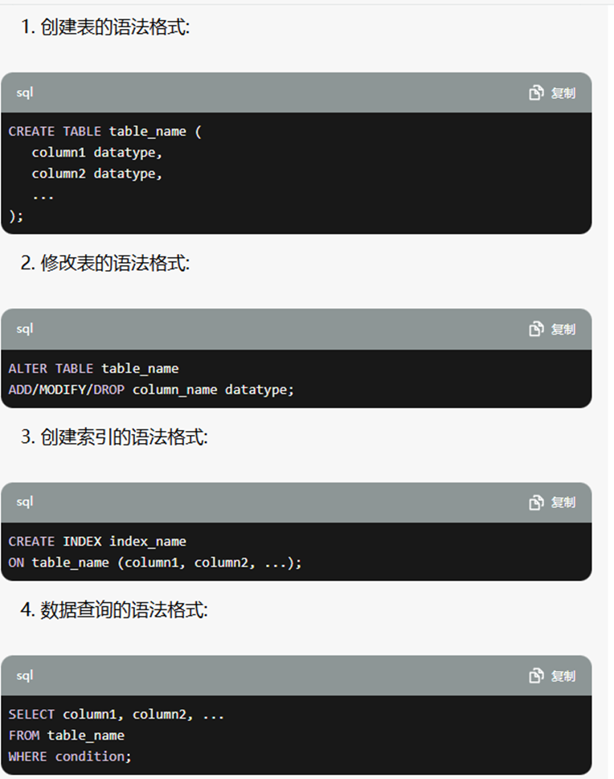
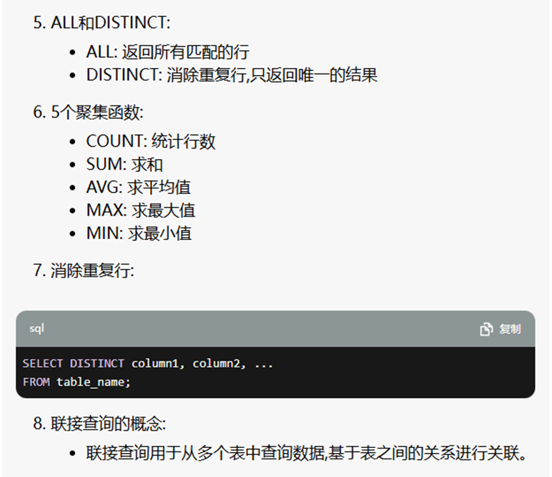
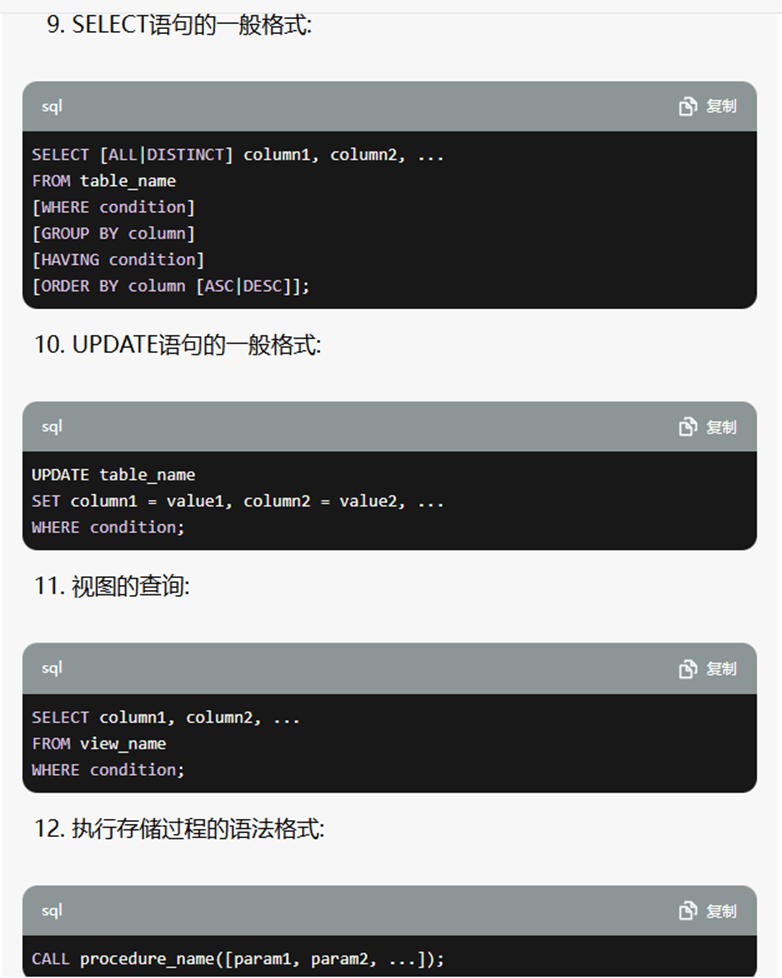
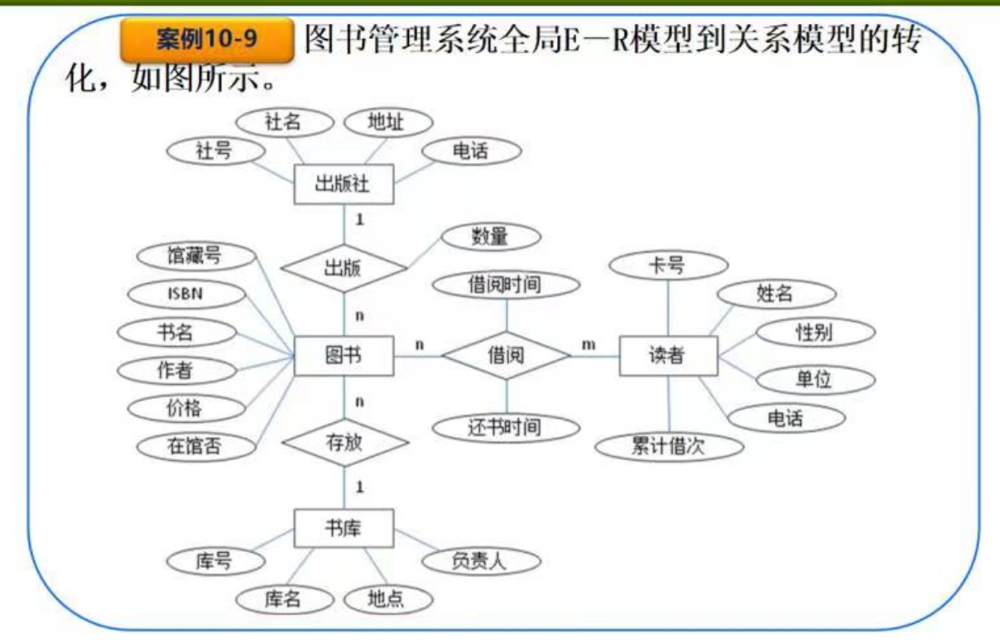
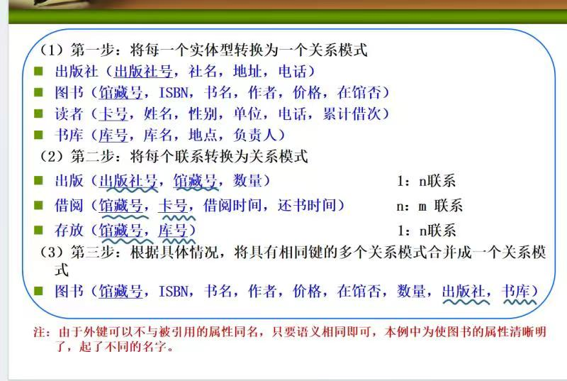

>   ==数据库管理技术发展==：人工管理阶段、文件系统阶段、数据库系统阶段。

>   ==数据模型==，主要是建立数据库的一个简单建模过程
>
>   -   概念模型（确定实体，确定实体间的关系）
>   -   逻辑模型（每实体间关系都有哪些约束，每实体都有哪些属性）
>   -   物理模型（转化为真实的数据库）。
>
>   数据模型一般包含：数据结构、数据操作、完整性约束，一个数据模型通常由若干个关系模式构成。
>
>   在关系数据库中，一个 ==关系模式== 通常由以下几部分组成：
>
>   1.  **表名（Relation Name）**：表在数据库中的唯一标识符。
>   2.  **属性（Attributes）**：表中的列或字段，描述了表中存储的数据项的名称和类型。
>   3.  **域（Domain）**：每个属性的数据类型和取值范围。
>   4.  **键（Keys）**：主键和候选键（一个完全决定一个元组的属性或属性组 `K`），用于唯一标识表中的每条记录。
>   5.  **约束（Constraints）**：表中数据的完整性约束条件，例如唯一约束、外键约束等。
>
>   数据库应用系统设计所经过的前四个阶段是需求分析、概念结构设计、逻辑结构设计、物理结构设计。

>   ==逻辑模式==，主要是确保应用程序和数据的独立性
>
>   -   外模式：用户看到的视图和权限，也被称为子模式和用户模式
>   -   模式：数据库的设计和表结构
>   -   内模式：数据的实际存储和优化方式

>   ==模式映像==，逻辑模式中的两层映像，主要是确保转化
>
>   **外模式/模式映像** 和 **模式/内模式映像** 是数据库体系结构中两个不同的映像层次，它们的主要目的是在不同层次之间进行转换，确保数据库系统的抽象和独立性。而这两层确保的就是 **数据逻辑独立性安全** 和 **数据物理独立性安全**。
>
>   数据库系统的三层模式和两级映像指的是数据库系统由外**模式、模式和内模式**三层模式构成，且在这三层模式之间提供了**外模式/模式映像、模式/内模式映像两级映像**。其中的三种模式是对数据库系统三个层次的抽象，为了能够在计算机系统内部实现这三个层次上的转换和联系，数据库管理系统在三层模式之间提供了两级映像功能，用来保证数据库系统具有较高的数据独立性。

>   ==集合运算==
>
>   -   传统运算：并集、交集、差集、笛卡尔积
>
>       
>
>   -   关系运算：
>
>       选择 $\sigma$（从行中选择符合条件的行组成新的表）
>
>       投影 $\pi$（从列中选择若干属性的行组成新的表）
>
>       连接 $\bowtie$（满足某种关系的笛卡尔积表，分为等值连接（找 A 和 B 中某属性值相等的列，将列合并起来得到新的表）和自然连接（找 A 和 B 中重复的列并且去重，B 有但是 A 没有的列），其中自然连接分为左连接（在自然连接的基础上加上左表中自然连接没有的行，没有的属性值写 null）和右连接（在自然连接的基础上加上右表中自然连接没有的行，没有的属性值写 null），而左右连接加起来就是外连接）
>
>       除运算 $/$（在 `table1` 中找到 `test2` 中有对应记录的行，最后得到的左表除去右表的新表）
>
>   其中自然连接一定是等值连接，但反过来不一定。关系运算中一定会包括选择、投影、连接。
>
>   
>
>   ==五种基本关系代数运算==
>
>   

>   ==DDL 和 DML 语言==
>
>   在数据库管理系统（`DBMS`）中，`DDL`（`Data Definition Language`）和 `DML`（`Data Manipulation Language`）是两种不同类型的SQL语言子集，用于管理和操作数据库对象和数据。
>
>   `DDL` 用于定义数据库结构和对象，例如表（`table`）、索引（`index`）、视图（`view`）、存储过程（`stored procedure`）等。主要的 `DDL` 命令包括：
>
>   1.  **CREATE**：用于创建数据库对象，如创建表、索引、视图等。
>   2.  **ALTER**：用于修改数据库对象的结构，如修改表结构、增加或删除列。
>   3.  **DROP**：用于删除数据库对象，如删除表、索引、视图等。
>   4.  **TRUNCATE**：用于删除表中的所有数据，但保留表结构。
>
>   `DML` 用于操作数据库中的数据，主要是通过以下命令来执行数据的查询、插入、更新和删除操作：
>
>   1.  **SELECT**：用于从数据库中查询数据。
>   2.  **INSERT**：用于向数据库表中插入新数据。
>   3.  **UPDATE**：用于更新数据库表中的现有数据。
>   4.  **DELETE**：用于从数据库表中删除数据。
>
>   

>   ==恢复技术==
>
>   数据转储和登录日志文件。

>   ==数据库完整性==是指：数据的正确性、一致性、相容性。

>   ==SQL 语言一种标准的数据库语言==，包括 查询、定义、操纵、控制 四部分功能。

# 1.简答题

## 1.1.视图

视图是一种虚拟表，它是由一个或多个基本表的行或列组成的。视图并不实际存储数据，而是根据定义的查询语句动态生成结果集。视图可以看作是一个预定义的查询，它可以简化复杂的查询操作，提高查询效率，同时也可以保护数据的安全性，隐藏敏感数据。

```sql
CREATE VIEW customer_orders AS
SELECT customers.customer_id, customers.name, orders.order_id, orders.order_date
FROM customers
JOIN orders ON customers.customer_id = orders.customer_id;
```

## 1.2.完整性

### 1.2.1.域（列）完整性

域完整性确保每个字段（列）中的数据都是有效的。它包括：

*   **数据类型**：确定每个字段可以存储的数据类型，例如整数、字符串、日期等。
*   **值域**：规定字段中可以接受的具体值范围，例如年龄字段必须是 0 到 120 之间的整数。
*   **默认值**：如果插入数据时没有指定某个字段的值，则使用默认值。
*   **约束**：例如字段是否可以为空（NOT NULL）、字段值是否唯一（UNIQUE）等。

这些规则帮助防止无效数据进入数据库。例如，年龄字段的值不能是负数，也不能是字符串。

### 1.2.2.实体（行）完整性

实体完整性确保每条记录（行）都是唯一的，不能有重复或缺失的标识。具体表现为：

*   **主键**：每个表都有一个主键，唯一标识表中的每一行。主键值不能重复，也不能为空。
*   **唯一索引**：确保某些字段中的值是唯一的，例如用户名或电子邮件地址。

举个例子，在一个用户表中，每个用户都有一个唯一的用户 ID，这样我们就可以通过用户 ID 唯一地识别每个用户。

### 1.2.3.参照（表）完整性

参照完整性确保不同表之间的关系是有效的。主要通过外键实现：

*   **外键**：一个表中的外键字段引用另一个表的主键。这确保了一个表中的值在另一个表中是有效的。
*   **触发器**：有时可以使用触发器来维护表之间的关系。

例如，有一个订单表和一个客户表。订单表中的客户 ID 引用客户表中的主键。这保证了每个订单都对应一个有效的客户。如果我们试图在订单表中插入一个不存在的客户 ID，数据库会阻止这种操作。

## 1.3.事务

事务（`Transaction`）是一组作为单个逻辑工作单元执行的操作。这些操作要么完全执行，要么完全不执行，确保数据库从一个一致的状态转换到另一个一致的状态。事务的主要目的是确保数据库的完整性和一致性，即使在系统崩溃、硬件故障或其他问题的情况下。

事务具有以下四个主要特征，通常简称为 `ACID` 特性：

1.  **原子性(Atomicity)**：一组 `DML` 语句/一个事务，要么全部成功，要么全部失败，这是由 `MySQL` 提供的机制来保障的。
2.  **一致性(Consistency)**：在事务开始和结束以后，数据库的完整性没有被破坏，写入的数据必须完全符合所有的预设规则（在 `MySQL` 中，一致性时被其他三个属性来保证的，但是需要数据库和用户来配合，才能得到一致性）

3.  **隔离性(Isolation)**：防止多个事务并发执行时由于交叉执行导致的数据不一致问题，事务隔离有不同的等级

    (1)读未提交（`Read Uncommitted`）

    (2)读提交（`Read Committed`）

    (3)可重复读（`Repeatable Read`）

    (4)串行化（`Serialzable`）

4.  **持久性(Durability)**：事务处理完后，对表中数据的影响是永久的（哪怕系统挂了也不会丢失），也就是持久化

>   原子一致隔离持久。

## 1.4.存储过程

所有的输入参数以及传给调用者的输出参数。

## 1.5.联接查询

连接查询是关系数据库中最主要的查询，主要包括 内连接、外连接、交叉连接 等。通过连接运算符可以实现多个表查询。

# 2.大题

## 2.1.基本语句







存储过程（`Stored Procedure`）是一段预先编译好的SQL代码块，存储在数据库中并被分配了一个名称，可以被反复调用执行。它类似于程序中的函数或方法，但是存储过程是在数据库管理系统中执行的，而不是在应用程序中执行。

使用 `BEGIN` 和 `END` 用于将多个 `SQL` 语句组成一个程序块，作为一个整体执行。

## 2.2.范式

-   第一范式（属性不可分离）：表中每个属性必须是不可分割的，不能出现一个属性中包含多个子属性（不要设计为“成绩”，应该设置为“数学成绩、英语成绩”）
-   第二范式（消除部分依赖）：，是指所有的非主属性都完全依赖于关键字

## 2.3.ER 图




