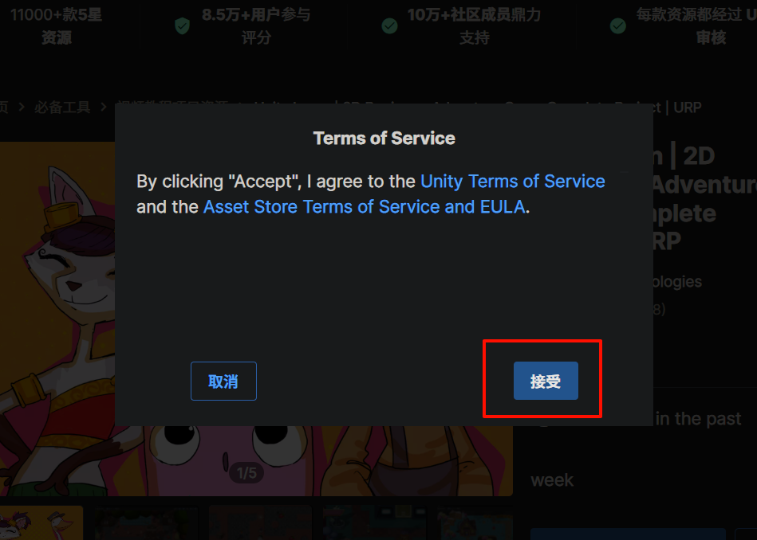
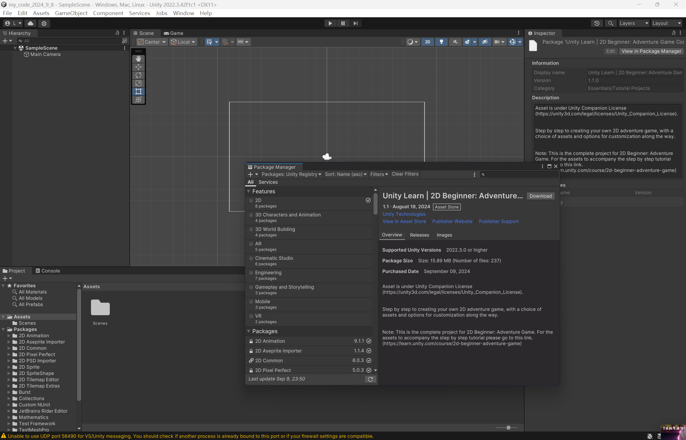
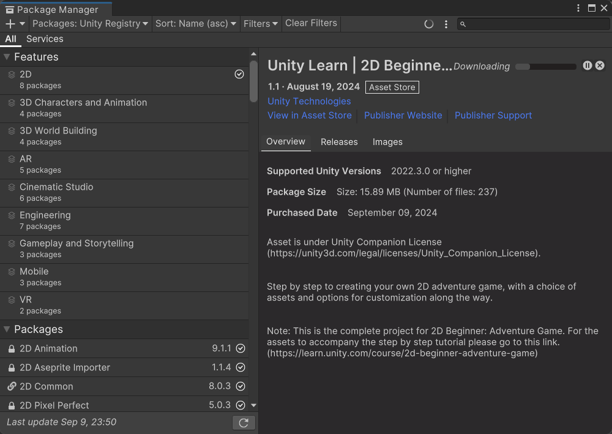
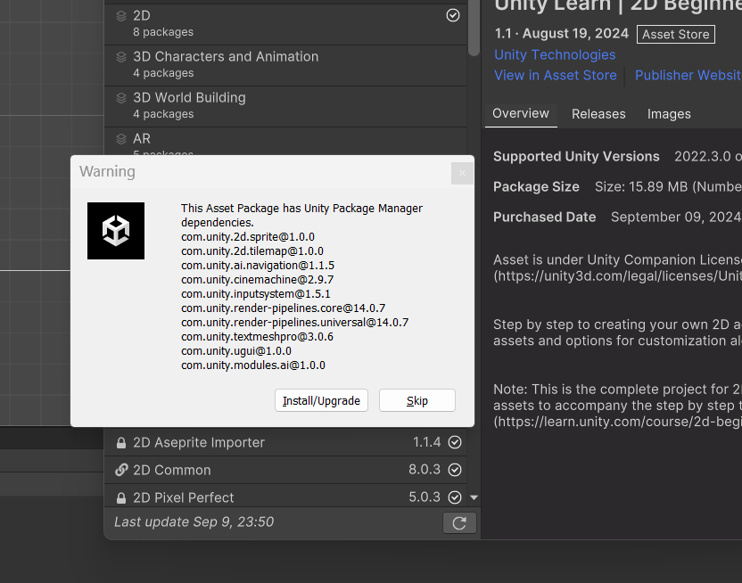
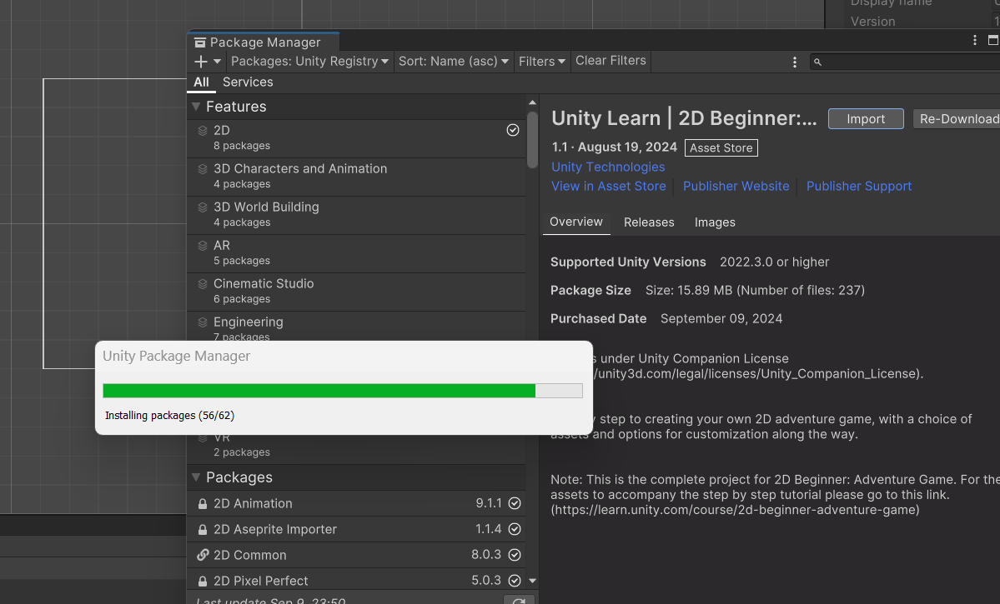
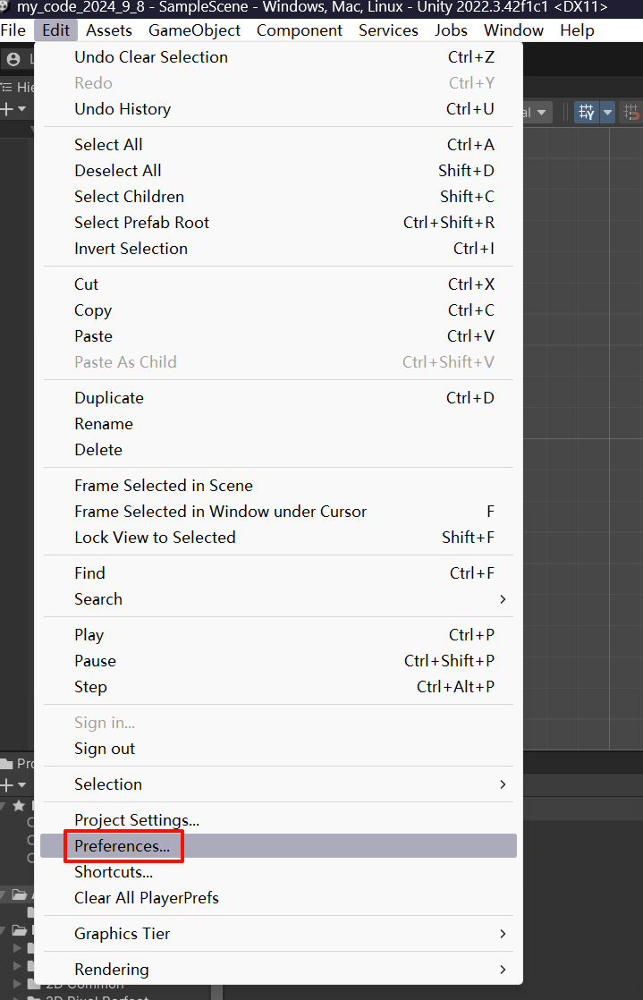

# 1.Unity 创建项目


非常直观，直接使用 `Unity Hub` 管理项目即可，创建完毕后，就会开始编译一些初始化项目的代码，编译完成后就会打开下面这段代码。

# 2.Unity 界面认识


# 3.Unity 游戏准备

## 3.1.游戏视角

[关于游戏视角可以参考这篇文档](https://docs.unity.cn/cn/current/Manual/Quickstart2DPerspective.html)

-   平面
-   侧面
-   俯视

## 3.2.游戏风格

[关于游戏风格可以参考这篇文档](https://docs.unity.cn/cn/current/Manual/Quickstart2DArt.html)

-   极简注意
-   像素艺术
-   插图
-   预渲染 `3D`

# 4.Unity 极简项目

接下来我们 [根据官方文档中的一个小游戏项目进行编码](https://learn.unity.com/project/ruby-s-adventure-2d-chu-xue-zhe)，这个项目是一个俯视视角的小游戏，您将学到许多和游戏开发相关的概念。

## 4.1.下载资源文件

先 [到官方资源库中下载资源文件](https://assetstore.unity.com/packages/essentials/tutorial-projects/unity-learn-2d-beginner-adventure-game-complete-project-urp-271239) 并且导入到 `Unity` 编辑器中。














## 4.2.添加中文模块



待补充...

## 4.3.熟悉编辑窗口


上图是官方文档给出的布局，下图是我自己导入后的布局，给您对照进行参考。


```mermaid
graph LR
Project["Project(项目文件)"]
Console["Console(控制台)"]
Hierarchy["Hierarchy(层次结构)"]
Scene["Scene(场景视图)"]
Game["Game(玩家视图)"]
Inspector["Inspector(检查员)"]
Toolbar["Toolbar(工具栏)"]
UI --> Project & Console & Hierarchy & Scene & Game & Inspector & Toolbar
```

## 4.3.了解项目文件

一个标准的 `Unity` 项目文件夹中的文件是比较多的，我们只看最顶层的父目录们，分别解释他们有何作用

```shell
$ tree -L 1
.
|-- Assembly-CSharp.csproj # C# 项目文件, 包含项目的配置信息
|-- Assets # 主要资源目录，存储游戏资源(模型、纹理、音频、脚本等)
|-- Library # Unity 的内部数据和缓存文件
|-- Logs # 存储 Unity 的日志文件，记录错误、警告和调试信息
|-- Packages # 存储项目中使用的 Unity 包
|-- ProjectSettings # 包含项目的设置文件(图形设置、输入设置等)
|-- Temp # Unity 生成的临时文件夹, 通常在关闭 Unity 时会被清空
|-- UserSettings # 存储用户特定的设置和配置文件
|-- my_code_2024_9_8.sln # Visual Studio 解决方案文件, 用于管理 C# 项目
`-- obj # 存储编译过程中生成的临时文件

```

## 4.5.添加场景放入主角

新版默认添加了一个示例场景 `SampleScene`，场景中还有一个主摄像机，如果没有就自己创建一个新的空场景，我的建议是自己新建一个，并且命名为 `MainScene`。


>   注意：经常使用 `[ctrl+s]` 是好习惯。


由于我们之前已经导入过资源了，这里可以看到已经自动为我们创建了一个精灵，直接拖拽到场景中即可。


可以在右侧查看属性，当前我们制作的是 `2D` 游戏，可以忽略其中的 `z` 轴，注意使用 `[ctrl+s]` 时刻进行保存。

## 4.6.创建新脚本


在 `Unity` 中脚本通常放置在 `Assets` 目录下的子文件夹中，这样 `Unity` 会自动识别这个文件夹中的所有文件并将其导入到项目中。


而所谓的脚本文件其实就是 `C#` 文件，我们直接在双击 `Script` 文件夹创建脚本，并且名字为 `RubyController`，我们可以在编辑器中预览脚本的内容。


不过如果我们希望开发脚本，比较正式且常规的方法是在 `VS` 中进行开发，双击编辑器中的脚本文件即可打开电脑上默认的 `VS` 环境，这里我使用的是 `VS2022` 的较新版本。

## 4.7.编写新脚本

这里假定您对 `C#` 的语法稍微熟悉，这里我对一些异于其他语言的特性和一些作用简单用注释在代码中给出，同时编写一些代码。

```c#
// 编写新脚本
using System.Collections; // 这个命名空间包含了一些非泛型集合类
using System.Collections.Generic; // 这个命名空间包含了泛型集合类
using UnityEngine; // Unity 的核心命名空间，包含了大多数 Unity API

public class NewBehaviourScript : MonoBehaviour // MonoBehaviour 是 Unity 引擎中的基类之一, 所有自定义脚本都继承自这个类
{
    private bool IsLife { get; set; } = false;

    // 脚本实例刚开始被启动后调用一次的钩子函数
    void Start()
    {
        Vector3 position = transform.position; // 使用 Vector3 类型以确保不丢失 z 轴信息

        position.x = 0; // 初始化 x 为 0
        position.y = 0; // 初始化 y 为 0

        transform.position = position; // 更新 GameObject 的位置

        // 尝试打印一个输出进行测试
        Debug.Log("Hello Unity!"); // 使用 Debug.Log 输出调试信息
    }

    // 在每一帧被反复调用的钩子函数
    void Update()
    {
        Vector3 position = transform.position; // 使用 Vector3 类型

        if (IsLife == false && position.x < 7)
        {
            position.x += 0.1f; // 在每一帧中使得 x 不断增加 0.1f
        }
        else if (IsLife == true && position.x > -7)
        {
            position.x -= 0.1f; // 在每一帧中使得 x 不断减少 0.1f
        }
        else
        {
            IsLife = !IsLife;
        }

        transform.position = position; // 更新 GameObject 的位置
    }
}

```

## 4.8.使用新脚本

保存好上述代码后，就可以回到 `Unity` 编辑器中使用我们的新脚本，直接拖拽然后运行即可。


并且控制台有我要求打印的输出。


## 4.9.使用键盘和精灵进行交互

```c#
// 使用键盘和精灵进行交互
using System.Collections; // 这个命名空间包含了一些非泛型集合类
using System.Collections.Generic; // 这个命名空间包含了泛型集合类
using UnityEngine; // Unity 的核心命名空间，包含了大多数 Unity API

public class NewBehaviourScript : MonoBehaviour // MonoBehaviour 是 Unity 引擎中的基类之一, 所有自定义脚本都继承自这个类
{
    // 脚本实例刚开始被启动后调用一次的钩子函数
    void Start()
    {
        Vector3 position = transform.position; // 使用 Vector3 类型以确保不丢失 z 轴信息

        position.x = 0; // 初始化 x 为 0
        position.y = 0; // 初始化 y 为 0

        transform.position = position; // 更新 GameObject 的位置

        // 尝试打印一个输出进行测试
        Debug.Log("Hello Unity!"); // 使用 Debug.Log 输出调试信息
    }

    // 在每一帧被反复调用的钩子函数
    void Update()
    {
        float horizontal = Input.GetAxis("Horizontal"); // Input.GetAxis() 用于获取指定轴的输入值, 默认情况下 "Horizontal" 轴通常与键盘 A 和 D 键(或 左箭头 和 右箭头), 游戏手柄左摇杆的水平移动相关联
        // 此处的区别在于您无需编写函数内部的代码
        // 因为 Unity 工程师已经为你完成此工作
        // 您在脚本中书写此类函数的名称时就是在调用函数

        Debug.Log(horizontal); // 向控制台发送一个日志消息

        // 根据按键修改精灵位置
        Vector2 position = transform.position; // 获取原本的位置
        position.x = position.x + 0.1f * horizontal; // 当玩家长按 a 或 d 时, horizontal 就会变成 -1 和 1, 什么都不按的时候 horizontal 就会变成 0
        transform.position = position;
    }
}

```


并且控制台也有很多日志输出。


可以看到，`Unity` 为我们设计好了长按 `a` 或 `d` 的行为，`horizontal` 的绝对值逐渐变大。

## 4.10.调整时间和频率

官方文档说目前的`Unity` 每秒至少可以渲染 `60` 帧，但是您也可以进行调整。

```c#
// 调整时间和频率
using System.Collections; // 这个命名空间包含了一些非泛型集合类
using System.Collections.Generic; // 这个命名空间包含了泛型集合类
using UnityEngine; // Unity 的核心命名空间，包含了大多数 Unity API

public class NewBehaviourScript : MonoBehaviour // MonoBehaviour 是 Unity 引擎中的基类之一, 所有自定义脚本都继承自这个类
{
    // 脚本实例刚开始被启动后调用一次的钩子函数
    void Start()
    {
        Vector3 position = transform.position; // 使用 Vector3 类型以确保不丢失 z 轴信息

        position.x = 0; // 初始化 x 为 0
        position.y = 0; // 初始化 y 为 0

        transform.position = position; // 更新 GameObject 的位置

        // 尝试打印一个输出进行测试
        Debug.Log("Hello Unity!"); // 使用 Debug.Log 输出调试信息

        QualitySettings.vSyncCount = 0; // 这行代码设置垂直同步的计数为 0 垂直同步 V-Sync 是一种技术, 用于防止画面撕裂(在显示器上显示的帧数与显示器的刷新率不同步)
                                        // 启用 V-Sync 后, 游戏的帧率将与显示器的刷新率同步
                                        // 0 禁用 V-Sync, 游戏将不受显示器刷新率的限制, 尽可能快地渲染帧
                                        // 1 将帧率限制为显示器的刷新率(例如 60Hz)
                                        // 2 将帧率限制为显示器刷新率的一半(例如 30Hz)
                                        // 注意禁用 V-Sync 可能会导致画面撕裂, 但可以提高帧率, 适合需要高帧率的场景

        Application.targetFrameRate = 10; // 这行代码设置应用程序的目标帧率为 10 帧每秒(FPS), targetFrameRate 这是一个属性
                                          // 用于指定应用程序希望达到的帧率, Unity 会尽量使游戏运行在这个帧率下
    }

    // 在每一帧被反复调用的钩子函数
    void Update()
    {
        float horizontal = Input.GetAxis("Horizontal"); // Input.GetAxis() 用于获取指定轴的输入值, 默认情况下 "Horizontal" 轴通常与键盘 A 和 D 键(或 左箭头 和 右箭头), 游戏手柄左摇杆的水平移动相关联
        // 此处的区别在于您无需编写函数内部的代码
        // 因为 Unity 工程师已经为你完成此工作
        // 您在脚本中书写此类函数的名称时就是在调用函数

        Debug.Log(horizontal); // 向控制台发送一个日志消息

        // 根据按键修改精灵位置
        Vector2 position = transform.position; // 获取原本的位置
        position.x = position.x + 0.1f * horizontal; // 当玩家长按 a 或 d 时, horizontal 就会变成 -1 和 1, 什么都不按的时候 horizontal 就会变成 0
        transform.position = position;
    }
}

```

看上去就像是游戏卡了一样，也就是所谓的“掉帧”，从原本的 `0.1单位 * 60帧` 变成 `0.1单位 * 10 帧`，因此如果玩家的计算机可支持帧率较低，则会导致游戏出现类似“卡顿”的现象，并且移动的速度也会受到影响，这太不公平了。

因此想要解决这样的问题，就必须使用 `单位/秒` 来表示移动速度，而不是采用目前的 `单位/帧` 来表示移动速度。同时，我们在代码里增加对 `w` 和 `s` 按键的支持，并且调高一下速度，不然动起来有些慢。

```c#
// 修正对速度的理解
using System.Collections; // 这个命名空间包含了一些非泛型集合类
using System.Collections.Generic; // 这个命名空间包含了泛型集合类
using UnityEngine; // Unity 的核心命名空间，包含了大多数 Unity API

public class NewBehaviourScript : MonoBehaviour // MonoBehaviour 是 Unity 引擎中的基类之一, 所有自定义脚本都继承自这个类
{
    // 脚本实例刚开始被启动后调用一次的钩子函数
    void Start()
    {
        Vector3 position = transform.position; // 使用 Vector3 类型以确保不丢失 z 轴信息

        position.x = 0; // 初始化 x 为 0
        position.y = 0; // 初始化 y 为 0

        transform.position = position; // 更新 GameObject 的位置

        // 尝试打印一个输出进行测试
        Debug.Log("Hello Unity!"); // 使用 Debug.Log 输出调试信息

        QualitySettings.vSyncCount = 0; // 这行代码设置垂直同步的计数为 0 垂直同步 V-Sync 是一种技术, 用于防止画面撕裂(在显示器上显示的帧数与显示器的刷新率不同步)
                                        // 启用 V-Sync 后, 游戏的帧率将与显示器的刷新率同步
                                        // 0 禁用 V-Sync, 游戏将不受显示器刷新率的限制, 尽可能快地渲染帧
                                        // 1 将帧率限制为显示器的刷新率(例如 60Hz)
                                        // 2 将帧率限制为显示器刷新率的一半(例如 30Hz)
                                        // 注意禁用 V-Sync 可能会导致画面撕裂, 但可以提高帧率, 适合需要高帧率的场景

        Application.targetFrameRate = 100; // 这行代码设置应用程序的目标帧率为 100 帧每秒(FPS), targetFrameRate 这是一个属性
                                          // 用于指定应用程序希望达到的帧率, Unity 会尽量使游戏运行在这个帧率下
    }

    // 在每一帧被反复调用的钩子函数
    void Update()
    {
        float horizontal = Input.GetAxis("Horizontal"); // Input.GetAxis() 用于获取指定轴的输入值, 默认情况下 "Horizontal" 轴通常与键盘 A 和 D 键(或 左箭头 和 右箭头), 游戏手柄左摇杆的水平移动相关联
        float vertical = Input.GetAxis("Vertical");
        // 此处的区别在于您无需编写函数内部的代码
        // 因为 Unity 工程师已经为你完成此工作
        // 您在脚本中书写此类函数的名称时就是在调用函数

        Debug.Log(horizontal); // 向控制台发送一个日志消息

        // 根据按键修改精灵位置
        Vector2 position = transform.position; // 获取原本的位置
        position.x = position.x + 3.5f * horizontal * Time.deltaTime;
        // 当玩家长按 a 或 d 时, horizontal 就会变成 -1 和 1, 什么都不按的时候 horizontal 就会变成 0
        // 这里还要乘以 Time.deltaTime 的推导逻辑如下:
        // 由于我们希望无论帧率的大小, 所有用户的速度都是一样的, 均为 v 单位/秒, 玩家1 的帧率为 f1, 玩家2 的帧率为 f2
        // 那么每一秒钟, 玩家1 渲染一帧的时间为 1/f1, 玩家2 渲染一帧的时间为 1/f2
        // 而这个函数就是在每一帧的情况下被调用了, 帧率不同意味着每一帧的移动距离各玩家都不同
        // 因此每个玩家的单位大小距离就是 x = v * t, 由于速度一样, 各个玩家的移动距离就是
        // x1 = (v) * (1/f1)
        // x2 = (v) * (1/f2)
        // 但是 Unity 有 Time.deltaTime 可以自动获取当前玩家的帧率, 因此改写为
        // x1 = (v) * Time.deltaTime
        // x2 = (v) * Time.deltaTime
        // 那 v 怎么转化呢?
        // 其实这个函数被调用的时候就加了 0.1f, 我们需要改变他的物理意义, 应该认为它是我们要求的速度, 0.1f 在这个代码里不是距离而是速度因子
        position.y = position.y + 3.5f * vertical * Time.deltaTime;

        transform.position = position;
    }
}

```


您可以自己手动修改下帧率试试，看看速度有没有什么变化。

>   补充：其实 `Unity` 也支持脚本的热重载，只需要在 `VS` 中保存好脚本代码就可以自动重新编译并且运行。

## 4.11.添加瓦片地图

`Tile map` 也就是瓦片地图，和精灵的区别比较大：

*   **瓦片地图** 主要用于构建游戏的背景和环境，通常由多个重复的图块组成，适合大规模场景的构建
*   **精灵** 则用于表示游戏中的具体对象和角色，通常是单个图像或动画，具有更高的灵活性和细节

并且，使用瓦片地图一般会涉及到网格：

*   **网格** 顾名思义，**场景**中的**网格**可用于将**游戏对象**均匀地放置在网格单元格中
*   **瓦片地图** 此瓦片地图是网格的子游戏对象。瓦片地图由瓦片组成，在本教程中，可将瓦片视为特殊的精灵
*   


然后找到之前导入的资源中的瓦片，点击 `Sprite` 的圆圈按钮，此时会显示您项目里的所有精灵，选择我们之前显示在视图上的精灵，这样就完成把瓦片分配给精灵的任务。


接下来就该添加瓦片了，我们打开瓦片选项板，添加一个新的选项板。


保存到 `Tiles` 文件夹中，然后拖拽瓦片精灵到选项板中，如果瓦片不适应网格可以考虑修改 `Pixels Per Unit`，如果没有就无需修改。

尽管我们可以设置深度 `z` 轴，但是 `2D` 游戏最好避免这么做，可以使用下面这种做法，也就是调整图层顺序，这样就不会导致地图位于主角上方。


不过可惜我们还没有设置碰撞，因此主角进行了“水上漂”这种不合理的行为，我们后面再说。

## 4.12.排序透视问题

我们尝试添加更多的精灵，但是有一个问题，主角如果走过某些物品，例如树的旁边时，应该一开始画主角，等到主角靠近树的后方时就应该优先画树，以此营造出透视的感觉。

而先前通过调整瓦片的 `Order in Layer` 属性虽然解决了瓦片地图的排序问题，但此方法并不是总是合适的，例如这里的透视效果。因为您并非总是希望一个游戏对象在另一个游戏对象之上。你需要“伪造”透视图。根据直觉，玩家希望角色在立方体前面时首先绘制角色，而角色在立方体后面时最后绘制角色。

如果用更技术性的语言来说，你需要做的是指示 `Unity` 根据游戏对象的 `y` 坐标来绘制游戏对象。屏幕上位置较低的游戏对象（`y` 坐标较小）应在屏幕上位置较高的游戏对象（`y` 坐标较大）之后绘制，这样将使位置较低的对象显示在上层。

我们这里先简单处理一下，暂时还无法完美处理，但是对于当前的我们来说足够了。