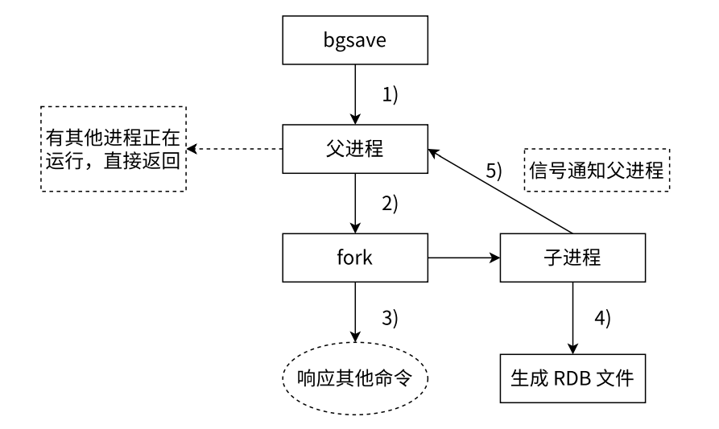
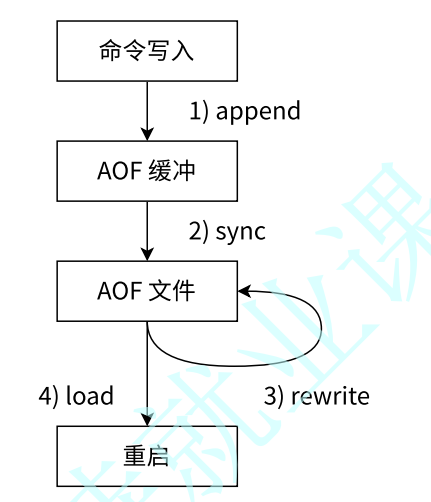
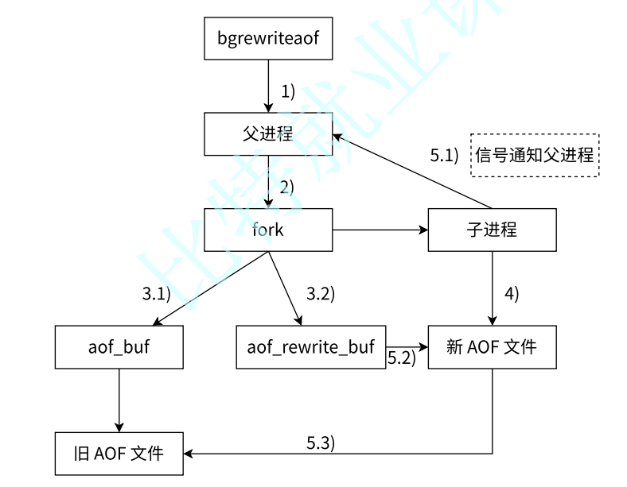

## 1.Redis 官方文档

### 1.1.Redis 的安装

[依照 Redis 官方文档即可下载 Redis](https://redis.io/docs/latest/operate/oss_and_stack/install/install-redis/install-redis-on-linux/)。

```shell
# 安装 Redis
$ sudo apt-get install lsb-release curl gpg # 以下指令可能过时, 推荐您看官方文档
$ curl -fsSL https://packages.redis.io/gpg | sudo gpg --dearmor -o /usr/share/keyrings/redis-archive-keyring.gpg
$ sudo chmod 644 /usr/share/keyrings/redis-archive-keyring.gpg
$ echo "deb [signed-by=/usr/share/keyrings/redis-archive-keyring.gpg] https://packages.redis.io/deb $(lsb_release -cs) main" | sudo tee /etc/apt/sources.list.d/redis.list
$ sudo apt-get update
$ sudo apt-get install redis

```

`Redis` 也有经典的 `CS` 模式，因此需要启动服务。

```shell
# 启动 Redis
$ sudo systemctl enable redis-server
$ sudo systemctl start redis-server

```

测试是否安装成功。

```shell
# 测试 Redis
$ redis-cli
127.0.0.1:6379> ping
PONG

```

>   [!IMPORTANT]
>
>   补充：`6379` 是 `Redis` 默认的服务端程序运行端口号。

### 1.2.Redis 的学习

接下来，可以 [根据 Redis 官方的快速学习手册进行学习](https://redis.io/docs/latest/get-started/)：

-   [Redis 作为内存中数据类型存储快速入门](https://redis.io/docs/latest/develop/get-started/data-store/)，并且还需要 [阅读 Redis 中的数据类型](https://redis.io/docs/latest/develop/data-types/)，每一个数据类型都可以有对应的文档
-   [Redis 作为文档数据库快速入门](https://redis.io/docs/latest/develop/get-started/document-database/)（但是必须额外下载 `Redis Stack`）
-   [Redis 作为矢量数据库快速入门](https://redis.io/docs/latest/develop/get-started/vector-database/)（但是必须额外下载 `Redis Stack`，并且您必须学习过机器学习）

这几个文档还是非常简单易读的，非常推荐（和本系列一起阅读更佳）。

如果觉得文档太难看懂，可以看看 [别人搬运的尚硅谷 Redis 教程(非正版...)](https://www.bilibili.com/video/BV1UnY5ehE4b?vd_source=c92c89dbfcf9cc30c48086469621f35b&spm_id_from=333.788.videopod.episodes)。

## 2.Redis 登录退出

登录方式和 `MySQL` 是一样的，可以在命令行使用客户端登录的方式，也可以只执行单条的命令，我们可以简单试试启动 `Redis` 的客户端。

```shell
# Redis 的登录和退出
# 直接使用客户端登录并且使用
$ redis-cli -h 0.0.0.0 -p 6379

0.0.0.0:6379> ping
PONG # WebSocket 协议中, PING 和 PONG 是一种心跳机制, 服务器或客户端可以发送 PING, 而接收方会响应 PONG, 以确保连接存活

0.0.0.0:6379> set key hello
OK

0.0.0.0:6379> get key
"hello"

0.0.0.0:6379> exit # 退出 Redis

# 在命令行中只执行一次 Redis 的指令
$ redis-cli -h 0.0.0.0 -p 6379 ping
PONG

```

>   [!WARNING]
>
>   注意：`Redis` 其实在实际开发中是不会暴露给外界访问的，我们这里只不过是为了方便把配置文件改为 `0.0.0.0`，如果您只在本机操作 `redis` 则默认使用的是 `127.0.0.1` 地址，并且默认 `6379` 端口，此时可以直接省略 `-h` 和 `-p` 直接登录。

## 3.Redis 指令教程

我们先再来学几个指令尝尝鲜，这些指令在后面用到的概率也非常高，另外 `Redis` 的指令也可以无视对大小写。

### 3.1.基础指令

#### 3.1.1.SET, GET, DEL

`set, get, del` 这三个指令非常简单，就是设置（修改）、获取、删除键值对。

```shell
# 使用 set, get, del
0.0.0.0:6379> set my_key "hello"
OK

0.0.0.0:6379> get my_key
"hello"

0.0.0.0:6379> del my_key
(integer) 1

0.0.0.0:6379> get my_key
(nil)
```

>   [!IMPORTANT]
>
>   补充：实际上还有更加方便可用的变种指令
>
>   -   `setex <key_name> <seconds> <key_value>` 可以直接使用秒作为单位设置 `key` 的过期时间
>   -   `setpx <key_name> <milliseconds> <key_value>` 可以直接使用毫秒作为单位设置 `key` 的过期时间
>   -   `setnx <key_name> <key_value>` 只在 `key` 不存在时才进行设置，即如果 `key` 之前已经存在，不执行设置
>   -   `setxx <key_name> <key_value>` 只在 `key` 存在时才进行设置，即如果 `key` 之前不存在，不执行设置
>   -   `mset <key_name_1> <key_value_1> <key_name_2> <key_value_2> ...` 一次设置多个键值对
>   -   `mget key_name_1 key_name_2` 一次获取多个键值
>   -   另外 `del` 本身就支持删除多个键值对...
>
>   这种一次性设置的指令通常会更受欢迎，因为可以减缓一些网络 `IO` 的代价。

#### 3.1.2.KEYS, EXISTS, SCAN

`keys` 指令可以根据一定的样式，或者匹配模式来查询对应的 `key` 值，查询的复杂度是 $O(n)$，而 `exists` 则可以查询 `key` 存在的个数，时间复杂度是 $O(1)$。

```shell
# 使用 keys, exists
0.0.0.0:6379> mset key_1 "hello" key_2 "limou" # 这个是 set 的升级版, 可以一次设置多个 key-value 对
OK

0.0.0.0:6379> keys * # 查询所有 k-v 值
1) "key_2"
2) "backup1"
3) "backup3"
4) "backup4"
5) "key_1"
6) "backup2"

0.0.0.0:6379> keys key_? # 查询 key_1 key_2 key_y 等 k-v 值
1) "key_2"
2) "key_1"

0.0.0.0:6379> keys k* # 查询 k2ey key_2 kkkkey key_1 等 k-v 值
1) "key_2"
2) "key_1"

0.0.0.0:6379> keys key_[13] # 查询 key_1 key_3 这两个 k-v 值
1) "key_1"

0.0.0.0:6379> keys key_[^1] # 查询除了 key_1 以外的所有 key_2 key_w key_0 等 k-v 值
1) "key_2"

0.0.0.0:6379> keys key_[0-3] # 查询 key_1 key_2 key_3 这三个 k-v 值
1) "key_2"
2) "key_1"

0.0.0.0:6379> exists key_1 # 查找符合 key_1 的个数
(integer) 1

0.0.0.0:6379> exists key_1 key_2 # 查找符合 key_1, key_2 的个数
(integer) 2

```

>   [!CAUTION]
>
>   警告：`keys` 的时间复杂度比较大，一般在实际工程中会直接禁用这个命令，否者一旦 `Redis` 在有大量的指令时，就会出现“卡住”的情况，这和 `Redis` 的架构设计本身是有关系的，后面再说...

还有一个比较高效的增量扫描 `scan` 指令，放回的数据是分批量的，即便是在单线程的情况下，也可以非阻塞返回大规模数据集，不会对 `Redis` 有很大的性能影响。

```shell
# 使用 scan
127.0.0.1:6379> scan 0 match "key_*" count 100 ## 0 代表游标, 是扫描的起始位置, 表示从当前 Redis 键空间
1) "0" ## 这里是因为数据量不大, 直接返回新的游标为 0 表示扫描完成, 如果数据量大会得到新的游标
2) 1) "key_2"
   2) "key_1"
```

可以看到 `keys` 是扫描整个键值空间，但是 `scan` 可以由用户指定游标进行增量扫描。

>   [!IMPORTANT]
>
>   补充：`Redis` 也是有关于数据库的概念的，也就是 `Redis` 键空间。

#### 3.1.3.EXPIRE, TTL

`expire` 为指定的 `key` 值添加秒级的过期时间，返回 `1` 表示设置成功，返回 `0` 表示设置失败，并且可以对同一个 `key` 值反复使用达到修改过期时间的目的。而 ` TTL` 则可以获取指定 `key` 值的过去时间，单位也是秒级，其返回值为 `任意数字` 表示距离过期时间所剩的秒数，`-1` 表示没有关联过期时间，`-2` 表示 `key` 不存在。

```shell
# 使用 expire, ttl
0.0.0.0:6379> set key 100
OK

0.0.0.0:6379> get key
"100"

0.0.0.0:6379> expire key 5 # 设置 key 的过期时间
(integer) 1

0.0.0.0:6379> get key # 每一秒获取一次
"100"

0.0.0.0:6379> get key
"100"

0.0.0.0:6379> get key
"100"

0.0.0.0:6379> get key
"100"

0.0.0.0:6379> get key
"100"

0.0.0.0:6379> get key
(nil)

0.0.0.0:6379> ttl key # 查看已经不存在的 key
(integer) -2

0.0.0.0:6379> set key 100 # 重新设置一个 key 值
OK

0.0.0.0:6379> set other_key 20 # 再设置另外一个 key 值
OK

0.0.0.0:6379> expire key 10 # 为第一个 key 设置过期时间
(integer) 1

0.0.0.0:6379> ttl key # 查看第一个 key 剩余的过期时间
(integer) 7

0.0.0.0:6379> ttl key # 查看第一个 key 剩余的过期时间
(integer) 4

0.0.0.0:6379> ttl other_key # 试图查看另外一个没有设置过期时间的 key 的剩余过期时间
(integer) -1

0.0.0.0:6379> set key 100 # 再次重新设置 key 值
OK

0.0.0.0:6379> get key # 正常获取
"100"

0.0.0.0:6379> expire key 100000 # 设置比较大的过期时间
(integer) 1

0.0.0.0:6379> ttl key # 查看剩余的过期时间
(integer) 99994

0.0.0.0:6379> expire key 10 # 重新设置过期时间
(integer) 1

0.0.0.0:6379> ttl key # 检查现在的过期时间
(integer) 9

```

>   [!IMPORTANT]
>
>   补充：实际上 `expire, ttl` 都有支持毫秒版本的 `pexpire, pttl`，使用方法类似。

#### 3.1.4.TYPE

`type` 也很简单，可以返回 `key` 值的数据类型，返回值有 `none, string, list, set, zset, hash, stream...` 其实就对应后面数据类型。

```shell
# 使用 type
0.0.0.0:6379> set key 100
OK

0.0.0.0:6379> get key
"100"

0.0.0.0:6379> type key
string

```

#### 3.1.5.INCR, INCRBY, DECR, DECRBY, INCRBYFLOAR

`incr` 可以用来给一个字符串类型的实数进行 `+1` 操作，哪怕这个 `key` 值之前不存在，也会从 `0` 开始加起。`incrby` 也是类似，但是加上用户指定的整数值（注意只能是整数），不存在时，该 `key` 也是从 `0` 开始加起。而 `decr` 和 `decrby` 和前面两者类似，只不过是变成减而已。

>   [!IMPORTANT]
>
>   补充：顺口一提上述关于 `...by` 的指令都可以使用负数作为操作数。

对于浮点数来说，只使用一个指令 `incrbyfloat` 就够了，功能也是类似的，加减使用正负实数调控就行。

```shell
# 使用 incr, incrby, decr, decrby, incrbyfloat
# incr
0.0.0.0:6379> exists mykey
(integer) 0

0.0.0.0:6379> incr mykey
(integer) 1

0.0.0.0:6379> exists mykey
(integer) 1

0.0.0.0:6379> get mykey
"1"

0.0.0.0:6379> incr mykey
(integer) 2

0.0.0.0:6379> incr mykey
(integer) 3

0.0.0.0:6379> incr mykey
(integer) 4

0.0.0.0:6379> get mykey
"4"

# incrby
0.0.0.0:6379> incrby mykey 5
(integer) 9

# decr
0.0.0.0:6379> decr mykey
(integer) 8

# decrby
0.0.0.0:6379> decrby mykey 7
(integer) 1

# incrbyfloat
0.0.0.0:6379> incrbyfloat mykey 5.6
"9.6"
0.0.0.0:6379> incrbyfloat mykey -10.33
"-0.73"
```

#### 3.1.6.APPEND, GETRANGE, SETRANGE, STRLEN

还可以对字符串进行操作，这些也比较简单...

```shell
# 使用 append, getrange, setrange, strlen
0.0.0.0:6379> set mykey "hello" # 设置初始字符串值到键 mykey
ok

0.0.0.0:6379> get mykey # 获取键 mykey 的值
"hello"

0.0.0.0:6379> append mykey " world" # 向 mykey 键追加字符串 " world"
(integer) 11

0.0.0.0:6379> get mykey # 获取追加后的 mykey 值
"hello world"

0.0.0.0:6379> getrange mykey 0 4 # 获取 mykey 值中从索引 0 到 4 的子串
"hello"

0.0.0.0:6379> getrange mykey 6 10 # 获取 mykey 值中从索引 6 到 10 的子串
"world"

0.0.0.0:6379> setrange mykey 6 "redis" # 设置 mykey 中从索引 6 开始的新值为 "redis"
(integer) 11

0.0.0.0:6379> get mykey # 获取 setrange 操作后的 mykey 值
"hello redis"

0.0.0.0:6379> strlen mykey # 获取 mykey 字符串的长度
(integer) 11

```

>   [!IMPORTANT]
>
>   补充：这些指令都很简单，如果您需要了解更多，可以 [前往 Redis 的官网中查看](https://redis.io/docs/latest/develop/get-started/)，不过由于我们使用 `Redis` 的大部分场景都是在代码中直接进行编程（除了一些运维人员、测试人员可能需要非常了解进行必要的检查以外），因此没有必要了解得特别细（除非需要使用）...

### 3.2.模块指令

除了基础的对于数据类型的操作指令，还有一些不同模块的指令，有需要再进行学习，不过这里先列出来：

> [!CAUTION]
>
> 警告：模块默认不直接内嵌到 `redis service` 中，因此需要您下载 `Redis` 的拓展 `Redis Stack` 才能使用。
>
> ```shell
> # 安装 Redis Stack
> # 停止传统的 Redis 服务
> $ sudo systemctl stop redis
> 
> # 检查是否停止 Redis 服务
> $ redis-cli
> Could not connect to Redis at 127.0.0.1:6379: Connection refused
> not connected> exit
> 
> # 开始安装 Redis Stack
> $ sudo apt-get install lsb-release curl gpg
> 
> $ curl -fsSL https://packages.redis.io/gpg | sudo gpg --dearmor -o /usr/share/keyrings/redis-archive-keyring.gpg
> 
> $ sudo chmod 644 /usr/share/keyrings/redis-archive-keyring.gpg
> 
> $ echo "deb [signed-by=/usr/share/keyrings/redis-archive-keyring.gpg] https://packages.redis.io/deb $(lsb_release -cs) main" | sudo tee /etc/apt/sources.list.d/redis.list
> 
> 
> $ sudo apt-get update
> $ sudo apt-get install redis-stack-server
> 
> # 由于我使用的是 Ubuntu24.04(这个时候比较新), 因此我需要使用二进制进行下载, 而无法使用包管理安装...
> 
> # 在 https://redis.io/downloads/#redis-stack-downloads 底部获取你所需要的安装链接
> 
> $ wget https://packages.redis.io/redis-stack/redis-stack-server-7.4.0-v1.jammy.x86_64.tar.gz
> 
> $ mv redis-stack-server-7.4.0-v1 redis-stack-server
> 
> $ sh redis-stack-server/bin/redis-stack-server
> # 此时就会启动输出...您可以开始测试是否已运行该服务...
> 
> # 打开另外一个终端开始测试
> $ redis-cli
> 127.0.0.1:6379> MODULE LIST
> 1) 1) "name"
>    2) "RedisCompat"
>    3) "ver"
>    4) (integer) 1
>    5) "path"
>    6) "/home/ljp/temp/redis-stack-server/lib/rediscompat.so"
>    7) "args"
>    8) (empty array)
> 2) 1) "name"
>    2) "redisgears_2"
>    3) "ver"
>    4) (integer) 20020
>    5) "path"
>    6) "/home/ljp/temp/redis-stack-server/lib/redisgears.so"
>    7) "args"
>    8) 1) "v8-plugin-path"
>       2) "/home/ljp/temp/redis-stack-server/lib/libredisgears_v8_plugin.so"
> 3) 1) "name"
>    2) "search"
>    3) "ver"
>    4) (integer) 21005
>    5) "path"
>    6) "/home/ljp/temp/redis-stack-server/lib/redisearch.so"
>    7) "args"
>    8) 1) "MAXSEARCHRESULTS"
>       2) "10000"
>       3) "MAXAGGREGATERESULTS"
>       4) "10000"
> 4) 1) "name"
>    2) "bf"
>    3) "ver"
>    4) (integer) 20802
>    5) "path"
>    6) "/home/ljp/temp/redis-stack-server/lib/redisbloom.so"
>    7) "args"
>    8) (empty array)
> 5) 1) "name"
>    2) "ReJSON"
>    3) "ver"
>    4) (integer) 20803
>    5) "path"
>    6) "/home/ljp/temp/redis-stack-server/lib/rejson.so"
>    7) "args"
>    8) (empty array)
> 6) 1) "name"
>    2) "timeseries"
>    3) "ver"
>    4) (integer) 11202
>    5) "path"
>    6) "/home/ljp/temp/redis-stack-server/lib/redistimeseries.so"
>    7) "args"
>    8) (empty array)
> 
> # 有比较多的回显就是配置成功了
> 
> ```

#### 3.2.1.RediSearch(`FT`)

主要用于全文搜索和数据索引功能，核心命令如：
   - `FT.CREATE`、`FT.ADD`、`FT.SEARCH`：创建索引、添加文档、搜索查询
   - `FT.AGGREGATE`：执行聚合查询
   - `FT.DROPINDEX`、`FT.SYNUPDATE` 等

#### 3.2.2.RedisJSON(`JSON`)

`RedisJSON` 模块用于在 `Redis` 中存储和操作 `JSON` 数据类型，核心命令如：

   - `JSON.SET`：设置 `JSON` 数据
   - `JSON.GET`：获取 `JSON` 数据
   - `JSON.DEL`：删除 `JSON` 键
   - `JSON.MGET`：从多个键中获取 `JSON` 值

#### 3.2.3.RedisGraph(`GRAPH`)
   RedisGraph 提供了图数据库功能，用于图数据的存储和查询，核心命令如：
   - `GRAPH.QUERY`：使用 `Cypher` 查询语言执行查询。
   - `GRAPH.PROFILE`：分析查询性能。
   - `GRAPH.DELETE`：删除图。

#### 3.2.4.Redis TimeSeries(`TS`)
`RedisTimeSeries` 是用于存储和分析时间序列数据的模块，核心命令如：

   - `TS.CREATE`：创建时间序列
   - `TS.ADD`：添加时间序列数据点
   - `TS.RANGE`、`TS.MRANGE`：查询时间范围内的数据
   - `TS.ALTER`：修改时间序列元数据

#### 3.2.5.RedisAI(`AI`)
`RedisAI` 用于在 `Redis` 中运行机器学习模型，支持 `TensorFlow, PyTorch, ONNX...` 模型，核心命令如：

   - `AI.MODELSET`：加载机器学习模型
   - `AI.MODELRUN`：运行机器学习模型
   - `AI.SCRIPTSET`：设置自定义脚本
   - `AI.TENSORSET` 和 `AI.TENSORGET`：处理张量数据

#### 3.2.6.RedisBloom(`BF`, `CF`, `CMS`, `TOPK`)
`RedisBloom` 提供了`布隆过滤器, 计数最小堆, Cuckoo Filter, TopK...` 等数据类型，适合处理大数据集合。

   - **布隆过滤器** (`BF`)：`BF.ADD`、`BF.EXISTS`
   - **Cuckoo Filter** (`CF`)：`CF.ADD`、`CF.EXISTS`
   - **Count-Min Sketch** (`CMS`)：`CMS.INCRBY`、`CMS.QUERY`
   - **TopK**：`TOPK.ADD`、`TOPK.QUERY`

这些模块可以根据场景进行组合使用，以增强 `Redis` 数据库的功能，从而更高效地处理搜索、图数据、时间序列分析和机器学习任务。

> [!IMPORTANT]
>
> 补充：由于有需要我补充这部分内容。
>
> ```shell
> # 使用 RediSearch 和 RedisJSON 的相关指令
> 0.0.0.0:6379> FT.CREATE \ # 设置添加索引
> idx:bicycle \ # 设置索引名称
> ON JSON \ # 表示针对 JSON 的索引
> PREFIX 1 bicycle: \ # 仅对具有 "bicycle:" 前缀的键创建索引(这里的数字代表可以设置多个前缀)
> SCORE 1.0 \ # 为该索引设置评分(用于索引之间进行评分比较)
> SCHEMA \ # 后面定义字段的模式
> $.brand AS brand TEXT WEIGHT 1.0 \
> $.model AS model TEXT WEIGHT 1.0 \
> $.description AS description TEXT WEIGHT 1.0 \
> $.price AS price NUMERIC \
> $.condition AS condition \
> TAG SEPARATOR "," # 设置标签, 用于分割不同 JSON 对象
> # 完整一行指令为 FT.CREATE idx:bicycle ON JSON PREFIX 1 bicycle: SCORE 1.0 SCHEMA $.brand AS brand TEXT WEIGHT 1.0 $.model AS model TEXT WEIGHT 1.0 $.description AS description TEXT WEIGHT 1.0 $.price AS price NUMERIC $.condition AS condition TAG SEPARATOR ","
> OK
> 
> # 上述描述的就是一个 JSON 对象的集合
> # {
> #   "bicycle:xxx": {
> #     "brand": "",
> #     "model": "",
> #     "description": "",
> #     "price": 0,
> #     "condition": ""
> #   },
> # }
> 
> # 可以使用 FT.INFO idx:bicycle 查看配置结果
> 
> # 设置 "键名-JSON:" 对
> 0.0.0.0:6379> JSON.SET \
> "bicycle:0" \
> "." \ # 存储在根处, 也可以是只设置字段
> "{\"brand\": \"Velorim\", \"model\": \"Jigger\", \"price\": 270, \"description\": \"Small and powerful, the Jigger is the best ride for the smallest of tikes! This is the tiniest kids\\u2019 pedal bike on the market available without a coaster brake, the Jigger is the vehicle of choice for the rare tenacious little rider raring to go.\", \"condition\": \"new\"}"
> # 完整指令为 JSON.SET "bicycle:0" "." "{\"brand\": \"Velorim\", \"model\": \"Jigger\", \"price\": 270, \"description\": \"Small and powerful, the Jigger is the best ride for the smallest of tikes! This is the tiniest kids\\u2019 pedal bike on the market available without a coaster brake, the Jigger is the vehicle of choice for the rare tenacious little rider raring to go.\", \"condition\": \"new\"}"
> 
> # 获取键对应 JSON 的某个字段
> 0.0.0.0:6379> JSON.GET bicycle:0 $.brand $.price
> "{\"$.brand\":[\"Velorim\"],\"$.price\":[270]}"
> 
> # 更新键对应 JSON 的某个字段
> 0.0.0.0:6379> JSON.SET bicycle:1234 $ '{"price": 600}'
> 
> # 查卡键对应 JSON 的所有字段‘
> 0.0.0.0:6379> JSON.GET bicycle:0
> "{\"brand\":\"Velorim\",\"model\":\"Jigger\",\"price\":270,\"description\":\"Small and powerful, the Jigger is the best ride for the smallest of tikes! This is the tiniest kids\xe2\x80\x99 pedal bike on the market available without a coaster brake, the Jigger is the vehicle of choice for the rare tenacious little rider raring to go.\",\"condition\":\"new\"}"
> 
> # 不过我们使用的是 JSON.GET, 如果使用 FT.SEARCH 还能用于执行基于全文索引的搜索查询, 它结合了索引、评分、排序和过滤功能, 可以用于复杂的搜索操作...
> 
> # 使用 FT 的查询
> 0.0.0.0:6379> FT.SEARCH "idx:bicycle" "*" LIMIT 0 10
> 1) (integer) 1
> 2) "bicycle:0"
> 3) 1) "$"
>    2) "{\"brand\":\"Velorim\",\"model\":\"Jigger\",\"price\":270,\"description\":\"Small and powerful, the Jigger is the best ride for the smallest of tikes! This is the tiniest kids\xe2\x80\x99 pedal bike on the market available without a coaster brake, the Jigger is the vehicle of choice for the rare tenacious little rider raring to go.\",\"condition\":\"new\"}"
> 
> ```
>
> 更多待补充...

### 3.3.自定指令

除了已有的基础指令和模块指令，还可以使用 `Lua` 脚本代码编写出用户自己定义的指令，待补充...

## 4.Redis 数据类型

#### 4.1.数据类型分类

知道前面的基础指令后，就可以知道 `Redis` 是一个跨语言的大号键值对存储数据库，但是除了简单的字符类型以外，键位对应的值还可以是其他数据类型，主要的数据类型有一下六种。

-   **字符 String** 最基本的数据类型，支持二进制安全的字符串
-   **列表 List** 按插入顺序存储的字符串列表，支持从两端推入和弹出操作
-   **无权集合 Set** 无序无权字符串集合，不允许重复元素
-   **带权集合 Zset** 有序有权字符串集合，保留集合无序不可重复的特点，但每个成员都有一个与之关联的分数（是允许重复的浮点数），并可以按分数排序
-   **键值集合 Hash** 键值对的集合，适用于存储对象的字段和对应的值，也可以叫哈希，这意味着键对应的值也可以是一系列键值对（有点套娃）
-   **空值 None** 当键值对不存在时的一种特殊类型

>   [!IMPORTANT]
>
>   补充：也有一些比较高级的类型，有很多是字符类型演变而来。
>
>   -   **位图 bitmap** 可以看作是一种压缩的数据类型，按位存储数据
>   -   **地理位置 geospatial** 用于存储地理位置数据并进行地理空间查询
>   -   **流 stream** 用于存储和管理日志数据、消息队列等类型的数据，流的条目按时间戳进行排序
>   -   **基数 HyperLogLog** 用于统计某个数据流中不重复元素的数量（如果您的需求是要 **存储所有的元素并进行操作**，那么 `Set` 是合适的选择；如果您只是需要 **估算独立元素的数量**，且不关心精确值，那么 `Hyper LogLog` 会更高效）
>   -   ...

>   [!IMPORTANT]
>
>   补充：流的存在，使得 `Redis` 可以简单充当一个消息队列，但是这不是 `Redis` 的主要应用场景。不过这可以作为中小型项目的消息队列组件，尤其是在已经引入 `Redis` 时，可以快速把 `Redis` 作为消息队列，减低系统复杂度。

#### 4.2.外部数据类型

###### 4.2.1.String 的基本操作

```shell
# String
0.0.0.0:6379> set mystring "hello"
OK

0.0.0.0:6379> type mystring
string

```

###### 4.2.2.List 的基本操作

```shell
# List
0.0.0.0:6379> lpush mylist "item1"
(integer) 1

0.0.0.0:6379> lpush mylist "item2"
(integer) 2

0.0.0.0:6379> lpush mylist "item3"
(integer) 3

0.0.0.0:6379> lrange mylist 0 -1 # 查询列表所有元素, 0 表示最先一个元素, -1 表示最后一个元素
1) "item3"
2) "item2"
3) "item1"
0.0.0.0:6379> lrange mylist 1 1 # 查询 mylist [1] 处的元素
1) "item2"
0.0.0.0:6379> type mylist
list

# 除此以外还有阻塞版本的指令, 例如 blpop 和 brpop
# 在有数据的情况下行为与 lpop 和 rpop 一致
# 但无数据的情况下 lpop 和 rpop 会立刻返回 nil, 客户端呈现请求阻塞状态, 且期间 Redis 可以继续执行其他指令, 如果超出设定的 timeout 也会返回 nil

```

###### 4.2.3.Set 的基本操作

```shell
# Set
0.0.0.0:6379> sadd myset "member1"
(integer) 1

0.0.0.0:6379> sadd myset "member2"
(integer) 1

0.0.0.0:6379> sadd myset "member3"
(integer) 1

0.0.0.0:6379> smembers myset
1) "member3"
2) "member2"
3) "member1"

0.0.0.0:6379> sismember myset "member1"
(integer) 1

0.0.0.0:6379> sismember myset "member4"
(integer) 0 # 表示不存在这个元素

0.0.0.0:6379> type myset
set

# Redis 除了支持增删查改的基础操作, 也支持交集(sinterstore/sinter)、并集(sunionstore/sunion)、差集(sdiffstore/sdiff)
```

###### 4.2.4.Zset 的基本操作

```shell
# Zset
# 添加
0.0.0.0:6379> zadd myzset 3 "member3"
(integer) 1 # 添加成功个数

0.0.0.0:6379> zadd myzset 2 "member2"
(integer) 1

0.0.0.0:6379> zadd myzset 1 "member1"
(integer) 1

# 查询
0.0.0.0:6379> zcrd myzset
(integer) 3 # zset 的元素个数

0.0.0.0:6379> zrange myzset 0 -1
1) "member1"
2) "member2"
3) "member3"

0.0.0.0:6379> zrank myzset "member2" # 查找是否存在元素并且返回排名
(integer) 1

0.0.0.0:6379> zrank myzset "member3"
(integer) 2

0.0.0.0:6379> zrank myzset "member1"
(integer) 0

0.0.0.0:6379> type myzset
zset

# 除此以外还有一些额外的选项
# ZADD key [XX | NX]: 仅仅⽤于更新已经存在的元素, 不会添加新元素; 仅⽤于添加新元素，不会更新已经存在的元素
# ZADD key [GT | LT]: Greater Than, 表示“大于”, 通常用于范围查询中, 表示取值大于某个指定的值; Less Than, 表示“小于”, 通常用于范围查询中, 表示取值小于某个指定的值
# ZADD key [CH]: 默认情况下, ZADD 返回的是本次添加的元素个数, 但指定这个选项之后, 就会还包含本次更新的元素的个数
# ZADD key [INCR]: 此时命令类似 ZINCRBY 的效果, 将元素的分数加上指定的分数, 此时只能指定⼀个元素和分数

# 也支持集合, 并且是聚合集合

```

>   [!IMPORTANT]
>
>   补充：`ZINTERSTORE` 是 `Redis` 的一个命令，用于对多个有序集合（`ZSET`）进行交集操作，并将结果存储到指定的目标集合中。具体来说，`ZINTERSTORE` 会计算多个有序集合的交集，并根据权重和聚合方式合并它们的分数，然后将结果保存在指定的目标集合中。
>
>   ```shell
>   # 聚合搜索
>   0.0.0.0:6379> zinterstore destination numkeys key [key ...] [weights weight [weight ...]] [aggregate <sum | min | max>]
>   # (1) destination: 目标集合的名称，交集的结果将存储在这个集合中
>   # (2) numkeys: 输入的有序集合的数量(key 的数量)
>   # (3) key [key ...]: 参与交集操作的多个有序集合的键名
>   # (4) weights weight [weight ...]: 可选参数, 指定每个集合的权重(默认权重为 1), 如果提供了权重, Redis 会按权重计算每个集合中的元素分数
>   # (5) aggregate <sum | min | max>: 可选参数, 指定合并多个集合元素时如何聚合它们的分数
>   	# sum 表示分数相加(默认)
>   	# mim 表示取最小值
>   	# max 表示取最大值
>   ```

###### 4.2.5.Hash 的基本操作

```shell
# Hash
0.0.0.0:6379> hset myhash field1 "value1"
(integer) 1

0.0.0.0:6379> hset myhash field2 "value2"
(integer) 1

0.0.0.0:6379> hset myhash field3 "value3"
(integer) 1

0.0.0.0:6379> hkeys myhash # 获取哈希中的所有字段
1) "field1"
2) "field2"
3) "field3"

0.0.0.0:6379> hvals myhash # 获取哈希中的所有值
1) "value1"
2) "value2"
3) "value3"

0.0.0.0:6379> hexists myhash field2 # 检查某个字段是否存在于哈希中
(integer) 1

0.0.0.0:6379> type myhash
hash

```

>   [!IMPORTANT]
>
>   补充：`Redis` 内部的哈希通常被称为 `field-value` 对，这主要是为了和 `Readis` 本身的 `key-value` 做区分。

> [!IMPORTANT]
>
> 补充：使用 `HGETALL` 获取哈希元素个数过多时，就有可能阻塞 `Redis`，这种情况下可以使用 `HSCAN` 扫描指令。

###### 4.2.6.None 的基本操作

```shell
# None
0.0.0.0:6379> type non_existing_key
none

```

>   [!IMPORTANT]
>
>   补充：下面补充一些高级数据类型的使用。
>
>   ```shell
>   # Bitmap
>   0.0.0.0:6379> setbit mybitmap 7 1 # 设置第 7 位为 1
>   (integer) 0
>   
>   0.0.0.0:6379> setbit mybitmap 2 1 # 设置第 2 位为 1
>   (integer) 0
>   
>   0.0.0.0:6379> getbit mybitmap 7 # 查看第 7 位设置的比特值
>   (integer) 1
>   
>   0.0.0.0:6379> getbit mybitmap 6 # 查看第 7 位设置的比特值
>   (integer) 0
>   
>   0.0.0.0:6379> bitcount mybitmap # 统计位图中总共有多少个设置为 1 的比特位
>   (integer) 2
>   
>   ```
>
>   ```shell
>   # Geospatial
>   0.0.0.0:6379> geoadd myplaces 13.361389 38.115556 "Palermo" # 设置一个地理位置, 这里设置了经纬度和地名
>   (integer) 1
>   
>   0.0.0.0:6379> geoadd myplaces 15.087269 37.502669 "Catania"
>   (integer) 1
>   
>   0.0.0.0:6379> geopos myplaces "Palermo" # 查询某个位置的经纬度
>   1) 1) "13.36138933897018433"
>      2) "38.11555639549629859"
>      
>   0.0.0.0:6379> geodist myplaces "Palermo" "Catania" km # 查询两个地点之间的距离, 以 km 单位
>   "166.2742"
>   
>   0.0.0.0:6379> georadius myplaces 15 37 100 km # 查询以经纬度 15, 37 为中心, 半径为 100km 的所有地名
>   1) "Catania"
>   
>   ```
>
>   ```shell
>   # Stream
>   # 添加流
>   0.0.0.0:6379> xadd \ # 添加流的指令
>                 mystream \ # 设置流的名称
>                 * \ # * 代表由 Redis 自己生成时间戳
>                 name "limou" age 18 # 代表流存储的数据
>   "1723358298361-0"
>   # 每条消息都有一个唯一的 ID, 这个 ID 由两部分组成, 使用 - 分隔
>   # 第一部分是一个时间戳(毫秒级), 表示消息被写入流的时间
>   # 第二部分是一个序列号, 用来区分同一时间戳下的不同消息(为了区分同时间戳)
>   
>   0.0.0.0:6379> xadd mystream * name "eimou" age 10
>   "1723358303994-0"
>   
>   0.0.0.0:6379> xadd mystream * name "gimou" age 20
>   "1723358311147-0"
>   
>   # 查询流
>   0.0.0.0:6379> keys *
>   1) "mystream"
>   0.0.0.0:6379> xread count 3 streams mystream 0 # 0 表示从流的开始读取所有的消息
>   1) 1) "mystream"
>      2) 1) 1) "1723358298361-0"
>            2) 1) "name"
>               2) "limou"
>               3) "age"
>               4) "18"
>         2) 1) "1723358303994-0"
>            2) 1) "name"
>               2) "eimou"
>               3) "age"
>               4) "10"
>         3) 1) "1723358311147-0"
>            2) 1) "name"
>               2) "gimou"
>               3) "age"
>               4) "20"
>               
>   0.0.0.0:6379> xread count 3 streams mystream $ # $ 表示从最新的数据开始读取所有的消息
>   (nil)
>   
>   0.0.0.0:6379> xread count 3 streams mystream 1723358311147-0 # 直接使用流 ID 查询就是读取该 ID 之后的所有消息
>   (nil)
>   
>   0.0.0.0:6379> xread count 3 streams mystream 1723358303994-0
>   1) 1) "mystream"
>      2) 1) 1) "1723358311147-0"
>            2) 1) "name"
>               2) "gimou"
>               3) "age"
>               4) "20"
>               
>   0.0.0.0:6379> xread count 3 streams mystream 1723358298361-0
>   1) 1) "mystream"
>      2) 1) 1) "1723358303994-0"
>            2) 1) "name"
>               2) "eimou"
>               3) "age"
>               4) "10"
>         2) 1) "1723358311147-0"
>            2) 1) "name"
>               2) "gimou"
>               3) "age"
>               4) "20"
>   # 这种情况下是直接消费数据的, 并且数据不会因为消费消失
>   
>   ```
>
>   ```shell
>   # HyperLogLog 
>   0.0.0.0:6379> PFADD ip_set \
>                   "192.168.0.1" \
>                   "192.168.0.2" \
>                   "192.168.0.3" \
>                   "192.168.0.1" \ # 这个是重复的 IP 地址
>                   "192.168.0.4" \
>                   "192.168.0.5" # 完整指令为 PFADD ip_set "192.168.0.1" "192.168.0.2" "192.168.0.3" "192.168.0.1" "192.168.0.4" "192.168.0.5"
>   (integer) 1
>   
>   0.0.0.0:6379> PFCOUNT ip_set
>   (integer) 5
>   ```

>   [!IMPORTANT]
>
>   补充：不知道您有没有发现很相当大的一部分数据类型是由 `string` 这个类型衍生出来的，因此如果需要细学其他的类型，就必须先对 `string` 有足够的理解，首先您至少需要知道几件事：
>
>   -   所有的键名类型都是字符类型
>   -   字符串类型的键值可以单纯是（但是一个字符串的最大值不能是 `512MB`）：
>       -   字符串
>       -   一般格式的 `JSON`
>       -   一般格式的 `XML`
>       -   数字
>       -   二进制流
>
>   -   `Redis` 内部存储的字符串是完全按照二进制流的形式保存的，所以不需要处理字符集编码，客户端传入的是什么字符集就存储什么

#### 4.3.内部数据类型

实际上 `Redis` 针对每一种数据类型都有自己的底层内部编码实现，而且是多种实现，这样 `Redis` 就会根据合适的场景选择合适的内部编码，例如下表（除去空类型剩下的五个类型）。

| **数据类型** | **内部编码**                                   |
| ------------ | ---------------------------------------------- |
| String       | `raw(>=39byte), int(8 byte), embstr(<=39byte)` |
| List         | `linkedlist, ziplist`                          |
| Set          | `hashtable, intset`                            |
| Zset         | `skiplist, ziplist`                            |
| Hash         | `hashtable, ziplist`                           |

>   [!IMPORTANT]
>
>   补充：我们可以通过 `object encoding 键名` 查询此时键的内部编码。

`Redis` 这样设计有两个好处：

-   方便 `Redis` 未来改进内部编码，而对外的数据类型和命令没有任何影响，这样可以开发出更优秀的内部编码
-   多种内部编码实现可以在不同场景下发挥各自的优势，例如 `ziplist` 比较节省内存，但是在列表元素比较较多的情况下，性能会下降，这时候 `Redis` 会根据配置选项将列表类型的内部实现转换为 `linkedlist`，整个过程用户是全无感知的

###### 4.3.1.String 的内部编码

尤其是字符串类型，内部编码至少有三种，`Redis` 会自动根据当前的值来决定使用哪一种内部编码进行实现。

-   **int(8byte 的长整型)**

-   **embstr(<= 39byte 的字符串)**

-   **raw(> 39byte 的字符串)**

```shell
# 查看 string 内部编码的变化
0.0.0.0:6379> set key 123
OK

0.0.0.0:6379> object encoding key
"int"

0.0.0.0:6379> set key limou
OK

0.0.0.0:6379> object encoding key
"embstr"

0.0.0.0:6379> set key limou343434343434343434343434343434343434343434343434343434343434
OK

0.0.0.0:6379> object encoding key
"raw"
```

###### 4.3.2.List 的内部编码

-   **ziplist(压缩列表)**：下面两个条件同时满足时

    -   列表元素个数小于 `list-max-ziplist-entries` 配置（默认 `512` 个）
    -   列表元素长度小于 `list-max-ziplist-value` 配置（默认 `64` 字节）

    `Redis` 会使用压缩列表（`ziplist`）作为列表的内部编码方式，从而减少内存消耗

-   **linkedlist(链表)**：当哈希类型无法满足 `ziplist` 的条件时，`Redis` 会使⽤ `hashtable` 作为哈希的内部实现，`Redis` 会选择使用 `linkedlist` 作为列表的内部实现。

###### 4.3.3.Set 的内部编码

-   **intset(整数集合)**：

    -   集合元素的个数小于 `set-max-intset-entries` 配置（默认最大 `512` 个元素）
    -   集合元素值都是整数

    `Redis` 会使用 `intset` 作为集合的内部实现，`intset` 是一个专门优化整数集合的压缩结构，可以显著减少内存使用。

-   **hashtable(哈希表)**：当列表类型无法满足 `intset` 的条件时，`Redis` 会使用 `hashtable` 作为集合的内部实现。`hashtable` 提供了高效的插入、查找和删除操作，适用于较大的集合。

###### 4.3.4.Zset 的内部编码

-   **ziplist(压缩列表)**：

    - 集合元素的个数小于 `zset-max-ziplist-entries` 配置（默认 `128` 个）
    - 每个元素的值都小于 `zset-max-ziplist-value` 配置（默认 `64` 字节）

    `Redis` 会⽤ `ziplist` 来作为有序集合的内部实现，`ziplist` 可以有效减少内存消耗

-   **skiplist(跳表)**：当 `ziplist` 条件不满⾜时，有序集合会使用 `skiplist` 作为内部实现，因为此时 `ziplist` 的操作效率会下降。

###### 4.3.5.Hash 的内部编码

哈希本身的内部编码变化也值得我们关注，内部的编码实现至少有两种 `ziplist(压缩列表), hashtable(哈希表)`，这就比字符串要复杂一些。

- **ziplist(压缩列表)**：下面两个条件同时满足时
  
  - 哈希元素个数小于 `hash-max-ziplist-entries` 配置（默认 `512` 个）
  - 哈希元素值都小于 `hash-max-ziplist-value` 配置（默认 `64` 字节）
  
  `Redis` 会使⽤ `ziplist` 作为哈希的内部实现，`ziplist` 使用更加紧凑的结构实现多个元素的连续存储，所以在节省内存方面比 `hashtable` 更加优秀。
  
- **hashtable(哈希表)**：当哈希类型无法满足 `ziplist` 的条件时，`Redis` 会使⽤ `hashtable` 作为哈希的内部实现，因为此时 `ziplist` 的读写效率会下降，而 `hashtable` 的读写时间复杂度为 `O(1)`。

```shell
# 查看 Hash 内部编码的变化(略)
```

###### 4.3.6.None 的内部编码

待补充...

#### 4.4.数据类型原理

待补充...

## 5.Redis 渐进遍历

`Redis` 提供了 `SCAN` 命令，允许用户以渐进式的方式进行键的遍历，避免了阻塞操作，适用于遍历大量数据的场景。

```shell
SCAN cursor [MATCH pattern] [COUNT count] [TYPE type]
# cursor: 游标，初始值为 `0`，返回的游标值指示下次扫描的位置。
# MATCH pattern: 可选参数，用于过滤键名，支持模式匹配（类似于 `glob` 模式）。
# COUNT count: 可选参数，建议每次返回的元素数量。并不是严格的数量限制，实际返回数量可能会有所不同。
# TYPE type: 可选参数，指定键的类型（如 `string`, `list`, `set`, `zset`, `hash` 等）。
```

`SCAN` 命令的时间复杂度是常数时间 $O(1)$，但遍历大数据集时，实际的时间复杂度会受到 `MATCH` 和 `COUNT` 参数的影响。

```bash
redis 127.0.0.1:6379> scan 0
1) "17"
2) 1) "key:12"
   2) "key:8"
   3) "key:4"
   4) "key:14"
   5) "key:16"
   6) "key:17"
   7) "key:15"
   8) "key:10"
   9) "key:3"
   10) "key:7"
   11) "key:1"

redis 127.0.0.1:6379> scan 17
1) "0"
2) 1) "key:5"
   2) "key:18"
   3) "key:0"
   4) "key:2"
   5) "key:19"
   6) "key:13"
   7) "key:6"
   8) "key:9"
   9) "key:11"
```

`Redis` 还为不同数据类型提供了相应的 `SCAN` 命令变种，功能与 `SCAN` 基本类似：

- **hscan**: 用于扫描哈希类型的数据。
- **sscan**: 用于扫描集合类型的数据。
- **zscan**: 用于扫描有序集合类型的数据。

它们的语法和使用方式与 `SCAN` 相同，只是针对特定类型的数据进行扫描。

```bash
hscan key cursor [MATCH pattern] [COUNT count]
sscan key cursor [MATCH pattern] [COUNT count]
zscan key cursor [MATCH pattern] [COUNT count]
```

>   [!CAUTION]
>
>   警告：`scan` 在使用过程中也有值得注意的地方。
>
>   - **渐进性遍历**：`SCAN` 命令是渐进式的，它不会一次性返回所有数据，而是通过多次调用来遍历数据。每次返回部分数据，并返回一个游标，指示下一次扫描的位置。
>
>   - **遍历期间的数据变化**：在扫描期间，如果 `Redis` 数据发生变化（例如增加、修改或删除键），可能会导致以下问题：
>
>       - **重复遍历**：某些键可能会被扫描多次
>       - **遗漏数据**：某些键可能会被遗漏
>
>       因此，在使用 `SCAN` 命令时，开发者应考虑到数据可能会在遍历过程中发生变化的情况。

## 6.Redis 键值空间

与 `MySQL` 等关系型数据库不同的是，`Redis` 没有表、字段这种命名空间，而且也没有对键名有强制要求（除了不能使用一些特殊字符）。但设计合理的键名，有利于防止键冲突和项目的可维护性，比较推荐的方式是使用 =="业务名:对象名:唯一标识:属性"== 作为键名。例如 `MySQL` 的数据库名为 `vs`，用户表名为 `user_info`，那么对应的键 `name` 可以使用 `"vs:user_info:6379:name"` 来表示，如果当前 `Redis` 只会被⼀个业务使用，可以省略业务名 `"vs:"`。

>   [!WARNING]
>
>   注意：键名过长也会影响到 `Redis` 的性能。

>   [!CAUTION]
>
>   警告：`Redis` 中虽然支持持多数据库，但随着版本的升级，其实不是特别建议使⽤多数据库特性。如果真的需要完全隔离的两套键值对，更好的做法是维护多个 `Redis` 实例，而不是在⼀个 `Redis` 实例中维护多数据库。这是因为本身 `Redis` 并没有为多数据库提供太多的特性，其次无论是否有多个数据库，`Redis` 都是使用单线程模型，所以彼此之间还是需要排队等待命令的执行。同时多数据库还会让开发、调试和运维⼯作变得复杂。所以实践中，始终使用数据库 `0` 其实是⼀个很好的选择。

>   [!CAUTION]
>
>   警告：`flushdb/flushall` 命令用于清除数据库，区别在于 `flushdb` 只清除当前数据库，`flushall` 会清理所有数据库（这些行为很接近删库）。

## 7.Redis 设计架构

实际上 `Redis` 采用的是单线程的架构，但是为什么采用单线程还能这么快呢？主要原因如下：

-   纯内存访问，这是最重要的一点，工作环境和 `MySQL` 等持久化数据库完全不一样
-   非阻塞 `IO` 模型，底层用 `epoll` 的 `ET` 模式，无论时连接、读写、关闭都被转化为事件来处理，因此不会在网络 `IO` 上浪费太多时间
-   单线程模型，无论客户端如何操作，在微观上一定时存在时间差的，因此就避免了线程切换开销的问题和并发加锁的问题

`Redis` 的这种特性，导致 `Redis` 只能作用于快速执行场景的热数据，一旦某个操作过长，就会导致严重延时的响应，这对 `Redis` 服务几乎是致命的。

## 8.Redis 的持久化

### 8.1.RDB

#### 8.1.1.RDB 的简单介绍

`Redis` 的 **RDB(Redis Database)** 持久化机制是将当前内存中的数据生成快照并保存到磁盘的过程。`RDB` 是一种高效的持久化方式，但它有可能丢失短时间内的数据更新。

转储的 `RDB` ⽂件保存在 `dir` 配置指定的目录下（默认 `/var/lib/redis/`），⽂件名通过 `dbfilename` 配置（默认 `dump.rdb`）指定。可以通过执行 `config set dir {newDir}` 和 `config set dbfilename {newFilename}` 运行期间动态执行，当下次运行时 `RDB` ⽂件会保存到新目录。

`Redis` 默认采⽤ `LZF` 算法对⽣成的 `RDB` ⽂件做压缩处理，压缩后的文件远远小于内存大小，默认开启，可以通过参数 `config set rdbcompression {yes|no}` 动态修改。

>   [!IMPORTANT]
>
>   补充：虽然压缩 `RDB` 会消耗 `CPU`，但可以大幅降低文件的体积，方便保存到硬盘或通过网络发送到 **从节点**，因此建议开启。

#### 8.1.2.RDB 的触发机制

##### 8.1.2.1.手动触发

*   `save`：在执行 `save` 命令时，`Redis` 会阻塞当前服务器，直到 `RDB` 过程完成为止。对于大规模数据集会导致长时间的阻塞，因此在实际使用中很少采用。
*   `bgsave`：执行 `bgsave` 命令时，`Redis` 通过 `fork` 创建一个子进程来处理 `RDB` 持久化，主进程不会被阻塞，持久化任务由子进程处理。`RDB` 完成后，子进程会自动结束，主进程继续处理其他请求。

##### 8.1.2.2.自动触发

除了手动触发，`Redis` 还支持以下几种自动触发的机制：

*   `save`：通过配置文件中的 `save m n` 指令，`Redis` 会在每隔 `m` 秒内数据集发生了 `n` 次修改时，自动触发 `RDB` 持久化
*   从节点复制操作：当 `Redis` 的 **从节点** 进行全量复制时，主节点会自动执行 `RDB` 持久化，并将生成的 `RDB` 文件内容发送给从节点
*   `shutdown`：当执行 `shutdown` 命令关闭 `Redis` 时，`Redis` 会自动执行 `RDB` 持久化，确保数据的持久性

#### 8.1.3.RDB 的实现原理



1.   执行 `bgsave` 后父进程检查是否有其他的持久化子进程在执行持久化操作
2.   父进程通过 `fork` 创建持久化子进程，`fork` 的过程中父进程会轻微阻塞，通过 `info stats` 命令查看 `latest_fork_usec` 选项，可以获取最近一次 `fork` 操作的耗时，单位为微秒
3.   `bgsave` 命令返回并释放父进程，继续处理请求
4.   子进程执行 `RDB` 持久化操作，根据父进程内存生成老师快照文件，完成并原子化替换原始的 `RDB` 文件，执行 `lastsave` 命令就可以获取最后一次生成 `RDB` 的时间，对应 `info` 统计的 `rdb_last_save_time` 选项
5.   子进程发送信号通知父进程操作完成，父进程更新统计信息

#### 8.1.4.RDB 的优势劣势

-   `RDB` 文件是一个紧凑压缩的二进制文件，代表 `Redis` 在某个时间点上的数据快照 `RDB` 非常适用于备份、全量复制等场景。例如，每 `6` 小时执行 `bgsave` 备份，并把 `RDB` 文件复制到远程机器或者文件系统（如 `HDFS`）用于灾备。而 `Redis` 加载 `RDB` 恢复数据的速度远快于 `AOF` 的方式。
-   `RDB` 方式无法做到实时持久化或秒级持久化，因为 `bgsave` 每次执行都要进行 `fork` 创建子进程，这属于重量级操作，频繁执行成本过高。另外，由于 `RDB` 文件使用特定的二进制格式保存，随着 `Redis` 版本演进，`RDB` 格式可能发生变化，存在兼容性风险。

### 8.2.AOF

#### 8.2.1.AOF 的简单介绍

`Redis` 的 **AOF(Append Only File)** 持久化机制，以独立日志的方式记录每次写命令，重启时再重新执行 `AOF` 文件中的命令以达到恢复数据的目的。`AOF` 的主要作用是解决了数据持久化的实时性问题，目前已经成为 `Redis` 持久化的主流方式。

#### 8.2.2.AOF 的触发机制

##### 8.2.2.1.启用持久

默认 `AOF` 是不开启的，需要配置设置 `appendonly yes` 才可以打开，`AOF` ⽂件名通过 `appendfilename` 配置（默认是 `appendonly.aof`）设置。保存目录同 `RDB` 持久化方式一直，也是通过 `dir` 配置来指定。

`AOF` 开启后，写命令也会被写入到缓存中，写入的持久化内容是以文本协议格式进行的。例如，`set hello world` 这条命令在 `AOF` 缓冲区会追加如下文本：

```shell
*3\r\n$3\r\nset\r\n$5\r\nhello\r\n$5\r\nworld\r\n
```

这里遵循了 `Redis` 协议格式。`Redis` 选择文本协议的原因主要包括：

- **兼容性**：文本协议具有较好的跨平台兼容性。
- **实现简单**：文本协议易于理解和实现。
- **可读性**：文本格式直观，便于调试和查看。

在 `AOF` 过程中，需要一个名为 `aof_buf` 的缓冲区。`Redis` 使用单线程响应命令，如果每次写 `AOF` 文件都直接同步到硬盘，会导致性能下降，因为每次操作都涉及到 `IO` 读写，这比内存读写要慢。通过先写入缓冲区，可以有效减少 `IO` 次数。同时，`Redis` 提供了多种缓冲区同步策略，允许用户根据实际需求进行性能和数据持久性的平衡。

##### 8.2.2.2.同步策略

`Redis` 提供了多种 `AOF` 缓冲区同步文件策略，通过参数 `appendfsync` 控制。不同值的含义如下：

| 可配置值   | 说明                                                         | 建议                                                         |
| ---------- | ------------------------------------------------------------ | ------------------------------------------------------------ |
| `always`   | 命令写入 `aof_buf` 后调用 `fsync` 同步，完成后返回。         | 每次写入都同步 `AOF` 文件，数据安全性最高。但是性能非常差，在一般的 `SATA` 硬盘上，只能支持约几百 `TPS` 的写入量。因此除非数据极其重要，否则不建议配置。 |
| `everysec` | 命令写入 `aof_buf` 后只执行 `write` 操作，不进行 `fsync`。每秒由同步线程进行 `fsync`。 | 默认配置，也是推荐配置。命令写入 `aof_buf` 后立即返回，由同步线程每秒执行一次 `fsync`。兼顾数据安全性和性能，理论上最多丢失 `1` 秒的数据。 |
| `no`       | 命令写入 `aof_buf` 后只执行 `write` 操作，由操作系统控制 `fsync` 频率。 | 操作系统自行决定同步策略，性能较高，但数据丢失风险较大。仅适用于数据重要性极低的场景。 |

- **`write` 操作：**  
    - 会触发 **延迟写** 机制。
    - `Linux` 在内核中提供页面缓冲区，用来提升硬盘 `IO` 性能
    - `write` 操作在数据写入系统缓冲区后立即返回，数据同步到硬盘依赖系统调度机制（如缓冲区写满或达到特定时间周期）
    - 在数据同步到硬盘之前，如果系统发生故障或宕机，缓冲区内的数据将丢失

- **`fsync` 操作：**  
    - 针对单个文件操作，执行强制硬盘同步
    - `fsync` 会阻塞当前操作，直到数据写入到硬盘为止

在大多数场景下，推荐使用 `everysec` 配置，以获得较好的数据安全性和系统性能平衡。

##### 8.2.2.3.触发重写

###### 8.2.2.3.1.手动触发

手动触发 `AOF` 重写可以通过执行 `BGREWRITEAOF` 命令。

```bash
redis-cli BGREWRITEAOF
```

该命令会在后台执行 `AOF` 文件重写操作，将当前数据库状态保存到新的 `AOF` 文件中。

###### 8.2.2.3.2.自动触发

`AOF` 重写也可以根据以下两个参数自动触发：

-   `auto-aof-rewrite-min-size`：该参数表示触发 `AOF` 重写时，`AOF` 文件的最小大小。默认值为 `64MB`。当 `AOF` 文件的大小超过这个最小值时，`Redis` 会考虑是否进行自动重写。
-   `auto-aof-rewrite-percentage`：该参数表示当前 `AOF` 文件大小相对于上次重写时的增长百分比。只有当 `AOF` 文件的大小增加超过这个百分比时，才会触发自动重写。默认值为 `100%`。

#### 8.2.3.AOF 的实现原理



1. 所有的写入命令会追加到 `aof_buf`（缓冲区）中
2. `AOF` 缓冲区根据对应的策略向硬盘进行同步操作
3. 随着 `AOF` 文件增大，需要定期对 `AOF` 文件进行等价重写，以达到压缩目的
4. 当 `Redis` 服务器启动时，可以加载 `AOF` 文件进行数据恢复

>   [!IMPORTANT]
>
>   补充：随着命令不断写入 `AOF`，文件会越来越大。为了解决这个问题，`Redis` 引入了 `AOF` 重写机制来压缩文件体积。`AOF` 文件重写是将 `Redis` 进程内的数据转换为写命令，并同步到新的 `AOF` 文件。重写后的 `AOF` 为什么可以变小？主要有以下理由：
>
>   -   **超时数据的去除** 进程内已超时的数据不会再写入文件，避免了过期数据的冗余存储
>   -   **无效命令的删除** 旧的 `AOF` 文件中可能包含无效命令（如 `del`、`hdel`、`srem` 等）。在重写过程中，这些命令会被删除，只保留数据的最终版本
>   -   **多条写操作合并** 多条相似的写操作可以合并为一条命令。例如，`lpush list a`、`lpush list b`、`lpush list c` 可以合并为 `lpush list a b c`，从而减少冗余操作

此外还有一个重写的原理，您也可以简单看一看。



1. 执行 `AOF` 重写请求
   - 如果当前进程正在执行 `AOF` 重写，请求不执行
   - 如果当前进程正在执行 `bgsave` 操作，重写命令延迟到 `bgsave` 完成之后再执行

2. 父进程执行 `fork` 创建子进程

3. 重写过程：
   -   主进程 `fork` 之后，继续响应其他命令。所有修改操作写入 `AOF` 缓冲区，并根据 `appendfsync` 策略同步到硬盘，保证旧 `AOF` 文件机制正确
   -   子进程只有 `fork` 之前的所有内存信息，父进程中需要将 `fork` 之后这段时间的修改操作写入 `AOF` 重写缓冲区中

4. 子进程根据内存快照，将命令合并到新的 `AOF` 文件中

5. 子进程完成重写：
   -   新文件写入后，子进程发送信号给父进程
   -   父进程把 `AOF` 重写缓冲区内临时保存的命令追加到新 `AOF` 文件中
   -   用新 `AOF` 文件替换旧 `AOF` 文件

#### 8.2.4.AOF 的优势劣势

-   优势：

    -   **数据更精确**：`AOF` 会记录每个写命令，可以达到更高的数据持久化精度。例如，假设 `Redis` 崩溃了，你可能丢失不到几秒钟的数据（这取决于 `appendfsync` 策略）。
    -   **持久化策略灵活**：`AOF` 提供三种同步策略 (`always`, `everysec`, `no`)，可以根据需求在持久化精度和性能之间做平衡。
    -   **支持持久化恢复**：`AOF` 文件可以通过重放命令恢复数据，保证数据一致性。

-   劣势：

    *   **文件较大**：由于每个写命令都被记录，`AOF` 文件的大小可能会比 `RDB` 大很多。

    *   **性能开销**：`AOF` 会增加额外的写入操作，尤其是 `appendfsync always` 策略会频繁同步磁盘，导致性能下降。

>   [!IMPORTANT]
>
>   补充：`Redis` 两种方案的使用
>
>   -   `RDB` 高性能，底持久，磁盘多容量，慢速度
>   -   `AOF` 低性能，高持久，磁盘少容量，快速度

## 9.Redis 业务操作

#### 9.1.事务

> [!IMPORTANT]
>
> 补充：适合原子执行多个操作，只能单次启动。

由于 `Redis` 的实现是单线程的，对比 `MySQL` 来说，`Redis` 事务要简单很多

-   弱化的原子性：虽然也是把一系列操作绑定为一组，但是操作失败时，无法回滚，因此原子性比较弱。
-   不保证一致性：待补充...
-   不需要隔离性：`MySQL` 需要给多个同时执行的事务设置隔离性，但是由于 `Redis` 是单线程的，这导致 `Redis` 无需设置隔离性，只要保证自己的每条操作都是原子的即可。
-   不需要持久性：这不代表 `Redis` 不需要做持久化，或没有持久化功能，而是 `Redis` 的事务不需要自己考虑持久化的问题，这个问题交给 `redis-server` 自己的 `RDB/AOF` 持久化机制。

总结来看仅仅是打包了一组指令，避免被其他客户端 **加塞** 而已。

`Redis` 事务其实是在服务器上搞了一个 **事务队列**. 每次客户端在事务中进行一个操作, 都会把命令先发给服务器, 放到事务队列中（但并不会立刻执行），而是会在真正收到 `EXEC` 命令之后, 才真正执行队列中的所有操作。

```shell
# 操作一个简单的事务
# 开启事务
127.0.0.1:6379> MULTI
OK

# 执行指令(其实还没执行)
127.0.0.1:6379> set k1 1
QUEUED # 表示命令已加入事务队列
127.0.0.1:6379> set k2 2
QUEUED
127.0.0.1:6379> set k3 3
QUEUED

# 完成事务(提醒可以执行)
127.0.0.1:6379> EXEC # 也可以使用 DISCARD 放弃事务
1) OK
2) OK
3) OK

```

不过在对同一个键的操作上，并且客户端开始编写事务的情况下，其他客户端先提交事务（或者直接执行指令时），还是会出现一些问题，这个时候会使用 `watch/unwatch` 来监控键值的版本号（就是一个整数而已），版本号冲突就立刻停止执行。

```shell
# 假设两个客户端几乎同时开始编写事务
# >>> begin: 客户端 1 >>>
# 客户端 1 开始监视键 k1
127.0.0.1:6379> watch k1
OK

# 客户端 1 开始事务
127.0.0.1:6379> MULTI
OK

# 客户端 1 将修改 k1 和 k2 作为事务的一部分, 但尚未执行
127.0.0.1:6379> set k1 100
QUEUED  # 此时 k1 的版本号为 0, 记录该版本号, 操作被排队, 但没有提交

127.0.0.1:6379> set k2 1000
QUEUED  # k2 的修改操作也被加入队列, 尚未执行

# 客户端 1 尚未执行 EXEC, 事务仍在队列中
# <<< end <<<

# >>> begin: 客户端 2 >>>
# 客户端 2 执行修改 k1 操作, 修改 k1 的值, 并将其版本号更改为 1(相当于提前提交了只有一条指令的事务)
127.0.0.1:6379> set k1 200
OK  # 客户端 2 成功修改了 k1 的值, 服务器上的版本号变为 1
# <<< end <<<

# >>> begin: 客户端 1 >>>
# 客户端 1 执行 EXEC, 提交事务
127.0.0.1:6379> EXEC
(nil) # 由于版本号不一致, 事务被取消, 未执行任何命令

# 检查 k1 的最终值, 应该是客户端 2 提交的修改
127.0.0.1:6379> get k1
"200"  # k1 的最终值是 200, 表明客户端 2 修改成功

# 检查 k2 的最终值, 因为客户端 1 的事务没有成功提交, 所以 k2 未被设置
127.0.0.1:6379> get k2
(nil)  # k2 并没有被修改, 返回 nil
# <<< end <<<

```

#### 9.2.脚本

> [!IMPORTANT]
>
> 补充：适合原子执行多个操作，可以复用启动。

`Redis` 支持执行 `Lua` 脚本，关于 `Lua`，您可以可以 [前往 Lua 官网查看大概的情况](https://www.lua.org/)，使用 `Lua` 的原因主要是

- 为了将多个操作封装为原子操作，确保操作原子执行
- 支持脚本缓存，可以减少因为数据传输引起的网络开销
- `Lua` 本身也支持一些复杂的数据操作能力，避开 `Redis` 内部只有简单计算的缺点，也不必传递给客户端（对于 `Redis` 服务端来说客户端）浪费计算时间的问题再进行计算
- 对于较多的 `Redis` 操作，可以直接使用 `Lua` 脚本优化操作，由于 `Redis` 对 `Lua` 脚本做过优化，可以原生执行 `Redis` 的代码

怎么抉择什么时候使用 `Lua` 和 `Cpp` 呢？

- 需要事务原子操作时
- 需要减少网络开销时
- 重复执行相同操作时
- 避免在客户端计算时（对于 `Redis` 的客户端）

```shell
# 使用 Redis 的 Lua 脚本缓存机制
127.0.0.1:6379> SCRIPT LOAD "return ARGV[1] + ARGV[2]"
"53c370cb7894e73f9aaf94627c0506c428b5cc97"
127.0.0.1:6379> EVALSHA 53c370cb7894e73f9aaf94627c0506c428b5cc97 0 2 3
(integer) 5

```

#### 9.3.管道

> [!IMPORTANT]
>
> 补充：适合本地执行多个操作，通常由库实现

`Pipeline` 用来：

- **发送多个 Redis 命令** `Redis` 客户端会将多个命令批量发送到服务器，而不是逐条发送
- **读取所有命令的结果** 客户端一次性读取所有响应，减少网络往返时间

实际上`Redis` 没有管道的相关操作，但是对于大部分的客户端是有实现管道操作的，让多条指令能一次性发送到 `Redis` 中，保证多条指令的执行结果如同在 `redis-cli` 中是一样的（因此就理解为和在 `Redis` 服务器命令行本地中输入执行多条命令是一样的就可以）。

## 10.Redis 功能定位

下面将讨论一个非常重要的问题，究竟是我们学会使用 `Redis` 后，该如何接入到我们自己项目中，在哪里应该使用 `Redis`，在哪里不应该使用 `Redis`，我们需要解决的是 `Why` 的问题。相信我，`Why` 的问题永远要比 `What` 的问题要重要得多。

> 吐槽：老实说，专用的 `RabbitMQ, Apache Kafka` 消息队列可以替代 `Redis` 作为消息队列的部分，而使用 `Mongodb` 文档数据库可以替代 `Redis` 作为文档数据库的部分。因此从简单作为数据库上划分还是无法找到 `Redis` 的定位，因此下面从业务功能上来划分会更容易找到 `Redis` 在架构中的定位。 

#### 10.1.从数库上划分

###### 10.1.3.内存数据库

类似 `MySQL` 等数据库，把 `Redis` 当作内存中的数据库来使用也是不错的选择，但是一定要注意持久化的问题。这一点只需要知道对数据类型的操作和 `API` 即可，比较容易理解。

###### 10.1.2.文档数据库

`Redis` 通常作为键值存储系统，而不是传统的文档数据库（如 `MongoDB`）。但可以通过存储 `JSON` 或类似的文档数据类型，将其用于模拟文档数据库。

*   **实现方式**：可以将文档存储为 `Redis` 的字符串（`String`）或哈希表（`Hash`）。
*   **用途**：适用于需要高性能读写、低延迟操作和实时数据处理的场景，特别是非结构化数据，且以键值对方式存储。
*   **例子**：将用户信息存储为 `JSON` 格式的字符串，或将对象的属性存储为哈希表。

并且有 `Hash` 这样的数据结构在，整个表结构时稀疏的，不会有关系型数据库加字段困难的难题（不过也因此缺少了强大而复杂的关系查询）。

使用 `Redis` 作为文档数据库大抵有以下三种方案：

1. **原生字符串类型**
   优点：实现简单，针对个别属性变更也很灵活。
   缺点：占用过多的键，内存占用量较大，同时用户信息在 `Redis` 中比较分散，缺少内聚性，所以这种方案基本没有实用性。
2. **序列化字符串类型**
   优点：针对总是以整体作为操作的信息比较合适，编程也简单。同时，如果序列化方案选择合适，内存的使用效率很高。
   缺点：本身序列化和反序列需要一定开销，同时如果总是操作个别属性则非常不灵活。
3. **哈希类型**
   优点：简单、直观、灵活。尤其是针对信息的局部变更或者获取操作。
   缺点：需要控制哈希在 `ziplist` 和 `hashtable` 两种内部编码的转换，可能会造成内存的较大消耗。

###### 10.1.3.向量数据库

**向量数据库** 是一种专门用于存储和查询向量（数字序列）的数据库，通常用于处理需要快速相似性搜索的非结构化数据（如文本、图像、音频等）。在这种数据库中，数据被转化为向量，并在向量空间中进行存储和检索。

*   **实现方式**：数据通过机器学习模型（如 `Word2Vec, BERT` 等）转化为向量后，存储在数据库中。查询时，数据库通过计算向量之间的距离或相似度，找到与查询向量最相似的数据。
*   **用途**：适用于需要基于相似性进行快速查询的场景，例如图像搜索、语义搜索、推荐系统等。向量数据库能高效地处理大规模数据集，并提供高效的相似性检索。
*   **例子**：将图像特征或文本嵌入（如文本的词向量）存储在向量数据库中，当用户查询时，数据库通过计算向量之间的相似度返回相关的图片或文本内容。

>   [!NOTE]
>
>   吐槽：机器学习的部分我学习的不多，待补充...

#### 10.2.从功能上划分

###### 10.2.1.缓存功能(内存运行)

使用 `Redis` 做缓冲层，处理绝大多数的数据请求，而 `MySQl` 作为存储层，负责对重要数据进行持久。缓存功能可以减少对 `MySQL` 的访问次数，提高对应用的响应速度。

```cpp
// 缓存功能
UserInfo getUserInfo(long uid) {
    String key = "user:info:" + uid; // 根据 uid 得到 Redis 的键

    String value = Redis 执行命令: get key; // 尝试从 Redis 中获取对应的值

    // 如果缓存命中(hit)
    if (value != null) {
        UserInfo userInfo = JSON 反序列化(value); // 假设我们的用户信息按照 JSON 格式存储
        return userInfo;
    }

    // 如果缓存未命中(miss)
    if (value == null) {
        UserInfo userInfo = MySQL 执行 SQL: select * from user_info where uid = <uid>; // 从数据库中，根据 uid 获取用户信息

        if (userInfo == null) { // 如果表中没有 uid 对应的用户信息
            // 响应 404
            return null;
        }

        // 将用户信息序列化成 JSON 格式
        String value = JSON 序列化(userInfo);

        // 写入缓存，为了防止数据腐烂(rot), 设置过期时间为 1 h(3600 s)
        Redis 执行命令: set key value ex 3600;

        // 返回用户信息
        return userInfo;
    }
}

```

>   [!IMPORTANT]
>
>   补充：缓存方式的对比。
>
>   1.   **原生字符串类型**：通过多个键存储每个属性（如 `set user:1:name James`, `set user:1:age 23`, `set user:1:city Beijing`）
>        -   **优点**：实现简单，针对单个属性的变更较为灵活。
>        -   **缺点**：占用过多的键，内存消耗较大，且用户信息在 `Redis` 中分散，缺少内聚性，因此这种方式通常不具备实际应用价值。
>   2.   **序列化字符串类型（如 JSON 格式）**：将整个用户对象序列化后存储为一个字符串（如 `set user:1 "serialized_user_data"`）
>        -   **优点**：适用于需要整体操作的场景，编程简单，且内存使用效率较高。
>        -   **缺点**：序列化和反序列化会带来一定的性能开销，不适合频繁操作单个属性，灵活性较差。
>   3.   **哈希类型**：使用 `Redis` 的哈希结构存储用户信息（如 `hmset user:1 name James age 23 city Beijing`）
>        -   **优点**：简洁、直观且灵活，特别适用于频繁操作单个属性的场景。
>        -   **缺点**：需要管理哈希表的编码方式（`ziplist` 和 `hashtable`），可能会导致内存消耗较大。

###### 10.2.2.计数器功能(计数指令)

许多网站的计数器功能也可以增加用户的体验，这点也可以使用 `Redis` 来实现。

```cpp
// 排行榜功能
// 检查用户是否已经观看过该视频
boolean checkUserPlayStatus(long userId, long vid) {
    String key = "video:" + vid + ":user:" + userId; // 生成 Redis 键
    String value = Redis 执行命令: get key;
    return value == null; // 如果值为空, 说明用户尚未播放过
}

// 在统计某视频的播放次数
long incrVideoCounter(long vid, String dimension) {
    String key = "video:" + vid + ":" + dimension; // 生成 Redis 键(dimension 是维度)
    long count = Redis 执行命令: incr key; // 执行 Redis 命令, 增加视频播放次数
    return count; // 返回当前播放次数
}

// 标记用户已观看
void markUserAsPlayed(long userId, long vid) {
    String key = "video:" + vid + ":user:" + userId;
    Redis 执行命令：set key "played"; 
}

// 持久化到数据库
void asyncPersistToDatabase(long vid) {
    String key = "video:" + vid;
    String value = Redis 执行命令：get key;
    if (value != null) {
        // 异步写入数据库(可以使用消息队列或定时任务)
        MySQL 执行 SQL: update video_info set play_count = <count> where vid = <vid>;
    }
}

int main() {
    // ...
    
    if (!checkUserPlayStatus(userId, vid)) {
        long count = incrVideoCounter(vid, "view");
        markUserAsPlayed(userId, vid);
    } 
    
    asyncPersistToDatabase(vid);

    return 0;
}

```

>   [!IMPORTANT]
>
>   补充：计数器的实现还需要考虑很多，防作弊、按不同维度计数、避免单点节点故障问题、数据持久化到底层数据源等。

###### 10.2.3.共享会话功能(分布架构)

`Redis` 很适合集中存储会话的 `Session` 数据。一个分布式 `Web` 服务中，用户的 `Session` 信息（例如用户登录信息）保存在各自的服务器（内存）中。然而，这种设计会导致一个严重的问题：

如果用户的 `Session` 数据仅保存在某一台服务器上，当用户的访问请求被分配到另一台服务器时，新的服务器无法找到该用户的登录信息。结果就是用户可能需要重新登录，刷新页面后失去之前的登录状态，这种情况对用户体验影响很大。

但是我们可以把 `Redis` 作为所有后端服务器 `Session` 集中管理的数据库，而前端浏览器的 `Cookice` 只需要存储关于 `Session`。

1.   用户登录时，生成 `Session ID` 并存储到 `Redis`

     ```cpp
     #include <iostream>
     #include <string>
     #include <map>
     #include <ctime>
     #include <uuid/uuid.h>  // 用于生成 Session ID
     
     // Redis 客户端模拟
     class Redis {
     public:
         // 模拟 Redis 存储数据
         void set(const std::string& key, const std::string& value, int expire_seconds) {
             // 存储数据并设置过期时间
             session_store[key] = value;
         }
         // 模拟 Redis 获取数据
         std::string get(const std::string& key) {
             return session_store.count(key) ? session_store[key] : "";
         }
         // 模拟删除数据
         void del(const std::string& key) {
             session_store.erase(key);
         }
     
     private:
         std::map<std::string, std::string> session_store;
     };
     
     // 用户信息结构
     struct User {
         std::string username;
         std::time_t login_time;
         std::time_t last_access_time;
         std::map<std::string, std::string> user_data;
     };
     
     // 全局的 Redis 客户端对象
     Redis redis;
     
     // 生成 Session ID
     std::string generate_session_id() {
         uuid_t id;
         uuid_generate(id);
         char uuid_str[37];
         uuid_unparse(id, uuid_str);
         return std::string(uuid_str);
     }
     
     // 设置 Cookie (模拟)
     void set_cookie(const std::string& name, const std::string& value) {
         // 这里假设已经有设置 Cookie 的方式
         std::cout << "Setting Cookie: " << name << "=" << value << std::endl;
     }
     
     // 用户登录
     std::string user_login(const std::string& username, const std::string& password) {
         // 验证用户名密码
         if (username == "user" && password == "password") {
             // 生成 Session ID
             std::string session_id = generate_session_id();
     
             // 创建用户 Session 数据
             User user = {username, std::time(0), std::time(0), {{"email", "user@example.com"}}};
     
             // 序列化用户数据
             std::string session_data = "username=" + user.username + ";login_time=" + std::to_string(user.login_time);
     
             // 将 Session 数据存储到 Redis
             redis.set(session_id, session_data, 3600);  // 设置过期时间为1小时
     
             // 将 Session ID 设置到 Cookie
             set_cookie("session_id", session_id);
     
             return "Login successful, Session created.";
         } else {
             return "Invalid username or password.";
         }
     }
     ```

2.   用户请求时，前端服务器从 `Cookie` 获取 `Session ID`，查询 `Redis` 获取用户信息

     ```cpp
     // 获取 Cookie (模拟)
     std::string get_cookie(const std::string& name) {
         // 这里假设已经有获取 Cookie 的方法
         return "sample_session_id";  // 返回一个假设的 Session ID
     }
     
     // 处理用户请求
     std::string handle_request() {
         // 从 Cookie 获取 Session ID
         std::string session_id = get_cookie("session_id");
     
         if (!session_id.empty()) {
             // 从 Redis 获取 Session 数据
             std::string session_data = redis.get(session_id);
     
             if (!session_data.empty()) {
                 // 找到 Session 数据，表示用户已经登录
                 return "Welcome back, your session data: " + session_data;
             } else {
                 // Session 已过期或无效
                 return "Session expired, please log in again.";
             }
         } else {
             return "No session found, please log in.";
         }
     }
     ```

3.   用户登出时，删除 `Redis` 中的 `Session` 数据

     ```cpp
     // 用户登出
     std::string user_logout(const std::string& session_id) {
         // 从 Redis 中删除 Session 数据
         redis.del(session_id);
     
         // 删除 Cookie 中的 Session ID
         std::cout << "Deleting Cookie: session_id" << std::endl;
     
         return "You have been logged out.";
     }
     ```

>   [!NOTE]
>
>   吐槽：有的时候是真的可以把 `Redis` 看作内存，`MySQL` 看作磁盘，不过都是升级版...

###### 10.2.4.用户验证功能(消息腐烂)

`Redis` 提供的过期功能非常适合做验证码功能。

```cpp
// 验证码功能
// 发送验证码
String sendValidationCode(String phoneNumber) {
    String key = "shortMsg:limit:" + phoneNumber;
    
    // 尝试设置 key 为 1，并且设置过期时间为 60 秒，NX 表示只有在 key 不存在时才会设置成功
    boolean r = Redis 执行命令: set key 1 ex 60 nx;
    
    if (!r) {
        // 如果之前已经设置过验证码限制, 尝试增加计数(这样做的目的的方便限制规定时间内验证码获取次数)
        long count = Redis 执行命令: incr key;
        
        if (count > 5) {
            // 超过一分钟 5 次限制，不能再发送验证码
            return null;
        }
    }

    // 生成随机的 6 位数验证码
    String validationCode = generateRandomValidationCode();

    String validationKey = "validation:" + phoneNumber;
    
    // 将验证码存储在 Redis 中，设置过期时间为 5 分钟（300 秒）
    Redis 执行命令：set validationKey validationCode ex 300;

    // 返回验证码，随后可以通过短信发送给用户
    return validationCode;
}

// 校验验证码
boolean validateCode(String phoneNumber, String validationCode) {
    String validationKey = "validation:" + phoneNumber;

    // 从 Redis 中获取存储的验证码
    String value = Redis 执行命令：get validationKey;

    if (value == null) {
        // 没有找到验证码记录，验证失败
        return false;
    }

    // 比较用户输入的验证码与存储在 Redis 中的验证码是否一致
    if (value.equals(validationCode)) {
        return true;  // 验证成功
    } else {
        return false; // 验证失败
    }
}

```

###### 10.2.5.消息队列功能(阻塞列表 List)

由于 `Redis` 有阻塞式的列表类型，因此天生就可以作为简单的生产者消费者模型来实现，而由于 `Redis` 本身支持分布式架构，因此可以作为简易的消息消息队列。生产者客户端（这是对于 `Redis` 而言）可以使用 `lpush` 从列表左侧插入元素，多个消费者客户端（这是对于 `Redis` 而言）使用 `brpop` 命令阻塞式的抢夺队列中的队首元素（并且由于单线程的特点无需解决争夺锁的问题）。

并且还可以实现“频道”的概念，一个频道对应一个列表，一个列表就是一个消息队列，每个消息队列每个时刻都只能有一个消费者抢得到数据。

###### 10.2.6.用户标签功能(无权集合 Set)

好的，`Redis` 的集合类型非常适合用于标签功能的实现。集合类型的特点是没有重复元素，可以用于表示一组用户的兴趣标签。通过集合操作，可以方便地实现不同标签之间的交集、并集和差集，帮助我们进行精准的用户推荐和兴趣分析。

假设我们有两个用户：

- 用户 `A` 对娱乐和体育感兴趣，分别有标签 `entertainment` 和 `sports`
- 用户 `B` 对历史和新闻感兴趣，分别有标签 `history` 和 `news`

我们希望通过 `Redis` 集合来管理这些标签，并进行一些操作，例如找出两个用户的共同标签、找出喜欢同一标签的用户等。

1.   **设置用户标签**：首先使用 `Redis` 的集合（`SET`）来存储每个用户的兴趣标签。

     ```shell
     # 用户 A 的兴趣标签
     SADD user:A tags:entertainment tags:sports
     
     # 用户 B 的兴趣标签
     SADD user:B tags:history tags:news
     
     ```

2.   **找到共同的兴趣标签**：通过 `Redis` 的 `SINTER(交集)` 命令，可以找出两个用户共同的标签。例如，找出用户 `A` 和用户 `B` 的共同兴趣标签。

     ```shell
     SINTER user:A user:B
     ```

3.   **找到喜欢相同标签的用户**：如果有多个用户并希望找到哪些用户对某个标签感兴趣，可以利用集合的 `SISMEMBER(判断某个元素是否在集合中)` 命令来查找。

     ```shell
     # 用户 A 和用户 B 的兴趣标签已经存储在集合中，可以通过SISMEMBER来检查
     SISMEMBER user:A tags:sports  # 返回 1，表示用户A感兴趣
     SISMEMBER user:B tags:sports  # 返回 0，表示用户B不感兴趣
     ```

4.   **基于共同标签进行推荐**：如果我们想要基于标签进行用户推荐，可以通过 `SUNION`（并集）来找到对相同标签感兴趣的所有用户。这里通过 `SUNION` 得到的是对 `entertainment` 标签感兴趣的所有用户。

     ```shell
     # 找出对 'entertainment' 标签感兴趣的用户
     SADD user:C tags:entertainment
     
     SUNION user:A user:B user:C tags:entertainment
     ```

这种基于集合的标签功能，能够帮助电商平台、社交平台等更好地进行个性化推荐，提升用户的体验和粘性。

###### 10.2.7.排行系统功能(带权列表 Zset)

`Zset` 的聚合搜索，加上带权，非常适合作为排行系统，排行的系统是注重动态的，需要实时按照时间、阅读量、点赞量来更新，时刻维护热榜。

这里是简化后的 Redis 操作，主要用于管理用户的赞数和排名：

1. **添加用户赞数**：使用 `zadd` 添加初始赞数，使用 `zincrby` 增加赞数

    ```bash
    zadd user:ranking:2022-03-15 3 james
    zincrby user:ranking:2022-03-15 1 james
    ```

2. **取消用户赞数：**使用 `zrem` 删除用户

    ```shell
    zrem user:ranking:2022-03-15 tom
    ```

3. **获取赞数最多的前 10 用户**：使用 `zrevrange` 获取前 `10` 名

    ```shell
    zrevrange user:ranking:2022-03-15 0 9
    ```

4. **获取用户信息和分数**

- 使用哈希类型存储用户信息：
  ```bash
  hgetall user:info:tom
  ```
- 使用 `zscore` 获取用户分数：
  ```bash
  zscore user:ranking:2022-03-15 mike
  ```
- 使用 `zrank` 获取用户排名：
  ```bash
  zrank user:ranking:2022-03-15 mike
  ```

这些操作可以帮助管理用户的点赞、删除用户、获取用户排名和分数等信息。

## 11.Redis 通信协议

### 11.1.通信协议解析

待补充...

### 11.2.Cpp 客户端

#### 11.2.1.Redispp 的安装

这里使用 [redis-plus-plus 库](https://github.com/sewenew/redis-plus-plus) 来操作 `Redis` 的使用，`redis-plus-plus` 是基于 `C`语 言实现的 `hiredis`实现的，先使用 `sudo apt install libhiredis-dev`快速安装 `Redis` 开发工具，然后 `git clone https://github.com/sewenew/redis-plus-plus.git` 克隆该库进行安装。

```shell
# 编译和安装
# 安装开发工具包
$ sudo apt install libhiredis-dev

# 克隆源代码
$ git clone https://github.com/sewenew/redis-plus-plus.git

# 编译源代码, 然后进行安装
$ cd redis-plus-plus
$ mkdir build && cd build && cmake .. && make && sudo make install

```

接下来请您直接 [查看官方文档 API 文档](https://github.com/sewenew/redis-plus-plus/tree/master?tab=readme-ov-file#api-reference) 来学习使用 `Redispp`，官方文档写得非常详细。

#### 11.2.2.Redispp 的使用

这里结合官方文档简单快速的编写程序来做实验。

```cpp
// main.cpp
#include <iostream>
#include <vector>
#include <string>
#include <sw/redis++/redis++.h>

using namespace sw::redis;

int main() {
    try {
        // === 链接 Redis 实例 ===
        auto redis = Redis("tcp://127.0.0.1:6379");

        // === 单前数据库清空操作 ===
        redis.flushdb();

        // === String 操作 ===
        redis.del("string"); // 可以提前删除不需要的键
        redis.set("string", "val"); // 设置键值对
        const auto val = redis.get("string"); // 获取键值对
        if (val) {
            std::cout << *val << std::endl;
        }

        redis.expire("string", std::chrono::seconds(20)); // 设置过期时间(以秒为单位)
        // redis.pexpire("string", std::chrono::milliseconds(20000)); // 20 秒

        // === List 操作 ===
        std::vector<std::string> vec = {"aaa", "bbb", "ccc"};
        redis.rpush("list", vec.begin(), vec.end());
        redis.rpush("list", {"abc", "bac", "cab"});
        vec.clear(); // 清空, 以获取到新的数据

        redis.lrange("list", 0, -1, std::back_inserter(vec));
        for (const auto& v : vec) {
            std::cout << v << std::endl;
        }

        // === Set 操作 ===
        redis.sadd("set", "m1");
        std::unordered_set<std::string> set = {"m2", "m3"};
        redis.sadd("set", set.begin(), set.end());
        redis.sadd("set", {"m2", "m3"});
        set.clear(); // 清空, 以获取到新的数据

        redis.smembers("set", std::inserter(set, set.begin()));
        if (redis.sismember("set", "m1")) {
            std::cout << "m1 exists" << std::endl;
        } else {
            std::cout << "m1 not exists" << std::endl;
        }

        // === Zset 操作 ===
        redis.zadd("zset", "m1", 1.3);
        std::unordered_map<std::string, double> scores = {
            {"m2", 2.3},
            {"m3", 4.5}
        };
        redis.zadd("zset", scores.begin(), scores.end());

        // 获取带分数的有序集合结果
        std::vector<std::pair<std::string, double>> zset_result;
        redis.zrangebyscore("zset",
                UnboundedInterval<double>{},
                std::back_inserter(zset_result));

        std::cout << "zset_result (with scores):" << std::endl;
        for (const auto& item : zset_result) {
            std::cout << item.first << ": " << item.second << std::endl;
        }

        // 获取不带分数的有序集合结果
        std::vector<std::string> without_score;
        redis.zrangebyscore("zset",
                BoundedInterval<double>(1.3, 4.5, BoundType::CLOSED), // 注意 BoundType::CLOSED 表示闭区间
                std::back_inserter(without_score));

        std::cout << "\nwithout_score (no scores):" << std::endl;
        for (const auto& item : without_score) {
            std::cout << item << std::endl;
        }

        std::vector<std::pair<std::string, double>> with_score;
        redis.zrangebyscore("zset",
                BoundedInterval<double>(1.3, 4.5, BoundType::OPEN), // 注意 BoundType::LEFT_OPEN 表示开区间
                std::back_inserter(with_score));

        std::cout << "\nwith_score (open interval):" << std::endl;
        for (const auto& item : with_score) {
            std::cout << item.first << ": " << item.second << std::endl;
        }

        // === Hash 操作 ===
        redis.hset("hash", "field0", "val");
        redis.hset("hash", std::make_pair("field0", "val0")); // 注意这里做了更新操作
        std::unordered_map<std::string, std::string> m = {
            {"field1", "val1"},
            {"field2", "val2"}
        };
        redis.hmset("hash", m.begin(), m.end());
        m.clear(); // 清空, 以获取到新的数据

        redis.hgetall("hash", std::inserter(m, m.begin()));

        // 打印结果
        for (const auto &pair : m) {
            std::cout << pair.first << ": " << pair.second << std::endl;
        }

        // 也可以只获取到值而去除字段
        std::vector<OptionalString> vals;
        redis.hmget("hash", {"field0", "field1"}, std::back_inserter(vals));

        for (const auto &v : vals) {
            std::cout << *v << std::endl;
        }

        // === 脚本操作 ===
        // 这个脚本非常简单, 它仅返回 1, 并没有与 Redis 数据库进行任何交互
        auto num = redis.eval<long long>("return 1", {}, {});
        std::cout << num << std::endl;
        // 这段代码执行一个简单的 Lua 脚本 return 1
        // eval<long long> 表示将脚本的返回值转换为 long long 类型
        // 脚本返回 1, 即返回一个数字 1
        // {} 表示没有键(KEYS), {} 表示没有传入参数(ARGV)

        // 该脚本将返回两个元素 1 和 2, 并将其作为字符串存储在 nums 向量中
        std::vector<std::string> nums;
        redis.eval("return {ARGV[1], ARGV[2]}", {}, {"1", "2"}, std::back_inserter(nums));
        for (const auto& v : nums) {
            std::cout << v << std::endl;
        }
        // 这段代码执行 Lua 脚本 "return {ARGV[1], ARGV[2]}", 该脚本返回一个包含 ARGV[1] 和 ARGV[2] 两个元素的数组
        // ARGV[1] 和 ARGV[2] 分别对应传入的 {"1", "2"} 参数
        // 通过 std::back_inserter(nums) 将返回的结果插入到 nums 向量中

        // === 脚本操作 ===
        auto hash_val = redis.script_load("return ARGV[1] + ARGV[2]");
        std::cout << hash_val << std::endl;
        auto result = redis.evalsha<long long>(hash_val, {}, {"2", "3"});
        std::cout << "Result: " << result << std::endl;

        // 执行复杂脚本并且查看过期时间
        auto mset_with_ttl_script = R"(
            local len = #KEYS
            if (len == 0 or len + 1 ~= #ARGV) then return 0 end
            local ttl = tonumber(ARGV[len + 1])
            if (not ttl or ttl <= 0) then return 0 end
            for i = 1, len do redis.call("SET", KEYS[i], ARGV[i], "EX", ttl) end
            return 1
        )";
        auto keys = {"key-1", "key-2", "key-3"};
        std::vector<std::string> args = {"val-1", "val-2", "val-3", "60"};
        redis.eval<long long>(mset_with_ttl_script, keys.begin(), keys.end(), args.begin(), args.end());
        sleep(5); // 故意等 5 秒后再打印过期时间

        auto ttl0 = redis.pttl("string"); // pttl 是指微妙时间(这个键是之前设置的)
        auto ttl1 = redis.pttl("key-1"); // pttl 是指微妙时间(这个键是之前设置的)
        auto ttl2 = redis.pttl("key-2"); // pttl 是指微妙时间(这个键是之前设置的)
        auto ttl3 = redis.pttl("key-3"); // pttl 是指微妙时间(这个键是之前设置的)

        std::cout << "TTL: " << std::to_string(ttl0) << " seconds\n";
        std::cout << "TTL: " << std::to_string(ttl1) << " seconds\n";
        std::cout << "TTL: " << std::to_string(ttl2) << " seconds\n";
        std::cout << "TTL: " << std::to_string(ttl3) << " seconds\n";

        // 使用管道来本地操作多条指令
        auto pipe = redis.pipeline();
        auto pipe_replies = pipe.set("my-key", "my-value")
                                .get("my-key")
                                .rename("my-key", "new-my-key")
                                .rpush("my-list", {"a", "b", "c"})
                                .lrange("my-list", 0, -1)
                                .exec();

        auto set_cmd_result = pipe_replies.get<bool>(0); // 读取第一条命令结果(布尔)
        auto get_cmd_result = pipe_replies.get<OptionalString>(1); // 读取第二条命令结果(字符)
        pipe_replies.get<void>(2); // 读取第三条命令结果
        std::vector<std::string> lrange_cmd_result;
        pipe_replies.get(4, back_inserter(lrange_cmd_result)); // 读取第四条命令结果

        std::cout << "SET command result: " << (set_cmd_result ? "Success" : "Failure") << "\n";
        if (get_cmd_result.has_value()) {
            std::cout << "GET command result: " << *get_cmd_result << "\n";
        } else {
            std::cout << "GET command result: Key not found\n";
        }
        std::cout << "RENAME command result: Success (no return value)\n";
        std::cout << "LRANGE command result: ";
        for (const auto& item : lrange_cmd_result) {
            std::cout << item << " ";
        }
        std::cout << "\n";

        // === 事物操作 ===
        auto tx = redis.transaction();
        auto tx_replies = tx.incr("num0")
                            .incr("num1")
                            .mget({"num0", "num1"})
                            .exec(); // 提交事物

        auto incr_result_0 = tx_replies.get<long long>(0);
        auto incr_result_1 = tx_replies.get<long long>(1);
        std::vector<OptionalString> mget_cmd_result; // 使用 OptionalString 的目的是避免空值
        tx_replies.get(2, back_inserter(mget_cmd_result));

        std::cout << "incr_result_0: " << incr_result_0 << '\n';
        std::cout << "incr_result_1: " << incr_result_1 << '\n';

        for (const auto& item : mget_cmd_result) {
            std::cout << *item << " ";
        }

        // === 原生执行 Redis 指令 ===
        // 可以使用多个参数执行
        auto get_name = redis.command<OptionalString>("CLIENT", "SETNAME", "my-redis-cli"); // 大小写均可
        get_name = redis.command<OptionalString>("client", "getname");
        if (get_name) {
            std::cout << *get_name << std::endl;
        }

        std::vector<std::string> sorted_list;
        redis.command("sort", "list", "alpha", "desc", std::back_inserter(sorted_list)); // ALPHA 是指按照字母排序, desc 是逆向排序
        std::cout << "sorted_list" << std::endl;
        for (const auto& item : sorted_list) {
            std::cout << item << std::endl;
        }

        // 也可以使用初始化列表参数
        auto sort_cmd_str = {"sort", "list", "ALPHA"};
        redis.command(sort_cmd_str.begin(), sort_cmd_str.end(), std::back_inserter(sorted_list));

        // === 集群控制 ===
        // 如果您运行了多个 Redis 实例, 就可以利用多个实例的创建, 快速管理另外一个 Redis 实例
        auto redis_cluster = RedisCluster("tcp://127.0.0.1:7000");
        redis_cluster.set("key", "value");

        // 因此对于这个新实例来说, 也是相同的操作
        auto value = redis_cluster.get("key");
        if (value) {
            std::cout << *val << std::endl;
        }
    } catch (const Error &e) {
        std::cerr << "Error: " << e.what() << std::endl;
    }
    return 0;
}

```

当然，您可以继续查阅文档，官方也有提供 `Doxygen` 注释，您可以尝试生成一份来阅读。

还有一些其他 `API` 细节，这里简单概览一下文档支持的大部分功能，就不做详细的解读了...

- 连接
- 发送指令
- 异常
- 通用命令界面
- 发布订阅
- 管道
- 事物
- 集群
- 哨兵
- 流
- 模块
- 异步接口
- 协程接口

### 11.3.Java 客户端

待补充...

## 12.Redis 分布架构

### 12.1.复制

#### 12.1.1.复制的建立

首先我们需要建立 `Redis` 的集群架构，`Redis` 实例之间会进行复制操作，实例划分为主节点和从节点，复制数据流是单向的，只能从主节点流向从节点。复制的配置方式有三种：

- 配置文件中写入在 `slaveof {masterHost} {masterPort}` 随 `Redis` 启动生效
- 在 `redis-server` 启动命令时加入 `--slaveof {masterHost} {masterPort}` 生效
- 直接使用 `redis` 命令 `slaveof {masterHost} {masterPort}` 生效

我们在启动 `Redis` 的时候，其实是可以选择不同的配置文件的，因此我们只需要保持原来的 `Redis` 不变（作为主节点），复制原来的配置文件稍作修改为 `redis-slave.conf ` 即可（确保其中的 `daemonize` 为 `yes`，如果配置文件中已经设置好了，那其从节点配置文件可以继续使用主节点的配置文件，不做任何修改）。

```shell
# 复制的建立
$ sudo redis-server /etc/redis/redis-slave.conf --port 6380 --slaveof 127.0.0.1 6379 ## 6379 的主节点就连接上 6380 的次节点

```

然后使用 `redis-server /etc/redis/redis-slave.conf --port 6380 --slaveof 127.0.0.1 6379` 启动从节点，并且使用 `netstat -nlpt` 检查是否启动，最后按下面的做法查验是否有分布式运行。

#### 12.1.2.复制的过程

```shell
# 复制的过程
# >>> begin: 连接主节点 >>>
$ redis-cli -h 127.0.0.1 -p 6379
127.0.0.1:6379> set key "hello"
OK

127.0.0.1:6379> get key
"hello"

127.0.0.1:6379> info replication
# Replication
role:master
connected_slaves:1
slave0:ip=127.0.0.1,port=6380,state=online,offset=700,lag=1
master_failover_state:no-failover
master_replid:8280d7308ba672a701170c8eeba15e258546de71
master_replid2:0000000000000000000000000000000000000000
master_repl_offset:700
second_repl_offset:-1
repl_backlog_active:1
repl_backlog_size:1048576
repl_backlog_first_byte_offset:1
repl_backlog_histlen:700
# <<< end <<<

# >>> begin: 连接从节点 >>>
$ redis-cli -h 127.0.0.1 -p 6380
127.0.0.1:6379> get key
"hello"

127.0.0.1:6380> info replication
# Replication
role:slave
master_host:127.0.0.1
master_port:6379
master_link_status:up
master_last_io_seconds_ago:9
master_sync_in_progress:0
slave_read_repl_offset:700
slave_repl_offset:700
slave_priority:100
slave_read_only:1
replica_announced:1
connected_slaves:0
master_failover_state:no-failover
master_replid:8280d7308ba672a701170c8eeba15e258546de71
master_replid2:0000000000000000000000000000000000000000
master_repl_offset:700
second_repl_offset:-1
repl_backlog_active:1
repl_backlog_size:1048576
repl_backlog_first_byte_offset:15
repl_backlog_histlen:686
# <<< end <<<

```

从运行结果中看到复制已经在工作了，针对主节点 `6379` 的任何修改都可以同步到从节点 `6380` 中，并且也可以使用 `info replication` 查看每个节点的复制信息（节点角色、状态等）。

#### 12.1.3.复制的断开

在从节点中可以执行 `slaveof no one` 断开和主节点的复制关系，从节点就会晋升为新的主节点，断开复制节点后不会抛弃原有数据，只是无法再获取主节点上的数据变化。断开节点后，还可以使用 `slaveof <newMasterIp> <newMasterPort>` 给从节点切换为别的主节点，或者干脆给从节点恢复原本的主节点。

```shell
# 复制的断开
# >>> begin: 从节点 >>>
$ redis-cli -h 127.0.0.1 -p 6380

127.0.0.1:6380> get key
"hello"

127.0.0.1:6380> slaveof no one
OK

# <<< end <<<

# >>> begin: 主节点 >>>
$ redis-cli -h 127.0.0.1 -p 6379

127.0.0.1:6379> get key
"hello"

127.0.0.1:6379> set akey "redis"
OK
# <<< end <<<

# >>> begin: 从节点 >>>
127.0.0.1:6380> get akey # 这样就无法直接复制主节点的数据了
(nil)

127.0.0.1:6380> slaveof 127.0.0.1 6379
OK
# <<< end <<<

# >>> begin: 主节点 >>>
$ redis-cli -h 127.0.0.1 -p 6379 # 访问一次主节点
# <<< end <<<

# >>> begin: 主节点 >>>
127.0.0.1:6380> get akey # 就会发现从节点恢复了复制
"redis"
# <<< end <<<

```

#### 12.1.4.复制的安全

- **权限校验**：对于数据比较重要的节点，主节点会通过设置 `requirepass <密码>` 参数进行密码验证，这时所有的客户端访问进入命令行后必须先使用 `auth` 命令实行校验。从节点与主节点的复制连接是通过一个特殊标识的客户端来完成，因此需要配置从节点的 `masterauth <密码>` 参数与主节点密码保持一致，这样从节点才可以正确地连接到主节点并发起复制流程。 
- **只读模式**：只读默认情况下，从节点使用 `slave-read-only=yes` 配置为只读模式。由于复制只能从主节点到从节 点，对于从节点的任何修改主节点都无法感知，修改从节点会造成主从数据不一致，所以建议线上不要修改从节点的只读模式。

为了不影响我原来的配置，我这里复制最原本的配置文件，作为主节点和从节点的配置。

1. 配置主节点

   ```shell
   # 配置主节点( redis-master.conf)
   $ sudo cp /etc/redis/redis.conf ~/redis-master.conf
   $ vim redis-master.conf
   # ...
   port 6380
   requirepass <主节点密码>
   # ...
   
   ```

2. 启动主节点

   ```shell
   # 启动主节点
   $ redis-server redis.conf
   
   ```

3. 配置从节点

   ```shell
   # 配置从节点(redis-slave.conf)
   $ sudo cp /etc/redis/redis.conf ~/redis-slave.conf
   $ vim redis-slave.conf
   # ...
   port 6381
   requirepass <从节点密码>
   slaveof 127.0.0.1 6380
   masterauth <填入主节点密码>
   slave-read-only yes
   # ...
   
   ```

4. 启动从节点

   ```shell
   # 启动从节点
   $ redis-server redis-slave.conf
   
   ```

5. 连接主节点并设置值

   ```shell
   # 连接主节点并设置值
   $ redis-cli -p 6380 -a <主节点密码> # 或者不使用 -a 选项, 直接回车, 在命令行界面中使用 "auth 密码" 即可, 如果验证通过就会返回 OK
   127.0.0.1:6380> set key "value1"
   ok
   
   127.0.0.1:6380> get key
   "value1"
   
   ```

6. 验证从节点数据同步

   ```shell
   # 验证从节点数据同步
   $ redis-cli -p 6381
   127.0.0.1:6381> get key
   "value1"
   
   ```

7. 验证从节点只读模式

   ```shell
   # 验证从节点只读模式
   127.0.0.1:6381> set key "new_value"
   (error) READONLY You can't write against a read-only replica.
   
   ```

#### 12.1.5.复制的延迟

主从节点一般部署在不同机器上，复制时的网络延迟就成为需要考虑的问题，`Redis` 为我们提供了 `repl-disable-tcp-nodelay` 参数用于控制是否关闭 `TCP_NODELAY`，默认为 `no`，即开启 `tcpnodelay` 功能，说明如下：

- 当关闭时，主节点产生的命令数据无论大小都会及时地发送给从节点，这样主从之间延迟会变小，但增加了网络带宽的消耗。适用于主从之间的网络环境良好的场景，如同机房部署。
- 当开启时，主节点会合并较小的 `TCP` 数据包从而节省带宽，默认发送时间间隔取决于 `Linux` 的内核，一般默认为 `40` 毫秒。这种配置节省了带宽但增大主从之间的延迟。适用于主从网络环境复杂的场景，如跨机房部署。

#### 12.1.6.复制的原理

##### 12.1.6.1.复制的过程

1. **保存主节点信息**：当开始配置主从同步关系后，先启动从节点的话，会先保存主节点的地址信息，但复制流程尚未开始。 在从节点（如端口 `6380`）执行 `info replication`，可以看到以下信息。

   ```shell
   # 回显显示的配置
   127.0.0.1:6381> info replication
   # Replication
   role:slave
   master_host:127.0.0.1
   master_port:6380
   master_link_status:up
   master_last_io_seconds_ago:2
   master_sync_in_progress:0
   slave_read_repl_offset:43163
   slave_repl_offset:43163
   slave_priority:100
   slave_read_only:1
   replica_announced:1
   connected_slaves:0
   master_failover_state:no-failover
   master_replid:63d358c9223002afc5dcc995a235fcc14882c9d3
   master_replid2:1c606c458fe22df08bae73d9af9a675cb7b49554
   master_repl_offset:43163
   second_repl_offset:43094
   repl_backlog_active:1
   repl_backlog_size:1048576
   repl_backlog_first_byte_offset:43094
   repl_backlog_histlen:70\
   
   # master_host 和 master_port 分别表示主节点的 IP 和 PORT
   # master_link_status 表示主节点的连接状态, 此时为 down, 说明尚未建立连接
   
   ```

2. **建立 TCP 连接**：从节点会通过每秒运行的定时任务维护复制逻辑。

   - 如果检测到新的主节点，从节点会尝试与主节点建立基于 `TCP` 的网络连接
   - 若连接失败，定时任务会无限重试，直到连接成功或用户手动停止主从复制。

3. **发送 PING 命令**：成功建立连接后，从节点会发送 `PING` 命令，验证主节点的应用层状态。

   - 如果主节点正常，会返回 `PONG`
   - 如果 `PONG` 超时，从节点会断开 `TCP` 连接，并等待下一次定时任务重新连接

4. **权限验证**：若主节点配置了 `requirepass` 参数，则需要密码验证。

   - 从节点需在配置文件中设置 `masterauth` 参数提供密码
   - 如果验证失败，主从复制过程将停止

5. **同步数据集**：在首次建立复制时，主节点会将其所有数据发送给从节点，分为以下两种情况。

   - **全量同步**：发送所有数据，耗时较长
   - **部分同步**：发送增量数据，耗时较短

6. **命令持续复制**：完成数据同步后，主节点会将后续所有修改命令发送给从节点，从节点执行这些命令以保持数据一致性。

##### 12.1.6.2.复制的方式

- 早期的` Redis` 只支持全量复制，这就导致有新的从节点加入时，如果数据量较大，就会非常消耗网络资源，并且一旦出现网络波动，就会导致数据丢失而重传。
- 新版本的 `Redis` 支持部分复制，这主要处理在主从复制中网络闪断等原因造成的数据丢失场景，当从节点再次连接上主节点后，如果条件允许，主节点就会自动补发数据给从节点。补发的数量远小于全量复制，因此可以避免过量的开销。

而同步的指令主要依靠 `psync replicationid <offset>`（是 `Redis` 内部自动调用的命令，不用我们自己调用），其中 `offset` 为 `-1` 代表全量复制指令，其他数值均为部分复制。

触发全量复制，这通常在以下场景发生：

- 从节点首次连接到主节点时。
- 从节点与主节点数据完全不同步（如从节点为空或主节点 `replicationid` 改变）。
- 主节点无法满足部分复制条件（如复制积压缓冲区不足）。

触发部分复制，这通常在以下场景发生：

- 从节点重新连接主节点时（短暂网络中断后）。
- 从节点的 `replicationid` 和偏移量与主节点匹配，且主节点复制积压缓冲区中仍有缺失的数据。

##### 12.1.6.3.复制的字段

> [!IMPORTANT]
>
> 补充：通过 `info replication` 可以观察下提及的字段，以及对应值的变化。

###### 12.1.6.3.1.主节点复制标识

主节点的复制 `id`在以下两种情况：

- 主节点重新启动/异常恢复时
- 从节点晋级成主节点时

都会生成一个 `replication id`(同一个节点，每次重启，生成的 `replication id` 也会变化)，从节点和主节点建立连接之后，就会获取到主节点的 `replication id`，通过 `info replication` 即可查看 `replication id`。

而每个节点需要记录两组 `master_replid`，这个设定解决的问题场景是这样的：比如当前有两个节点 `A` 和 `B`，`A` 为 `master`，`B` 为 `slave`。此时 `B` 就会记录 `A` 的 `master_replid`。如果网络出现抖动，`B` 以为 `A` 挂了，`B` 自己就会自动成为主节点。于是 `B` 给自己分配了新的 `master_replid`。此时就会使用 `master_replid2` 来保存之前 `A` 的 `master_replid`。如果后续网络恢复了，`B` 就可以根据 `master_replid2` 找回之前的主节点。后续如果网络没有恢复，`B` 就按照新的 `master_replid` 自成一派，继续处理后续的数据（您可以自己尝试 `kill` 掉主节点，重启主节点，查看中间的变化...）。

###### 12.1.6.3.2.偏移量字段

参与复制的主从节点都会维护自身复制偏移量，主节点（`master`）在处理完写入命令后，会把命令的字节长度做累加记录，统计信息在 `info replication` 中的 `master_repl_offset` 指标中。

从节点在接受到主节点发送的命令后，也会累加记录自身的偏移量，统计信息在 `info replication` 中的 `slave_repl_offset` 指标中。

从节点每秒钟上报自身的复制偏移量给主节点，因此主节点也会保存从节点的复制偏移量，统计指标为 `slavex` 中的 `offset` 字段。、

因此，通过对比主从节点的复制偏移量，可以判断主从节点数据是否一致。

> [!IMPORTANT]
>
> 补充：`replid + offset` 共同标识了一个“数据集”，如果两个节点，他们的 `replid` 和 `offset` 都相同，则这两个节点上持有的数据，就一定相同。

> [!NOTE]
>
> 吐槽：偏移量就相当于学习进度。

### 12.2.拓扑

1. **一主一从结构**：也就是我们之前一直使用的结构
   - 通常用于主节点出现宕机时，从节点可以提供临时故障转移
   - 同时写命令较高需要持久化时，就可以在从节点上开启 `AOF` 配置

   这样就可以保证数据持久化安全性，也可以避免对主节点性能的干扰。
2. **一主多从结构**：在大型电商平台中，商品详情页的访问量通常远高于商品数据的修改量。例如，商品价格、库存等信息修改的频率较低，而用户浏览商品详情的频率极高。因此可以一个主节点负责写入，其他从节点都负责读取（负载均衡读取）。
3. **树形主从结构**：树形主从结构（分层结构）使得从节点不但可以复制主节点数据，同时可以作为其他从节点的主节点继续向下层复制。当祖先主节点需要直接挂载的从节点较多时，可以通过引入复制中间层（就是祖先节点只挂载几个从节点后，那几个从节点构成一层中间层），有效降低住系欸按负载和需要传送给从节点的数据量。数据写入节点 `A` 之后会同步给 `B` 和 `C` 节点，`B` 节点进一步把数据同步给 `D` 和 `E` 节 点，这样当主节点 `A` 需要挂载多个从节点时，就可以避免对主节点 `A` 的过高性能干扰。

> [!WARNING]
>
> 补充：这里 `Redis` 只是做了复制和拓扑的工作，并没有使用现有的负载均衡算法，因此我们后面需要补充这类算法，在对应编程语言客户端中实现。

### 12.3.哨兵

#### 12.3.1.人工恢复节点故障


#### 12.3.2.哨兵恢复节点故障


### 12.4.集群

#### 12.4.1.数据分片算法

哈希求余算法、一致性哈希算法、哈希槽分区算法。

#### 12.4.2.服务集群搭建

