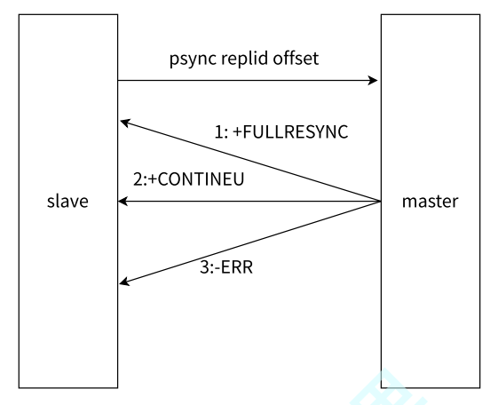
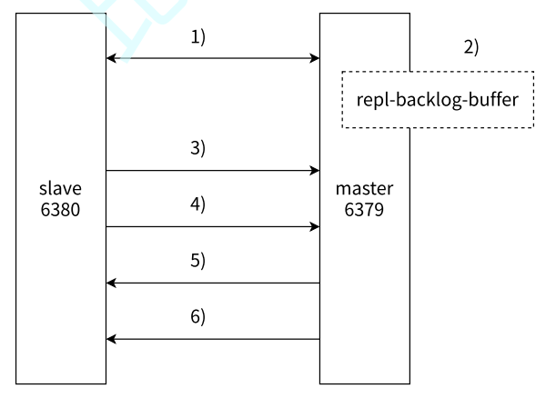
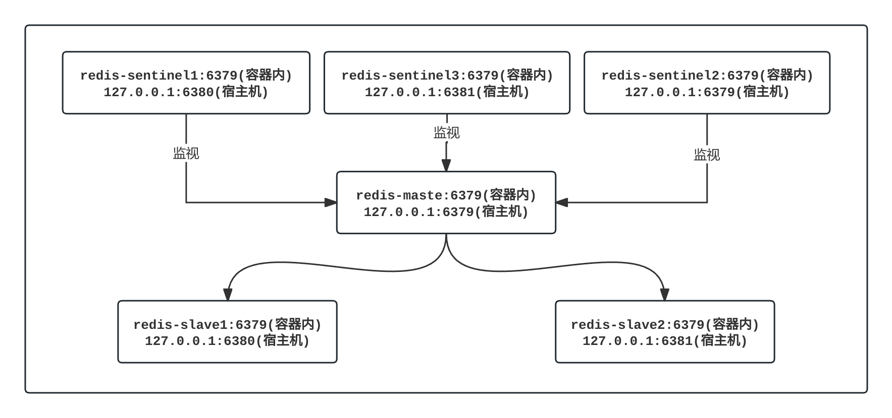
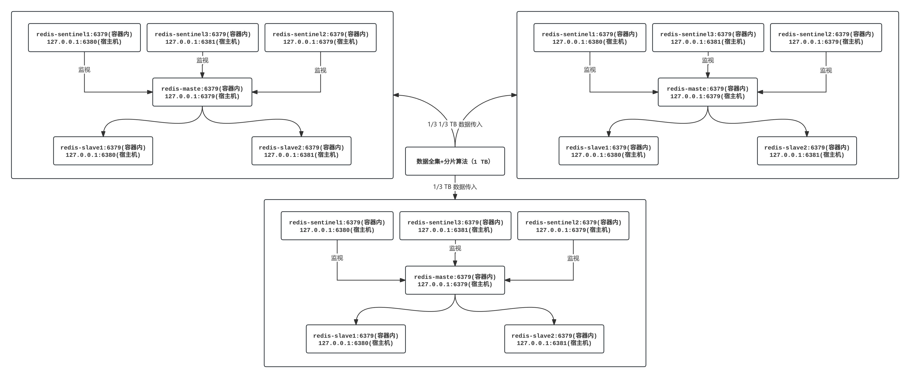
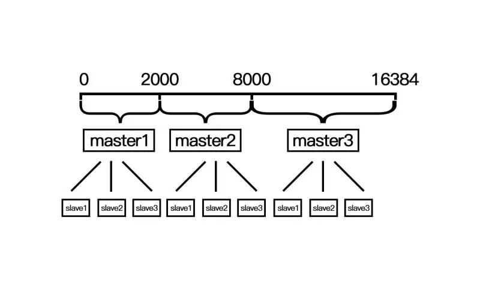

## 1.Redis 官方文档

### 1.1.Redis 的安装

[依照 Redis 官方文档即可下载 Redis](https://redis.io/docs/latest/operate/oss_and_stack/install/install-redis/install-redis-on-linux/)。

```shell
# 安装 Redis
$ sudo apt-get install lsb-release curl gpg # 以下指令可能过时, 推荐您看官方文档
$ curl -fsSL https://packages.redis.io/gpg | sudo gpg --dearmor -o /usr/share/keyrings/redis-archive-keyring.gpg
$ sudo chmod 644 /usr/share/keyrings/redis-archive-keyring.gpg
$ echo "deb [signed-by=/usr/share/keyrings/redis-archive-keyring.gpg] https://packages.redis.io/deb $(lsb_release -cs) main" | sudo tee /etc/apt/sources.list.d/redis.list
$ sudo apt-get update
$ sudo apt-get install redis

```

`Redis` 也有经典的 `CS` 模式，因此需要启动服务。

```shell
# 启动 Redis
$ sudo systemctl enable redis-server
$ sudo systemctl start redis-server

```

测试是否安装成功。

```shell
# 测试 Redis
$ redis-cli
127.0.0.1:6379> ping
PONG

```

>   [!IMPORTANT]
>
>   补充：`6379` 是 `Redis` 默认的服务端程序运行端口号。

### 1.2.Redis 的学习

接下来，可以 [根据 Redis 官方的快速学习手册进行学习](https://redis.io/docs/latest/get-started/)：

-   [Redis 作为内存中数据类型存储快速入门](https://redis.io/docs/latest/develop/get-started/data-store/)，并且还需要 [阅读 Redis 中的数据类型](https://redis.io/docs/latest/develop/data-types/)，每一个数据类型都可以有对应的文档
-   [Redis 作为文档数据库快速入门](https://redis.io/docs/latest/develop/get-started/document-database/)（但是必须额外下载 `Redis Stack`）
-   [Redis 作为矢量数据库快速入门](https://redis.io/docs/latest/develop/get-started/vector-database/)（但是必须额外下载 `Redis Stack`，并且您必须学习过机器学习）

这几个文档还是非常简单易读的，非常推荐（和本系列一起阅读更佳）。

如果觉得文档太难看懂，可以看看 [别人搬运的尚硅谷 Redis 教程(非正版...)](https://www.bilibili.com/video/BV1UnY5ehE4b?vd_source=c92c89dbfcf9cc30c48086469621f35b&spm_id_from=333.788.videopod.episodes)。

## 2.Redis 登录退出

登录方式和 `MySQL` 是一样的，可以在命令行使用客户端登录的方式，也可以只执行单条的命令，我们可以简单试试启动 `Redis` 的客户端。

```shell
# Redis 的登录和退出
# 直接使用客户端登录并且使用
$ redis-cli -h 0.0.0.0 -p 6379

0.0.0.0:6379> ping
PONG # WebSocket 协议中, PING 和 PONG 是一种心跳机制, 服务器或客户端可以发送 PING, 而接收方会响应 PONG, 以确保连接存活

0.0.0.0:6379> set key hello
OK

0.0.0.0:6379> get key
"hello"

0.0.0.0:6379> exit # 退出 Redis

# 在命令行中只执行一次 Redis 的指令
$ redis-cli -h 0.0.0.0 -p 6379 ping
PONG

```

>   [!WARNING]
>
>   注意：`Redis` 其实在实际开发中是不会暴露给外界访问的，我们这里只不过是为了方便把配置文件改为 `0.0.0.0`，如果您只在本机操作 `redis` 则默认使用的是 `127.0.0.1` 地址，并且默认 `6379` 端口，此时可以直接省略 `-h` 和 `-p` 直接登录。

## 3.Redis 指令教程

我们先再来学几个指令尝尝鲜，这些指令在后面用到的概率也非常高，另外 `Redis` 的指令也可以无视对大小写。

### 3.1.基础指令

#### 3.1.1.SET, GET, DEL

`set, get, del` 这三个指令非常简单，就是设置（修改）、获取、删除键值对。

```shell
# 使用 set, get, del
0.0.0.0:6379> set my_key "hello"
OK

0.0.0.0:6379> get my_key
"hello"

0.0.0.0:6379> del my_key
(integer) 1

0.0.0.0:6379> get my_key
(nil)
```

>   [!IMPORTANT]
>
>   补充：实际上还有更加方便可用的变种指令
>
>   -   `setex <key_name> <seconds> <key_value>` 可以直接使用秒作为单位设置 `key` 的过期时间
>   -   `setpx <key_name> <milliseconds> <key_value>` 可以直接使用毫秒作为单位设置 `key` 的过期时间
>   -   `setnx <key_name> <key_value>` 只在 `key` 不存在时才进行设置，即如果 `key` 之前已经存在，不执行设置
>   -   `setxx <key_name> <key_value>` 只在 `key` 存在时才进行设置，即如果 `key` 之前不存在，不执行设置
>   -   `mset <key_name_1> <key_value_1> <key_name_2> <key_value_2> ...` 一次设置多个键值对
>   -   `mget key_name_1 key_name_2` 一次获取多个键值
>   -   另外 `del` 本身就支持删除多个键值对...
>
>   这种一次性设置的指令通常会更受欢迎，因为可以减缓一些网络 `IO` 的代价。

#### 3.1.2.KEYS, EXISTS, SCAN

`keys` 指令可以根据一定的样式，或者匹配模式来查询对应的 `key` 值，查询的复杂度是 $O(n)$，而 `exists` 则可以查询 `key` 存在的个数，时间复杂度是 $O(1)$。

```shell
# 使用 keys, exists
0.0.0.0:6379> mset key_1 "hello" key_2 "limou" # 这个是 set 的升级版, 可以一次设置多个 key-value 对
OK

0.0.0.0:6379> keys * # 查询所有 k-v 值
1) "key_2"
2) "backup1"
3) "backup3"
4) "backup4"
5) "key_1"
6) "backup2"

0.0.0.0:6379> keys key_? # 查询 key_1 key_2 key_y 等 k-v 值
1) "key_2"
2) "key_1"

0.0.0.0:6379> keys k* # 查询 k2ey key_2 kkkkey key_1 等 k-v 值
1) "key_2"
2) "key_1"

0.0.0.0:6379> keys key_[13] # 查询 key_1 key_3 这两个 k-v 值
1) "key_1"

0.0.0.0:6379> keys key_[^1] # 查询除了 key_1 以外的所有 key_2 key_w key_0 等 k-v 值
1) "key_2"

0.0.0.0:6379> keys key_[0-3] # 查询 key_1 key_2 key_3 这三个 k-v 值
1) "key_2"
2) "key_1"

0.0.0.0:6379> exists key_1 # 查找符合 key_1 的个数
(integer) 1

0.0.0.0:6379> exists key_1 key_2 # 查找符合 key_1, key_2 的个数
(integer) 2

```

>   [!CAUTION]
>
>   警告：`keys` 的时间复杂度比较大，一般在实际工程中会直接禁用这个命令，否者一旦 `Redis` 在有大量的指令时，就会出现“卡住”的情况，这和 `Redis` 的架构设计本身是有关系的，后面再说...

还有一个比较高效的增量扫描 `scan` 指令，放回的数据是分批量的，即便是在单线程的情况下，也可以非阻塞返回大规模数据集，不会对 `Redis` 有很大的性能影响。

```shell
# 使用 scan
127.0.0.1:6379> scan 0 match "key_*" count 100 ## 0 代表游标, 是扫描的起始位置, 表示从当前 Redis 键空间
1) "0" ## 这里是因为数据量不大, 直接返回新的游标为 0 表示扫描完成, 如果数据量大会得到新的游标
2) 1) "key_2"
   2) "key_1"
```

可以看到 `keys` 是扫描整个键值空间，但是 `scan` 可以由用户指定游标进行增量扫描。

>   [!IMPORTANT]
>
>   补充：`Redis` 也是有关于数据库的概念的，也就是 `Redis` 键空间。

#### 3.1.3.EXPIRE, TTL

`expire` 为指定的 `key` 值添加秒级的过期时间，返回 `1` 表示设置成功，返回 `0` 表示设置失败，并且可以对同一个 `key` 值反复使用达到修改过期时间的目的。而 ` TTL` 则可以获取指定 `key` 值的过去时间，单位也是秒级，其返回值为 `任意数字` 表示距离过期时间所剩的秒数，`-1` 表示没有关联过期时间，`-2` 表示 `key` 不存在。

```shell
# 使用 expire, ttl
0.0.0.0:6379> set key 100
OK

0.0.0.0:6379> get key
"100"

0.0.0.0:6379> expire key 5 # 设置 key 的过期时间
(integer) 1

0.0.0.0:6379> get key # 每一秒获取一次
"100"

0.0.0.0:6379> get key
"100"

0.0.0.0:6379> get key
"100"

0.0.0.0:6379> get key
"100"

0.0.0.0:6379> get key
"100"

0.0.0.0:6379> get key
(nil)

0.0.0.0:6379> ttl key # 查看已经不存在的 key
(integer) -2

0.0.0.0:6379> set key 100 # 重新设置一个 key 值
OK

0.0.0.0:6379> set other_key 20 # 再设置另外一个 key 值
OK

0.0.0.0:6379> expire key 10 # 为第一个 key 设置过期时间
(integer) 1

0.0.0.0:6379> ttl key # 查看第一个 key 剩余的过期时间
(integer) 7

0.0.0.0:6379> ttl key # 查看第一个 key 剩余的过期时间
(integer) 4

0.0.0.0:6379> ttl other_key # 试图查看另外一个没有设置过期时间的 key 的剩余过期时间
(integer) -1

0.0.0.0:6379> set key 100 # 再次重新设置 key 值
OK

0.0.0.0:6379> get key # 正常获取
"100"

0.0.0.0:6379> expire key 100000 # 设置比较大的过期时间
(integer) 1

0.0.0.0:6379> ttl key # 查看剩余的过期时间
(integer) 99994

0.0.0.0:6379> expire key 10 # 重新设置过期时间
(integer) 1

0.0.0.0:6379> ttl key # 检查现在的过期时间
(integer) 9

```

>   [!IMPORTANT]
>
>   补充：实际上 `expire, ttl` 都有支持毫秒版本的 `pexpire, pttl`，使用方法类似。

#### 3.1.4.TYPE

`type` 也很简单，可以返回 `key` 值的数据类型，返回值有 `none, string, list, set, zset, hash, stream...` 其实就对应后面数据类型。

```shell
# 使用 type
0.0.0.0:6379> set key 100
OK

0.0.0.0:6379> get key
"100"

0.0.0.0:6379> type key
string

```

#### 3.1.5.INCR, INCRBY, DECR, DECRBY, INCRBYFLOAR

`incr` 可以用来给一个字符串类型的实数进行 `+1` 操作，哪怕这个 `key` 值之前不存在，也会从 `0` 开始加起。`incrby` 也是类似，但是加上用户指定的整数值（注意只能是整数），不存在时，该 `key` 也是从 `0` 开始加起。而 `decr` 和 `decrby` 和前面两者类似，只不过是变成减而已。

>   [!IMPORTANT]
>
>   补充：顺口一提上述关于 `...by` 的指令都可以使用负数作为操作数。

对于浮点数来说，只使用一个指令 `incrbyfloat` 就够了，功能也是类似的，加减使用正负实数调控就行。

```shell
# 使用 incr, incrby, decr, decrby, incrbyfloat
# incr
0.0.0.0:6379> exists mykey
(integer) 0

0.0.0.0:6379> incr mykey
(integer) 1

0.0.0.0:6379> exists mykey
(integer) 1

0.0.0.0:6379> get mykey
"1"

0.0.0.0:6379> incr mykey
(integer) 2

0.0.0.0:6379> incr mykey
(integer) 3

0.0.0.0:6379> incr mykey
(integer) 4

0.0.0.0:6379> get mykey
"4"

# incrby
0.0.0.0:6379> incrby mykey 5
(integer) 9

# decr
0.0.0.0:6379> decr mykey
(integer) 8

# decrby
0.0.0.0:6379> decrby mykey 7
(integer) 1

# incrbyfloat
0.0.0.0:6379> incrbyfloat mykey 5.6
"9.6"
0.0.0.0:6379> incrbyfloat mykey -10.33
"-0.73"
```

#### 3.1.6.APPEND, GETRANGE, SETRANGE, STRLEN

还可以对字符串进行操作，这些也比较简单...

```shell
# 使用 append, getrange, setrange, strlen
0.0.0.0:6379> set mykey "hello" # 设置初始字符串值到键 mykey
ok

0.0.0.0:6379> get mykey # 获取键 mykey 的值
"hello"

0.0.0.0:6379> append mykey " world" # 向 mykey 键追加字符串 " world"
(integer) 11

0.0.0.0:6379> get mykey # 获取追加后的 mykey 值
"hello world"

0.0.0.0:6379> getrange mykey 0 4 # 获取 mykey 值中从索引 0 到 4 的子串
"hello"

0.0.0.0:6379> getrange mykey 6 10 # 获取 mykey 值中从索引 6 到 10 的子串
"world"

0.0.0.0:6379> setrange mykey 6 "redis" # 设置 mykey 中从索引 6 开始的新值为 "redis"
(integer) 11

0.0.0.0:6379> get mykey # 获取 setrange 操作后的 mykey 值
"hello redis"

0.0.0.0:6379> strlen mykey # 获取 mykey 字符串的长度
(integer) 11

```

>   [!IMPORTANT]
>
>   补充：这些指令都很简单，如果您需要了解更多，可以 [前往 Redis 的官网中查看](https://redis.io/docs/latest/develop/get-started/)，不过由于我们使用 `Redis` 的大部分场景都是在代码中直接进行编程（除了一些运维人员、测试人员可能需要非常了解进行必要的检查以外），因此没有必要了解得特别细（除非需要使用）...

### 3.2.模块指令

除了基础的对于数据类型的操作指令，还有一些不同模块的指令，有需要再进行学习，不过这里先列出来：

> [!CAUTION]
>
> 警告：模块默认不直接内嵌到 `redis service` 中，因此需要您下载 `Redis` 的拓展 `Redis Stack` 才能使用。
>
> ```shell
> # 安装 Redis Stack
> # 停止传统的 Redis 服务
> $ sudo systemctl stop redis
> 
> # 检查是否停止 Redis 服务
> $ redis-cli
> Could not connect to Redis at 127.0.0.1:6379: Connection refused
> not connected> exit
> 
> # 开始安装 Redis Stack
> $ sudo apt-get install lsb-release curl gpg
> 
> $ curl -fsSL https://packages.redis.io/gpg | sudo gpg --dearmor -o /usr/share/keyrings/redis-archive-keyring.gpg
> 
> $ sudo chmod 644 /usr/share/keyrings/redis-archive-keyring.gpg
> 
> $ echo "deb [signed-by=/usr/share/keyrings/redis-archive-keyring.gpg] https://packages.redis.io/deb $(lsb_release -cs) main" | sudo tee /etc/apt/sources.list.d/redis.list
> 
> 
> $ sudo apt-get update
> $ sudo apt-get install redis-stack-server
> 
> # 由于我使用的是 Ubuntu24.04(这个时候比较新), 因此我需要使用二进制进行下载, 而无法使用包管理安装...
> 
> # 在 https://redis.io/downloads/#redis-stack-downloads 底部获取你所需要的安装链接
> 
> $ wget https://packages.redis.io/redis-stack/redis-stack-server-7.4.0-v1.jammy.x86_64.tar.gz
> 
> $ mv redis-stack-server-7.4.0-v1 redis-stack-server
> 
> $ sh redis-stack-server/bin/redis-stack-server
> # 此时就会启动输出...您可以开始测试是否已运行该服务...
> 
> # 打开另外一个终端开始测试
> $ redis-cli
> 127.0.0.1:6379> MODULE LIST
> 1) 1) "name"
>    2) "RedisCompat"
>    3) "ver"
>    4) (integer) 1
>    5) "path"
>    6) "/home/ljp/temp/redis-stack-server/lib/rediscompat.so"
>    7) "args"
>    8) (empty array)
> 2) 1) "name"
>    2) "redisgears_2"
>    3) "ver"
>    4) (integer) 20020
>    5) "path"
>    6) "/home/ljp/temp/redis-stack-server/lib/redisgears.so"
>    7) "args"
>    8) 1) "v8-plugin-path"
>       2) "/home/ljp/temp/redis-stack-server/lib/libredisgears_v8_plugin.so"
> 3) 1) "name"
>    2) "search"
>    3) "ver"
>    4) (integer) 21005
>    5) "path"
>    6) "/home/ljp/temp/redis-stack-server/lib/redisearch.so"
>    7) "args"
>    8) 1) "MAXSEARCHRESULTS"
>       2) "10000"
>       3) "MAXAGGREGATERESULTS"
>       4) "10000"
> 4) 1) "name"
>    2) "bf"
>    3) "ver"
>    4) (integer) 20802
>    5) "path"
>    6) "/home/ljp/temp/redis-stack-server/lib/redisbloom.so"
>    7) "args"
>    8) (empty array)
> 5) 1) "name"
>    2) "ReJSON"
>    3) "ver"
>    4) (integer) 20803
>    5) "path"
>    6) "/home/ljp/temp/redis-stack-server/lib/rejson.so"
>    7) "args"
>    8) (empty array)
> 6) 1) "name"
>    2) "timeseries"
>    3) "ver"
>    4) (integer) 11202
>    5) "path"
>    6) "/home/ljp/temp/redis-stack-server/lib/redistimeseries.so"
>    7) "args"
>    8) (empty array)
> 
> # 有比较多的回显就是配置成功了
> 
> ```

#### 3.2.1.RediSearch(`FT`)

主要用于全文搜索和数据索引功能，核心命令如：
   - `FT.CREATE`、`FT.ADD`、`FT.SEARCH`：创建索引、添加文档、搜索查询
   - `FT.AGGREGATE`：执行聚合查询
   - `FT.DROPINDEX`、`FT.SYNUPDATE` 等

#### 3.2.2.RedisJSON(`JSON`)

`RedisJSON` 模块用于在 `Redis` 中存储和操作 `JSON` 数据类型，核心命令如：

   - `JSON.SET`：设置 `JSON` 数据
   - `JSON.GET`：获取 `JSON` 数据
   - `JSON.DEL`：删除 `JSON` 键
   - `JSON.MGET`：从多个键中获取 `JSON` 值

#### 3.2.3.RedisGraph(`GRAPH`)
   RedisGraph 提供了图数据库功能，用于图数据的存储和查询，核心命令如：
   - `GRAPH.QUERY`：使用 `Cypher` 查询语言执行查询。
   - `GRAPH.PROFILE`：分析查询性能。
   - `GRAPH.DELETE`：删除图。

#### 3.2.4.Redis TimeSeries(`TS`)
`RedisTimeSeries` 是用于存储和分析时间序列数据的模块，核心命令如：

   - `TS.CREATE`：创建时间序列
   - `TS.ADD`：添加时间序列数据点
   - `TS.RANGE`、`TS.MRANGE`：查询时间范围内的数据
   - `TS.ALTER`：修改时间序列元数据

#### 3.2.5.RedisAI(`AI`)
`RedisAI` 用于在 `Redis` 中运行机器学习模型，支持 `TensorFlow, PyTorch, ONNX...` 模型，核心命令如：

   - `AI.MODELSET`：加载机器学习模型
   - `AI.MODELRUN`：运行机器学习模型
   - `AI.SCRIPTSET`：设置自定义脚本
   - `AI.TENSORSET` 和 `AI.TENSORGET`：处理张量数据

#### 3.2.6.RedisBloom(`BF`, `CF`, `CMS`, `TOPK`)
`RedisBloom` 提供了`布隆过滤器, 计数最小堆, Cuckoo Filter, TopK...` 等数据类型，适合处理大数据集合。

   - **布隆过滤器** (`BF`)：`BF.ADD`、`BF.EXISTS`
   - **Cuckoo Filter** (`CF`)：`CF.ADD`、`CF.EXISTS`
   - **Count-Min Sketch** (`CMS`)：`CMS.INCRBY`、`CMS.QUERY`
   - **TopK**：`TOPK.ADD`、`TOPK.QUERY`

这些模块可以根据场景进行组合使用，以增强 `Redis` 数据库的功能，从而更高效地处理搜索、图数据、时间序列分析和机器学习任务。

> [!IMPORTANT]
>
> 补充：由于有需要我补充这部分内容。
>
> ```shell
> # 使用 RediSearch 和 RedisJSON 的相关指令
> 0.0.0.0:6379> FT.CREATE \ # 设置添加索引
> idx:bicycle \ # 设置索引名称
> ON JSON \ # 表示针对 JSON 的索引
> PREFIX 1 bicycle: \ # 仅对具有 "bicycle:" 前缀的键创建索引(这里的数字代表可以设置多个前缀)
> SCORE 1.0 \ # 为该索引设置评分(用于索引之间进行评分比较)
> SCHEMA \ # 后面定义字段的模式
> $.brand AS brand TEXT WEIGHT 1.0 \
> $.model AS model TEXT WEIGHT 1.0 \
> $.description AS description TEXT WEIGHT 1.0 \
> $.price AS price NUMERIC \
> $.condition AS condition \
> TAG SEPARATOR "," # 设置标签, 用于分割不同 JSON 对象
> # 完整一行指令为 FT.CREATE idx:bicycle ON JSON PREFIX 1 bicycle: SCORE 1.0 SCHEMA $.brand AS brand TEXT WEIGHT 1.0 $.model AS model TEXT WEIGHT 1.0 $.description AS description TEXT WEIGHT 1.0 $.price AS price NUMERIC $.condition AS condition TAG SEPARATOR ","
> OK
> 
> # 上述描述的就是一个 JSON 对象的集合
> # {
> #   "bicycle:xxx": {
> #     "brand": "",
> #     "model": "",
> #     "description": "",
> #     "price": 0,
> #     "condition": ""
> #   },
> # }
> 
> # 可以使用 FT.INFO idx:bicycle 查看配置结果
> 
> # 设置 "键名-JSON:" 对
> 0.0.0.0:6379> JSON.SET \
> "bicycle:0" \
> "." \ # 存储在根处, 也可以是只设置字段
> "{\"brand\": \"Velorim\", \"model\": \"Jigger\", \"price\": 270, \"description\": \"Small and powerful, the Jigger is the best ride for the smallest of tikes! This is the tiniest kids\\u2019 pedal bike on the market available without a coaster brake, the Jigger is the vehicle of choice for the rare tenacious little rider raring to go.\", \"condition\": \"new\"}"
> # 完整指令为 JSON.SET "bicycle:0" "." "{\"brand\": \"Velorim\", \"model\": \"Jigger\", \"price\": 270, \"description\": \"Small and powerful, the Jigger is the best ride for the smallest of tikes! This is the tiniest kids\\u2019 pedal bike on the market available without a coaster brake, the Jigger is the vehicle of choice for the rare tenacious little rider raring to go.\", \"condition\": \"new\"}"
> 
> # 获取键对应 JSON 的某个字段
> 0.0.0.0:6379> JSON.GET bicycle:0 $.brand $.price
> "{\"$.brand\":[\"Velorim\"],\"$.price\":[270]}"
> 
> # 更新键对应 JSON 的某个字段
> 0.0.0.0:6379> JSON.SET bicycle:1234 $ '{"price": 600}'
> 
> # 查卡键对应 JSON 的所有字段‘
> 0.0.0.0:6379> JSON.GET bicycle:0
> "{\"brand\":\"Velorim\",\"model\":\"Jigger\",\"price\":270,\"description\":\"Small and powerful, the Jigger is the best ride for the smallest of tikes! This is the tiniest kids\xe2\x80\x99 pedal bike on the market available without a coaster brake, the Jigger is the vehicle of choice for the rare tenacious little rider raring to go.\",\"condition\":\"new\"}"
> 
> # 不过我们使用的是 JSON.GET, 如果使用 FT.SEARCH 还能用于执行基于全文索引的搜索查询, 它结合了索引、评分、排序和过滤功能, 可以用于复杂的搜索操作...
> 
> # 使用 FT 的查询
> 0.0.0.0:6379> FT.SEARCH "idx:bicycle" "*" LIMIT 0 10
> 1) (integer) 1
> 2) "bicycle:0"
> 3) 1) "$"
>    2) "{\"brand\":\"Velorim\",\"model\":\"Jigger\",\"price\":270,\"description\":\"Small and powerful, the Jigger is the best ride for the smallest of tikes! This is the tiniest kids\xe2\x80\x99 pedal bike on the market available without a coaster brake, the Jigger is the vehicle of choice for the rare tenacious little rider raring to go.\",\"condition\":\"new\"}"
> 
> ```
>
> 更多待补充...

### 3.3.自定指令

除了已有的基础指令和模块指令，还可以使用 `Lua` 脚本代码编写出用户自己定义的指令，待补充...

## 4.Redis 数据类型

#### 4.1.数据类型分类

知道前面的基础指令后，就可以知道 `Redis` 是一个跨语言的大号键值对存储数据库，但是除了简单的字符类型以外，键位对应的值还可以是其他数据类型，主要的数据类型有一下六种。

-   **字符 String** 最基本的数据类型，支持二进制安全的字符串
-   **列表 List** 按插入顺序存储的字符串列表，支持从两端推入和弹出操作
-   **无权集合 Set** 无序无权字符串集合，不允许重复元素
-   **带权集合 Zset** 有序有权字符串集合，保留集合无序不可重复的特点，但每个成员都有一个与之关联的分数（是允许重复的浮点数），并可以按分数排序
-   **键值集合 Hash** 键值对的集合，适用于存储对象的字段和对应的值，也可以叫哈希，这意味着键对应的值也可以是一系列键值对（有点套娃）
-   **空值 None** 当键值对不存在时的一种特殊类型

>   [!IMPORTANT]
>
>   补充：也有一些比较高级的类型，有很多是字符类型演变而来。
>
>   -   **位图 bitmap** 可以看作是一种压缩的数据类型，按位存储数据
>   -   **地理位置 geospatial** 用于存储地理位置数据并进行地理空间查询
>   -   **流 stream** 用于存储和管理日志数据、消息队列等类型的数据，流的条目按时间戳进行排序
>   -   **基数 HyperLogLog** 用于统计某个数据流中不重复元素的数量（如果您的需求是要 **存储所有的元素并进行操作**，那么 `Set` 是合适的选择；如果您只是需要 **估算独立元素的数量**，且不关心精确值，那么 `Hyper LogLog` 会更高效）
>   -   ...

>   [!IMPORTANT]
>
>   补充：流的存在，使得 `Redis` 可以简单充当一个消息队列，但是这不是 `Redis` 的主要应用场景。不过这可以作为中小型项目的消息队列组件，尤其是在已经引入 `Redis` 时，可以快速把 `Redis` 作为消息队列，减低系统复杂度。

#### 4.2.外部数据类型

###### 4.2.1.String 的基本操作

```shell
# String
0.0.0.0:6379> set mystring "hello"
OK

0.0.0.0:6379> type mystring
string

```

###### 4.2.2.List 的基本操作

```shell
# List
0.0.0.0:6379> lpush mylist "item1"
(integer) 1

0.0.0.0:6379> lpush mylist "item2"
(integer) 2

0.0.0.0:6379> lpush mylist "item3"
(integer) 3

0.0.0.0:6379> lrange mylist 0 -1 # 查询列表所有元素, 0 表示最先一个元素, -1 表示最后一个元素
1) "item3"
2) "item2"
3) "item1"
0.0.0.0:6379> lrange mylist 1 1 # 查询 mylist [1] 处的元素
1) "item2"
0.0.0.0:6379> type mylist
list

# 除此以外还有阻塞版本的指令, 例如 blpop 和 brpop
# 在有数据的情况下行为与 lpop 和 rpop 一致
# 但无数据的情况下 lpop 和 rpop 会立刻返回 nil, 客户端呈现请求阻塞状态, 且期间 Redis 可以继续执行其他指令, 如果超出设定的 timeout 也会返回 nil

```

###### 4.2.3.Set 的基本操作

```shell
# Set
0.0.0.0:6379> sadd myset "member1"
(integer) 1

0.0.0.0:6379> sadd myset "member2"
(integer) 1

0.0.0.0:6379> sadd myset "member3"
(integer) 1

0.0.0.0:6379> smembers myset
1) "member3"
2) "member2"
3) "member1"

0.0.0.0:6379> sismember myset "member1"
(integer) 1

0.0.0.0:6379> sismember myset "member4"
(integer) 0 # 表示不存在这个元素

0.0.0.0:6379> type myset
set

# Redis 除了支持增删查改的基础操作, 也支持交集(sinterstore/sinter)、并集(sunionstore/sunion)、差集(sdiffstore/sdiff)
```

###### 4.2.4.Zset 的基本操作

```shell
# Zset
# 添加
0.0.0.0:6379> zadd myzset 3 "member3"
(integer) 1 # 添加成功个数

0.0.0.0:6379> zadd myzset 2 "member2"
(integer) 1

0.0.0.0:6379> zadd myzset 1 "member1"
(integer) 1

# 查询
0.0.0.0:6379> zcrd myzset
(integer) 3 # zset 的元素个数

0.0.0.0:6379> zrange myzset 0 -1
1) "member1"
2) "member2"
3) "member3"

0.0.0.0:6379> zrank myzset "member2" # 查找是否存在元素并且返回排名
(integer) 1

0.0.0.0:6379> zrank myzset "member3"
(integer) 2

0.0.0.0:6379> zrank myzset "member1"
(integer) 0

0.0.0.0:6379> type myzset
zset

# 除此以外还有一些额外的选项
# ZADD key [XX | NX]: 仅仅⽤于更新已经存在的元素, 不会添加新元素; 仅⽤于添加新元素，不会更新已经存在的元素
# ZADD key [GT | LT]: Greater Than, 表示“大于”, 通常用于范围查询中, 表示取值大于某个指定的值; Less Than, 表示“小于”, 通常用于范围查询中, 表示取值小于某个指定的值
# ZADD key [CH]: 默认情况下, ZADD 返回的是本次添加的元素个数, 但指定这个选项之后, 就会还包含本次更新的元素的个数
# ZADD key [INCR]: 此时命令类似 ZINCRBY 的效果, 将元素的分数加上指定的分数, 此时只能指定⼀个元素和分数

# 也支持集合, 并且是聚合集合

```

>   [!IMPORTANT]
>
>   补充：`ZINTERSTORE` 是 `Redis` 的一个命令，用于对多个有序集合（`ZSET`）进行交集操作，并将结果存储到指定的目标集合中。具体来说，`ZINTERSTORE` 会计算多个有序集合的交集，并根据权重和聚合方式合并它们的分数，然后将结果保存在指定的目标集合中。
>
>   ```shell
>   # 聚合搜索
>   0.0.0.0:6379> zinterstore destination numkeys key [key ...] [weights weight [weight ...]] [aggregate <sum | min | max>]
>   # (1) destination: 目标集合的名称，交集的结果将存储在这个集合中
>   # (2) numkeys: 输入的有序集合的数量(key 的数量)
>   # (3) key [key ...]: 参与交集操作的多个有序集合的键名
>   # (4) weights weight [weight ...]: 可选参数, 指定每个集合的权重(默认权重为 1), 如果提供了权重, Redis 会按权重计算每个集合中的元素分数
>   # (5) aggregate <sum | min | max>: 可选参数, 指定合并多个集合元素时如何聚合它们的分数
>   	# sum 表示分数相加(默认)
>   	# mim 表示取最小值
>   	# max 表示取最大值
>   ```

###### 4.2.5.Hash 的基本操作

```shell
# Hash
0.0.0.0:6379> hset myhash field1 "value1"
(integer) 1

0.0.0.0:6379> hset myhash field2 "value2"
(integer) 1

0.0.0.0:6379> hset myhash field3 "value3"
(integer) 1

0.0.0.0:6379> hkeys myhash # 获取哈希中的所有字段
1) "field1"
2) "field2"
3) "field3"

0.0.0.0:6379> hvals myhash # 获取哈希中的所有值
1) "value1"
2) "value2"
3) "value3"

0.0.0.0:6379> hexists myhash field2 # 检查某个字段是否存在于哈希中
(integer) 1

0.0.0.0:6379> type myhash
hash

```

>   [!IMPORTANT]
>
>   补充：`Redis` 内部的哈希通常被称为 `field-value` 对，这主要是为了和 `Readis` 本身的 `key-value` 做区分。

> [!IMPORTANT]
>
> 补充：使用 `HGETALL` 获取哈希元素个数过多时，就有可能阻塞 `Redis`，这种情况下可以使用 `HSCAN` 扫描指令。

###### 4.2.6.None 的基本操作

```shell
# None
0.0.0.0:6379> type non_existing_key
none

```

>   [!IMPORTANT]
>
>   补充：下面补充一些高级数据类型的使用。
>
>   ```shell
>   # Bitmap
>   0.0.0.0:6379> setbit mybitmap 7 1 # 设置第 7 位为 1
>   (integer) 0
>   
>   0.0.0.0:6379> setbit mybitmap 2 1 # 设置第 2 位为 1
>   (integer) 0
>   
>   0.0.0.0:6379> getbit mybitmap 7 # 查看第 7 位设置的比特值
>   (integer) 1
>   
>   0.0.0.0:6379> getbit mybitmap 6 # 查看第 7 位设置的比特值
>   (integer) 0
>   
>   0.0.0.0:6379> bitcount mybitmap # 统计位图中总共有多少个设置为 1 的比特位
>   (integer) 2
>   
>   ```
>
>   ```shell
>   # Geospatial
>   0.0.0.0:6379> geoadd myplaces 13.361389 38.115556 "Palermo" # 设置一个地理位置, 这里设置了经纬度和地名
>   (integer) 1
>   
>   0.0.0.0:6379> geoadd myplaces 15.087269 37.502669 "Catania"
>   (integer) 1
>   
>   0.0.0.0:6379> geopos myplaces "Palermo" # 查询某个位置的经纬度
>   1) 1) "13.36138933897018433"
>      2) "38.11555639549629859"
>      
>   0.0.0.0:6379> geodist myplaces "Palermo" "Catania" km # 查询两个地点之间的距离, 以 km 单位
>   "166.2742"
>   
>   0.0.0.0:6379> georadius myplaces 15 37 100 km # 查询以经纬度 15, 37 为中心, 半径为 100km 的所有地名
>   1) "Catania"
>   
>   ```
>
>   ```shell
>   # Stream
>   # 添加流
>   0.0.0.0:6379> xadd \ # 添加流的指令
>                 mystream \ # 设置流的名称
>                 * \ # * 代表由 Redis 自己生成时间戳
>                 name "limou" age 18 # 代表流存储的数据
>   "1723358298361-0"
>   # 每条消息都有一个唯一的 ID, 这个 ID 由两部分组成, 使用 - 分隔
>   # 第一部分是一个时间戳(毫秒级), 表示消息被写入流的时间
>   # 第二部分是一个序列号, 用来区分同一时间戳下的不同消息(为了区分同时间戳)
>   
>   0.0.0.0:6379> xadd mystream * name "eimou" age 10
>   "1723358303994-0"
>   
>   0.0.0.0:6379> xadd mystream * name "gimou" age 20
>   "1723358311147-0"
>   
>   # 查询流
>   0.0.0.0:6379> keys *
>   1) "mystream"
>   0.0.0.0:6379> xread count 3 streams mystream 0 # 0 表示从流的开始读取所有的消息
>   1) 1) "mystream"
>      2) 1) 1) "1723358298361-0"
>            2) 1) "name"
>               2) "limou"
>               3) "age"
>               4) "18"
>         2) 1) "1723358303994-0"
>            2) 1) "name"
>               2) "eimou"
>               3) "age"
>               4) "10"
>         3) 1) "1723358311147-0"
>            2) 1) "name"
>               2) "gimou"
>               3) "age"
>               4) "20"
>               
>   0.0.0.0:6379> xread count 3 streams mystream $ # $ 表示从最新的数据开始读取所有的消息
>   (nil)
>   
>   0.0.0.0:6379> xread count 3 streams mystream 1723358311147-0 # 直接使用流 ID 查询就是读取该 ID 之后的所有消息
>   (nil)
>   
>   0.0.0.0:6379> xread count 3 streams mystream 1723358303994-0
>   1) 1) "mystream"
>      2) 1) 1) "1723358311147-0"
>            2) 1) "name"
>               2) "gimou"
>               3) "age"
>               4) "20"
>               
>   0.0.0.0:6379> xread count 3 streams mystream 1723358298361-0
>   1) 1) "mystream"
>      2) 1) 1) "1723358303994-0"
>            2) 1) "name"
>               2) "eimou"
>               3) "age"
>               4) "10"
>         2) 1) "1723358311147-0"
>            2) 1) "name"
>               2) "gimou"
>               3) "age"
>               4) "20"
>   # 这种情况下是直接消费数据的, 并且数据不会因为消费消失
>   
>   ```
>
>   ```shell
>   # HyperLogLog 
>   0.0.0.0:6379> PFADD ip_set \
>                   "192.168.0.1" \
>                   "192.168.0.2" \
>                   "192.168.0.3" \
>                   "192.168.0.1" \ # 这个是重复的 IP 地址
>                   "192.168.0.4" \
>                   "192.168.0.5" # 完整指令为 PFADD ip_set "192.168.0.1" "192.168.0.2" "192.168.0.3" "192.168.0.1" "192.168.0.4" "192.168.0.5"
>   (integer) 1
>   
>   0.0.0.0:6379> PFCOUNT ip_set
>   (integer) 5
>   ```

>   [!IMPORTANT]
>
>   补充：不知道您有没有发现很相当大的一部分数据类型是由 `string` 这个类型衍生出来的，因此如果需要细学其他的类型，就必须先对 `string` 有足够的理解，首先您至少需要知道几件事：
>
>   -   所有的键名类型都是字符类型
>   -   字符串类型的键值可以单纯是（但是一个字符串的最大值不能是 `512MB`）：
>       -   字符串
>       -   一般格式的 `JSON`
>       -   一般格式的 `XML`
>       -   数字
>       -   二进制流
>
>   -   `Redis` 内部存储的字符串是完全按照二进制流的形式保存的，所以不需要处理字符集编码，客户端传入的是什么字符集就存储什么

#### 4.3.内部数据类型

实际上 `Redis` 针对每一种数据类型都有自己的底层内部编码实现，而且是多种实现，这样 `Redis` 就会根据合适的场景选择合适的内部编码，例如下表（除去空类型剩下的五个类型）。

| **数据类型** | **内部编码**                                   |
| ------------ | ---------------------------------------------- |
| String       | `raw(>=39byte), int(8 byte), embstr(<=39byte)` |
| List         | `linkedlist, ziplist`                          |
| Set          | `hashtable, intset`                            |
| Zset         | `skiplist, ziplist`                            |
| Hash         | `hashtable, ziplist`                           |

>   [!IMPORTANT]
>
>   补充：我们可以通过 `object encoding 键名` 查询此时键的内部编码。

`Redis` 这样设计有两个好处：

-   方便 `Redis` 未来改进内部编码，而对外的数据类型和命令没有任何影响，这样可以开发出更优秀的内部编码
-   多种内部编码实现可以在不同场景下发挥各自的优势，例如 `ziplist` 比较节省内存，但是在列表元素比较较多的情况下，性能会下降，这时候 `Redis` 会根据配置选项将列表类型的内部实现转换为 `linkedlist`，整个过程用户是全无感知的

###### 4.3.1.String 的内部编码

尤其是字符串类型，内部编码至少有三种，`Redis` 会自动根据当前的值来决定使用哪一种内部编码进行实现。

-   **int(8byte 的长整型)**

-   **embstr(<= 39byte 的字符串)**

-   **raw(> 39byte 的字符串)**

```shell
# 查看 string 内部编码的变化
0.0.0.0:6379> set key 123
OK

0.0.0.0:6379> object encoding key
"int"

0.0.0.0:6379> set key limou
OK

0.0.0.0:6379> object encoding key
"embstr"

0.0.0.0:6379> set key limou343434343434343434343434343434343434343434343434343434343434
OK

0.0.0.0:6379> object encoding key
"raw"
```

###### 4.3.2.List 的内部编码

-   **ziplist(压缩列表)**：下面两个条件同时满足时

    -   列表元素个数小于 `list-max-ziplist-entries` 配置（默认 `512` 个）
    -   列表元素长度小于 `list-max-ziplist-value` 配置（默认 `64` 字节）

    `Redis` 会使用压缩列表（`ziplist`）作为列表的内部编码方式，从而减少内存消耗

-   **linkedlist(链表)**：当哈希类型无法满足 `ziplist` 的条件时，`Redis` 会使⽤ `hashtable` 作为哈希的内部实现，`Redis` 会选择使用 `linkedlist` 作为列表的内部实现。

###### 4.3.3.Set 的内部编码

-   **intset(整数集合)**：

    -   集合元素的个数小于 `set-max-intset-entries` 配置（默认最大 `512` 个元素）
    -   集合元素值都是整数

    `Redis` 会使用 `intset` 作为集合的内部实现，`intset` 是一个专门优化整数集合的压缩结构，可以显著减少内存使用。

-   **hashtable(哈希表)**：当列表类型无法满足 `intset` 的条件时，`Redis` 会使用 `hashtable` 作为集合的内部实现。`hashtable` 提供了高效的插入、查找和删除操作，适用于较大的集合。

###### 4.3.4.Zset 的内部编码

-   **ziplist(压缩列表)**：

    - 集合元素的个数小于 `zset-max-ziplist-entries` 配置（默认 `128` 个）
    - 每个元素的值都小于 `zset-max-ziplist-value` 配置（默认 `64` 字节）

    `Redis` 会⽤ `ziplist` 来作为有序集合的内部实现，`ziplist` 可以有效减少内存消耗

-   **skiplist(跳表)**：当 `ziplist` 条件不满⾜时，有序集合会使用 `skiplist` 作为内部实现，因为此时 `ziplist` 的操作效率会下降。

###### 4.3.5.Hash 的内部编码

哈希本身的内部编码变化也值得我们关注，内部的编码实现至少有两种 `ziplist(压缩列表), hashtable(哈希表)`，这就比字符串要复杂一些。

- **ziplist(压缩列表)**：下面两个条件同时满足时
  
  - 哈希元素个数小于 `hash-max-ziplist-entries` 配置（默认 `512` 个）
  - 哈希元素值都小于 `hash-max-ziplist-value` 配置（默认 `64` 字节）
  
  `Redis` 会使⽤ `ziplist` 作为哈希的内部实现，`ziplist` 使用更加紧凑的结构实现多个元素的连续存储，所以在节省内存方面比 `hashtable` 更加优秀。
  
- **hashtable(哈希表)**：当哈希类型无法满足 `ziplist` 的条件时，`Redis` 会使⽤ `hashtable` 作为哈希的内部实现，因为此时 `ziplist` 的读写效率会下降，而 `hashtable` 的读写时间复杂度为 `O(1)`。

```shell
# 查看 Hash 内部编码的变化(略)
```

###### 4.3.6.None 的内部编码

待补充...

#### 4.4.数据类型原理

待补充...

## 5.Redis 渐进遍历

`Redis` 提供了 `SCAN` 命令，允许用户以渐进式的方式进行键的遍历，避免了阻塞操作，适用于遍历大量数据的场景。

```shell
SCAN cursor [MATCH pattern] [COUNT count] [TYPE type]
# cursor: 游标，初始值为 `0`，返回的游标值指示下次扫描的位置。
# MATCH pattern: 可选参数，用于过滤键名，支持模式匹配（类似于 `glob` 模式）。
# COUNT count: 可选参数，建议每次返回的元素数量。并不是严格的数量限制，实际返回数量可能会有所不同。
# TYPE type: 可选参数，指定键的类型（如 `string`, `list`, `set`, `zset`, `hash` 等）。
```

`SCAN` 命令的时间复杂度是常数时间 $O(1)$，但遍历大数据集时，实际的时间复杂度会受到 `MATCH` 和 `COUNT` 参数的影响。

```bash
redis 127.0.0.1:6379> scan 0
1) "17"
2) 1) "key:12"
   2) "key:8"
   3) "key:4"
   4) "key:14"
   5) "key:16"
   6) "key:17"
   7) "key:15"
   8) "key:10"
   9) "key:3"
   10) "key:7"
   11) "key:1"

redis 127.0.0.1:6379> scan 17
1) "0"
2) 1) "key:5"
   2) "key:18"
   3) "key:0"
   4) "key:2"
   5) "key:19"
   6) "key:13"
   7) "key:6"
   8) "key:9"
   9) "key:11"
```

`Redis` 还为不同数据类型提供了相应的 `SCAN` 命令变种，功能与 `SCAN` 基本类似：

- **hscan**: 用于扫描哈希类型的数据。
- **sscan**: 用于扫描集合类型的数据。
- **zscan**: 用于扫描有序集合类型的数据。

它们的语法和使用方式与 `SCAN` 相同，只是针对特定类型的数据进行扫描。

```bash
hscan key cursor [MATCH pattern] [COUNT count]
sscan key cursor [MATCH pattern] [COUNT count]
zscan key cursor [MATCH pattern] [COUNT count]
```

>   [!CAUTION]
>
>   警告：`scan` 在使用过程中也有值得注意的地方。
>
>   - **渐进性遍历**：`SCAN` 命令是渐进式的，它不会一次性返回所有数据，而是通过多次调用来遍历数据。每次返回部分数据，并返回一个游标，指示下一次扫描的位置。
>
>   - **遍历期间的数据变化**：在扫描期间，如果 `Redis` 数据发生变化（例如增加、修改或删除键），可能会导致以下问题：
>
>       - **重复遍历**：某些键可能会被扫描多次
>       - **遗漏数据**：某些键可能会被遗漏
>
>       因此，在使用 `SCAN` 命令时，开发者应考虑到数据可能会在遍历过程中发生变化的情况。

## 6.Redis 键值空间

与 `MySQL` 等关系型数据库不同的是，`Redis` 没有表、字段这种命名空间，而且也没有对键名有强制要求（除了不能使用一些特殊字符）。但设计合理的键名，有利于防止键冲突和项目的可维护性，比较推荐的方式是使用 =="业务名:对象名:唯一标识:属性"== 作为键名。例如 `MySQL` 的数据库名为 `vs`，用户表名为 `user_info`，那么对应的键 `name` 可以使用 `"vs:user_info:6379:name"` 来表示，如果当前 `Redis` 只会被⼀个业务使用，可以省略业务名 `"vs:"`。

>   [!WARNING]
>
>   注意：键名过长也会影响到 `Redis` 的性能。

>   [!CAUTION]
>
>   警告：`Redis` 中虽然支持持多数据库，但随着版本的升级，其实不是特别建议使⽤多数据库特性。如果真的需要完全隔离的两套键值对，更好的做法是维护多个 `Redis` 实例，而不是在⼀个 `Redis` 实例中维护多数据库。这是因为本身 `Redis` 并没有为多数据库提供太多的特性，其次无论是否有多个数据库，`Redis` 都是使用单线程模型，所以彼此之间还是需要排队等待命令的执行。同时多数据库还会让开发、调试和运维⼯作变得复杂。所以实践中，始终使用数据库 `0` 其实是⼀个很好的选择。

>   [!CAUTION]
>
>   警告：`flushdb/flushall` 命令用于清除数据库，区别在于 `flushdb` 只清除当前数据库，`flushall` 会清理所有数据库（这些行为很接近删库）。

## 7.Redis 设计架构

实际上 `Redis` 采用的是单线程的架构，但是为什么采用单线程还能这么快呢？主要原因如下：

-   纯内存访问，这是最重要的一点，工作环境和 `MySQL` 等持久化数据库完全不一样
-   非阻塞 `IO` 模型，底层用 `epoll` 的 `ET` 模式，无论时连接、读写、关闭都被转化为事件来处理，因此不会在网络 `IO` 上浪费太多时间
-   单线程模型，无论客户端如何操作，在微观上一定时存在时间差的，因此就避免了线程切换开销的问题和并发加锁的问题

`Redis` 的这种特性，导致 `Redis` 只能作用于快速执行场景的热数据，一旦某个操作过长，就会导致严重延时的响应，这对 `Redis` 服务几乎是致命的。

## 8.Redis 的持久化

### 8.1.RDB

#### 8.1.1.RDB 的简单介绍

`Redis` 的 **RDB(Redis Database)** 持久化机制是将当前内存中的数据生成快照并保存到磁盘的过程。`RDB` 是一种高效的持久化方式，但它有可能丢失短时间内的数据更新。

转储的 `RDB` ⽂件保存在 `dir` 配置指定的目录下（默认 `/var/lib/redis/`），⽂件名通过 `dbfilename` 配置（默认 `dump.rdb`）指定。可以通过执行 `config set dir {newDir}` 和 `config set dbfilename {newFilename}` 运行期间动态执行，当下次运行时 `RDB` ⽂件会保存到新目录。

`Redis` 默认采⽤ `LZF` 算法对⽣成的 `RDB` ⽂件做压缩处理，压缩后的文件远远小于内存大小，默认开启，可以通过参数 `config set rdbcompression {yes|no}` 动态修改。

>   [!IMPORTANT]
>
>   补充：虽然压缩 `RDB` 会消耗 `CPU`，但可以大幅降低文件的体积，方便保存到硬盘或通过网络发送到 **从节点**，因此建议开启。

#### 8.1.2.RDB 的触发机制

##### 8.1.2.1.手动触发

*   `save`：在执行 `save` 命令时，`Redis` 会阻塞当前服务器，直到 `RDB` 过程完成为止。对于大规模数据集会导致长时间的阻塞，因此在实际使用中很少采用。
*   `bgsave`：执行 `bgsave` 命令时，`Redis` 通过 `fork` 创建一个子进程来处理 `RDB` 持久化，主进程不会被阻塞，持久化任务由子进程处理。`RDB` 完成后，子进程会自动结束，主进程继续处理其他请求。

##### 8.1.2.2.自动触发

除了手动触发，`Redis` 还支持以下几种自动触发的机制：

*   `save`：通过配置文件中的 `save m n` 指令，`Redis` 会在每隔 `m` 秒内数据集发生了 `n` 次修改时，自动触发 `RDB` 持久化
*   从节点复制操作：当 `Redis` 的 **从节点** 进行全量复制时，主节点会自动执行 `RDB` 持久化，并将生成的 `RDB` 文件内容发送给从节点
*   `shutdown`：当执行 `shutdown` 命令关闭 `Redis` 时，`Redis` 会自动执行 `RDB` 持久化，确保数据的持久性

#### 8.1.3.RDB 的实现原理


1.   执行 `bgsave` 后父进程检查是否有其他的持久化子进程在执行持久化操作
2.   父进程通过 `fork` 创建持久化子进程，`fork` 的过程中父进程会轻微阻塞，通过 `info stats` 命令查看 `latest_fork_usec` 选项，可以获取最近一次 `fork` 操作的耗时，单位为微秒
3.   `bgsave` 命令返回并释放父进程，继续处理请求
4.   子进程执行 `RDB` 持久化操作，根据父进程内存生成老师快照文件，完成并原子化替换原始的 `RDB` 文件，执行 `lastsave` 命令就可以获取最后一次生成 `RDB` 的时间，对应 `info` 统计的 `rdb_last_save_time` 选项
5.   子进程发送信号通知父进程操作完成，父进程更新统计信息

#### 8.1.4.RDB 的优势劣势

-   `RDB` 文件是一个紧凑压缩的二进制文件，代表 `Redis` 在某个时间点上的数据快照 `RDB` 非常适用于备份、全量复制等场景。例如，每 `6` 小时执行 `bgsave` 备份，并把 `RDB` 文件复制到远程机器或者文件系统（如 `HDFS`）用于灾备。而 `Redis` 加载 `RDB` 恢复数据的速度远快于 `AOF` 的方式。
-   `RDB` 方式无法做到实时持久化或秒级持久化，因为 `bgsave` 每次执行都要进行 `fork` 创建子进程，这属于重量级操作，频繁执行成本过高。另外，由于 `RDB` 文件使用特定的二进制格式保存，随着 `Redis` 版本演进，`RDB` 格式可能发生变化，存在兼容性风险。

### 8.2.AOF

#### 8.2.1.AOF 的简单介绍

`Redis` 的 **AOF(Append Only File)** 持久化机制，以独立日志的方式记录每次写命令，重启时再重新执行 `AOF` 文件中的命令以达到恢复数据的目的。`AOF` 的主要作用是解决了数据持久化的实时性问题，目前已经成为 `Redis` 持久化的主流方式。

#### 8.2.2.AOF 的触发机制

##### 8.2.2.1.启用持久

默认 `AOF` 是不开启的，需要配置设置 `appendonly yes` 才可以打开，`AOF` ⽂件名通过 `appendfilename` 配置（默认是 `appendonly.aof`）设置。保存目录同 `RDB` 持久化方式一直，也是通过 `dir` 配置来指定。

`AOF` 开启后，写命令也会被写入到缓存中，写入的持久化内容是以文本协议格式进行的。例如，`set hello world` 这条命令在 `AOF` 缓冲区会追加如下文本：

```shell
*3\r\n$3\r\nset\r\n$5\r\nhello\r\n$5\r\nworld\r\n
```

这里遵循了 `Redis` 协议格式。`Redis` 选择文本协议的原因主要包括：

- **兼容性**：文本协议具有较好的跨平台兼容性。
- **实现简单**：文本协议易于理解和实现。
- **可读性**：文本格式直观，便于调试和查看。

在 `AOF` 过程中，需要一个名为 `aof_buf` 的缓冲区。`Redis` 使用单线程响应命令，如果每次写 `AOF` 文件都直接同步到硬盘，会导致性能下降，因为每次操作都涉及到 `IO` 读写，这比内存读写要慢。通过先写入缓冲区，可以有效减少 `IO` 次数。同时，`Redis` 提供了多种缓冲区同步策略，允许用户根据实际需求进行性能和数据持久性的平衡。

##### 8.2.2.2.同步策略

`Redis` 提供了多种 `AOF` 缓冲区同步文件策略，通过参数 `appendfsync` 控制。不同值的含义如下：

| 可配置值   | 说明                                                         | 建议                                                         |
| ---------- | ------------------------------------------------------------ | ------------------------------------------------------------ |
| `always`   | 命令写入 `aof_buf` 后调用 `fsync` 同步，完成后返回。         | 每次写入都同步 `AOF` 文件，数据安全性最高。但是性能非常差，在一般的 `SATA` 硬盘上，只能支持约几百 `TPS` 的写入量。因此除非数据极其重要，否则不建议配置。 |
| `everysec` | 命令写入 `aof_buf` 后只执行 `write` 操作，不进行 `fsync`。每秒由同步线程进行 `fsync`。 | 默认配置，也是推荐配置。命令写入 `aof_buf` 后立即返回，由同步线程每秒执行一次 `fsync`。兼顾数据安全性和性能，理论上最多丢失 `1` 秒的数据。 |
| `no`       | 命令写入 `aof_buf` 后只执行 `write` 操作，由操作系统控制 `fsync` 频率。 | 操作系统自行决定同步策略，性能较高，但数据丢失风险较大。仅适用于数据重要性极低的场景。 |

- **`write` 操作：**  
    - 会触发 **延迟写** 机制。
    - `Linux` 在内核中提供页面缓冲区，用来提升硬盘 `IO` 性能
    - `write` 操作在数据写入系统缓冲区后立即返回，数据同步到硬盘依赖系统调度机制（如缓冲区写满或达到特定时间周期）
    - 在数据同步到硬盘之前，如果系统发生故障或宕机，缓冲区内的数据将丢失

- **`fsync` 操作：**  
    - 针对单个文件操作，执行强制硬盘同步
    - `fsync` 会阻塞当前操作，直到数据写入到硬盘为止

在大多数场景下，推荐使用 `everysec` 配置，以获得较好的数据安全性和系统性能平衡。

##### 8.2.2.3.触发重写

###### 8.2.2.3.1.手动触发

手动触发 `AOF` 重写可以通过执行 `BGREWRITEAOF` 命令。

```bash
redis-cli BGREWRITEAOF
```

该命令会在后台执行 `AOF` 文件重写操作，将当前数据库状态保存到新的 `AOF` 文件中。

###### 8.2.2.3.2.自动触发

`AOF` 重写也可以根据以下两个参数自动触发：

-   `auto-aof-rewrite-min-size`：该参数表示触发 `AOF` 重写时，`AOF` 文件的最小大小。默认值为 `64MB`。当 `AOF` 文件的大小超过这个最小值时，`Redis` 会考虑是否进行自动重写。
-   `auto-aof-rewrite-percentage`：该参数表示当前 `AOF` 文件大小相对于上次重写时的增长百分比。只有当 `AOF` 文件的大小增加超过这个百分比时，才会触发自动重写。默认值为 `100%`。

#### 8.2.3.AOF 的实现原理


1. 所有的写入命令会追加到 `aof_buf`（缓冲区）中
2. `AOF` 缓冲区根据对应的策略向硬盘进行同步操作
3. 随着 `AOF` 文件增大，需要定期对 `AOF` 文件进行等价重写，以达到压缩目的
4. 当 `Redis` 服务器启动时，可以加载 `AOF` 文件进行数据恢复

>   [!IMPORTANT]
>
>   补充：随着命令不断写入 `AOF`，文件会越来越大。为了解决这个问题，`Redis` 引入了 `AOF` 重写机制来压缩文件体积。`AOF` 文件重写是将 `Redis` 进程内的数据转换为写命令，并同步到新的 `AOF` 文件。重写后的 `AOF` 为什么可以变小？主要有以下理由：
>
>   -   **超时数据的去除** 进程内已超时的数据不会再写入文件，避免了过期数据的冗余存储
>   -   **无效命令的删除** 旧的 `AOF` 文件中可能包含无效命令（如 `del`、`hdel`、`srem` 等）。在重写过程中，这些命令会被删除，只保留数据的最终版本
>   -   **多条写操作合并** 多条相似的写操作可以合并为一条命令。例如，`lpush list a`、`lpush list b`、`lpush list c` 可以合并为 `lpush list a b c`，从而减少冗余操作

此外还有一个重写的原理，您也可以简单看一看。


1. 执行 `AOF` 重写请求
   - 如果当前进程正在执行 `AOF` 重写，请求不执行
   - 如果当前进程正在执行 `bgsave` 操作，重写命令延迟到 `bgsave` 完成之后再执行

2. 父进程执行 `fork` 创建子进程

3. 重写过程：
   -   主进程 `fork` 之后，继续响应其他命令。所有修改操作写入 `AOF` 缓冲区，并根据 `appendfsync` 策略同步到硬盘，保证旧 `AOF` 文件机制正确
   -   子进程只有 `fork` 之前的所有内存信息，父进程中需要将 `fork` 之后这段时间的修改操作写入 `AOF` 重写缓冲区中

4. 子进程根据内存快照，将命令合并到新的 `AOF` 文件中

5. 子进程完成重写：
   -   新文件写入后，子进程发送信号给父进程
   -   父进程把 `AOF` 重写缓冲区内临时保存的命令追加到新 `AOF` 文件中
   -   用新 `AOF` 文件替换旧 `AOF` 文件

#### 8.2.4.AOF 的优势劣势

-   优势：

    -   **数据更精确**：`AOF` 会记录每个写命令，可以达到更高的数据持久化精度。例如，假设 `Redis` 崩溃了，你可能丢失不到几秒钟的数据（这取决于 `appendfsync` 策略）。
    -   **持久化策略灵活**：`AOF` 提供三种同步策略 (`always`, `everysec`, `no`)，可以根据需求在持久化精度和性能之间做平衡。
    -   **支持持久化恢复**：`AOF` 文件可以通过重放命令恢复数据，保证数据一致性。

-   劣势：

    *   **文件较大**：由于每个写命令都被记录，`AOF` 文件的大小可能会比 `RDB` 大很多。

    *   **性能开销**：`AOF` 会增加额外的写入操作，尤其是 `appendfsync always` 策略会频繁同步磁盘，导致性能下降。

>   [!IMPORTANT]
>
>   补充：`Redis` 两种方案的使用
>
>   -   `RDB` 高性能，底持久，磁盘多容量，慢速度
>   -   `AOF` 低性能，高持久，磁盘少容量，快速度

## 9.Redis 业务操作

#### 9.1.事务

> [!IMPORTANT]
>
> 补充：适合原子执行多个操作，只能单次启动。

由于 `Redis` 的实现是单线程的，对比 `MySQL` 来说，`Redis` 事务要简单很多。

-   弱化的原子性：虽然也是把一系列操作绑定为一组，但是操作失败时，无法回滚，因此原子性比较弱。
-   不保证一致性：<span style="text-emphasis:filled red;">这点待补充...</span>
-   不需要隔离性：`MySQL` 需要给多个同时执行的事务设置隔离性，但是由于 `Redis` 是单线程的，这导致 `Redis` 无需设置隔离性，只要保证自己的每条操作都是原子的即可。
-   不需要持久性：这不代表 `Redis` 不需要做持久化，或没有持久化功能，而是 `Redis` 的事务不需要自己考虑持久化的问题，这个问题交给 `redis-server` 自己的 `RDB/AOF` 持久化机制。

总结来看仅仅是打包了一组指令，避免被其他客户端 **加塞** 而已。

`Redis` 事务其实是在服务器上搞了一个 **事务队列**. 每次客户端在事务中进行一个操作, 都会把命令先发给服务器, 放到事务队列中（但并不会立刻执行），而是会在真正收到 `EXEC` 命令之后, 才真正执行队列中的所有操作。

```shell
# 操作一个简单的事务
# 开启事务
127.0.0.1:6379> MULTI
OK

# 执行指令(其实还没执行)
127.0.0.1:6379> set k1 1
QUEUED # 表示命令已加入事务队列
127.0.0.1:6379> set k2 2
QUEUED
127.0.0.1:6379> set k3 3
QUEUED

# 完成事务(提醒可以执行)
127.0.0.1:6379> EXEC # 也可以使用 DISCARD 放弃事务
1) OK
2) OK
3) OK

```

不过在对同一个键的操作上，并且客户端开始编写事务的情况下，其他客户端先提交事务（或者直接执行指令时），还是会出现一些问题，这个时候会使用 `watch/unwatch` 来监控键值的版本号（就是一个整数而已），版本号冲突就立刻停止执行。

```shell
# 假设两个客户端几乎同时开始编写事务
# >>> begin: 客户端 1 >>>
# 客户端 1 开始监视键 k1
127.0.0.1:6379> watch k1
OK

# 客户端 1 开始事务
127.0.0.1:6379> MULTI
OK

# 客户端 1 将修改 k1 和 k2 作为事务的一部分, 但尚未执行
127.0.0.1:6379> set k1 100
QUEUED  # 此时 k1 的版本号为 0, 记录该版本号, 操作被排队, 但没有提交

127.0.0.1:6379> set k2 1000
QUEUED  # k2 的修改操作也被加入队列, 尚未执行

# 客户端 1 尚未执行 EXEC, 事务仍在队列中
# <<< end <<<

# >>> begin: 客户端 2 >>>
# 客户端 2 执行修改 k1 操作, 修改 k1 的值, 并将其版本号更改为 1(相当于提前提交了只有一条指令的事务)
127.0.0.1:6379> set k1 200
OK  # 客户端 2 成功修改了 k1 的值, 服务器上的版本号变为 1
# <<< end <<<

# >>> begin: 客户端 1 >>>
# 客户端 1 执行 EXEC, 提交事务
127.0.0.1:6379> EXEC
(nil) # 由于版本号不一致, 事务被取消, 未执行任何命令

# 检查 k1 的最终值, 应该是客户端 2 提交的修改
127.0.0.1:6379> get k1
"200"  # k1 的最终值是 200, 表明客户端 2 修改成功

# 检查 k2 的最终值, 因为客户端 1 的事务没有成功提交, 所以 k2 未被设置
127.0.0.1:6379> get k2
(nil)  # k2 并没有被修改, 返回 nil
# <<< end <<<

```

#### 9.2.脚本

> [!IMPORTANT]
>
> 补充：适合原子执行多个操作，可以复用启动。

`Redis` 支持执行 `Lua` 脚本，关于 `Lua`，您可以可以 [前往 Lua 官网查看大概的情况](https://www.lua.org/)，使用 `Lua` 的原因主要是

- 为了将多个操作封装为原子操作，确保操作原子执行
- 支持脚本缓存，可以减少因为数据传输引起的网络开销
- `Lua` 本身也支持一些复杂的数据操作能力，避开 `Redis` 内部只有简单计算的缺点，也不必传递给客户端（对于 `Redis` 服务端来说客户端）浪费计算时间的问题再进行计算
- 对于较多的 `Redis` 操作，可以直接使用 `Lua` 脚本优化操作，由于 `Redis` 对 `Lua` 脚本做过优化，可以原生执行 `Redis` 的代码

怎么抉择什么时候使用 `Lua` 和 `Cpp` 呢？

- 需要事务原子操作时
- 需要减少网络开销时
- 重复执行相同操作时
- 避免在客户端计算时（对于 `Redis` 的客户端）

```shell
# 使用 Redis 的 Lua 脚本缓存机制
127.0.0.1:6379> SCRIPT LOAD "return ARGV[1] + ARGV[2]"
"53c370cb7894e73f9aaf94627c0506c428b5cc97"
127.0.0.1:6379> EVALSHA 53c370cb7894e73f9aaf94627c0506c428b5cc97 0 2 3
(integer) 5

```

#### 9.3.管道

> [!IMPORTANT]
>
> 补充：适合本地执行多个操作，通常由库实现

`Pipeline` 用来：

- **发送多个 Redis 命令** `Redis` 客户端会将多个命令批量发送到服务器，而不是逐条发送
- **读取所有命令的结果** 客户端一次性读取所有响应，减少网络往返时间

实际上`Redis` 没有管道的相关操作，但是对于大部分的客户端是有实现管道操作的，让多条指令能一次性发送到 `Redis` 中，保证多条指令的执行结果如同在 `redis-cli` 中是一样的（因此就理解为和在 `Redis` 服务器命令行本地中输入执行多条命令是一样的就可以）。

## 10.Redis 功能定位

下面将讨论一个非常重要的问题（阅读到这里您对 `Redis` 的基本操作基本是差不多的了，该了解一些 `Redis` 的主要功能了），我们学会使用 `Redis` 后，该如何接入到我们自己项目中？在哪里应该使用 `Redis`？在哪里不应该使用 `Redis`？我们需要解决的是 `Why` 的问题。相信我，`Why` 的问题永远要比 `What` 的问题要重要得多。

> 吐槽：老实说，专用的 `RabbitMQ, Apache Kafka` 消息队列可以替代 `Redis` 作为消息队列的部分，而使用 `Mongodb` 文档数据库可以替代 `Redis` 作为文档数据库的部分。因此从简单作为数据库上划分还是无法找到 `Redis` 的定位，因此下面从业务功能上来划分会更容易找到 `Redis` 在架构中的定位。 

#### 10.1.从数库上划分

###### 10.1.3.内存数据库

类似 `MySQL` 等数据库，把 `Redis` 当作内存中的数据库来使用也是不错的选择，快是很快，但是一定要注意持久化的问题。这一点只需要知道对数据类型的操作和 `API` 即可，比较容易理解。

###### 10.1.2.文档数据库

`Redis` 通常作为键值存储系统，而不是传统的文档数据库（如 `MongoDB`）。但可以通过存储 `JSON` 或类似的文档数据类型，将其用于模拟文档数据库。

*   **实现方式**：可以将文档存储为 `Redis` 的字符串（`String`）或哈希表（`Hash`）。
*   **用途**：适用于需要高性能读写、低延迟操作和实时数据处理的场景，特别是非结构化数据，且以键值对方式存储。
*   **例子**：将用户信息存储为 `JSON` 格式的字符串，或将对象的属性存储为哈希表。

并且有 `Hash` 这样的数据结构在，整个表结构时稀疏的，不会有关系型数据库加字段困难的难题（不过也因此缺少了强大而复杂的关系查询）。

使用 `Redis` 作为文档数据库大抵有以下三种方案：

1. **原生字符串类型**
   优点：实现简单，针对个别属性变更也很灵活。
   缺点：占用过多的键，内存占用量较大，同时用户信息在 `Redis` 中比较分散，缺少内聚性，所以这种方案基本没有实用性。
2. **序列化字符串类型**
   优点：针对总是以整体作为操作的信息比较合适，编程也简单。同时，如果序列化方案选择合适，内存的使用效率很高。
   缺点：本身序列化和反序列需要一定开销，同时如果总是操作个别属性则非常不灵活。
3. **哈希类型**
   优点：简单、直观、灵活。尤其是针对信息的局部变更或者获取操作。
   缺点：需要控制哈希在 `ziplist` 和 `hashtable` 两种内部编码的转换，可能会造成内存的较大消耗。

###### 10.1.3.向量数据库

**向量数据库** 是一种专门用于存储和查询向量（数字序列）的数据库，通常用于处理需要快速相似性搜索的非结构化数据（如文本、图像、音频等）。在这种数据库中，数据被转化为向量，并在向量空间中进行存储和检索。

*   **实现方式**：数据通过机器学习模型（如 `Word2Vec, BERT` 等）转化为向量后，存储在数据库中。查询时，数据库通过计算向量之间的距离或相似度，找到与查询向量最相似的数据。
*   **用途**：适用于需要基于相似性进行快速查询的场景，例如图像搜索、语义搜索、推荐系统等。向量数据库能高效地处理大规模数据集，并提供高效的相似性检索。
*   **例子**：将图像特征或文本嵌入（如文本的词向量）存储在向量数据库中，当用户查询时，数据库通过计算向量之间的相似度返回相关的图片或文本内容。

待补充...

>   [!NOTE]
>
>   吐槽：机器学习的部分我学习的不多，待补充...

#### 10.2.从功能上划分

###### 10.2.1.缓存功能(内存运行)

使用 `Redis` 做缓冲层，处理绝大多数的数据请求，而 `MySQl` 作为存储层，负责对重要数据进行持久。缓存功能可以减少对 `MySQL` 的访问次数，提高对应用的响应速度。

```cpp
// 缓存功能
UserInfo getUserInfo(long uid) {
    String key = "user:info:" + uid; // 根据 uid 得到 Redis 的键

    String value = Redis 执行命令: get key; // 尝试从 Redis 中获取对应的值

    // 如果缓存命中(hit)
    if (value != null) {
        UserInfo userInfo = JSON 反序列化(value); // 假设我们的用户信息按照 JSON 格式存储
        return userInfo;
    }

    // 如果缓存未命中(miss)
    if (value == null) {
        UserInfo userInfo = MySQL 执行 SQL: select * from user_info where uid = <uid>; // 从数据库中，根据 uid 获取用户信息

        if (userInfo == null) { // 如果表中没有 uid 对应的用户信息
            // 响应 404
            return null;
        }

        // 将用户信息序列化成 JSON 格式
        String value = JSON 序列化(userInfo);

        // 写入缓存，为了防止数据腐烂(rot), 设置过期时间为 1 h(3600 s)
        Redis 执行命令: set key value ex 3600;

        // 返回用户信息
        return userInfo;
    }
}

```

>   [!IMPORTANT]
>
>   补充：缓存方式的对比。
>
>   1.   **原生字符串类型**：通过多个键存储每个属性（如 `set user:1:name James`, `set user:1:age 23`, `set user:1:city Beijing`）
>        -   **优点**：实现简单，针对单个属性的变更较为灵活。
>        -   **缺点**：占用过多的键，内存消耗较大，且用户信息在 `Redis` 中分散，缺少内聚性，因此这种方式通常不具备实际应用价值。
>   2.   **序列化字符串类型（如 JSON 格式）**：将整个用户对象序列化后存储为一个字符串（如 `set user:1 "serialized_user_data"`）
>        -   **优点**：适用于需要整体操作的场景，编程简单，且内存使用效率较高。
>        -   **缺点**：序列化和反序列化会带来一定的性能开销，不适合频繁操作单个属性，灵活性较差。
>   3.   **哈希类型**：使用 `Redis` 的哈希结构存储用户信息（如 `hmset user:1 name James age 23 city Beijing`）
>        -   **优点**：简洁、直观且灵活，特别适用于频繁操作单个属性的场景。
>        -   **缺点**：需要管理哈希表的编码方式（`ziplist` 和 `hashtable`），可能会导致内存消耗较大。

不过，尽管我们知道这个原理，但是如何把已经存储在 `MySQL` 上的数据缓存到 `Redis` 上呢？哪些需要缓存？哪些不需要缓存？怎么缓存？什么时候缓存？没有命中的策略是什么？

###### 10.2.2.计数器功能(计数指令)

许多网站的计数器功能也可以增加用户的体验，这点也可以使用 `Redis` 来实现。

```cpp
// 排行榜功能
// 检查用户是否已经观看过该视频
boolean checkUserPlayStatus(long userId, long vid) {
    String key = "video:" + vid + ":user:" + userId; // 生成 Redis 键
    String value = Redis 执行命令: get key;
    return value == null; // 如果值为空, 说明用户尚未播放过
}

// 在统计某视频的播放次数
long incrVideoCounter(long vid, String dimension) {
    String key = "video:" + vid + ":" + dimension; // 生成 Redis 键(dimension 是维度)
    long count = Redis 执行命令: incr key; // 执行 Redis 命令, 增加视频播放次数
    return count; // 返回当前播放次数
}

// 标记用户已观看
void markUserAsPlayed(long userId, long vid) {
    String key = "video:" + vid + ":user:" + userId;
    Redis 执行命令：set key "played"; 
}

// 持久化到数据库
void asyncPersistToDatabase(long vid) {
    String key = "video:" + vid;
    String value = Redis 执行命令：get key;
    if (value != null) {
        // 异步写入数据库(可以使用消息队列或定时任务)
        MySQL 执行 SQL: update video_info set play_count = <count> where vid = <vid>;
    }
}

int main() {
    // ...
    
    if (!checkUserPlayStatus(userId, vid)) {
        long count = incrVideoCounter(vid, "view");
        markUserAsPlayed(userId, vid);
    } 
    
    asyncPersistToDatabase(vid);

    return 0;
}

```

>   [!IMPORTANT]
>
>   补充：计数器的实现还需要考虑很多，防作弊、按不同维度计数、避免单点节点故障问题、数据持久化到底层数据源等。

###### 10.2.3.共享会话功能(分布架构)

`Redis` 很适合集中存储会话的 `Session` 数据。一个 `Web` 服务中，后端拥有自己的服务器，因此得到的用户 `Session` 信息（例如用户登录信息）也会保存在自己的后端服务器中。

`Session` 不算是需要强持久化的数据，哪怕是丢失了只需要重新登陆即可（但是不能反复登陆太多次，影响用户体验），因此可以考虑在每个后端服务器上安装 `Redis` 存储 `Session` 数据，这样用户登陆的时候非常高效。

我们可以把 `Redis` 作为后端服务器中的 `Session` 数据库。

1. 用户登录时，生成 `Session ID` 并存储到 `Redis`

   ```cpp
   // 生存 Session ID
   #include <iostream>
   #include <string>
   #include <map>
   #include <ctime>
   #include <uuid/uuid.h>  // 用于生成 Session ID
   
   // Redis 客户端模拟
   class Redis {
   public:
       // 模拟 Redis 存储数据
       void set(const std::string& key, const std::string& value, int expire_seconds) {
           // 存储数据并设置过期时间
           session_store[key] = value;
       }
       // 模拟 Redis 获取数据
       std::string get(const std::string& key) {
           return session_store.count(key) ? session_store[key] : "";
       }
       // 模拟删除数据
       void del(const std::string& key) {
           session_store.erase(key);
       }
   
   private:
       std::map<std::string, std::string> session_store;
   };
   
   // 用户信息结构
   struct User {
       std::string username;
       std::time_t login_time;
       std::time_t last_access_time;
       std::map<std::string, std::string> user_data;
   };
   
   // 全局的 Redis 客户端对象
   Redis redis;
   
   // 生成 Session ID
   std::string generate_session_id() {
       uuid_t id;
       uuid_generate(id);
       char uuid_str[37];
       uuid_unparse(id, uuid_str);
       return std::string(uuid_str);
   }
   
   // 设置 Cookie (模拟)
   void set_cookie(const std::string& name, const std::string& value) {
       // 这里假设已经有设置 Cookie 的方式
       std::cout << "Setting Cookie: " << name << "=" << value << std::endl;
   }
   
   // 用户登录
   std::string user_login(const std::string& username, const std::string& password) {
       // 验证用户名密码
       if (username == "user" && password == "password") {
           // 生成 Session ID
           std::string session_id = generate_session_id();
   
           // 创建用户 Session 数据
           User user = {username, std::time(0), std::time(0), {{"email", "user@example.com"}}};
   
           // 序列化用户数据
           std::string session_data = "username=" + user.username + ";login_time=" + std::to_string(user.login_time);
   
           // 将 Session 数据存储到 Redis
           redis.set(session_id, session_data, 3600);  // 设置过期时间为1小时
   
           // 将 Session ID 设置到 Cookie
           set_cookie("session_id", session_id);
   
           return "Login successful, Session created.";
       } else {
           return "Invalid username or password.";
       }
   }
   ```

2.   用户请求时，前端服务器从 `Cookie` 获取 `Session ID`，查询 `Redis` 获取用户信息

     ```cpp
     // 获取 Cookie (模拟)
     std::string get_cookie(const std::string& name) {
         // 这里假设已经有获取 Cookie 的方法
         return "sample_session_id";  // 返回一个假设的 Session ID
     }
     
     // 处理用户请求
     std::string handle_request() {
         // 从 Cookie 获取 Session ID
         std::string session_id = get_cookie("session_id");
     
         if (!session_id.empty()) {
             // 从 Redis 获取 Session 数据
             std::string session_data = redis.get(session_id);
     
             if (!session_data.empty()) {
                 // 找到 Session 数据，表示用户已经登录
                 return "Welcome back, your session data: " + session_data;
             } else {
                 // Session 已过期或无效
                 return "Session expired, please log in again.";
             }
         } else {
             return "No session found, please log in.";
         }
     }
     ```

3.   用户登出时，删除 `Redis` 中的 `Session` 数据

     ```cpp
     // 用户登出
     std::string user_logout(const std::string& session_id) {
         // 从 Redis 中删除 Session 数据
         redis.del(session_id);
     
         // 删除 Cookie 中的 Session ID
         std::cout << "Deleting Cookie: session_id" << std::endl;
     
         return "You have been logged out.";
     }
     ```

>   [!NOTE]
>
>   吐槽：有的时候是真的可以把 `Redis` 看作内存，`MySQL` 看作磁盘，不过都是升级版...

###### 10.2.4.用户验证功能(消息腐烂)

`Redis` 提供的过期功能非常适合做验证码功能。

```cpp
// 验证码功能
// 发送验证码
String sendValidationCode(String phoneNumber) {
    String key = "shortMsg:limit:" + phoneNumber;
    
    // 尝试设置 key 为 1，并且设置过期时间为 60 秒，NX 表示只有在 key 不存在时才会设置成功
    boolean r = Redis 执行命令: set key 1 ex 60 nx;
    
    if (!r) {
        // 如果之前已经设置过验证码限制, 尝试增加计数(这样做的目的的方便限制规定时间内验证码获取次数)
        long count = Redis 执行命令: incr key;
        
        if (count > 5) {
            // 超过一分钟 5 次限制，不能再发送验证码
            return null;
        }
    }

    // 生成随机的 6 位数验证码
    String validationCode = generateRandomValidationCode();

    String validationKey = "validation:" + phoneNumber;
    
    // 将验证码存储在 Redis 中，设置过期时间为 5 分钟（300 秒）
    Redis 执行命令：set validationKey validationCode ex 300;

    // 返回验证码，随后可以通过短信发送给用户
    return validationCode;
}

// 校验验证码
boolean validateCode(String phoneNumber, String validationCode) {
    String validationKey = "validation:" + phoneNumber;

    // 从 Redis 中获取存储的验证码
    String value = Redis 执行命令：get validationKey;

    if (value == null) {
        // 没有找到验证码记录，验证失败
        return false;
    }

    // 比较用户输入的验证码与存储在 Redis 中的验证码是否一致
    if (value.equals(validationCode)) {
        return true;  // 验证成功
    } else {
        return false; // 验证失败
    }
}

```

###### 10.2.5.消息队列功能(阻塞列表 List)

由于 `Redis` 有阻塞式的列表类型，因此天生就可以作为简单的生产者消费者模型来实现，而由于 `Redis` 本身支持分布式架构，因此可以作为简易的消息队列。生产者客户端（这是对于 `Redis` 而言）可以使用 `lpush` 从列表左侧插入元素，多个消费者客户端（这是对于 `Redis` 而言）使用 `brpop` 命令阻塞式的抢夺队列中的队首元素（并且由于单线程的特点无需解决争夺锁的问题）。

并且还可以实现“频道”的概念，一个频道对应一个列表，一个列表就是一个消息队列，每个消息队列每个时刻都只能有一个消费者抢得到数据。

###### 10.2.6.用户标签功能(无权集合 Set)

好的，`Redis` 的集合类型非常适合用于标签功能的实现。集合类型的特点是没有重复元素，可以用于表示一组用户的兴趣标签。通过集合操作，可以方便地实现不同标签之间的交集、并集和差集，帮助我们进行精准的用户推荐和兴趣分析。

假设我们有两个用户：

- 用户 `A` 对娱乐和体育感兴趣，分别有标签 `entertainment` 和 `sports`
- 用户 `B` 对历史和新闻感兴趣，分别有标签 `history` 和 `news`

我们希望通过 `Redis` 集合来管理这些标签，并进行一些操作，例如找出两个用户的共同标签、找出喜欢同一标签的用户等。

1. **设置用户标签**：首先使用 `Redis` 的集合（`SET`）来存储每个用户的兴趣标签。

   ```shell
   # 设置用户标签
   # 用户 A 的兴趣标签
   SADD user:A tags:entertainment tags:sports
   
   # 用户 B 的兴趣标签
   SADD user:B tags:history tags:news
   
   ```

2. **找到共同的兴趣标签**：通过 `Redis` 的 `SINTER(交集)` 命令，可以找出两个用户共同的标签。例如，找出用户 `A` 和用户 `B` 的共同兴趣标签。

   ```shell
   # 找到共同的兴趣标签
   SINTER user:A user:B
   ```

3. **找到喜欢相同标签的用户**：如果有多个用户并希望找到哪些用户对某个标签感兴趣，可以利用集合的 `SISMEMBER(判断某个元素是否在集合中)` 命令来查找。

   ```shell
   # 找到喜欢相同标签的用户
   # 用户 A 和用户 B 的兴趣标签已经存储在集合中，可以通过SISMEMBER来检查
   SISMEMBER user:A tags:sports  # 返回 1，表示用户A感兴趣
   SISMEMBER user:B tags:sports  # 返回 0，表示用户B不感兴趣
   ```

4.   **基于共同标签进行推荐**：如果我们想要基于标签进行用户推荐，可以通过 `SUNION`（并集）来找到对相同标签感兴趣的所有用户。这里通过 `SUNION` 得到的是对 `entertainment` 标签感兴趣的所有用户。

     ```shell
     # 基于共同标签进行推荐
     # 找出对 'entertainment' 标签感兴趣的用户
     SADD user:C tags:entertainment
     
     SUNION user:A user:B user:C tags:entertainment
     ```

这种基于集合的标签功能，能够帮助电商平台、社交平台等更好地进行个性化推荐，提升用户的体验和粘性。

###### 10.2.7.排行系统功能(带权列表 Zset)

`Zset` 的聚合搜索，加上带权，非常适合作为排行系统，排行的系统是注重动态的，需要实时按照时间、阅读量、点赞量来更新，时刻维护热榜。

这里是简化后的 Redis 操作，主要用于管理用户的赞数和排名：

1. **添加用户赞数**：使用 `zadd` 添加初始赞数，使用 `zincrby` 增加赞数

    ```bash
    # 添加用户赞数
    zadd user:ranking:2022-03-15 3 james
    zincrby user:ranking:2022-03-15 1 james
    ```

2. **取消用户赞数：**使用 `zrem` 删除用户

    ```shell
    # 取消用户赞数
    zrem user:ranking:2022-03-15 tom
    ```

3. **获取赞数最多的前 10 用户**：使用 `zrevrange` 获取前 `10` 名

    ```shell
    # 获取赞数最多的前 10 用户
    zrevrange user:ranking:2022-03-15 0 9
    ```

4. **获取用户信息和分数**

- 使用哈希类型存储用户信息：
  ```bash
  # 使用哈希类型存储用户信息
  hgetall user:info:tom
  ```
- 使用 `zscore` 获取用户分数：
  ```bash
  # 使用 zscore 获取用户分数
  zscore user:ranking:2022-03-15 mike
  ```
- 使用 `zrank` 获取用户排名：
  ```bash
  # 使用 zrank 获取用户排名
  zrank user:ranking:2022-03-15 mike
  ```

这些操作可以帮助管理用户的点赞、删除用户、获取用户排名和分数等信息。

## 11.Redis 通信协议

### 11.1.通信协议解析

待补充...

### 11.2.Cpp 客户端

#### 11.2.1.Redispp 的安装

这里使用 [redis-plus-plus 库](https://github.com/sewenew/redis-plus-plus) 来操作 `Redis` 的使用，`redis-plus-plus` 是基于 `C`语 言实现的 `hiredis`实现的，先使用 `sudo apt install libhiredis-dev`快速安装 `Redis` 开发工具，然后 `git clone https://github.com/sewenew/redis-plus-plus.git` 克隆该库进行安装。

```shell
# 编译和安装
# 安装开发工具包
$ sudo apt install libhiredis-dev

# 克隆源代码
$ git clone https://github.com/sewenew/redis-plus-plus.git

# 编译源代码, 然后进行安装
$ cd redis-plus-plus
$ mkdir build && cd build && cmake .. && make && sudo make install

```

接下来请您直接 [查看官方文档 API 文档](https://github.com/sewenew/redis-plus-plus/tree/master?tab=readme-ov-file#api-reference) 来学习使用 `Redispp`，官方文档写得非常详细。

#### 11.2.2.Redispp 的使用

这里结合官方文档简单快速的编写程序来做实验。

```cpp
// main.cpp
#include <iostream>
#include <vector>
#include <string>
#include <sw/redis++/redis++.h>

using namespace sw::redis;

int main() {
    try {
        // === 链接 Redis 实例 ===
        auto redis = Redis("tcp://127.0.0.1:6379");

        // === 单前数据库清空操作 ===
        redis.flushdb();

        // === String 操作 ===
        redis.del("string"); // 可以提前删除不需要的键
        redis.set("string", "val"); // 设置键值对
        const auto val = redis.get("string"); // 获取键值对
        if (val) {
            std::cout << *val << std::endl;
        }

        redis.expire("string", std::chrono::seconds(20)); // 设置过期时间(以秒为单位)
        // redis.pexpire("string", std::chrono::milliseconds(20000)); // 20 秒

        // === List 操作 ===
        std::vector<std::string> vec = {"aaa", "bbb", "ccc"};
        redis.rpush("list", vec.begin(), vec.end());
        redis.rpush("list", {"abc", "bac", "cab"});
        vec.clear(); // 清空, 以获取到新的数据

        redis.lrange("list", 0, -1, std::back_inserter(vec));
        for (const auto& v : vec) {
            std::cout << v << std::endl;
        }

        // === Set 操作 ===
        redis.sadd("set", "m1");
        std::unordered_set<std::string> set = {"m2", "m3"};
        redis.sadd("set", set.begin(), set.end());
        redis.sadd("set", {"m2", "m3"});
        set.clear(); // 清空, 以获取到新的数据

        redis.smembers("set", std::inserter(set, set.begin()));
        if (redis.sismember("set", "m1")) {
            std::cout << "m1 exists" << std::endl;
        } else {
            std::cout << "m1 not exists" << std::endl;
        }

        // === Zset 操作 ===
        redis.zadd("zset", "m1", 1.3);
        std::unordered_map<std::string, double> scores = {
            {"m2", 2.3},
            {"m3", 4.5}
        };
        redis.zadd("zset", scores.begin(), scores.end());

        // 获取带分数的有序集合结果
        std::vector<std::pair<std::string, double>> zset_result;
        redis.zrangebyscore("zset",
                UnboundedInterval<double>{},
                std::back_inserter(zset_result));

        std::cout << "zset_result (with scores):" << std::endl;
        for (const auto& item : zset_result) {
            std::cout << item.first << ": " << item.second << std::endl;
        }

        // 获取不带分数的有序集合结果
        std::vector<std::string> without_score;
        redis.zrangebyscore("zset",
                BoundedInterval<double>(1.3, 4.5, BoundType::CLOSED), // 注意 BoundType::CLOSED 表示闭区间
                std::back_inserter(without_score));

        std::cout << "\nwithout_score (no scores):" << std::endl;
        for (const auto& item : without_score) {
            std::cout << item << std::endl;
        }

        std::vector<std::pair<std::string, double>> with_score;
        redis.zrangebyscore("zset",
                BoundedInterval<double>(1.3, 4.5, BoundType::OPEN), // 注意 BoundType::LEFT_OPEN 表示开区间
                std::back_inserter(with_score));

        std::cout << "\nwith_score (open interval):" << std::endl;
        for (const auto& item : with_score) {
            std::cout << item.first << ": " << item.second << std::endl;
        }

        // === Hash 操作 ===
        redis.hset("hash", "field0", "val");
        redis.hset("hash", std::make_pair("field0", "val0")); // 注意这里做了更新操作
        std::unordered_map<std::string, std::string> m = {
            {"field1", "val1"},
            {"field2", "val2"}
        };
        redis.hmset("hash", m.begin(), m.end());
        m.clear(); // 清空, 以获取到新的数据

        redis.hgetall("hash", std::inserter(m, m.begin()));

        // 打印结果
        for (const auto &pair : m) {
            std::cout << pair.first << ": " << pair.second << std::endl;
        }

        // 也可以只获取到值而去除字段
        std::vector<OptionalString> vals;
        redis.hmget("hash", {"field0", "field1"}, std::back_inserter(vals));

        for (const auto &v : vals) {
            std::cout << *v << std::endl;
        }

        // === 脚本操作 ===
        // 这个脚本非常简单, 它仅返回 1, 并没有与 Redis 数据库进行任何交互
        auto num = redis.eval<long long>("return 1", {}, {});
        std::cout << num << std::endl;
        // 这段代码执行一个简单的 Lua 脚本 return 1
        // eval<long long> 表示将脚本的返回值转换为 long long 类型
        // 脚本返回 1, 即返回一个数字 1
        // {} 表示没有键(KEYS), {} 表示没有传入参数(ARGV)

        // 该脚本将返回两个元素 1 和 2, 并将其作为字符串存储在 nums 向量中
        std::vector<std::string> nums;
        redis.eval("return {ARGV[1], ARGV[2]}", {}, {"1", "2"}, std::back_inserter(nums));
        for (const auto& v : nums) {
            std::cout << v << std::endl;
        }
        // 这段代码执行 Lua 脚本 "return {ARGV[1], ARGV[2]}", 该脚本返回一个包含 ARGV[1] 和 ARGV[2] 两个元素的数组
        // ARGV[1] 和 ARGV[2] 分别对应传入的 {"1", "2"} 参数
        // 通过 std::back_inserter(nums) 将返回的结果插入到 nums 向量中

        // === 脚本操作 ===
        auto hash_val = redis.script_load("return ARGV[1] + ARGV[2]");
        std::cout << hash_val << std::endl;
        auto result = redis.evalsha<long long>(hash_val, {}, {"2", "3"});
        std::cout << "Result: " << result << std::endl;

        // 执行复杂脚本并且查看过期时间
        auto mset_with_ttl_script = R"(
            local len = #KEYS
            if (len == 0 or len + 1 ~= #ARGV) then return 0 end
            local ttl = tonumber(ARGV[len + 1])
            if (not ttl or ttl <= 0) then return 0 end
            for i = 1, len do redis.call("SET", KEYS[i], ARGV[i], "EX", ttl) end
            return 1
        )";
        auto keys = {"key-1", "key-2", "key-3"};
        std::vector<std::string> args = {"val-1", "val-2", "val-3", "60"};
        redis.eval<long long>(mset_with_ttl_script, keys.begin(), keys.end(), args.begin(), args.end());
        sleep(5); // 故意等 5 秒后再打印过期时间

        auto ttl0 = redis.pttl("string"); // pttl 是指微妙时间(这个键是之前设置的)
        auto ttl1 = redis.pttl("key-1"); // pttl 是指微妙时间(这个键是之前设置的)
        auto ttl2 = redis.pttl("key-2"); // pttl 是指微妙时间(这个键是之前设置的)
        auto ttl3 = redis.pttl("key-3"); // pttl 是指微妙时间(这个键是之前设置的)

        std::cout << "TTL: " << std::to_string(ttl0) << " seconds\n";
        std::cout << "TTL: " << std::to_string(ttl1) << " seconds\n";
        std::cout << "TTL: " << std::to_string(ttl2) << " seconds\n";
        std::cout << "TTL: " << std::to_string(ttl3) << " seconds\n";

        // 使用管道来本地操作多条指令
        auto pipe = redis.pipeline();
        auto pipe_replies = pipe.set("my-key", "my-value")
                                .get("my-key")
                                .rename("my-key", "new-my-key")
                                .rpush("my-list", {"a", "b", "c"})
                                .lrange("my-list", 0, -1)
                                .exec();

        auto set_cmd_result = pipe_replies.get<bool>(0); // 读取第一条命令结果(布尔)
        auto get_cmd_result = pipe_replies.get<OptionalString>(1); // 读取第二条命令结果(字符)
        pipe_replies.get<void>(2); // 读取第三条命令结果
        std::vector<std::string> lrange_cmd_result;
        pipe_replies.get(4, back_inserter(lrange_cmd_result)); // 读取第四条命令结果

        std::cout << "SET command result: " << (set_cmd_result ? "Success" : "Failure") << "\n";
        if (get_cmd_result.has_value()) {
            std::cout << "GET command result: " << *get_cmd_result << "\n";
        } else {
            std::cout << "GET command result: Key not found\n";
        }
        std::cout << "RENAME command result: Success (no return value)\n";
        std::cout << "LRANGE command result: ";
        for (const auto& item : lrange_cmd_result) {
            std::cout << item << " ";
        }
        std::cout << "\n";

        // === 事物操作 ===
        auto tx = redis.transaction();
        auto tx_replies = tx.incr("num0")
                            .incr("num1")
                            .mget({"num0", "num1"})
                            .exec(); // 提交事物

        auto incr_result_0 = tx_replies.get<long long>(0);
        auto incr_result_1 = tx_replies.get<long long>(1);
        std::vector<OptionalString> mget_cmd_result; // 使用 OptionalString 的目的是避免空值
        tx_replies.get(2, back_inserter(mget_cmd_result));

        std::cout << "incr_result_0: " << incr_result_0 << '\n';
        std::cout << "incr_result_1: " << incr_result_1 << '\n';

        for (const auto& item : mget_cmd_result) {
            std::cout << *item << " ";
        }

        // === 原生执行 Redis 指令 ===
        // 可以使用多个参数执行
        auto get_name = redis.command<OptionalString>("CLIENT", "SETNAME", "my-redis-cli"); // 大小写均可
        get_name = redis.command<OptionalString>("client", "getname");
        if (get_name) {
            std::cout << *get_name << std::endl;
        }

        std::vector<std::string> sorted_list;
        redis.command("sort", "list", "alpha", "desc", std::back_inserter(sorted_list)); // ALPHA 是指按照字母排序, desc 是逆向排序
        std::cout << "sorted_list" << std::endl;
        for (const auto& item : sorted_list) {
            std::cout << item << std::endl;
        }

        // 也可以使用初始化列表参数
        auto sort_cmd_str = {"sort", "list", "ALPHA"};
        redis.command(sort_cmd_str.begin(), sort_cmd_str.end(), std::back_inserter(sorted_list));

        // === 集群控制 ===
        // 如果您运行了多个 Redis 实例, 就可以利用多个实例的创建, 快速管理另外一个 Redis 实例
        auto redis_cluster = RedisCluster("tcp://127.0.0.1:7000");
        redis_cluster.set("key", "value");

        // 因此对于这个新实例来说, 也是相同的操作
        auto value = redis_cluster.get("key");
        if (value) {
            std::cout << *val << std::endl;
        }
    } catch (const Error &e) {
        std::cerr << "Error: " << e.what() << std::endl;
    }
    return 0;
}

```

当然，您可以继续查阅文档，官方也有提供 `Doxygen` 注释，您可以尝试生成一份来阅读。

还有一些其他 `API` 细节，这里简单概览一下文档支持的大部分功能，就不做详细的解读了...

- 连接
- 发送指令
- 异常
- 通用命令界面
- 发布订阅
- 管道
- 事物
- 集群
- 哨兵
- 流
- 模块
- 异步接口
- 协程接口

> [!WARNING]
>
> 警告：部分后续提及，少部分功能未完全实现。

### 11.3.Java 客户端

待补充...

## 12.Redis 读分离架构

### 12.1.架构原理

当客户端足够多时，要减轻 `redis` 节点的负担，则可以考虑多个从节点复制主节点的数据，主节点负责读写，从节点只负责读

### 12.2.数据节点

#### 12.2.1.复制

##### 12.2.1.1.复制的建立

首先我们需要建立 `Redis` 的集群架构，`Redis` 实例之间会进行复制操作，实例划分为主节点和从节点，复制数据流是单向的，只能从主节点流向从节点。复制的配置方式有三种：

- 配置文件中写入在 `slaveof {masterHost} {masterPort}` 随 `Redis` 启动生效
- 在 `redis-server` 启动命令时加入 `--slaveof {masterHost} {masterPort}` 生效
- 直接使用 `redis` 命令 `slaveof {masterHost} {masterPort}` 生效

我们在启动 `Redis` 的时候，其实是可以选择不同的配置文件的，因此我们只需要保持原来的 `Redis` 不变（作为主节点），复制原来的配置文件稍作修改为 `redis-slave.conf ` 即可（确保其中的 `daemonize` 为 `yes`，如果配置文件中已经设置好了，那其从节点配置文件可以继续使用主节点的配置文件，不做任何修改）。

```shell
# 复制的建立
$ sudo redis-server /etc/redis/redis-slave.conf --port 6380 --slaveof 127.0.0.1 6379 ## 6379 的主节点就连接上 6380 的次节点

```

然后使用 `redis-server /etc/redis/redis-slave.conf --port 6380 --slaveof 127.0.0.1 6379` 启动从节点，并且使用 `netstat -nlpt` 检查是否启动，最后按下面的做法查验是否有分布式运行。

##### 12.2.1.2.复制的现象

```shell
# 复制的过程
# >>> begin: 连接主节点 >>>
$ redis-cli -h 127.0.0.1 -p 6379
127.0.0.1:6379> set key "hello"
OK

127.0.0.1:6379> get key
"hello"

127.0.0.1:6379> info replication
# Replication
role:master
connected_slaves:1
slave0:ip=127.0.0.1,port=6380,state=online,offset=700,lag=1
master_failover_state:no-failover
master_replid:8280d7308ba672a701170c8eeba15e258546de71
master_replid2:0000000000000000000000000000000000000000
master_repl_offset:700
second_repl_offset:-1
repl_backlog_active:1
repl_backlog_size:1048576
repl_backlog_first_byte_offset:1
repl_backlog_histlen:700
# <<< end <<<

# >>> begin: 连接从节点 >>>
$ redis-cli -h 127.0.0.1 -p 6380
127.0.0.1:6379> get key
"hello"

127.0.0.1:6380> info replication
# Replication
role:slave
master_host:127.0.0.1
master_port:6379
master_link_status:up
master_last_io_seconds_ago:9
master_sync_in_progress:0
slave_read_repl_offset:700
slave_repl_offset:700
slave_priority:100
slave_read_only:1
replica_announced:1
connected_slaves:0
master_failover_state:no-failover
master_replid:8280d7308ba672a701170c8eeba15e258546de71
master_replid2:0000000000000000000000000000000000000000
master_repl_offset:700
second_repl_offset:-1
repl_backlog_active:1
repl_backlog_size:1048576
repl_backlog_first_byte_offset:15
repl_backlog_histlen:686
# <<< end <<<

```

从运行结果中看到复制已经在工作了，针对主节点 `6379` 的任何修改都可以同步到从节点 `6380` 中，并且也可以使用 `info replication` 查看每个节点的复制信息（节点角色、状态等）。

##### 12.2.1.3.复制的断开

在从节点中可以执行 `slaveof no one` 断开和主节点的复制关系，从节点就会晋升为新的主节点，断开复制节点后不会抛弃原有数据，只是无法再获取主节点上的数据变化。断开节点后，还可以使用 `slaveof <newMasterIp> <newMasterPort>` 给从节点切换为别的主节点，或者干脆给从节点恢复原本的主节点。

```shell
# 复制的断开
# >>> begin: 从节点 >>>
$ redis-cli -h 127.0.0.1 -p 6380

127.0.0.1:6380> get key
"hello"

127.0.0.1:6380> slaveof no one
OK

# <<< end <<<

# >>> begin: 主节点 >>>
$ redis-cli -h 127.0.0.1 -p 6379

127.0.0.1:6379> get key
"hello"

127.0.0.1:6379> set akey "redis"
OK
# <<< end <<<

# >>> begin: 从节点 >>>
127.0.0.1:6380> get akey # 这样就无法直接复制主节点的数据了
(nil)

127.0.0.1:6380> slaveof 127.0.0.1 6379
OK
# <<< end <<<

# >>> begin: 主节点 >>>
$ redis-cli -h 127.0.0.1 -p 6379 # 访问一次主节点
# <<< end <<<

# >>> begin: 主节点 >>>
127.0.0.1:6380> get akey # 就会发现从节点恢复了复制
"redis"
# <<< end <<<

```

##### 12.2.1.4.复制的安全

- **权限校验**：对于数据比较重要的节点，主节点会通过设置 `requirepass <密码>` 参数进行密码验证，这时所有的客户端访问进入命令行后必须先使用 `auth` 命令实行校验。从节点与主节点的复制连接是通过一个特殊标识的客户端来完成，因此需要配置从节点的 `masterauth <密码>` 参数与主节点密码保持一致，这样从节点才可以正确地连接到主节点并发起复制流程。 
- **只读模式**：只读默认情况下，从节点使用 `slave-read-only=yes` 配置为只读模式。由于复制只能从主节点到从节 点，对于从节点的任何修改主节点都无法感知，修改从节点会造成主从数据不一致，所以建议线上不要修改从节点的只读模式。

为了不影响我原来的配置，我这里复制最原本的配置文件，作为主节点和从节点的配置。

1. 配置主节点

   ```shell
   # 配置主节点( redis-master.conf)
   $ sudo cp /etc/redis/redis.conf ~/redis-master.conf
   $ vim redis-master.conf
   # ...
   port 6380
   requirepass <主节点密码>
   # ...
   
   ```

2. 启动主节点

   ```shell
   # 启动主节点
   $ redis-server redis.conf
   
   ```

3. 配置从节点

   ```shell
   # 配置从节点(redis-slave.conf)
   $ sudo cp /etc/redis/redis.conf ~/redis-slave.conf
   $ vim redis-slave.conf
   # ...
   port 6381
   requirepass <从节点密码>
   slaveof 127.0.0.1 6380
   masterauth <填入主节点密码>
   slave-read-only yes
   # ...
   
   ```

4. 启动从节点

   ```shell
   # 启动从节点
   $ redis-server redis-slave.conf
   
   ```

5. 连接主节点并设置值

   ```shell
   # 连接主节点并设置值
   $ redis-cli -p 6380 -a <主节点密码> # 或者不使用 -a 选项, 直接回车, 在命令行界面中使用 "auth 密码" 即可, 如果验证通过就会返回 OK
   127.0.0.1:6380> set key "value1"
   ok
   
   127.0.0.1:6380> get key
   "value1"
   
   ```

6. 验证从节点数据同步

   ```shell
   # 验证从节点数据同步
   $ redis-cli -p 6381
   127.0.0.1:6381> get key
   "value1"
   
   ```

7. 验证从节点只读模式

   ```shell
   # 验证从节点只读模式
   127.0.0.1:6381> set key "new_value"
   (error) READONLY You can't write against a read-only replica.
   
   ```

##### 12.2.1.5.复制的延迟

主从节点一般部署在不同机器上，复制时的网络延迟就成为需要考虑的问题，`Redis` 为我们提供了 `repl-disable-tcp-nodelay` 参数用于控制是否关闭 `TCP_NODELAY`，默认为 `no`，即开启 `tcpnodelay` 功能，说明如下：

- 当关闭时，主节点产生的命令数据无论大小都会及时地发送给从节点，这样主从之间延迟会变小，但增加了网络带宽的消耗。适用于主从之间的网络环境良好的场景，如同机房部署。
- 当开启时，主节点会合并较小的 `TCP` 数据包从而节省带宽，默认发送时间间隔取决于 `Linux` 的内核，一般默认为 `40` 毫秒。这种配置节省了带宽但增大主从之间的延迟。适用于主从网络环境复杂的场景，如跨机房部署。

#### 12.2.2.拓扑

1. **一主一从结构**：也就是我们之前一直使用的结构

   - 通常用于主节点出现宕机时，从节点可以提供临时故障转移
   - 同时写命令较高需要持久化时，就可以在从节点上开启 `AOF` 配置

   这样就可以保证数据持久化安全性，也可以避免对主节点性能的干扰。

2. **一主多从结构**：在大型电商平台中，商品详情页的访问量通常远高于商品数据的修改量。例如，商品价格、库存等信息修改的频率较低，而用户浏览商品详情的频率极高。因此可以一个主节点负责写入，其他从节点都负责读取（负载均衡读取）。

3. **树形主从结构**：树形主从结构（分层结构）使得从节点不但可以复制主节点数据，同时可以作为其他从节点的主节点继续向下层复制。当祖先主节点需要直接挂载的从节点较多时，可以通过引入复制中间层（就是祖先节点只挂载几个从节点后，那几个从节点构成一层中间层），有效降低住系欸按负载和需要传送给从节点的数据量。数据写入节点 `A` 之后会同步给 `B` 和 `C` 节点，`B` 节点进一步把数据同步给 `D` 和 `E` 节 点，这样当主节点 `A` 需要挂载多个从节点时，就可以避免对主节点 `A` 的过高性能干扰。

> [!WARNING]
>
> 补充：这里 `Redis` 只是做了复制和拓扑的工作，并没有使用现有的负载均衡算法，因此我们后面需要补充这类算法，在对应编程语言客户端中实现。

#### 12.2.3.原理

##### 12.2.3.1.链接检测

建立复制链接之前：

1. **保存主节点信息**：当开始配置主从同步关系后，先启动从节点的话，会先保存主节点的地址信息，但复制流程尚未开始。 在从节点（如端口 `6380`）执行 `info replication`，可以看到以下信息，此时链接尚未建立。

   ```shell
   # 回显显示的配置
   127.0.0.1:6381> info replication
   # Replication
   role:slave
   master_host:127.0.0.1
   master_port:6380
   master_link_status:up
   master_last_io_seconds_ago:2
   master_sync_in_progress:0
   slave_read_repl_offset:43163
   slave_repl_offset:43163
   slave_priority:100
   slave_read_only:1
   replica_announced:1
   connected_slaves:0
   master_failover_state:no-failover
   master_replid:63d358c9223002afc5dcc995a235fcc14882c9d3
   master_replid2:1c606c458fe22df08bae73d9af9a675cb7b49554
   master_repl_offset:43163
   second_repl_offset:43094
   repl_backlog_active:1
   repl_backlog_size:1048576
   repl_backlog_first_byte_offset:43094
   repl_backlog_histlen:70\
   
   # master_host 和 master_port 分别表示主节点的 IP 和 PORT
   # master_link_status 表示主节点的连接状态, 此时为 down, 说明尚未建立连接
   
   ```

2. **建立 TCP 连接**：从节点会通过每秒运行的定时任务维护复制逻辑。

   - 如果检测到新的主节点，从节点会尝试与主节点建立基于 `TCP` 的网络连接
   - 若连接失败，定时任务会无限重试，直到连接成功或用户手动停止主从复制。

3. **发送 PING 命令**：成功建立连接后，从节点会发送 `PING` 命令，验证主节点的应用层状态。

   - 如果主节点正常，会返回 `PONG`
   - 如果 `PONG` 超时，从节点会断开 `TCP` 连接，并等待下一次定时任务重新连接

4. **权限验证**：若主节点配置了 `requirepass` 参数，则需要密码验证。

   - 从节点需在配置文件中设置 `masterauth` 参数提供密码
   - 如果验证失败，主从复制过程将停止

5. **同步数据集**：在首次建立复制时，主节点会将其所有数据发送给从节点，分为以下两种情况。

   - **全量同步**：发送所有数据，耗时较长（后面会提及 ==方式、字段、指令==）
   - **部分同步**：发送增量数据，耗时较短（后面会提及 ==方式、字段、指令==）

6. **命令持续复制**：完成数据同步后，主节点会将后续所有修改命令发送给从节点，从节点执行这些命令以保持数据一致性。

建立复制链接之后：

而实际上，为了做到实时复制，主从节点在建立复制链接后，主节点回报自己收到的修改操作，通过 `tcp` 长链接的方式，源源不断传输给从节点，从节点就会根据这写请求来同步修改自己的数据，保持和主节点的数据一致性。

而这样的长链接需要使用心跳检测机制（这里的心跳机制是在 `Redis` 应用层实现的，而不是 `TCP` 自带的心跳机制）来维护链接状态：

1. 主从节点彼此之间都有心跳机制，各自模拟为对方的客户端进行通信
2. 主节点默认每隔 `10 s` 对从节点发送 `ping` 指令，判断从节点的存活性和链接状态（从节点也可以用这种方式来的只主节点是否掉线）
3. 从节点默认每隔 `1 s` 对主节点发送 `replconf ack {offset}` 指令来上报自己的偏移量（主节点会根据该偏移量来知道哪些数据已经被从节点接收并处理）

如果主节点发现从节点通信延迟超过 `repl-timeout` 配置的值（默认 `60` 秒），则判定从节点下线，断 开复制客⼾端连接。从节点恢复连接后，⼼跳机制继续进⾏。

##### 12.2.3.2.复制方式

- 早期的` Redis` 只支持全量复制，这就导致有新的从节点加入时，如果数据量较大，就会非常消耗网络资源，并且一旦出现网络波动，就会导致数据丢失而重传。
- 新版本的 `Redis` 支持部分复制，这主要处理在主从复制中网络闪断等原因造成的数据丢失场景，当从节点再次连接上主节点后，如果条件允许，主节点就会自动补发数据给从节点。补发的数量远小于全量复制，因此可以避免过量的开销。

而同步的指令主要依靠 `psync replicationid <offset>`（是 `Redis` 内部自动调用的命令，不用我们自己调用），其中 `offset` 为 `-1` 代表全量复制指令，其他数值均为部分复制。

触发全量复制，这通常在以下场景发生：

- 从节点首次连接到主节点时。
- 从节点与主节点数据完全不同步（如从节点为空或主节点 `replicationid` 改变）。
- 主节点无法满足部分复制条件（如复制积压缓冲区不足）。

触发部分复制，这通常在以下场景发生：

- 从节点重新连接主节点时（短暂网络中断后）。
- 从节点的 `replicationid` 和偏移量与主节点匹配，且主节点复制积压缓冲区中仍有缺失的数据。

##### 12.2.3.3.重要字段

> [!IMPORTANT]
>
> 补充：通过 `info replication` 可以观察下提及的字段，以及对应值的变化。

###### 12.2.3.3.1.复制标识字段

节点的复制 `id`在以下两种情况。

- 主节点初始启动时/重新启动时/异常恢复时
- 从节点晋级成主节点时

都会生成一个 `replication id`(同一个节点，每次重启，生成的 `replication id` 也会变化)，从节点和主节点建立连接之后，就会获取到主节点的 `replication id`，通过 `info replication` 即可查看 `replication id`。

而每个节点需要记录两组 `master_replid`，这个设定解决的问题场景是这样的：

- 比如当前有两个节点 `A` 和 `B`，`A` 为 `master`，`B` 为 `slave`。此时 `B` 就会记录 `A` 的 `master_replid`。如果网络出现抖动，`B` 以为 `A` 挂了，`B` 自己就会自动成为主节点。
- 于是 `B` 给自己分配了新的 `master_replid`。此时就会使用 `master_replid2` 来保存之前 `A` 的 `master_replid`。
- 如果后续网络恢复了，`B` 就可以根据 `master_replid2` 找回之前的主节点。
- 如果后续网络没有恢复，`B` 就按照新的 `master_replid` 自成一派，继续处理后续的数据（您可以自己尝试 `kill` 掉主节点，重启主节点，查看中间的变化...）。

###### 12.2.3.3.2.复制偏移字段

参与复制的主从节点都会维护自身复制偏移量，主节点（`master`）在处理完写入命令后，会把命令的字节长度做累加记录，统计信息在 `info replication` 中的 `master_repl_offset` 指标中。

从节点在接受到主节点发送的命令后，也会累加记录自身的偏移量，统计信息在 `info replication` 中的 `slave_repl_offset` 指标中。

从节点每秒钟上报自身的复制偏移量给主节点，因此主节点也会保存从节点的复制偏移量，统计指标为 `slavex` 中的 `offset` 字段。

因此，通过对比主从节点的复制偏移量，可以判断主从节点数据是否一致。

> [!IMPORTANT]
>
> 补充：`replid + offset` 共同标识了一个“数据集”，如果两个节点，他们的 `replid` 和 `offset` 都相同，则这两个节点上持有的数据，就一定相同。

> [!NOTE]
>
> 吐槽：偏移量就相当于学习进度。

##### 12.2.3.4.同步指令

从节点实现复制的原理实际上就是调用 `psync` 指令（由于早期不支持部分复制，会使用全量复制指令 `sync`，`Redis` 会自动根据当前版本来决定使用哪一个指令）。

```shell
# 数据同步指令
psync <主节点复制标识replicationid> <偏移量offset>
# 如果 replicationid 设为 '?' 并且 offset 设为 '-1' 此时就是在尝试进行全量复制
#如果 replicationid offset 设为了具体的数值, 则是尝试进行部分复制

```

从节点使用后，主要发生了以下事情：



1. 从节点发送 `psync` 命令给主节点，`replid` 和 `offset` 的默认值分别是 `?` 和 `-1`
2. 主节点根据 `psync` 参数和自身数据情况决定响应结果：
   - 如果回复 `+FULLRESYNC`，从节点进行全量复制流程
   - 如果回复 `+CONTINEU`，从节点进行部分复制流程
   - 如果回复 `-ERR`，说明 `Redis` 主节点版本过低，不支持 `psync` 命令，从节点可以使用 `sync` 命令进行全量复制

> [!IMPORTANT]
>
> 补充：当从节点初次连接主节点时，它不知道主节点的 `replicationid`（即它没有之前的同步信息）。
>
> 这种情况下，从节点会发送 `PSYNC ? 0` 请求，表示它从未与主节点进行过同步，要求主节点进行全量同步。

> [!IMPORTANT]
>
> 补充：`psync` 一般不需要手动执行，`Redis-server` 会在主从复制模式下自动调用执行。

> [!IMPORTANT]
>
> 补充：`sync` 会阻塞 `redis server` 处理其他请求，`psync` 则不会。

##### 12.2.3.5.详细过程

根据我们之前的知识，您也肯定明白两种复制方式的触发情况，但是我我们可以进一步细化这一步复制的概念。

###### 12.2.3.5.1.全量复制的细节


1. 从节点发送 `psync` 命令给主节点进行数据同步，由于是第一次进行复制，从节点没有主节点的运行 `ID` 和复制偏移量，所以发送 `psync ? -1`（不过有 `IP` 和`PORT` 所以不愁找不到主节点）。
2. 主节点根据命令，解析出要进行全量复制，回复 `+FULLRESYNC` 响应。
3. 从节点接收主节点的运行信息进行保存。
4. 主节点执行 `bgsave` 进行 `RDB` 文件的持久化。
5. 主节点发送 `RDB` 文件给从节点，从节点保存 `RDB` 数据到本地硬盘。
6. 主节点将从生成 `RDB` 到接收完成期间执行的写命令，写入到缓冲区中（不是指积压缓冲区），等从节点保存完 `RDB` 文件后，主节点再将缓冲区内的数据补发给从节点，补发的数据仍然按照 `RDB` 的二进制格式追加写入到收 到的 `rdb` 文件中，保持主从一致性。
7. 从节点清空自身原有的旧数据。
8. 从节点加载 `RDB` 文件得到与主节点一致的数据。
9. 如果从节点加载 `RDB` 完成之后，并且开启了 `AOF` 持久化功能，它会进行 `bgrewriteaof` 操作（不阻塞地优化 `AOF` 文件），得到最近的 `AOF` 文件。

> [!IMPORTANT]
>
> 补充：默认情况下，进行全量复制需要主节点生成 `RDB` 文件到主节点的磁盘中, 再把磁盘上的 `RDB` 文件通过发送给从节点。`Redis` 从 `2.8.18` 版本开始支持无磁盘复制。主节点在执行 `RDB` 生成流程时, 不会生成 `RDB` 文件到磁盘中了，而是直接把生成的 `RDB` 数据通过网络发送给从节点，这样就节省了一系列的写硬盘和读硬盘的操作开销。

###### 12.2.3.5.2.部分复制的细节



1. 当主从节点之间出现网络中断时，如果超过 `repl-timeout` 时间，主节点会认为从节点故障并终止复制连接。
2. 主从连接中断期间主节点依然响应命令，但这些复制命令都因网络中断无法及时发送给从节点，所以暂时将这些命令滞留在 **复制积压缓冲区** 中。
3. 当主从节点网络恢复后，从节点再次连上主节点。
4. 从节点将之前保存的 `replicationId` 和 `offset` 作为 `psync` 的参数发送给主节点，请求进行部分复制。
5. 主节点接到 `psync` 请求后，进行必要的验证。随后根据 `offset` 去复制积压缓冲区查找合适的数据， 并响应 `+CONTINUE` 给从节点（如果超出缓冲区的范围就需要切换为全量复制了）。
6. 主节点将需要从节点同步的数据发送给从节点，最终完成一致性。

> [!IMPORTANT]
>
> 补充：复制积压缓冲区的概念。
>
> 
>
> 复制积压缓冲区是保存在主节点上的一个固定长度的队列，默认大小为 `1MB`，当主节点有连接的从节点时被创建，这时主节点响应写命令时，不但会把命令发送给从节点，还会写入复制积压缓冲区，
>
> 由于积压缓冲区本质上是先进先出的定长队列，所以能实现保存最近已复制数据的功能，用于补救 **部分复制或复制命令** 中丢失的数据。复制缓冲区相关统计信息可以通过主节点的 `info replication` 中。
>
> ```shell
> # 积压缓冲区信息
> 127.0.0.1:6379> info replication
> # Replication
> role:master
> ...
> repl_backlog_active:1 # 开启复制缓冲区
> repl_backlog_size:1048576 # 缓冲区最大长度 
> repl_backlog_first_byte_offset:7479 # 起始偏移量, 计算当前缓冲区可用范围
> repl_backlog_histlen:1048576 # 已保存数据的有效长度
> # 可算出复制积压缓冲区内的可用偏移量范围: [repl_backlog_first_byte_offset, repl_backlog_first_byte_offset + repl_backlog_histlen]
> 
> ```

### 12.3.哨兵节点

#### 12.3.1.概念

`Redis` 的主从复制模式可以将主节点的数据改变同步给从节点，这样从节点就可以起到两个作用：

- 作为主节点的一个备份，一旦主节点出了故障不可达的情况，从节点可以作为后备“顶替”上来，并且保证数据尽量不丢失（主从复制表现为最终一致性）
- 从节点可以分担主节点上的读压力，让主节点只承担写请求的处理，将所有的读请求负载均衡到各个从节点上。 但是主从复制模式并不是万能的，它同样遗留下以下几个问题： 
  - 主节点发生故障时，进行主备切换的过程是复杂的，需要完全的人工参与，导致故障恢复时间无法得到保障（这个用哨兵来解决）。
  - 主节点可以将读压力分散出去，但写压力/存储压力是无法法被分担的，还是受到单机的限制。 其中第一个问题是高可用问题，即 `Redis` 哨兵主要解决的问题（这个用集群来解决）。

不过，我们先来观察一个主节点故障后，一名运维工程师是如何 !!在睡梦中惊醒后!! 快速恢复服务 !!然后回去继续补觉!! 的。

1. 运维工程师监控面板，发现公司应用出现问题，排查后发现是分布式 `Redis` 的主节点发生了故障（假设这个应用只使用了一个主节点，多个一级从节点），但是此应用读取数据是没有问题只是无法写入。
2. 运维工程师在多个从节点中选择一个选择一个节点作为新主节点，修改所有从节点的配置文件，时从节点们指向新主节点，新的主节点也可以继续使用原有的读操作。
3. 运维工程师再修改应用的配置文件，让应用连接新的主节点，应用恢复写能力。
4. 运维工程师排除设计的旧主节点的问题后，修改旧主节点转化为新从节点，加入到分布式 `Redis` 架构中，以新主节点作为主节点。

整个过程也被称为 **故障转移**，因此我们认为 !!运维工程师真的很惨...咳咳!! 这个应用并不高可用，我们希望这个过程是自动的，运维工程师只需要观察异常日志和指定分布是架构节点个数即可。

> [!IMPORTANT]
>
> 补充：这里梳理一下概念。
>
> - 数据节点包含主节点、从节点，节点内运行 `redis-server` 服务
> - 哨兵集合内包含哨兵节点，节点内运行 `redis-sentinel` 服务
> - 应用方也叫客户端，可以是命令行也可以是语言第三方库

为了解决上面的问题，`Redis` 提出了 `Redis Sentinel` 这个分布式架构解决方案，其中包含若干个哨兵节点和数据节点。每个哨兵节点会对数据节点和其余 `Sentinel` 节点进行监控（在哨兵节点集合中，存在类似循环链表结构的互相监督机制），当它发现节点不可达时，会对节点做下线标识。

如果下线的是主节点，它还会和其他的 `Sentinel` 节点（所有哨兵节点最好保持奇数总数，避免出现无法选举的问题）进行“协商”，当大多数 `Sentinel` 节点对主节点不可达这个结论达成共识之后，它们自己会在哨兵节点集合内部“选举”出一个 **领导节点** 来完成自动故障转移的工作，同时将这个变化实时通知给 `Redis` 应用方。整个过程是完全自动的，不需要人工介入。因此大体的流程和上面运维工程师做的类似，故障转移的流程大体如下：


1. 监控：主节点故障，从节点同步连接中断，主从复制停止。哨兵节点通过定期监控发现主节点出现故障
2. 故障转移：哨兵节点与其他哨兵节点进行协商，达成多数认同主节点故障的共识（防止出故障的不是主节点，而是负责发现故障的哨兵节点，该情况经常发生于哨兵节点的网络被孤立的场景下）。后哨兵节点之间使用 `Raft` 算法选举出一个领导角色，由该节点负责后续的故障转移工作，哨兵领导者开始执行故障转移：
   - 在从节点集合中选择一个作为新主节点
   - 让其他从节点同步新主节点
5. 通知：通知应用层转移到新主节点

#### 12.3.2.部署

由于带有哨兵节点的分布式架构，直接本机部署多个数据节点和哨兵节点是有些麻烦的，因此为了演示方便，这里将会使用 `Docker Compose` 统一管理多个数据节点容器和多个哨兵节点容器。

> [!WARNING]
>
> 注意：如果您没有学习过 `Docker` 相关的知识，其实也很难理解后面的集群知识，因此这里建议学习过一些 `Docker` 的操作和原理再来继续查阅本文档...

##### 12.3.2.1.准备工作

```shell
 # 准备工作
 # 安装编排工具
$ sudo apt install docker-compose 
$ docker-compose -v
Docker Compose version v2.26.1

# 停止原有服务
$ sudo systemctl stop redis
# $ sudo systemctl stop redis-sentinel # 如果有的话

# 拉取最新镜像
$ docker pull redis:latest

```

> [!CAUTION]
>
> 警告：建议和我相同版本。

##### 12.3.2.2.主从编排

```shell
# 编排主从
$ sudo vim /etc/redis/redis-data/docker-compose.yml
$ sudo cat /etc/redis/redis-data/docker-compose.yml
services:
  redis1:
    image: 'redis:latest'
    container_name: redis-node-1
    restart: always
    command: redis-server --appendonly yes
    ports:
      - 6379:6379
  
  redis2:
    image: 'redis:latest'
    container_name: redis-node-2
    restart: always
    command: redis-server --appendonly yes --slaveof redis-node-1 6379
    ports:
      - 6380:6379
  
  redis3:
    image: 'redis:latest'
    container_name: redis-node-3
    restart: always
    command: redis-server --appendonly yes --slaveof redis-node-1 6379
    ports:
      - 6381:6379
      
```

上述配置文件描述了三个节点容器，一个主节点容器，两个从节点容器（都开启 `AOP` 持久化）。

```shell
# 启动指令
# 根据不同编排配置启动分布式
$ cd /etc/redis/redis-data
$ docker-compose up -d

# 查看默认的网络
$ docker network ls
NETWORK ID     NAME                 DRIVER    SCOPE
efe47f88acdc   redis-data_default        bridge    local # 注意: 这个网络名称是根据 "编排配置文件所在目录名称 + _default" 得到的

$ docker network inspect redis-data_default
[
    {
        "Name": "redis-data_default",
        "Id": "8533d02081e2576057d6838168e5e1d6e87f5daba69a1ea7d69e51fd4cd151a5",
        "Created": "2024-12-05T13:47:48.417830084+08:00",
        "Scope": "local",
        "Driver": "bridge",
        "EnableIPv6": false,
        "IPAM": {
            "Driver": "default",
            "Options": null,
            "Config": [
                {
                    "Subnet": "172.20.0.0/16",
                    "Gateway": "172.20.0.1"
                }
            ]
        },
        "Internal": false,
        "Attachable": false,
        "Ingress": false,
        "ConfigFrom": {
            "Network": ""
        },
        "ConfigOnly": false,
        "Containers": {
            "5680ccfbbc0ff83424c2472f5993a40d181308919bf6a0d4c5e7629e0d70f986": {
                "Name": "redis-node-1",
                "EndpointID": "63fb132ccd54ae3cd7aa2c84ca7d66c8b7ea55a2f6945f47ccf42b065f635cc3",
                "MacAddress": "02:42:ac:14:00:03",
                "IPv4Address": "172.20.0.3/16",
                "IPv6Address": ""
            },
            "6542ad572406c4a42f4cdc470f7bc7a11efa434709976b961ffb5bca6fb6a9c0": {
                "Name": "redis-node-2",
                "EndpointID": "23dd68fec78289df8ac836cf4d91b04bc541847339a9a1b2d59d08ab285511ec",
                "MacAddress": "02:42:ac:14:00:04",
                "IPv4Address": "172.20.0.4/16",
                "IPv6Address": ""
            },
            "f848db6f4005b6884cfeedbb3fe8beec5d3a51fde536305c2c756e6fa6999f80": {
                "Name": "redis-node-3",
                "EndpointID": "4b7fe30897519d432fd4ff9a30b7c36baddfa8c8665b847cc109dc4ce1999c98",
                "MacAddress": "02:42:ac:14:00:02",
                "IPv4Address": "172.20.0.2/16",
                "IPv6Address": ""
            }
        },
        "Options": {},
        "Labels": {
            "com.docker.compose.network": "default",
            "com.docker.compose.project": "redis-data",
            "com.docker.compose.version": "2.26.1"
        }
    }
]

# 检查主从运行情况
$ redis-cli -p 6379
127.0.0.1:6379> info replication
# Replication
role:master
connected_slaves:2
slave0:ip=172.20.0.4,port=6379,state=online,offset=252,lag=0
slave1:ip=172.20.0.2,port=6379,state=online,offset=252,lag=0
master_failover_state:no-failover
master_replid:8d4657bef20c6a9b9e260f04fe86a919fdc2db1f
master_replid2:0000000000000000000000000000000000000000
master_repl_offset:252
second_repl_offset:-1
repl_backlog_active:1
repl_backlog_size:1048576
repl_backlog_first_byte_offset:1
repl_backlog_histlen:252
127.0.0.1:6379> set my_key 114514
OK
127.0.0.1:6379> get my_key
"114514"
127.0.0.1:6379> exit

$ redis-cli -p 6380
127.0.0.1:6380> get my_key
"114514"
127.0.0.1:6380> exit

$ redis-cli -p 6381
127.0.0.1:6381> get my_key
"114514"
127.0.0.1:6381> exit

```

##### 12.3.2.3.哨兵编排

```shell
# 编排哨兵
$ sudo vim /etc/redis/redis-sentinel/docker-compose.yml
$ sudo cat /etc/redis/redis-sentinel/docker-compose.yml
networks:
  redis-data_default:
    external: true # 表示网络来自外部

services:
  sentinel1:
    image: 'redis:latest'
    container_name: redis-sentinel-1
    networks:
      - redis-data_default
    restart: always
    command: "redis-server /etc/redis-config/redis.conf --sentinel"
    volumes:
      - "./sentinel2:/etc/redis-config"
    ports:
      - 26379:26379

  sentinel2:
    image: 'redis:latest'
    container_name: redis-sentinel-2
    networks:
      - redis-data_default
    restart: always
    command: "redis-server /etc/redis-config/redis.conf --sentinel"
    volumes:
      - "./sentinel2:/etc/redis-config"
    ports:
      - 26380:26379

  sentinel3:
    image: 'redis:latest'
    container_name: redis-sentinel-3
    networks:
      - redis-data_default
    restart: always
    command: "redis-server /etc/redis-config/redis.conf --sentinel"
    volumes:
      - "./sentinel3:/etc/redis-config"
    ports:
      - 26381:26379
```

每个哨兵节点其实在一开始都使用同一份内容配置文件，但是被我分开为三个配置文件 ，且每个哨兵节点都在监视主节点，三个节点的总票数为 `3` 只需要 `2` 张票即可判定主节点下线。

```shell
# 配置文件
  # 先查看现有的 Redis 主数据节点分配到的 ip 地址
$ docker network inspect redis-data_default
# ...
            "5680ccfbbc0ff83424c2472f5993a40d181308919bf6a0d4c5e7629e0d70f986": {
                "Name": "redis-node-1",
                "EndpointID": "63fb132ccd54ae3cd7aa2c84ca7d66c8b7ea55a2f6945f47ccf42b065f635cc3",
                "MacAddress": "02:42:ac:14:00:03",
                "IPv4Address": "172.20.0.3/16",
                "IPv6Address": ""
            },
# ...

# 编写配置文件
$ cd /etc/redis/redis-sentinel
$ mkdir sentinel1 sentinel2 sentinel3
$ sudo vim sentinel1/redis.conf
bind 0.0.0.0
port 26379
sentinel monitor redis-master 172.20.0.3 6379 2 # 警告: 不允许使用容器名称替换 ip 地址
sentinel down-after-milliseconds redis-master 1000
# 这里标识 sentinel monitor 主节点名 主节点ip 主节点端口 法定票数

# 复制三份配置文件
$ sudo cp  sentinel1/redis.conf sentinel2/redis.conf
$ sudo cp sentinel1/redis.conf sentinel3/redis.conf

# 查看文件目录结构
 $ tree -L 2
.
├── docker-compose.yml
├── sentinel1
│   └── redis.conf
├── sentinel2
│   └── redis.conf
└── sentinel3
    └── redis.conf

```

> [!CAUTION]
>
> 警告：`redis-sentinel` 在运行过此中可能会对配置进行 `rewrite(重写)` 导致文件内容发生修改，如果用一份文件，就可能出现修改混乱的情况（例如三个哨兵节点监视的主节点失效后，就需要更改配置文件中主节点的 `ip` 和 `port`）。

> [!CAUTION]
>
> 警告：将三个 `redis.conf` 放在各个目录中是必要的，我也不太清楚原因，但是我确实有搜索到 [相关的资料](https://stackoverflow.com/questions/70384566/warning-sentinel-was-not-able-to-save-the-new-configuration-on-disk-device)，不过也没有详细解释原因...

> [!CAUTION]
>
> 补充：之前的 `redis` 数据节点之所以可以直接使用 `redis-master` 名称作为域名解析，是因为编排文件默认生成一个局域网，三个数据节点处于同一个局域网 `redis-data_default` 中。因此 `docker` 可以根据默认 `DNS` 解析得到容器在局域网中的 `ip`，但是貌似因为 `Redis` 最新版本中没有完全为哨兵节点适配这个问题，因此后面的三份 `redis.conf` 配置文件是根据前面分配给主数据节点的 `ip` 硬编码进去的，这里也有一些相关资料供您参考...
>
> - [CSDN 相关资料](https://blog.csdn.net/weixin_63028438/article/details/136077092)
> - [堆栈溢出相关资料](https://stackoverflow.com/questions/57464443/redis-sentinel-throws-error-cant-resolve-master-instance-hostname)
> - [Redis 官方文档](https://redis.io/docs/latest/operate/oss_and_stack/management/sentinel/#ip-addresses-and-dns-names)

```shell
# 启动指令
 $ cd /etc/redis/redis-sentinel/
 $ docker-compose up -d
 $ docker-compose ls
 NAME                STATUS              CONFIG FILES
redis-data          running(3)          /etc/redis/redis-data/docker-compose.yml
redis-sentinel      running(3)          /etc/redis/redis-sentinel/docker-compose.yml

```

上述配置文件描述了三个哨兵节点容器，分别监听配置文件里规定的数据节点容器。

##### 12.3.2.4.现象观察



根据配置文件`docker` 网络应该符合上图，我们可以简单查看一下。

```shell
# 查看网络
$ docker network inspect redis-data_default
[
    {
        "Name": "redis-data_default",
        "Id": "8533d02081e2576057d6838168e5e1d6e87f5daba69a1ea7d69e51fd4cd151a5",
        "Created": "2024-12-05T13:47:48.417830084+08:00",
        "Scope": "local",
        "Driver": "bridge",
        "EnableIPv6": false,
        "IPAM": {
            "Driver": "default",
            "Options": null,
            "Config": [
                {
                    "Subnet": "172.20.0.0/16",
                    "Gateway": "172.20.0.1"
                }
            ]
        },
        "Internal": false,
        "Attachable": false,
        "Ingress": false,
        "ConfigFrom": {
            "Network": ""
        },
        "ConfigOnly": false,
        "Containers": {
            "30fc3d7275e9e5c3a252c9838af4df3e0dcdb3d7aaa491247117b32c0d1733fd": {
                "Name": "redis-sentinel-1",
                "EndpointID": "897b230ed7894a039328c8cac06a0eafb28c12b714814873e8693696d2243696",
                "MacAddress": "02:42:ac:14:00:05",
                "IPv4Address": "172.20.0.5/16",
                "IPv6Address": ""
            },
            "3b3913ebe84f1997aaed3b4e632b33a62b324c77e614b8ad3bdc0866411f0cc4": {
                "Name": "redis-sentinel-3",
                "EndpointID": "60092aabd2445d68477326529fe604b6daecc46bb5ddd7dbdc6c63ef1c5eee3b",
                "MacAddress": "02:42:ac:14:00:07",
                "IPv4Address": "172.20.0.7/16",
                "IPv6Address": ""
            },
            "5680ccfbbc0ff83424c2472f5993a40d181308919bf6a0d4c5e7629e0d70f986": {
                "Name": "redis-node-1",
                "EndpointID": "63fb132ccd54ae3cd7aa2c84ca7d66c8b7ea55a2f6945f47ccf42b065f635cc3",
                "MacAddress": "02:42:ac:14:00:03",
                "IPv4Address": "172.20.0.3/16",
                "IPv6Address": ""
            },
            "6542ad572406c4a42f4cdc470f7bc7a11efa434709976b961ffb5bca6fb6a9c0": {
                "Name": "redis-node-2",
                "EndpointID": "23dd68fec78289df8ac836cf4d91b04bc541847339a9a1b2d59d08ab285511ec",
                "MacAddress": "02:42:ac:14:00:04",
                "IPv4Address": "172.20.0.4/16",
                "IPv6Address": ""
            },
            "7803c0046b724adcd30524b4241cd0f9d0aa17db187c08a3cf3e3dbd6b147d1b": {
                "Name": "redis-sentinel-2",
                "EndpointID": "c6186ef8769b3719dfbafbc261471a65717ad88acd4e0571e220c7fd0c906fe5",
                "MacAddress": "02:42:ac:14:00:06",
                "IPv4Address": "172.20.0.6/16",
                "IPv6Address": ""
            },
            "f848db6f4005b6884cfeedbb3fe8beec5d3a51fde536305c2c756e6fa6999f80": {
                "Name": "redis-node-3",
                "EndpointID": "4b7fe30897519d432fd4ff9a30b7c36baddfa8c8665b847cc109dc4ce1999c98",
                "MacAddress": "02:42:ac:14:00:02",
                "IPv4Address": "172.20.0.2/16",
                "IPv6Address": ""
            }
        },
        "Options": {},
        "Labels": {
            "com.docker.compose.network": "default",
            "com.docker.compose.project": "redis-data",
            "com.docker.compose.version": "2.26.1"
        }
    }
]

```

```shell
# 观察现象
# 查看哨兵节点日志
$ docker container logs redis-sentinel-1
1:X 05 Dec 2024 06:45:37.907 * oO0OoO0OoO0Oo Redis is starting oO0OoO0OoO0Oo
1:X 05 Dec 2024 06:45:37.907 * Redis version=7.4.1, bits=64, commit=00000000, modified=0, pid=1, just started
1:X 05 Dec 2024 06:45:37.907 * Configuration loaded
1:X 05 Dec 2024 06:45:37.907 * monotonic clock: POSIX clock_gettime
1:X 05 Dec 2024 06:45:37.908 * Running mode=sentinel, port=26379.
1:X 05 Dec 2024 06:45:37.908 * Sentinel ID is 37d3396d0d849849aae8412b320123e38a774f7f
1:X 05 Dec 2024 06:45:37.908 # +monitor master redis-master 172.20.0.3 6379 quorum 2 # 开始监控主节点, 并且配置仲裁数量为 2
1:X 05 Dec 2024 06:45:39.973 * +sentinel sentinel 37d3396d0d849849aae8412b320123e38a774f7f 172.20.0.6 26379 @ redis-master 172.20.0.3 6379 # 注册一个哨兵节点监控主数据节点
1:X 05 Dec 2024 06:45:39.979 * Sentinel new configuration saved on disk
1:X 05 Dec 2024 06:45:39.981 * +sentinel-address-switch master redis-master 172.20.0.3 6379 ip 172.20.0.5 port 26379 for 37d3396d0d849849aae8412b320123e38a774f7f # 注册一个哨兵节点监控主数据节点
1:X 05 Dec 2024 06:45:39.983 * Sentinel new configuration saved on disk
1:X 05 Dec 2024 06:45:39.992 * +sentinel-address-switch master redis-master 172.20.0.3 6379 ip 172.20.0.7 port 26379 for 4ac62e0c7bde83b4acd18aa35bb544a7936f1a30 # 注册一个哨兵节点监控主数据节点
1:X 05 Dec 2024 06:45:39.995 * Sentinel new configuration saved on disk # 哨兵节点加载并且保存了新的配置到磁盘中

# 查看配置文件
$ sudo cat sentinel1/redis.conf 
bind 0.0.0.0
port 26379
sentinel monitor redis-master 172.20.0.3 6379 2
sentinel down-after-milliseconds redis-master 1000

# Generated by CONFIG REWRITE  # 这一部分也是新增加的部分, 是哨兵节点写入的, 我们需要分开三个配置文件书写的原因就是因为哨兵节点会对配置文件进行修改
dir "/data" # Redis Sentinel 工作目录
latency-tracking-info-percentiles 50 99 99.9 # 配置延迟跟踪的百分位
user default on nopass sanitize-payload ~* &* +@all # 配置默认用户的权限及认证方式
sentinel myid b6acb72ff13c744f8559c5582f97490af5dfa5c0 # 当前哨兵节点的唯一标识符
sentinel config-epoch redis-master 0 # 配置主节点的纪元值, 用于主节点选举时的版本控制
sentinel leader-epoch redis-master 0 # 记录当前哨兵选举过程中被选中的主节点的纪元
sentinel current-epoch 0 # 当前哨兵的纪元 

sentinel known-replica redis-master 172.20.0.2 6379 # 声明一个已知的副本节点(从数据节点)

sentinel known-replica redis-master 172.20.0.4 6379 # 声明一个已知的副本节点(从数据节点)

sentinel known-sentinel redis-master 172.20.0.6 26379 4ac62e0c7bde83b4acd18aa35bb544a7936f1a30 # 已知的其他哨兵节点信息

sentinel known-sentinel redis-master 172.20.0.7 26379 37d3396d0d849849aae8412b320123e38a774f7f # 已知的其他哨兵节点信息

# 模拟主节点挂掉
$ docker container stop redis-node-1

# 重新查看日志
$ docker container logs redis-node-1
# (省略) ...
1:X 05 Dec 2024 07:27:32.069 # +sdown master redis-master 172.20.0.3 6379 # 本哨兵节点检测到主节点失效(主观下线)
1:X 05 Dec 2024 07:27:32.131 # +odown master redis-master 172.20.0.3 6379 #quorum 2/2 # 所有哨兵节点通过投票决定该主数据节点已经完全不可用(客观下线), 这里的 quorum 意为多数同意
# >>> begin: 开始故障转移 >>>
1:X 05 Dec 2024 07:27:32.131 # +new-epoch 1 # 创建了一个新的选举周期, 标识为 1
1:X 05 Dec 2024 07:27:32.131 # +try-failover master redis-master 172.20.0.3  # 开始尝试进行主节点故障转移
1:X 05 Dec 2024 07:27:32.137 * Sentinel new configuration saved on disk # Sentinel 已经将新的配置加载的磁盘中
1:X 05 Dec 2024 07:27:32.137 # +vote-for-leader 37d3396d0d849849aae8412b320123e38a774f7f 1 # 选举新的领导
1:X 05 Dec 2024 07:27:32.137 * 37d3396d0d849849aae8412b320123e38a774f7f voted for 37d3396d0d849849aae8412b320123e38a774f7f 1 
1:X 05 Dec 2024 07:27:32.141 * 4ac62e0c7bde83b4acd18aa35bb544a7936f1a30 voted for 37d3396d0d849849aae8412b320123e38a774f7f 1
1:X 05 Dec 2024 07:27:32.214 # +elected-leader master redis-master 172.20.0.3 6379
1:X 05 Dec 2024 07:27:32.214 # +failover-state-select-slave master redis-master 172.20.0.3 6379
1:X 05 Dec 2024 07:27:32.305 # +selected-slave slave 172.20.0.2:6379 172.20.0.2 6379 @ redis-master 172.20.0.3 6379
1:X 05 Dec 2024 07:27:32.305 * +failover-state-send-slaveof-noone slave 172.20.0.2:6379 172.20.0.2 6379 @ redis-master 172.20.0.3 6379
1:X 05 Dec 2024 07:27:32.456 * +failover-state-wait-promotion slave 172.20.0.2:6379 172.20.0.2 6379 @ redis-master 172.20.0.3 6379
1:X 05 Dec 2024 07:27:33.393 * Sentinel new configuration saved on disk
1:X 05 Dec 2024 07:27:33.393 # +promoted-slave slave 172.20.0.2:6379 172.20.0.2 6379 @ redis-master 172.20.0.3 6379
1:X 05 Dec 2024 07:27:33.393 # +failover-state-reconf-slaves master redis-master 172.20.0.3 6379
1:X 05 Dec 2024 07:27:33.449 * +slave-reconf-sent slave 172.20.0.4:6379 172.20.0.4 6379 @ redis-master 172.20.0.3 6379
1:X 05 Dec 2024 07:27:34.393 * +slave-reconf-inprog slave 172.20.0.4:6379 172.20.0.4 6379 @ redis-master 172.20.0.3 6379
1:X 05 Dec 2024 07:27:34.393 * +slave-reconf-done slave 172.20.0.4:6379 172.20.0.4 6379 @ redis-master 172.20.0.3 6379
1:X 05 Dec 2024 07:27:34.455 # +failover-end master redis-master 172.20.0.3 6379 # 完成故障转移
# <<< end <<<
1:X 05 Dec 2024 07:27:34.455 # +switch-master redis-master 172.20.0.3 6379 172.20.0.2 6379 # 切换主节点
1:X 05 Dec 2024 07:27:34.455 * +slave slave 172.20.0.4:6379 172.20.0.4 6379 @ redis-master 172.20.0.2 6379 # 更新新的从节点
1:X 05 Dec 2024 07:27:34.455 * +slave slave 172.20.0.3:6379 172.20.0.3 6379 @ redis-master 172.20.0.2 6379 # 更新新的从节点
1:X 05 Dec 2024 07:27:34.457 * Sentinel new configuration saved on disk
1:X 05 Dec 2024 07:27:35.506 # +sdown slave 172.20.0.3:6379 172.20.0.3 6379 @ redis-master 172.20.0.2 6379

# 重新访问新的主节点
$ docker container ls | grep redis
30fc3d7275e9   redis:latest   "docker-entrypoint.s…"   2 hours ago   Up 2 hours   6379/tcp, 0.0.0.0:26379->26379/tcp, :::26379->26379/tcp     redis-sentinel-1
7803c0046b72   redis:latest   "docker-entrypoint.s…"   2 hours ago   Up 2 hours   6379/tcp, 0.0.0.0:26380->26379/tcp, [::]:26380->26379/tcp   redis-sentinel-2
3b3913ebe84f   redis:latest   "docker-entrypoint.s…"   2 hours ago   Up 2 hours   6379/tcp, 0.0.0.0:26381->26379/tcp, [::]:26381->26379/tcp   redis-sentinel-3
6542ad572406   redis:latest   "docker-entrypoint.s…"   3 hours ago   Up 3 hours   0.0.0.0:6380->6379/tcp, [::]:6380->6379/tcp                 redis-node-2
f848db6f4005   redis:latest   "docker-entrypoint.s…"   3 hours ago   Up 3 hours   0.0.0.0:6381->6379/tcp, [::]:6381->6379/tcp                 redis-node-3

# 进入客户端
$ redis-cli -p 6380
# 查看最新配置
127.0.0.1:6380> info replication
# Replication
role:slave
master_host:172.20.0.2 # 容器内部的 id
master_port:6379 # 容器内部的 port
master_link_status:up
master_last_io_seconds_ago:1
master_sync_in_progress:0
slave_read_repl_offset:1465716
slave_repl_offset:1465716
slave_priority:100
slave_read_only:1
replica_announced:1
connected_slaves:0
master_failover_state:no-failover
master_replid:d6cda86c05c8b419d7d5a8775c9ee7478d2c451e
master_replid2:8d4657bef20c6a9b9e260f04fe86a919fdc2db1f
master_repl_offset:1465716
second_repl_offset:808512
repl_backlog_active:1
repl_backlog_size:1048576
repl_backlog_first_byte_offset:408801
repl_backlog_histlen:1056916

# 检查是否只读
127.0.0.1:6381> config get replica-read-only
1) "replica-read-only"
2) "yes"

# 取消只读配置
127.0.0.1:6381> config set replica-read-only no
OK

# 测试是否发生主从复制
127.0.0.1:6381> set my_key "1433223"
OK

127.0.0.1:6381> get my_key
"1433223"

127.0.0.1:6381> exit

$ redis-cli -p 6380
127.0.0.1:6380> get my_key
"1433223"
127.0.0.1:6380> exit

# 回复旧的主节点
$ docker container start redis-node-1
redis-node-1

$ redis-cli -p 6379
127.0.0.1:6379> get my_key
"114514" # 还没有更改, 因为是懒加载的
127.0.0.1:6379> exit

$ redis-cli -p 6381
127.0.0.1:6381> get my_key "8848"
127.0.0.1:6381> exit

$ redis-cli -p 6379
127.0.0.1:6379> get my_key
"8848" # 这意味着这个旧主节点已经完全变为了新从节点
127.0.0.1:6379> exit

```

> [!IMPORTANT]
>
> 补充：关于数据节点下线的判断。
>
> - 主观下线（`Subjectively Down, SDown`）：哨兵感知到主节点没心跳了，判定为主观下线
> - 客观下线（`Objectively Down, ODown`）: 多个哨兵达成一致意见，才能认为 `master` 确实下线了

> [!IMPORTANT]
>
> 补充：在进行主从切换时，所有参与的哨兵节点都会更新自己的配置，并带上当前的 `epoch` 标识，也就是所谓的“选举周期标识”。这样，其他哨兵节点就能知道哪个节点是最新的领导者，避免出现重复的操作。

> [!WARNING]
>
> 注意：哨兵节点最好是有奇数个，方便选举 `leader`，故障得票也更容易超过半数。

> [!CAUTION]
>
> 警告：“主从复制+哨兵节点”的无人值守模式提高了高可用性，降低的运维成本，但也无法避免极端数据丢失的情况，并且也无法解决内存容量不够的问题，主节点所在的机器能存储的最多数据只和本机内存条有关，和其他从节点所在的机器的内存条是不会叠加的，毕竟从节点只是复制了主节点的数据而已。

#### 12.3.3.原理

还是根据我们的架构图，<span style="text-emphasis:filled red;">阐述一下 `Raft` 选举算法原理，待补充...</span>


## 13.Redis 写分离架构

### 13.1.架构原理

如果我们把上述的读分离结构看作一个小集群，那么多个读分离结构就是一个大集群。这样做就会有多个主节点可以被写入，假定数据是 `1 TB` 的话，有三个这样的小集群，就可以根据分片算法，每个小集群存储数据集的 `1/3 TB` 即可。这样做既解决了读压力过大的问题又解决了写存储不够的问题。



`Redis` 有什么必要需要这么做么？有，例如搜索引擎，这种需求对读写响应速度是强需求，对海量数据存储也是强需求。

### 13.2.分片算法

一个小集群相当于一个分片，可是直接引入某种机制一定会造成某些问题，假设给定数据全集

- 这些数据应该写入到哪一个分片上？
- 这些数据应该读出到哪一个分片上？

#### 13.2.1.哈希求余算法

假设有 `N` 个分片，使用`[0, N-1]` 的顺序进行编号，针对某个键值对，根据键名通过算法（例如 `md5` 算法）得到哈希值结果，再使用 `%N` 来求余，最终余数就是分片编号，根据计算出来的编号存储键值对即可。而读取的问题也是，根据想要获取键值对的键名，依葫芦画瓢得到对应的分片编号后，最对应的分区中查找即可。

这种方式简单高效，数据分配相对均匀（其实表现一般），但缺点就是拓展性差，一旦分区数量增加，就会导致原有的映射规则被破坏，一定需要扩容就需要重新对所有的键值对进行分区，数据在节点之间多次流动以满足新的映射规则，这增加了维护成本。并且在业务中如果发生分区拓展，造成的数据流动会影响业务的正常读写，有可能导致严重的数据一致性问题。迁移的过程中一旦发生数据丢失，就会导致数据丢失的严重情况。

#### 13.2.2.一致性哈希算法

.png)

换一种思路，我们不再进行简单的求余，把 $[0, 2^{32}-1)$ 这个数据空间映射到一个圆环上，数据按照顺时针的方向增长，键值对的键名映射为哈希值 `H` 后，假设我们有 `N` 个分片，人为设置分布在圆环上的 `N` 个点的位置上（分片点）。然后根据 `H` 在圆环上的位置，顺时针往下寻找分片点，遇到第一个分片点就把键值对存储到对应的分片中。

这种分配方式相当于把所有的哈希值的可能取值都提前做好了分区，如果需要扩容，就可以在某两个分片之间新建一个分片点，新的分片点将夺取前一个分片点的部分数据（分片点按照顺时针顺序分前后），这样每分一个分片就会增加存储量，减少前一个分片的压力。大大减少了扩容时数据搬运的规模，提高了扩容操作的效率，同时不影响业务读写。但缺点就是有可能发生数据分配不均匀，导致数据倾斜。另外，更加严重的问题是，如果某个节点集群发生雪崩（但大量读写涌入时，无论如何更替主从节点，最后整个节点集群还是会刮掉），但是后续的节点集群如果负荷能力甚至都比前面节点集群要小，就会导致后续的节点集群继续承接读写压力，过一段时间再次崩溃，一直往后就会造成雪崩的问题。这种问题轻微会导致数据倾斜、部分数据丢失，严重会导致整个 `Redis` 大集群（也就是圆环上所有的节点集群）失去响应。尽管有人提出了虚拟节点的方式来解决这个问题，但是也会增加系统的复杂度和维护难度。

#### 13.2.3.哈希槽算法



上述两种方式一是导致扩容成本高，二是导致分配不均匀，因此 `Redis cluster` 就引入了哈希槽算法（例如使用 $hash\_slot = crc16(key_name) \% 16384$ 的到哈希值）。`Redis cluster`采用数据分片的哈希槽来进行数据存储和数据的读取，`Redis cluster` 一共有 $2^{14}=16384$个槽，所有的 `master` 节点都会有一个槽区,比如 $[0, 1000)$，槽数是可以迁移的。`master`节点的 `slave` 节点不分配槽，只拥有读权限。第一次新建 `Redis cluster` 时，`16384` 个槽是被 `master` 节点均匀分布的。

哈希槽不是闭合的，并且一个键值对的键名计算得到哈希值后，是固定在某一个区域的，不会像一致性算法一样出现大面积雪崩的情况，哪怕是某一个节点集群故障了，也不会导致大量的读写压力转移到别的节点上，仍能保持业务一定的活性。并且扩容机制和一致性算法有些类似，也可以避免大面积的传输，是兼顾多方面的好手。

### 13.3.搭建集群

前面的话太空，这里依旧是使用单机部署集群，真正意义上的跨主机集群，需要使用 `k8s` 来操作。在单机部署上，使用 `docker-compose` 模拟 `k8s` 工具，一个容器就是一台裸机。我们需要 `11` 个 `Redis` 节点，其中 `9` 个用来演示集群的搭建，`2` 个用作后续扩容缩容准备。

#### 13.3.1.设置目录

```shell
# 设置目录
$ cd /etc/redis/
$ mkdir redis-cluster
$ cd redis-cluster
$ touch docker-compose.yml
$ touch generate.sh
$ touch dissipate.sh

```

#### 13.3.2.脚本文件

```shell
# 脚本文件
$ cd /etc/redis/redis-cluster
$ vim generate.sh
$ cat generate.sh
# !/bin/bash
# 集群节点
for port in $(seq 1 9); \
do \
    mkdir -p redis${port}/
    touch redis${port}/redis.conf
    cat << EOF > redis${port}/redis.conf # 两个 EOF 之间的多行文本会被全部输入到 cat 中
port 6379 # 容器内的 PORT
bind 0.0.0.0 # 容器内的 IP
protected-mode no # 关闭保护模式(原本是会屏蔽掉一些不安全的访问的)
appendonly yes # 开启 AOF 持久化
cluster-enabled yes # 开启集群模式
cluster-config-file nodes.conf # 指定集群配置文件的名称, 节点可以通过读取该文件来解集群的状态
cluster-node-timeout 5000 # 设置集群节点超时时间
cluster-announce-ip 172.30.0.10${port} # 向集群中的其他节点宣告自己的集群网络 IP
cluster-announce-port 6379 # 向集群中的其他节点宣告自己的集群网络 PORT
cluster-announce-bus-port 16379 # 集群内部节点之间的通信总线端口(集群管理的信息交互是通过这个端口进行的)
EOF
done

# 备用节点
for port in $(seq 10 11); \
do \
    mkdir -p redis${port}/
    touch redis${port}/redis.conf
    cat << EOF > redis${port}/redis.conf
port 6379
bind 0.0.0.0
protected-mode no
appendonly yes
cluster-enabled yes
cluster-config-file nodes.conf
cluster-node-timeout 5000
cluster-announce-ip 172.30.0.1${port}
cluster-announce-port 6379
cluster-announce-bus-port 16379
EOF
done

$ vim dissipate.sh
$ cat dissipate.sh
# !/bin/bash
rm -rf redis*

# 去除上述注释后运行脚本
$ bash generate.sh
$ ls
dissipate.sh  generate.sh  redis1  redis10  redis11  redis2  redis3  redis4  redis5  redis6  redis7  redis8  redis9
$ tree -L 2
.
├── dissipate.sh
├── generate.sh
├── redis1
│   └── redis.conf
├── redis10
│   └── redis.conf
├── redis11
│   └── redis.conf
├── redis2
│   └── redis.conf
├── redis3
│   └── redis.conf
├── redis4
│   └── redis.conf
├── redis5
│   └── redis.conf
├── redis6
│   └── redis.conf
├── redis7
│   └── redis.conf
├── redis8
│   └── redis.conf
└── redis9
    └── redis.conf

12 directories, 13 files

# 查看配置内容是否正确
$ cat redis1/redis.conf
port 6379
bind 0.0.0.0
protected-mode no
appendonly yes
cluster-enabled yes
cluster-config-file nodes.conf
cluster-node-timeout 5000
cluster-announce-ip 172.30.0.101
cluster-announce-port 6379
cluster-announce-bus-port 16379

```

> [!CAUTION]
>
> 警告：注意请删除上面脚本中的注释后再运行。

> [!IMPORTANT]
>
> 补充：常用目录配置结构就是，使用一个目录来标识一个 `Redis` 集群，然后目录中存放多个节点目录（可能是数据节点，也可能是哨兵节点），节点目录中存放配置文件 `redis.conf`，我们可以根据 `redis-server` 读取不同的配置文件，来决定一个节点是数据节点还是哨兵节点。

#### 13.3.3.编排文件

> [!WARNING]
>
> 注意：之前我们使用的网络名称是根据父目录名称来得到的，但是其实我们也可以自己自定义一个，下面的配置文件就事先定义了一个集群网络。

```shell
# 编排容器
$ cd /etc/redis/redis-cluster
$ vim docker-compose.yml
$ cat docker-compose.yml
#  先自定义集群网络 redis-cluster-net
networks:
  redis-cluster-net:
    driver: bridge
    ipam: # 配置子网 IP 地址分配规则
      config:
        - subnet: 172.30.0.0/24 # 配置子网范围为 172.30.0.1 到 172.30.0.254

services:
  redis1: # 服务名
    image: 'redis:latest' # 指定镜像文件
    container_name: redis1 # 生成的容器名
    restart: always # 设置自动重启策略
    deploy: # 部署
      resources: # 资源
        limits: # 最大额度
          memory: 512M
        reservations: # 最小额度
          memory: 256M
    volumes: # 存储映射
      - ./redis1:/usr/local/etc/redis
    ports: # 端口映射
      - 6371:6379
    command: ["redis-server", "/usr/local/etc/redis/redis.conf"] # 启动指令
    networks: # 网络配置
      redis-cluster-net: # 在开头定义的子网网络中
        ipv4_address: 172.30.0.101 # 为容器指定静态的 ipv4 地址, 避免地址改动引起其他地方的修改

  redis2:
    image: 'redis:latest'
    container_name: redis2
    restart: always
    deploy:
      resources:
        limits:
          memory: 512M
        reservations:
          memory: 256M
    volumes:
      - ./redis2:/usr/local/etc/redis
    ports:
      - 6372:6379
    command: ["redis-server", "/usr/local/etc/redis/redis.conf"]
    networks:
      redis-cluster-net:
        ipv4_address: 172.30.0.102

  redis3:
    image: 'redis:latest'
    container_name: redis3
    restart: always
    deploy:
      resources:
        limits:
          memory: 512M
        reservations:
          memory: 256M
    volumes:
      - ./redis3:/usr/local/etc/redis
    ports:
      - 6373:6379
    command: ["redis-server", "/usr/local/etc/redis/redis.conf"]
    networks:
      redis-cluster-net:
        ipv4_address: 172.30.0.103
        
  redis4:
    image: 'redis:latest'
    container_name: redis4
    restart: always
    deploy:
      resources:
        limits:
          memory: 512M
        reservations:
          memory: 256M
    volumes:
      - ./redis4:/usr/local/etc/redis
    ports:
      - 6374:6379
    command: ["redis-server", "/usr/local/etc/redis/redis.conf"]
    networks:
      redis-cluster-net:
        ipv4_address: 172.30.0.104
        
  redis5:
    image: 'redis:latest'
    container_name: redis5
    restart: always
    deploy:
      resources:
        limits:
          memory: 512M
        reservations:
          memory: 256M
    volumes:
      - ./redis5:/usr/local/etc/redis
    ports:
      - 6375:6379
    command: ["redis-server", "/usr/local/etc/redis/redis.conf"]
    networks:
      redis-cluster-net:
        ipv4_address: 172.30.0.105
        
  redis6:
    image: 'redis:latest'
    container_name: redis6
    restart: always
    deploy:
      resources:
        limits:
          memory: 512M
        reservations:
          memory: 256M
    volumes:
      - ./redis6:/usr/local/etc/redis
    ports:
      - 6376:6379
    command: ["redis-server", "/usr/local/etc/redis/redis.conf"]
    networks:
      redis-cluster-net:
        ipv4_address: 172.30.0.106

  redis7:
    image: 'redis:latest'
    container_name: redis7
    restart: always
    deploy:
      resources:
        limits:
          memory: 512M
        reservations:
          memory: 256M
    volumes:
      - ./redis7:/usr/local/etc/redis
    ports:
      - 6377:6379
    command: ["redis-server", "/usr/local/etc/redis/redis.conf"]
    networks:
      redis-cluster-net:
        ipv4_address: 172.30.0.107

  redis8:
    image: 'redis:latest'
    container_name: redis8
    restart: always
    deploy:
      resources:
        limits:
          memory: 512M
        reservations:
          memory: 256M
    volumes:
      - ./redis8:/usr/local/etc/redis
    ports:
      - 6378:6379
    command: ["redis-server", "/usr/local/etc/redis/redis.conf"]
    networks:
      redis-cluster-net:
        ipv4_address: 172.30.0.108

  redis9:
    image: 'redis:latest'
    container_name: redis9
    restart: always
    deploy:
      resources:
        limits:
          memory: 512M
        reservations:
          memory: 256M
    volumes:
      - ./redis9:/usr/local/etc/redis
    ports:
      - 6379:6379
    command: ["redis-server", "/usr/local/etc/redis/redis.conf"]
    networks:
      redis-cluster-net:
        ipv4_address: 172.30.0.109

  redis10:
    image: 'redis:latest'
    container_name: redis10
    restart: always
    deploy:
      resources:
        limits:
          memory: 512M
        reservations:
          memory: 256M
    volumes:
      - ./redis10:/usr/local/etc/redis
    ports:
      - 6380:6379
    command: ["redis-server", "/usr/local/etc/redis/redis.conf"]
    networks:
      redis-cluster-net:
        ipv4_address: 172.30.0.110

  redis11:
    image: 'redis:latest'
    container_name: redis11
    restart: always
    deploy:
      resources:
        limits:
          memory: 512M
        reservations:
          memory: 256M
    volumes:
      - ./redis11:/usr/local/etc/redis
    ports:
      - 6381:6379
    command: ["redis-server", "/usr/local/etc/redis/redis.conf"]
    networks:
      redis-cluster-net:
        ipv4_address: 172.30.0.111

```

#### 13.3.4.启动指令

```shell
# 启动指令
# 启动编排中的容器
$ docker-compose up -d

# 检查容器日志是否正常
$ docker-compose ls
NAME                STATUS              CONFIG FILES
redis-cluster       running(11)         /etc/redis/redis-cluster/docker-compose.yml

$ docker container logs redis1
1:C 06 Dec 2024 12:47:43.226 # WARNING: Changing databases number from 16 to 1 since we are in cluster mode # 这个警告表示在 Redis 集群模式下, 数据库的数量已从 16 个减少为 1 个, 在默认的 Redis 单机模式下, Redis 允许使用 16 个数据库(编号从 0 到 15), 但是在集群模式下, Redis 只支持一个数据库(即 0 号数据库)
1:C 06 Dec 2024 12:47:43.226 * oO0OoO0OoO0Oo Redis is starting oO0OoO0OoO0Oo
1:C 06 Dec 2024 12:47:43.226 * Redis version=7.4.1, bits=64, commit=00000000, modified=0, pid=1, just started
1:C 06 Dec 2024 12:47:43.226 * Configuration loaded
1:M 06 Dec 2024 12:47:43.226 * monotonic clock: POSIX clock_gettime
1:M 06 Dec 2024 12:47:43.227 * Running mode=cluster, port=6379.
1:M 06 Dec 2024 12:47:43.227 * No cluster configuration found, I'm 9922b4fb888f86437a10912ed4505f86277b6c2e
1:M 06 Dec 2024 12:47:43.229 * Server initialized
1:M 06 Dec 2024 12:47:43.230 * Creating AOF base file appendonly.aof.1.base.rdb on server start
1:M 06 Dec 2024 12:47:43.233 * Creating AOF incr file appendonly.aof.1.incr.aof on server start
1:M 06 Dec 2024 12:47:43.233 * Ready to accept connections tcp

# 创建集群
$ redis-cli --cluster create \ # 表示创建集群
172.30.0.101:6379 172.30.0.102:6379 172.30.0.103:6379 \ # 加入集群的节点地址
172.30.0.104:6379 172.30.0.105:6379 172.30.0.106:6379 \ # 加入集群的节点地址
172.30.0.107:6379 172.30.0.108:6379 172.30.0.109:6379 \ # 加入集群的节点地址
--cluster-replicas 2 # 表示每一个节点需要两个从节点进行备份
# 完整指令为 redis-cli --cluster create 172.30.0.101:6379 172.30.0.102:6379 172.30.0.103:6379 172.30.0.104:6379 172.30.0.105:6379 172.30.0.106:6379 172.30.0.107:6379 172.30.0.108:6379 172.30.0.109:6379 --cluster-replicas 2
>>> Performing hash slots allocation on 9 nodes...
Master[0] -> Slots 0 - 5460
Master[1] -> Slots 5461 - 10922
Master[2] -> Slots 10923 - 16383
Adding replica 172.30.0.105:6379 to 172.30.0.101:6379
Adding replica 172.30.0.106:6379 to 172.30.0.101:6379
Adding replica 172.30.0.107:6379 to 172.30.0.102:6379
Adding replica 172.30.0.108:6379 to 172.30.0.102:6379
Adding replica 172.30.0.109:6379 to 172.30.0.103:6379
Adding replica 172.30.0.104:6379 to 172.30.0.103:6379
M: 9922b4fb888f86437a10912ed4505f86277b6c2e 172.30.0.101:6379
   slots:[0-5460] (5461 slots) master
M: e42760e10502691aa9e9791a103ac77cb707c070 172.30.0.102:6379
   slots:[5461-10922] (5462 slots) master
M: 4544c27547b8392cbd5b2e7afcb80c0066d37e9f 172.30.0.103:6379
   slots:[10923-16383] (5461 slots) master
S: 12992b85a92de26dd849f1abf012ad674da733e4 172.30.0.104:6379
   replicates 4544c27547b8392cbd5b2e7afcb80c0066d37e9f
S: bce31769a218d92d5a3735458e6e479759bdd500 172.30.0.105:6379
   replicates 9922b4fb888f86437a10912ed4505f86277b6c2e
S: 9cd6418590131bf0b6fa20c046ee9bbb06f56afe 172.30.0.106:6379
   replicates 9922b4fb888f86437a10912ed4505f86277b6c2e
S: 0903a2928d09168fa3cc2f4f74c96fe926eef8ef 172.30.0.107:6379
   replicates e42760e10502691aa9e9791a103ac77cb707c070
S: bc2a17498f1c88f2d827638625e3b998b5d36abf 172.30.0.108:6379
   replicates e42760e10502691aa9e9791a103ac77cb707c070
S: fc92b4b941bc55edc638b3ed5570c77649f11124 172.30.0.109:6379
   replicates 4544c27547b8392cbd5b2e7afcb80c0066d37e9f
Can I set the above configuration? (type 'yes' to accept): yes # 这里需要输入 yes 后回车
>>> Nodes configuration updated
>>> Assign a different config epoch to each node
>>> Sending CLUSTER MEET messages to join the cluster
Waiting for the cluster to join

>>> Performing Cluster Check (using node 172.30.0.101:6379)
M: 9922b4fb888f86437a10912ed4505f86277b6c2e 172.30.0.101:6379
   slots:[0-5460] (5461 slots) master
   2 additional replica(s)
S: 0903a2928d09168fa3cc2f4f74c96fe926eef8ef 172.30.0.107:6379
   slots: (0 slots) slave
   replicates e42760e10502691aa9e9791a103ac77cb707c070
M: e42760e10502691aa9e9791a103ac77cb707c070 172.30.0.102:6379
   slots:[5461-10922] (5462 slots) master
   2 additional replica(s)
S: bc2a17498f1c88f2d827638625e3b998b5d36abf 172.30.0.108:6379
   slots: (0 slots) slave
   replicates e42760e10502691aa9e9791a103ac77cb707c070
S: 9cd6418590131bf0b6fa20c046ee9bbb06f56afe 172.30.0.106:6379
   slots: (0 slots) slave
   replicates 9922b4fb888f86437a10912ed4505f86277b6c2e
S: 12992b85a92de26dd849f1abf012ad674da733e4 172.30.0.104:6379
   slots: (0 slots) slave
   replicates 4544c27547b8392cbd5b2e7afcb80c0066d37e9f
S: bce31769a218d92d5a3735458e6e479759bdd500 172.30.0.105:6379
   slots: (0 slots) slave
   replicates 9922b4fb888f86437a10912ed4505f86277b6c2e
M: 4544c27547b8392cbd5b2e7afcb80c0066d37e9f 172.30.0.103:6379
   slots:[10923-16383] (5461 slots) master
   2 additional replica(s)
S: fc92b4b941bc55edc638b3ed5570c77649f11124 172.30.0.109:6379
   slots: (0 slots) slave
   replicates 4544c27547b8392cbd5b2e7afcb80c0066d37e9f
[OK] All nodes agree about slots configuration.
>>> Check for open slots...
>>> Check slots coverage...
[OK] All 16384 slots covered.

# 查看正在运行的容器
$ docker container ls
CONTAINER ID   IMAGE          COMMAND                   CREATED          STATUS          PORTS                                         NAMES
25ec15dde362   redis:latest   "docker-entrypoint.s…"   23 minutes ago   Up 23 minutes   0.0.0.0:6377->6379/tcp, [::]:6377->6379/tcp   redis7
77414c90b6ea   redis:latest   "docker-entrypoint.s…"   23 minutes ago   Up 23 minutes   0.0.0.0:6380->6379/tcp, [::]:6380->6379/tcp   redis10
41dacddb4ac3   redis:latest   "docker-entrypoint.s…"   23 minutes ago   Up 23 minutes   0.0.0.0:6371->6379/tcp, [::]:6371->6379/tcp   redis1
573c13c744ca   redis:latest   "docker-entrypoint.s…"   23 minutes ago   Up 23 minutes   0.0.0.0:6373->6379/tcp, [::]:6373->6379/tcp   redis3
6aa2609836c7   redis:latest   "docker-entrypoint.s…"   23 minutes ago   Up 23 minutes   0.0.0.0:6379->6379/tcp, :::6379->6379/tcp     redis9
bcbd5203f15c   redis:latest   "docker-entrypoint.s…"   23 minutes ago   Up 23 minutes   0.0.0.0:6381->6379/tcp, [::]:6381->6379/tcp   redis11
67e1aeef7b1d   redis:latest   "docker-entrypoint.s…"   23 minutes ago   Up 23 minutes   0.0.0.0:6378->6379/tcp, [::]:6378->6379/tcp   redis8
9fa7e3fb21bc   redis:latest   "docker-entrypoint.s…"   23 minutes ago   Up 23 minutes   0.0.0.0:6374->6379/tcp, [::]:6374->6379/tcp   redis4
ec8d07d38191   redis:latest   "docker-entrypoint.s…"   23 minutes ago   Up 23 minutes   0.0.0.0:6376->6379/tcp, [::]:6376->6379/tcp   redis6
5031b98a28d5   redis:latest   "docker-entrypoint.s…"   23 minutes ago   Up 23 minutes   0.0.0.0:6375->6379/tcp, [::]:6375->6379/tcp   redis5
1acb75345d10   redis:latest   "docker-entrypoint.s…"   23 minutes ago   Up 23 minutes   0.0.0.0:6372->6379/tcp, [::]:6372->6379/tcp   redis2

```

> [!IMPORTANT]
>
> 补充：创建集群这一步完全可以使用

从上面的输出来看，`redis-cli` 的 `--cluster create` 命令成功地将 `9` 个 `Redis` 节点配置为一个 `Redis` 集群，并且已经自动完成了分配槽位、添加副本、以及节点之间的通信（使用的正式哈希槽算法）。回显显示的信息如下：

- **槽位分配**：集群被划分为 `16384` 个槽位，三个主节点分别负责分配槽位：
  - `172.30.0.101:6379`：负责 `0-5460` 号槽位
  - `172.30.0.102:6379`：负责 `5461-10922` 号槽位
  - `172.30.0.103:6379`：负责 `10923-16383` 号槽位
- **副本添加**：每个主节点都有两个副本节点：
  - `172.30.0.101:6379` 有两个副本：`172.30.0.105:6379` 和 `172.30.0.106:6379`
  - `172.30.0.102:6379` 有两个副本：`172.30.0.107:6379` 和 `172.30.0.108:6379`
  - `172.30.0.103:6379` 有两个副本：`172.30.0.109:6379` 和 `172.30.0.104:6379`
- **节点信息**：每个主节点和副本的状态都列出，并确认了副本正确地复制了主节点的数据。
- **集群检查**：
  - 所有 `16384` 个槽位都已经被覆盖和分配。
  - 所有节点和槽位配置一致，没有发现未分配的槽位。

此时,使用客户端连上集群中的任何一个节点，都相当于连上了整个集群。那么由于有分片的的存在，我们访问的主节点不一定就是数据所在的节点怎么办呢？客户端后面要加上 `-c` 选项，否则 `key` 如果没有落到当前节点上，是不能进行操作的，`-c` 会自动把请求重定向到对应节点。

不过我们不急着操作先，先来使用 ` cluster nodes` 来查看整个集群的信息，然后再来使用集群。

```shell
# 使用集群
$ redis-cli -h 172.30.0.101 -p 6379 -c # 注意携带 -c 选项
172.30.0.101:6379> cluster nodes
0903a2928d09168fa3cc2f4f74c96fe926eef8ef 172.30.0.107:6379@16379 slave e42760e10502691aa9e9791a103ac77cb707c070 0 1733490348922 2 connected
9922b4fb888f86437a10912ed4505f86277b6c2e 172.30.0.101:6379@16379 myself,master - 0 0 1 connected 0-5460
e42760e10502691aa9e9791a103ac77cb707c070 172.30.0.102:6379@16379 master - 0 1733490348000 2 connected 5461-10922
bc2a17498f1c88f2d827638625e3b998b5d36abf 172.30.0.108:6379@16379 slave e42760e10502691aa9e9791a103ac77cb707c070 0 1733490347917 2 connected
9cd6418590131bf0b6fa20c046ee9bbb06f56afe 172.30.0.106:6379@16379 slave 9922b4fb888f86437a10912ed4505f86277b6c2e 0 1733490349525 1 connected
12992b85a92de26dd849f1abf012ad674da733e4 172.30.0.104:6379@16379 slave 4544c27547b8392cbd5b2e7afcb80c0066d37e9f 0 1733490348419 3 connected
bce31769a218d92d5a3735458e6e479759bdd500 172.30.0.105:6379@16379 slave 9922b4fb888f86437a10912ed4505f86277b6c2e 0 1733490349023 1 connected
4544c27547b8392cbd5b2e7afcb80c0066d37e9f 172.30.0.103:6379@16379 master - 0 1733490348520 3 connected 10923-16383
fc92b4b941bc55edc638b3ed5570c77649f11124 172.30.0.109:6379@16379 slave 4544c27547b8392cbd5b2e7afcb80c0066d37e9f 0 1733490348520 3 connected
172.30.0.101:6379> set akey "666"
-> Redirected to slot [8093] located at 172.30.0.102:6379 # 这句话表示您发送的请求被重定向到一个位于 172.30.0.102:6379 的主节点，该节点负责处理槽位编号为 8093 的数据。
OK

172.30.0.102:6379> get akey
"666"
172.30.0.102:6379> exit

# 尝试不带 -c 选项直接进行访问
redis-cli -h 172.30.0.101 -p 6379
172.30.0.101:6379> get akey
(error) MOVED 8093 172.30.0.102:6379 # 果然访问不到了...并且提示到另外一个主节点进行寻找
172.30.0.101:6379> exit

# 尝试不带 -c 选项直接进行访问
redis-cli -h 172.30.0.103 -p 6379
172.30.0.103:6379> get akey
(error) MOVED 8093 172.30.0.102:6379 # 果然还是不行
172.30.0.103:6379> exit

# 尝试不带 -c 选项直接进行访问
$ redis-cli -h 172.30.0.102 -p 6379
172.30.0.102:6379> get akey
"666" # 说明数据确实进行了分片
172.30.0.102:6379> exit

# 使用从节点访问试一试
$ redis-cli -h 172.30.0.107 -p 6379
172.30.0.107:6379> get akey
(error) MOVED 8093 172.30.0.102:6379 # 欸? 这是怎么回事呢? 难道从节点没有把主节点数据拷贝过来?
172.30.0.107:6379> readonly # 打开只读试试
OK
172.30.0.107:6379> get akey
"666" # 欸果然可以了
172.30.0.107:6379> exit # 不过每次退出都需要重新执行 readonly, 除非我们修改所有节点的 redis.conf 配置文件中的配置选项为 "slave-read-only no", 这种设置不会对主节点产生影响(待补充...)

```

> [!CAUTION]
>
> 警告：`Redis` 默认从节点只是拿来数据备份和进行故障转移的，默热不推荐我们使用从节点进行数据读取，因为复制带来的延迟在集群状态下可能会很高，导致读取到旧数据，在有集群的情况下，我们可以不用再向之前的主从架构一样，将主节点用来写，从节点都用来读。而是主节点都用来读写，从节点用来做数据备份和故障转移即可。因此与其说分片把写分离，不如说分片让读写都分离了。

## 13.4.故障转移

手动停止一个主节点，看看会发生什么现象。

```shell
 # 故障转移
 # 查看节点
 $ redis-cli -h 172.30.0.102 -p 6379 -c
172.30.0.102:6379> cluster nodes
fc92b4b941bc55edc638b3ed5570c77649f11124 172.30.0.109:6379@16379 slave 4544c27547b8392cbd5b2e7afcb80c0066d37e9f 0 1733492320000 3 connected
bce31769a218d92d5a3735458e6e479759bdd500 172.30.0.105:6379@16379 slave 9922b4fb888f86437a10912ed4505f86277b6c2e 0 1733492319548 1 connected
4544c27547b8392cbd5b2e7afcb80c0066d37e9f 172.30.0.103:6379@16379 master - 0 1733492320553 3 connected 10923-16383
9922b4fb888f86437a10912ed4505f86277b6c2e 172.30.0.101:6379@16379 master - 0 1733492319548 1 connected 0-5460
bc2a17498f1c88f2d827638625e3b998b5d36abf 172.30.0.108:6379@16379 slave e42760e10502691aa9e9791a103ac77cb707c070 0 1733492319950 2 connected
e42760e10502691aa9e9791a103ac77cb707c070 172.30.0.102:6379@16379 myself,master - 0 0 2 connected 5461-10922
12992b85a92de26dd849f1abf012ad674da733e4 172.30.0.104:6379@16379 slave 4544c27547b8392cbd5b2e7afcb80c0066d37e9f 0 1733492319000 3 connected
0903a2928d09168fa3cc2f4f74c96fe926eef8ef 172.30.0.107:6379@16379 slave e42760e10502691aa9e9791a103ac77cb707c070 0 1733492320000 2 connected
9cd6418590131bf0b6fa20c046ee9bbb06f56afe 172.30.0.106:6379@16379 slave 9922b4fb888f86437a10912ed4505f86277b6c2e 0 1733492319000 1 connected
172.30.0.102:6379> exit

# 手动停止
$ docker stop redis1
redis1

 # 观察节点
 $ redis-cli -h 172.30.0.102 -p 6379 -c
172.30.0.102:6379> cluster nodes
fc92b4b941bc55edc638b3ed5570c77649f11124 172.30.0.109:6379@16379 slave 4544c27547b8392cbd5b2e7afcb80c0066d37e9f 0 1733492469571 3 connected
bce31769a218d92d5a3735458e6e479759bdd500 172.30.0.105:6379@16379 master - 0 1733492469000 10 connected 0-5460 # 原本是从节点的 172.30.0.105:6379 变为了主节点
4544c27547b8392cbd5b2e7afcb80c0066d37e9f 172.30.0.103:6379@16379 master - 0 1733492468566 3 connected 10923-16383
9922b4fb888f86437a10912ed4505f86277b6c2e 172.30.0.101:6379@16379 master,fail - 1733492324572 1733492322000 1 connected # 可以看到这一个主节点爆 fail 以及发生故障
bc2a17498f1c88f2d827638625e3b998b5d36abf 172.30.0.108:6379@16379 slave e42760e10502691aa9e9791a103ac77cb707c070 0 1733492469000 2 connected
e42760e10502691aa9e9791a103ac77cb707c070 172.30.0.102:6379@16379 myself,master - 0 0 2 connected 5461-10922
12992b85a92de26dd849f1abf012ad674da733e4 172.30.0.104:6379@16379 slave 4544c27547b8392cbd5b2e7afcb80c0066d37e9f 0 1733492469571 3 connected
0903a2928d09168fa3cc2f4f74c96fe926eef8ef 172.30.0.107:6379@16379 slave e42760e10502691aa9e9791a103ac77cb707c070 0 1733492469000 2 connected
9cd6418590131bf0b6fa20c046ee9bbb06f56afe 172.30.0.106:6379@16379 slave bce31769a218d92d5a3735458e6e479759bdd500 0 1733492470073 10 connected
172.30.0.102:6379> exit

# 手动恢复
$ docker start redis1
redis1

 # 观察节点
 $ redis-cli -h 172.30.0.102 -p 6379 -c
172.30.0.102:6379> cluster nodes
fc92b4b941bc55edc638b3ed5570c77649f11124 172.30.0.109:6379@16379 slave 4544c27547b8392cbd5b2e7afcb80c0066d37e9f 0 1733492665569 3 connected
bce31769a218d92d5a3735458e6e479759bdd500 172.30.0.105:6379@16379 master - 0 1733492665368 10 connected 0-5460 # 这个 172.30.0.105:6379 节点依旧是主节点
4544c27547b8392cbd5b2e7afcb80c0066d37e9f 172.30.0.103:6379@16379 master - 0 1733492666000 3 connected 10923-16383
9922b4fb888f86437a10912ed4505f86277b6c2e 172.30.0.101:6379@16379 slave bce31769a218d92d5a3735458e6e479759bdd500 0 1733492666573 10 connected # 172.30.0.101:6379 从原本的主节点变为了从节点
bc2a17498f1c88f2d827638625e3b998b5d36abf 172.30.0.108:6379@16379 slave e42760e10502691aa9e9791a103ac77cb707c070 0 1733492666372 2 connected
e42760e10502691aa9e9791a103ac77cb707c070 172.30.0.102:6379@16379 myself,master - 0 0 2 connected 5461-10922
12992b85a92de26dd849f1abf012ad674da733e4 172.30.0.104:6379@16379 slave 4544c27547b8392cbd5b2e7afcb80c0066d37e9f 0 1733492666000 3 connected
0903a2928d09168fa3cc2f4f74c96fe926eef8ef 172.30.0.107:6379@16379 slave e42760e10502691aa9e9791a103ac77cb707c070 0 1733492664866 2 connected
9cd6418590131bf0b6fa20c046ee9bbb06f56afe 172.30.0.106:6379@16379 slave bce31769a218d92d5a3735458e6e479759bdd500 0 1733492665000 10 connected
172.30.0.102:6379> exit

```

> [!IMPORTANT]
>
> 补充：另外，可以使用 `cluster failover` 进行集群恢复，例如上述的主节点因为故障变为从节点，可以使用这个指令继续恢复回主节点的位置，不过需要恢复谁就需要登陆谁进行恢复。
>
> ```shell
> # 恢复集群
> 172.30.0.101:6379> cluster failover
> OK
> 172.30.0.101:6379> cluster nodes
> 9922b4fb888f86437a10912ed4505f86277b6c2e 172.30.0.101:6379@16379 myself,master - 0 0 11 connected 0-5460
> 12992b85a92de26dd849f1abf012ad674da733e4 172.30.0.104:6379@16379 slave 4544c27547b8392cbd5b2e7afcb80c0066d37e9f 0 1733492921973 3 connected
> bc2a17498f1c88f2d827638625e3b998b5d36abf 172.30.0.108:6379@16379 slave e42760e10502691aa9e9791a103ac77cb707c070 0 1733492920000 2 connected
> bce31769a218d92d5a3735458e6e479759bdd500 172.30.0.105:6379@16379 slave 9922b4fb888f86437a10912ed4505f86277b6c2e 0 1733492919563 11 connected
> e42760e10502691aa9e9791a103ac77cb707c070 172.30.0.102:6379@16379 master - 0 1733492921070 2 connected 5461-10922
> 9cd6418590131bf0b6fa20c046ee9bbb06f56afe 172.30.0.106:6379@16379 slave 9922b4fb888f86437a10912ed4505f86277b6c2e 0 1733492921000 11 connected
> 0903a2928d09168fa3cc2f4f74c96fe926eef8ef 172.30.0.107:6379@16379 slave e42760e10502691aa9e9791a103ac77cb707c070 0 1733492920000 2 connected
> fc92b4b941bc55edc638b3ed5570c77649f11124 172.30.0.109:6379@16379 slave 4544c27547b8392cbd5b2e7afcb80c0066d37e9f 0 1733492920568 3 connected
> 4544c27547b8392cbd5b2e7afcb80c0066d37e9f 172.30.0.103:6379@16379 master - 0 1733492920969 3 connected 10923-16383
> 172.30.0.101:6379> exit
> ```

> [!IMPORTANT]
>
> 补充：故障判定处理流程。集群中的所有节点, 都会周期性的使用心跳包进行通信。
>
> 1. 节点 `A` 给 节点 `B` 发送 `ping` 包，`B` 就会给 `A` 返回一个 `pong` 包。`ping` 和 `pong` 除了 `message type` 属性之外，其他部分都是一样的，这里包含了集群的配置信息（该节点的 `id`，该节点从属于哪个分片，是主节点还是从节点，从属于谁，持有哪些 `slots` 的位图...）
> 2. 每个节点每秒钟，都会给一些随机的节点发起 `ping` 包，而不是全发一遍。这样设定是为了避免在节点很多的时候，心跳包也非常多（比如有 `9` 个节点，如果全发，就是 `9 * 8 == 72` 组心跳了，而且这是按照 `N^2` 这样的级别增长的）
> 3. 当节点 `A` 给节点 `B` 发起 `ping` 包，`B` 不能如期回应的时候，此时 `A` 就会尝试重置和 `B` 的 `tcp` 连接，看能否连接成功。如果仍然连接失败，`A` 就会把 `B` 设为 `PFAIL` 状态（相当于主观下线）
> 4. `A` 判定 `B` 为 `PFAIL` 之后，会通过 `redis` 内置的 `Gossip` 协议，和其他节点进行沟通，向其他节点确认 `B` 的状态（每个节点都会维护一个自己的“下线列表”，由于视角不同，每个节点的下线列表也不一定相同）
> 5. 此时 `A` 发现其他很多节点，也认为 `B` 为 `PFAIL`，并且数目超过总集群个数的一半，那么 `A` 就会把 `B` 标记成 `FAIL`（相当于客观下线），并且把这个消息同步给其他节点（其他节点收到之后，也会把 `B` 标记成 `FAIL`)
> 6. 至此 `B` 就彻底被判定为故障节点了
>
> 另外，在 `Redis` 集群中，出现集群宕机（比主节点故障更加严重的情况）的情况通常是由以下三种情况引起的：
>
> - **某个分片的所有主节点和从节点都挂了**：如果一个分片的主节点和从节点都宕机，`Redis` 集群将无法处理该分片的数据请求，导致整个集群处于 `fail` 状态。
> - **某个分片的主节点挂了，但没有从节点**：如果某个分片的主节点宕机，而该分片没有从节点，`Redis` 集群无法进行故障转移，导致该分片无法正常服务，进而可能导致集群 `fail`。
> - **超过半数的主节点挂了**：如果集群中的主节点宕机超过一半，`Redis` 集群无法保证数据的完整性和可用性，这时集群会进入 `fail` 状态。

> [!IMPORTANT]
>
> 补充：故障转移处理流程。
>
> 1. 故障判断：
>    - **如果故障节点是从节点**：无需进行故障迁移，因为从节点只是备份数据，不会影响集群的整体功能。
>    - **如果故障节点是主节点**：需要进行故障迁移，选举从节点中的一个作为新的主节点。
> 2. 从节点资格判定：从节点首先要判断自己是否具备成为主节点的资格。如果从节点和主节点的通信已经中断太久，导致数据差异过大，超过了预定的阈值，则该从节点将失去竞选资格。
> 3. 休眠时间：有资格的从节点（如 `C` 和 `D`）会先进行短暂的休眠，休眠时间为“基础时间`500ms` + 随机时间：`[0, 500ms]` + 排名时间（根据节点的排名，越靠前的节点休眠时间越短，排名越靠后的节点休眠时间越长，`排名 * 1000ms`）”
> 4. 投票阶段：如 `C` 休眠结束后，`C` 会向集群中的所有节点发起拉票操作，并且只有主节点有投票资格。每个主节点只能投一票，投票给其认为最合适的从节点。`C` 需要获得集群中超过一半的主节点的支持票，才能晋升为主节点。
> 5. 提升为主节点：一旦 `C` 获得超过一半的主节点投票，它就会被晋升为主节点。`C` 会执行 `slaveof no one` 来成为独立的主节点，同时让 `D` 成为 `C` 的从节点（`slaveof C`）。
> 6. 更新集群信息：`C` 会将自己晋升为主节点的消息同步给其他节点，其他节点会更新自己的集群结构信息，确保集群中各节点的信息一致。
>
> 这个过程更加细致，也就是之前提到过的著名选举算法，`Raft` 算法。

### 13.5.扩容集群

接下来需要把 `redis10` 和 `redis11` 也加入到集群中，应该怎么做呢？很简单，我们之前使用 `redis-cli --cluster create <节点列表>` 创建集群，就可以使用 `redis-cli --cluster add-node <单个节点> <集群中任意节点地址>` 来添加新的节点（默认）。

```shell
# 扩容集群
redis-cli --cluster add-node 172.30.0.110:6379 172.30.0.101:6379
>>> Adding node 172.30.0.110:6379 to cluster 172.30.0.101:6379
>>> Performing Cluster Check (using node 172.30.0.101:6379)
M: 9922b4fb888f86437a10912ed4505f86277b6c2e 172.30.0.101:6379
   slots:[0-5460] (5461 slots) master
   2 additional replica(s)
S: 12992b85a92de26dd849f1abf012ad674da733e4 172.30.0.104:6379
   slots: (0 slots) slave
   replicates 4544c27547b8392cbd5b2e7afcb80c0066d37e9f
S: bc2a17498f1c88f2d827638625e3b998b5d36abf 172.30.0.108:6379
   slots: (0 slots) slave
   replicates e42760e10502691aa9e9791a103ac77cb707c070
S: bce31769a218d92d5a3735458e6e479759bdd500 172.30.0.105:6379
   slots: (0 slots) slave
   replicates 9922b4fb888f86437a10912ed4505f86277b6c2e
M: e42760e10502691aa9e9791a103ac77cb707c070 172.30.0.102:6379
   slots:[5461-10922] (5462 slots) master
   2 additional replica(s)
S: 9cd6418590131bf0b6fa20c046ee9bbb06f56afe 172.30.0.106:6379
   slots: (0 slots) slave
   replicates 9922b4fb888f86437a10912ed4505f86277b6c2e
S: 0903a2928d09168fa3cc2f4f74c96fe926eef8ef 172.30.0.107:6379
   slots: (0 slots) slave
   replicates e42760e10502691aa9e9791a103ac77cb707c070
S: fc92b4b941bc55edc638b3ed5570c77649f11124 172.30.0.109:6379
   slots: (0 slots) slave
   replicates 4544c27547b8392cbd5b2e7afcb80c0066d37e9f
M: 4544c27547b8392cbd5b2e7afcb80c0066d37e9f 172.30.0.103:6379
   slots:[10923-16383] (5461 slots) master
   2 additional replica(s)
[OK] All nodes agree about slots configuration.
>>> Check for open slots...
>>> Check slots coverage...
[OK] All 16384 slots covered.
>>> Getting functions from cluster
>>> Send FUNCTION LIST to 172.30.0.110:6379 to verify there is no functions in it
>>> Send FUNCTION RESTORE to 172.30.0.110:6379
>>> Send CLUSTER MEET to node 172.30.0.110:6379 to make it join the cluster.
[OK] New node added correctly.

# 然后进入集群查看主从关系
 $ redis-cli -h 172.30.0.101 -p 6379 -c
172.30.0.101:6379> cluster nodes
5863ebe5623e98c9f405b9da099d0e75990aebce 172.30.0.110:6379@16379 master - 0 1733494939225 0 connected # 可以看到 172.30.0.110:6379 成为了集群中新的主节点
9922b4fb888f86437a10912ed4505f86277b6c2e 172.30.0.101:6379@16379 myself,master - 0 0 11 connected 0-5460
12992b85a92de26dd849f1abf012ad674da733e4 172.30.0.104:6379@16379 slave 4544c27547b8392cbd5b2e7afcb80c0066d37e9f 0 1733494938000 3 connected
bc2a17498f1c88f2d827638625e3b998b5d36abf 172.30.0.108:6379@16379 slave e42760e10502691aa9e9791a103ac77cb707c070 0 1733494939023 2 connected
bce31769a218d92d5a3735458e6e479759bdd500 172.30.0.105:6379@16379 slave 9922b4fb888f86437a10912ed4505f86277b6c2e 0 1733494938522 11 connected
e42760e10502691aa9e9791a103ac77cb707c070 172.30.0.102:6379@16379 master - 0 1733494938522 2 connected 5461-10922
9cd6418590131bf0b6fa20c046ee9bbb06f56afe 172.30.0.106:6379@16379 slave 9922b4fb888f86437a10912ed4505f86277b6c2e 0 1733494938000 11 connected
0903a2928d09168fa3cc2f4f74c96fe926eef8ef 172.30.0.107:6379@16379 slave e42760e10502691aa9e9791a103ac77cb707c070 0 1733494939000 2 connected
fc92b4b941bc55edc638b3ed5570c77649f11124 172.30.0.109:6379@16379 slave 4544c27547b8392cbd5b2e7afcb80c0066d37e9f 0 1733494938722 3 connected
4544c27547b8392cbd5b2e7afcb80c0066d37e9f 172.30.0.103:6379@16379 master - 0 1733494939727 3 connected 10923-16383
# 不过虽然节点已经成功加入集群, 但是新的节点并不会自动接管已有的槽(slots), 除非明确执行了槽迁移操作
172.30.0.101:6379> exit

# 进行槽迁移操作
$ redis-cli --cluster reshard 172.30.0.101:6379 # 只需要任意集群中的节点即可完成槽迁移操作
>>> Performing Cluster Check (using node 172.30.0.101:6379) # 注意下面生成的信息, 里面的节点携带有 id 信息的存在, 后面用得到
M: 9922b4fb888f86437a10912ed4505f86277b6c2e 172.30.0.101:6379
   slots:[0-5460] (5461 slots) master
   2 additional replica(s)
M: 5863ebe5623e98c9f405b9da099d0e75990aebce 172.30.0.110:6379
   slots: (0 slots) master
S: 12992b85a92de26dd849f1abf012ad674da733e4 172.30.0.104:6379
   slots: (0 slots) slave
   replicates 4544c27547b8392cbd5b2e7afcb80c0066d37e9f
S: bc2a17498f1c88f2d827638625e3b998b5d36abf 172.30.0.108:6379
   slots: (0 slots) slave
   replicates e42760e10502691aa9e9791a103ac77cb707c070
S: bce31769a218d92d5a3735458e6e479759bdd500 172.30.0.105:6379
   slots: (0 slots) slave
   replicates 9922b4fb888f86437a10912ed4505f86277b6c2e
M: e42760e10502691aa9e9791a103ac77cb707c070 172.30.0.102:6379
   slots:[5461-10922] (5462 slots) master
   2 additional replica(s)
S: 9cd6418590131bf0b6fa20c046ee9bbb06f56afe 172.30.0.106:6379
   slots: (0 slots) slave
   replicates 9922b4fb888f86437a10912ed4505f86277b6c2e
S: 0903a2928d09168fa3cc2f4f74c96fe926eef8ef 172.30.0.107:6379
   slots: (0 slots) slave
   replicates e42760e10502691aa9e9791a103ac77cb707c070
S: fc92b4b941bc55edc638b3ed5570c77649f11124 172.30.0.109:6379
   slots: (0 slots) slave
   replicates 4544c27547b8392cbd5b2e7afcb80c0066d37e9f
M: 4544c27547b8392cbd5b2e7afcb80c0066d37e9f 172.30.0.103:6379
   slots:[10923-16383] (5461 slots) master
   2 additional replica(s)
[OK] All nodes agree about slots configuration.
>>> Check for open slots...
>>> Check slots coverage...
[OK] All 16384 slots covered.
How many slots do you want to move (from 1 to 16384)? 4096 # 填入需要新加入集群主节点分配到的槽个数
# 其实这里的目标是让所有主节点平均分配 slots, 计算方式如下：
# 总 slots 数量 = 16384
# 当前主节点数量 = 4
# 每个节点理想的 slots 数量 = 16384 / 4 = 4096
What is the receiving node ID? 5863ebe5623e98c9f405b9da099d0e75990aebce # 填入新加入节点的 ID, 注意不是 IP:PORT
Please enter all the source node IDs.
  Type 'all' to use all the nodes as source nodes for the hash slots.
  Type 'done' once you entered all the source nodes IDs.
Source node #1: all # 填入某个节点的 ID, 就会从某个节点迁移槽给新增加的主节点, 如果填入 all 就把所有现有主节点的槽都均衡迁移到新增加的主节点中

Ready to move 4096 slots.
  Source nodes:
    M: 9922b4fb888f86437a10912ed4505f86277b6c2e 172.30.0.101:6379
       slots:[0-5460] (5461 slots) master
       2 additional replica(s)
    M: e42760e10502691aa9e9791a103ac77cb707c070 172.30.0.102:6379
       slots:[5461-10922] (5462 slots) master
       2 additional replica(s)
    M: 4544c27547b8392cbd5b2e7afcb80c0066d37e9f 172.30.0.103:6379
       slots:[10923-16383] (5461 slots) master
       2 additional replica(s)
  Destination node:
    M: 5863ebe5623e98c9f405b9da099d0e75990aebce 172.30.0.110:6379
       slots: (0 slots) master
  Resharding plan:
    Moving slot 5461 from e42760e10502691aa9e9791a103ac77cb707c070
# (省略)...

```

> [!IMPORTANT]
>
> 补充：假设您的 `Redis` 集群中有 `3` 个主节点，它们的 `slots` 分配如下：
>
> - **节点 A**：`0-5460` (共 `5461` 个 `slots`)
> - **节点 B**：`5461-10922` (共 `5462` 个 `slots`)
> - **节点 C**：`10923-16383` (共 `5461` 个 `slots`)
>
> 新增一个节点 `D`，您想迁移 `4096` 个 `slots` 给它，并选择 `all`，那么`Redis` 会按比例从节点 `A、B、C` 中迁移 `slots`：
>
> - **节点 A**：迁移约 `1365` 个 `slots`
> - **节点 B**：迁移约 `1366` 个 `slots`
> - **节点 C**：迁移约 `1365` 个 `slots`
>
> 最终，节点 `A、B、C` 的 `slots` 数量会减少，负载下降，新节点 `D` 接管迁移过来的 `4096` 个 `slots`，开始分担存储和请求。而如果不选择 `all`，明确指定了某个主节点（如节点 `A`），那么 `Redis` 只会从该节点迁移 `slots` 到新节点 `D`，这样会导致：
>
> - 节点 `A` 的负载迅速减轻，但其他节点的负载保持不变
> - 整体负载分布可能变得不均匀，不利于集群性能

> [!IMPORTANT]
>
> 补充：迁移槽管理的过程中也伴随着键值对的迁移，之后就会进行集群的 `key` 搬运工作，这个过程涉及到数据搬运，可能需要消耗一定的时间，并且期间不影响新键值对的写入和读出；也不影响不需要迁移的键值对进行正常的读写；但需要迁移的键值对会发生短暂的错误，只有等待一段时间才会恢复（不过我还没有测试过，待补充...）。

加入新的主节点时，扩容的目标已经初步达成，但为了保证集群高可用性，还需要给这个新的主节点添加从节点，保证该主节点宕机之后，有从节点可以进行故障转移。

```shell
# 提高可用
# 添加从节点
redis-cli --cluster add-node \
 172.30.0.111:6379 \ # 要添加的节点
 172.30.0.101:6379 \ # 集群中存在的任意节点
 --cluster-slave \ # 表示将新节点加入为从节点
--cluster-master-id 5863ebe5623e98c9f405b9da099d0e75990aebce # 指定该从节点的主节点的节点 ID
# 完整指令为 redis-cli --cluster add-node 172.30.0.111:6379 172.30.0.101:6379 --cluster-slave --cluster-master-id 5863ebe5623e98c9f405b9da099d0e75990aebce
>>> Adding node 172.30.0.111:6379 to cluster 172.30.0.101:6379
>>> Performing Cluster Check (using node 172.30.0.101:6379)
M: 9922b4fb888f86437a10912ed4505f86277b6c2e 172.30.0.101:6379
   slots:[1365-5460] (4096 slots) master
   2 additional replica(s)
M: 5863ebe5623e98c9f405b9da099d0e75990aebce 172.30.0.110:6379
   slots:[0-1364],[5461-6826],[10923-12287] (4096 slots) master
   1 additional replica(s)
S: 12992b85a92de26dd849f1abf012ad674da733e4 172.30.0.104:6379
   slots: (0 slots) slave
   replicates 4544c27547b8392cbd5b2e7afcb80c0066d37e9f
S: bc2a17498f1c88f2d827638625e3b998b5d36abf 172.30.0.108:6379
   slots: (0 slots) slave
   replicates e42760e10502691aa9e9791a103ac77cb707c070
S: bce31769a218d92d5a3735458e6e479759bdd500 172.30.0.105:6379
   slots: (0 slots) slave
   replicates 9922b4fb888f86437a10912ed4505f86277b6c2e
M: e42760e10502691aa9e9791a103ac77cb707c070 172.30.0.102:6379
   slots:[6827-10922] (4096 slots) master
   1 additional replica(s)
S: 9cd6418590131bf0b6fa20c046ee9bbb06f56afe 172.30.0.106:6379
   slots: (0 slots) slave
   replicates 9922b4fb888f86437a10912ed4505f86277b6c2e
S: 0903a2928d09168fa3cc2f4f74c96fe926eef8ef 172.30.0.107:6379
   slots: (0 slots) slave
   replicates 5863ebe5623e98c9f405b9da099d0e75990aebce
S: fc92b4b941bc55edc638b3ed5570c77649f11124 172.30.0.109:6379
   slots: (0 slots) slave
   replicates 4544c27547b8392cbd5b2e7afcb80c0066d37e9f
M: 4544c27547b8392cbd5b2e7afcb80c0066d37e9f 172.30.0.103:6379
   slots:[12288-16383] (4096 slots) master
   2 additional replica(s)
[OK] All nodes agree about slots configuration.
>>> Check for open slots...
>>> Check slots coverage...
[OK] All 16384 slots covered.
>>> Send CLUSTER MEET to node 172.30.0.111:6379 to make it join the cluster.
Waiting for the cluster to join

>>> Configure node as replica of 172.30.0.110:6379.
[OK] New node added correctly.

# 查看新的主从结构
 redis-cli -h 172.30.0.101 -p 6379 -c
172.30.0.101:6379> cluster nodes
5863ebe5623e98c9f405b9da099d0e75990aebce 172.30.0.110:6379@16379 master - 0 1733501266902 12 connected 0-1364 5461-6826 10923-12287
9922b4fb888f86437a10912ed4505f86277b6c2e 172.30.0.101:6379@16379 myself,master - 0 0 11 connected 1365-5460
12992b85a92de26dd849f1abf012ad674da733e4 172.30.0.104:6379@16379 slave 4544c27547b8392cbd5b2e7afcb80c0066d37e9f 0 1733501265898 3 connected
bc2a17498f1c88f2d827638625e3b998b5d36abf 172.30.0.108:6379@16379 slave e42760e10502691aa9e9791a103ac77cb707c070 0 1733501265000 2 connected
bce31769a218d92d5a3735458e6e479759bdd500 172.30.0.105:6379@16379 slave 9922b4fb888f86437a10912ed4505f86277b6c2e 0 1733501265597 11 connected
e42760e10502691aa9e9791a103ac77cb707c070 172.30.0.102:6379@16379 master - 0 1733501266501 2 connected 6827-10922
9cd6418590131bf0b6fa20c046ee9bbb06f56afe 172.30.0.106:6379@16379 slave 9922b4fb888f86437a10912ed4505f86277b6c2e 0 1733501266501 11 connected
0903a2928d09168fa3cc2f4f74c96fe926eef8ef 172.30.0.107:6379@16379 slave 5863ebe5623e98c9f405b9da099d0e75990aebce 0 1733501266501 12 connected
fc92b4b941bc55edc638b3ed5570c77649f11124 172.30.0.109:6379@16379 slave 4544c27547b8392cbd5b2e7afcb80c0066d37e9f 0 1733501266000 3 connected
8cbe43de958f2564d95d0d5da51cab654b861036 172.30.0.111:6379@16379 slave 5863ebe5623e98c9f405b9da099d0e75990aebce 0 1733501265000 12 connected # 果然成为了  172.30.0.110:6379 的从节点
4544c27547b8392cbd5b2e7afcb80c0066d37e9f 172.30.0.103:6379@16379 master - 0 1733501265597 3 connected 12288-16383
172.30.0.101:6379> exit

```

### 13.6.缩容集群

缩容的操作一般比较少见，但是也不是没有，简单演示一下您就明白怎么操作了，假设我们需要把刚刚加入的主从节点剔除（也就是 `172.30.0.110:6379` 和 ` 172.30.0.111:6379`，节点 `ID` 分别为 `5863ebe5623e98c9f405b9da099d0e75990aebce` 和 `8cbe43de958f2564d95d0d5da51cab654b861036`）。

```shell
 # 缩容集群
 # 删除从节点
 $ redis-cli 
--cluster \ # 表示集群操作 
del-node \ # 表示要删除节点
172.30.0.110:6379 \ # 集群中任意一个节点
8cbe43de958f2564d95d0d5da51cab654b861036 # 要删除的节点 ID
# 完整指令为 redis-cli --cluster del-node 172.30.0.110:6379 8cbe43de958f2564d95d0d5da51cab654b861036
>>> Removing node 8cbe43de958f2564d95d0d5da51cab654b861036 from cluster 172.30.0.110:6379
>>> Sending CLUSTER FORGET messages to the cluster...
>>> Sending CLUSTER RESET SOFT to the deleted node.

# 删除主节点
# 重新分配槽, 把 172.30.0.110:6379 这个待删除的主节点去除前, 需要把其占有的槽均分给其他主节点(大概均分即可, 从需要移除的节点中迁移 1365、1365、1366 到三个主节点)
$ redis-cli --cluster reshard 172.30.0.101:6379 # 把要剔除的  172.30.0.110:6379 中的 1365 个槽迁移给 172.30.0.101:6379
>>> Performing Cluster Check (using node 172.30.0.101:6379)
M: 9922b4fb888f86437a10912ed4505f86277b6c2e 172.30.0.101:6379
   slots:[1365-5460] (4096 slots) master
   2 additional replica(s)
M: 5863ebe5623e98c9f405b9da099d0e75990aebce 172.30.0.110:6379
   slots:[0-1364],[5461-6826],[10923-12287] (4096 slots) master
   1 additional replica(s)
S: 12992b85a92de26dd849f1abf012ad674da733e4 172.30.0.104:6379
   slots: (0 slots) slave
   replicates 4544c27547b8392cbd5b2e7afcb80c0066d37e9f
S: bc2a17498f1c88f2d827638625e3b998b5d36abf 172.30.0.108:6379
   slots: (0 slots) slave
   replicates e42760e10502691aa9e9791a103ac77cb707c070
S: bce31769a218d92d5a3735458e6e479759bdd500 172.30.0.105:6379
   slots: (0 slots) slave
   replicates 9922b4fb888f86437a10912ed4505f86277b6c2e
M: e42760e10502691aa9e9791a103ac77cb707c070 172.30.0.102:6379
   slots:[6827-10922] (4096 slots) master
   1 additional replica(s)
S: 9cd6418590131bf0b6fa20c046ee9bbb06f56afe 172.30.0.106:6379
   slots: (0 slots) slave
   replicates 9922b4fb888f86437a10912ed4505f86277b6c2e
S: 0903a2928d09168fa3cc2f4f74c96fe926eef8ef 172.30.0.107:6379
   slots: (0 slots) slave
   replicates 5863ebe5623e98c9f405b9da099d0e75990aebce
S: fc92b4b941bc55edc638b3ed5570c77649f11124 172.30.0.109:6379
   slots: (0 slots) slave
   replicates 4544c27547b8392cbd5b2e7afcb80c0066d37e9f
M: 4544c27547b8392cbd5b2e7afcb80c0066d37e9f 172.30.0.103:6379
   slots:[12288-16383] (4096 slots) master
   2 additional replica(s)
[OK] All nodes agree about slots configuration.
>>> Check for open slots...
>>> Check slots coverage...
[OK] All 16384 slots covered.
How many slots do you want to move (from 1 to 16384)? 1365
What is the receiving node ID? 9922b4fb888f86437a10912ed4505f86277b6c2e
Please enter all the source node IDs.
  Type 'all' to use all the nodes as source nodes for the hash slots.
  Type 'done' once you entered all the source nodes IDs.
Source node #1: 5863ebe5623e98c9f405b9da099d0e75990aebce
Source node #2: done
# (省略)...

$ redis-cli --cluster reshard 172.30.0.101:6379 # 把要剔除的  172.30.0.110:6379 中的 1365 个槽迁移给 172.30.0.102:6379
# (省略)...

$ redis-cli --cluster reshard 172.30.0.101:6379 # 把要剔除的  172.30.0.110:6379 中的 1366 个槽迁移给 172.30.0.103:6379
# (省略)...

# 这里我还观察到此时的 172.30.0.110:6379 自动变为了 172.30.0.103 的从节点, Redis 版本不同可能结果也不同(可能还是主节点, 只不过不持有槽而已, 您可以试一试)

# 删除“主”节点
$ redis-cli --cluster del-node 172.30.0.101:6379 5863ebe5623e98c9f405b9da099d0e75990aebce 
>>> Removing node 5863ebe5623e98c9f405b9da099d0e75990aebce from cluster 172.30.0.101:6379
>>> Sending CLUSTER FORGET messages to the cluster...
>>> Sending CLUSTER RESET SOFT to the deleted node.

# 重新查看集群中的主从结构
$ redis-cli -h 172.30.0.101 -p 6379 -c
172.30.0.101:6379> cluster nodes
9922b4fb888f86437a10912ed4505f86277b6c2e 172.30.0.101:6379@16379 myself,master - 0 0 13 connected 0-5460
12992b85a92de26dd849f1abf012ad674da733e4 172.30.0.104:6379@16379 slave 4544c27547b8392cbd5b2e7afcb80c0066d37e9f 0 1733503694213 15 connected
bc2a17498f1c88f2d827638625e3b998b5d36abf 172.30.0.108:6379@16379 slave e42760e10502691aa9e9791a103ac77cb707c070 0 1733503694514 14 connected
bce31769a218d92d5a3735458e6e479759bdd500 172.30.0.105:6379@16379 slave 9922b4fb888f86437a10912ed4505f86277b6c2e 0 1733503696221 13 connected
e42760e10502691aa9e9791a103ac77cb707c070 172.30.0.102:6379@16379 master - 0 1733503696523 14 connected 5461-6825 6827-10922
9cd6418590131bf0b6fa20c046ee9bbb06f56afe 172.30.0.106:6379@16379 slave 9922b4fb888f86437a10912ed4505f86277b6c2e 0 1733503696121 13 connected
0903a2928d09168fa3cc2f4f74c96fe926eef8ef 172.30.0.107:6379@16379 slave 4544c27547b8392cbd5b2e7afcb80c0066d37e9f 0 1733503695000 15 connected
fc92b4b941bc55edc638b3ed5570c77649f11124 172.30.0.109:6379@16379 slave 4544c27547b8392cbd5b2e7afcb80c0066d37e9f 0 1733503695518 15 connected
4544c27547b8392cbd5b2e7afcb80c0066d37e9f 172.30.0.103:6379@16379 master - 0 1733503695217 15 connected 6826 10923-16383
172.30.0.101:6379> exit

```

### 13.7.访问集群


## 14.Redis 缓存机制


## 15.Redis 设计架构

尽管您已知道如何设计分布式 `Redis`，也知道如何设计集群化 `Redis`，还知道 `Redis` 的常用功能。但是，如果将分布式、集群化、常用功能合并在一起，那么这个架构大概是什么样子？下面就我的经验和开发经验给您提供一种思路，这种思路您可以任意批判，因为仅仅是个人的想法，没有参阅太多现代公司的架构。
