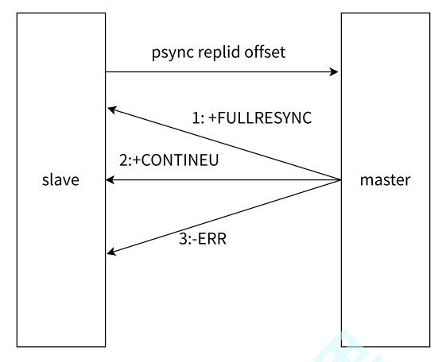
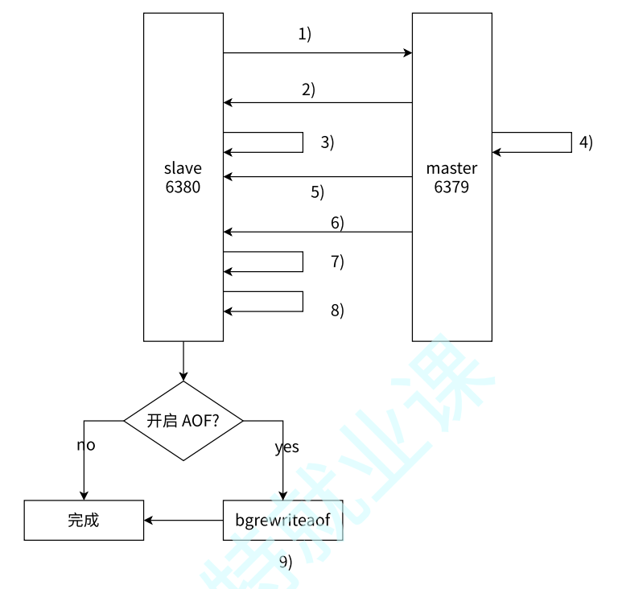
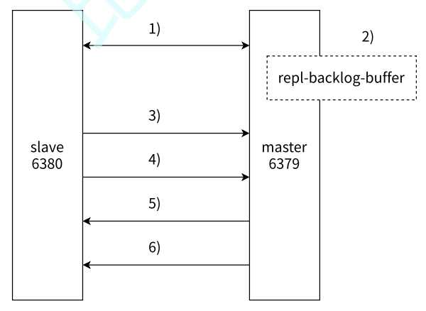
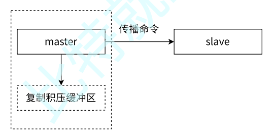
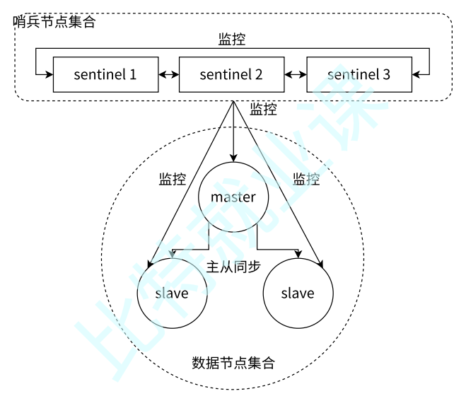
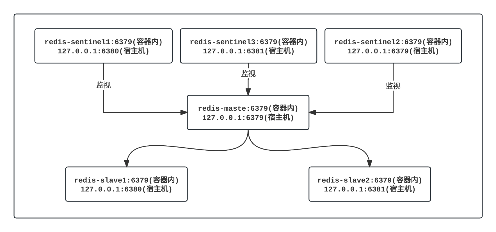
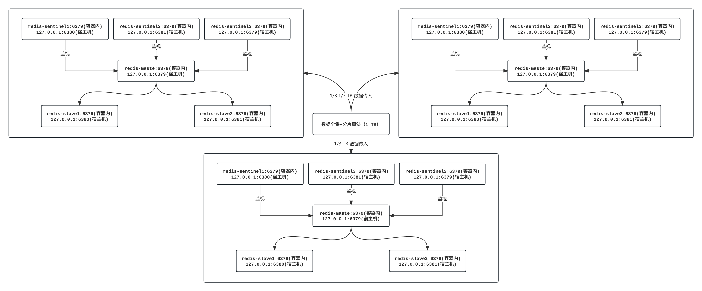
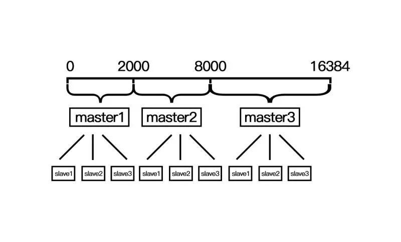

# Redis 集群架构

## 1.Redis 读分离架构/高可用架构

### 1.1.架构原理

当客户端足够多时，要减轻 `redis` 节点的负担，则可以考虑多个从节点复制主节点的数据，主节点负责读写，从节点只负责读（不过这么做其实是有点问题的，后面一步一步来）。

### 1.2.数据节点

#### 1.2.1.复制

##### 1.2.1.1.复制的建立

首先我们需要建立 `Redis` 的集群架构，`Redis` 实例之间会进行复制操作，实例划分为主节点和从节点，复制数据流是单向的，只能从主节点流向从节点。复制的配置方式有三种：

- 配置文件中写入在 `slaveof {masterHost} {masterPort}` 随 `Redis` 启动生效
- 在 `redis-server` 启动命令时加入 `--slaveof {masterHost} {masterPort}` 生效
- 直接使用 `redis` 命令 `slaveof {masterHost} {masterPort}` 生效

我们在启动 `Redis` 的时候，其实是可以选择不同的配置文件的，因此我们只需要保持原来的 `Redis` 不变（作为主节点），复制原来的配置文件稍作修改为 `redis-slave.conf ` 即可（确保其中的 `daemonize` 为 `yes`，如果配置文件中已经设置好了，那其从节点配置文件可以继续使用主节点的配置文件，不做任何修改）。

```shell
# 复制的建立
$ sudo redis-server /etc/redis/redis-slave.conf --port 6380 --slaveof 127.0.0.1 6379 ## 6379 的主节点就连接上 6380 的次节点

```

然后使用 `redis-server /etc/redis/redis-slave.conf --port 6380 --slaveof 127.0.0.1 6379` 启动从节点，并且使用 `netstat -nlpt` 检查是否启动，最后按下面的做法查验是否有分布式运行。

##### 1.2.1.2.复制的现象

```shell
# 复制的过程
# >>> begin: 连接主节点 >>>
$ redis-cli -h 127.0.0.1 -p 6379
127.0.0.1:6379> set key "hello"
OK

127.0.0.1:6379> get key
"hello"

127.0.0.1:6379> info replication
# Replication
role:master
connected_slaves:1
slave0:ip=127.0.0.1,port=6380,state=online,offset=700,lag=1
master_failover_state:no-failover
master_replid:8280d7308ba672a701170c8eeba15e258546de71
master_replid2:0000000000000000000000000000000000000000
master_repl_offset:700
second_repl_offset:-1
repl_backlog_active:1
repl_backlog_size:1048576
repl_backlog_first_byte_offset:1
repl_backlog_histlen:700
# <<< end <<<

# >>> begin: 连接从节点 >>>
$ redis-cli -h 127.0.0.1 -p 6380
127.0.0.1:6379> get key
"hello"

127.0.0.1:6380> info replication
# Replication
role:slave
master_host:127.0.0.1
master_port:6379
master_link_status:up
master_last_io_seconds_ago:9
master_sync_in_progress:0
slave_read_repl_offset:700
slave_repl_offset:700
slave_priority:100
slave_read_only:1
replica_announced:1
connected_slaves:0
master_failover_state:no-failover
master_replid:8280d7308ba672a701170c8eeba15e258546de71
master_replid2:0000000000000000000000000000000000000000
master_repl_offset:700
second_repl_offset:-1
repl_backlog_active:1
repl_backlog_size:1048576
repl_backlog_first_byte_offset:15
repl_backlog_histlen:686
# <<< end <<<

```

从运行结果中看到复制已经在工作了，针对主节点 `6379` 的任何修改都可以同步到从节点 `6380` 中，并且也可以使用 `info replication` 查看每个节点的复制信息（节点角色、状态等）。

##### 1.2.1.3.复制的断开

在从节点中可以执行 `slaveof no one` 断开和主节点的复制关系，从节点就会晋升为新的主节点，断开复制节点后不会抛弃原有数据，只是无法再获取主节点上的数据变化。断开节点后，还可以使用 `slaveof <newMasterIp> <newMasterPort>` 给从节点切换为别的主节点，或者干脆给从节点恢复原本的主节点。

```shell
# 复制的断开
# >>> begin: 从节点 >>>
$ redis-cli -h 127.0.0.1 -p 6380

127.0.0.1:6380> get key
"hello"

127.0.0.1:6380> slaveof no one
OK

# <<< end <<<

# >>> begin: 主节点 >>>
$ redis-cli -h 127.0.0.1 -p 6379

127.0.0.1:6379> get key
"hello"

127.0.0.1:6379> set akey "redis"
OK
# <<< end <<<

# >>> begin: 从节点 >>>
127.0.0.1:6380> get akey # 这样就无法直接复制主节点的数据了
(nil)

127.0.0.1:6380> slaveof 127.0.0.1 6379
OK
# <<< end <<<

# >>> begin: 主节点 >>>
$ redis-cli -h 127.0.0.1 -p 6379 # 访问一次主节点
# <<< end <<<

# >>> begin: 主节点 >>>
127.0.0.1:6380> get akey # 就会发现从节点恢复了复制
"redis"
# <<< end <<<

```

##### 1.2.1.4.复制的安全

- **权限校验**：对于数据比较重要的节点，主节点会通过设置 `requirepass <密码>` 参数进行密码验证，这时所有的客户端访问进入命令行后必须先使用 `auth` 命令实行校验。从节点与主节点的复制连接是通过一个特殊标识的客户端来完成，因此需要配置从节点的 `masterauth <密码>` 参数与主节点密码保持一致，这样从节点才可以正确地连接到主节点并发起复制流程。 
- **只读模式**：只读默认情况下，从节点使用 `slave-read-only=yes` 配置为只读模式。由于复制只能从主节点到从节 点，对于从节点的任何修改主节点都无法感知，修改从节点会造成主从数据不一致，所以建议线上不要修改从节点的只读模式。

为了不影响我原来的配置，我这里复制最原本的配置文件，作为主节点和从节点的配置。

1. 配置主节点

   ```shell
   # 配置主节点( redis-master.conf)
   $ sudo cp /etc/redis/redis.conf ~/redis-master.conf
   $ vim redis-master.conf
   # ...
   port 6380
   requirepass <主节点密码>
   # ...
   
   ```

2. 启动主节点

   ```shell
   # 启动主节点
   $ redis-server redis.conf
   
   ```

3. 配置从节点

   ```shell
   # 配置从节点(redis-slave.conf)
   $ sudo cp /etc/redis/redis.conf ~/redis-slave.conf
   $ vim redis-slave.conf
   # ...
   port 6381
   requirepass <从节点密码>
   slaveof 127.0.0.1 6380
   masterauth <填入主节点密码>
   slave-read-only yes
   # ...
   
   ```

4. 启动从节点

   ```shell
   # 启动从节点
   $ redis-server redis-slave.conf
   
   ```

5. 连接主节点并设置值

   ```shell
   # 连接主节点并设置值
   $ redis-cli -p 6380 -a <主节点密码> # 或者不使用 -a 选项, 直接回车, 在命令行界面中使用 "auth 密码" 即可, 如果验证通过就会返回 OK
   127.0.0.1:6380> set key "value1"
   ok
   
   127.0.0.1:6380> get key
   "value1"
   
   ```

6. 验证从节点数据同步

   ```shell
   # 验证从节点数据同步
   $ redis-cli -p 6381
   127.0.0.1:6381> get key
   "value1"
   
   ```

7. 验证从节点只读模式

   ```shell
   # 验证从节点只读模式
   127.0.0.1:6381> set key "new_value"
   (error) READONLY You can't write against a read-only replica.
   
   ```

##### 1.2.1.5.复制的延迟

主从节点一般部署在不同机器上，复制时的网络延迟就成为需要考虑的问题，`Redis` 为我们提供了 `repl-disable-tcp-nodelay` 参数用于控制是否关闭 `TCP_NODELAY`，默认为 `no`，即开启 `tcpnodelay` 功能，说明如下：

- 当关闭时，主节点产生的命令数据无论大小都会及时地发送给从节点，这样主从之间延迟会变小，但增加了网络带宽的消耗。适用于主从之间的网络环境良好的场景，如同机房部署。
- 当开启时，主节点会合并较小的 `TCP` 数据包从而节省带宽，默认发送时间间隔取决于 `Linux` 的内核，一般默认为 `40` 毫秒。这种配置节省了带宽但增大主从之间的延迟。适用于主从网络环境复杂的场景，如跨机房部署。

> [!CAUTION]
>
> 警告：因此除非数据不紧急，否则使用 `Redis` 的从节点做读分离其实是有点问题的，因为可能会有较高的延迟，与其说是读分离，不如说从节点的重点是备份数据，方便后续的哨兵节点做故障转移的。

#### 1.2.2.拓扑

1. **一主一从结构**：也就是我们之前一直使用的结构

   - 通常用于主节点出现宕机时，从节点可以提供临时故障转移
   - 同时写命令较高需要持久化时，就可以在从节点上开启 `AOF` 配置

   这样就可以保证数据持久化安全性，也可以避免对主节点性能的干扰。

2. **一主多从结构**：在大型电商平台中，商品详情页的访问量通常远高于商品数据的修改量。例如，商品价格、库存等信息修改的频率较低，而用户浏览商品详情的频率极高。因此可以一个主节点负责写入，其他从节点都负责读取（负载均衡读取）。

3. **树形主从结构**：树形主从结构（分层结构）使得从节点不但可以复制主节点数据，同时可以作为其他从节点的主节点继续向下层复制。当祖先主节点需要直接挂载的从节点较多时，可以通过引入复制中间层（就是祖先节点只挂载几个从节点后，那几个从节点构成一层中间层），有效降低住系欸按负载和需要传送给从节点的数据量。数据写入节点 `A` 之后会同步给 `B` 和 `C` 节点，`B` 节点进一步把数据同步给 `D` 和 `E` 节 点，这样当主节点 `A` 需要挂载多个从节点时，就可以避免对主节点 `A` 的过高性能干扰。

> [!WARNING]
>
> 补充：这里 `Redis` 只是做了复制和拓扑的工作，并没有使用现有的负载均衡算法，因此我们后面需要补充这类算法，在对应编程语言客户端中实现。

#### 1.2.3.原理

##### 1.2.3.1.链接检测

建立复制链接之前：

1. **保存主节点信息**：当开始配置主从同步关系后，先启动从节点的话，会先保存主节点的地址信息，但复制流程尚未开始。 在从节点（如端口 `6380`）执行 `info replication`，可以看到以下信息，此时链接尚未建立。

   ```shell
   # 回显显示的配置
   127.0.0.1:6381> info replication
   # Replication
   role:slave
   master_host:127.0.0.1
   master_port:6380
   master_link_status:up
   master_last_io_seconds_ago:2
   master_sync_in_progress:0
   slave_read_repl_offset:43163
   slave_repl_offset:43163
   slave_priority:100
   slave_read_only:1
   replica_announced:1
   connected_slaves:0
   master_failover_state:no-failover
   master_replid:63d358c9223002afc5dcc995a235fcc14882c9d3
   master_replid2:1c606c458fe22df08bae73d9af9a675cb7b49554
   master_repl_offset:43163
   second_repl_offset:43094
   repl_backlog_active:1
   repl_backlog_size:1048576
   repl_backlog_first_byte_offset:43094
   repl_backlog_histlen:70\
   
   # master_host 和 master_port 分别表示主节点的 IP 和 PORT
   # master_link_status 表示主节点的连接状态, 此时为 down, 说明尚未建立连接
   
   ```

2. **建立 TCP 连接**：从节点会通过每秒运行的定时任务维护复制逻辑。

   - 如果检测到新的主节点，从节点会尝试与主节点建立基于 `TCP` 的网络连接
   - 若连接失败，定时任务会无限重试，直到连接成功或用户手动停止主从复制。

3. **发送 PING 命令**：成功建立连接后，从节点会发送 `PING` 命令，验证主节点的应用层状态。

   - 如果主节点正常，会返回 `PONG`
   - 如果 `PONG` 超时，从节点会断开 `TCP` 连接，并等待下一次定时任务重新连接

4. **权限验证**：若主节点配置了 `requirepass` 参数，则需要密码验证。

   - 从节点需在配置文件中设置 `masterauth` 参数提供密码
   - 如果验证失败，主从复制过程将停止

5. **同步数据集**：在首次建立复制时，主节点会将其所有数据发送给从节点，分为以下两种情况。

   - **全量同步**：发送所有数据，耗时较长（后面会提及 ==方式、字段、指令==）
   - **部分同步**：发送增量数据，耗时较短（后面会提及 ==方式、字段、指令==）

6. **命令持续复制**：完成数据同步后，主节点会将后续所有修改命令发送给从节点，从节点执行这些命令以保持数据一致性。

建立复制链接之后：

而实际上，为了做到实时复制，主从节点在建立复制链接后，主节点回报自己收到的修改操作，通过 `tcp` 长链接的方式，源源不断传输给从节点，从节点就会根据这写请求来同步修改自己的数据，保持和主节点的数据一致性。

而这样的长链接需要使用心跳检测机制（这里的心跳机制是在 `Redis` 应用层实现的，而不是 `TCP` 自带的心跳机制）来维护链接状态：

1. 主从节点彼此之间都有心跳机制，各自模拟为对方的客户端进行通信
2. 主节点默认每隔 `10 s` 对从节点发送 `ping` 指令，判断从节点的存活性和链接状态（从节点也可以用这种方式来的只主节点是否掉线）
3. 从节点默认每隔 `1 s` 对主节点发送 `replconf ack {offset}` 指令来上报自己的偏移量（主节点会根据该偏移量来知道哪些数据已经被从节点接收并处理）

如果主节点发现从节点通信延迟超过 `repl-timeout` 配置的值（默认 `60` 秒），则判定从节点下线，断 开复制客⼾端连接。从节点恢复连接后，⼼跳机制继续进⾏。

##### 1.2.3.2.复制方式

- 早期的` Redis` 只支持全量复制，这就导致有新的从节点加入时，如果数据量较大，就会非常消耗网络资源，并且一旦出现网络波动，就会导致数据丢失而重传。
- 新版本的 `Redis` 支持部分复制，这主要处理在主从复制中网络闪断等原因造成的数据丢失场景，当从节点再次连接上主节点后，如果条件允许，主节点就会自动补发数据给从节点。补发的数量远小于全量复制，因此可以避免过量的开销。

而同步的指令主要依靠 `psync replicationid <offset>`（是 `Redis` 内部自动调用的命令，不用我们自己调用），其中 `offset` 为 `-1` 代表全量复制指令，其他数值均为部分复制。

触发全量复制，这通常在以下场景发生：

- 从节点首次连接到主节点时。
- 从节点与主节点数据完全不同步（如从节点为空或主节点 `replicationid` 改变）。
- 主节点无法满足部分复制条件（如复制积压缓冲区不足）。

触发部分复制，这通常在以下场景发生：

- 从节点重新连接主节点时（短暂网络中断后）。
- 从节点的 `replicationid` 和偏移量与主节点匹配，且主节点复制积压缓冲区中仍有缺失的数据。

##### 1.2.3.3.重要字段

> [!IMPORTANT]
>
> 补充：通过 `info replication` 可以观察下提及的字段，以及对应值的变化。

###### 1.2.3.3.1.复制标识字段

节点的复制 `id`在以下两种情况。

- 主节点初始启动时/重新启动时/异常恢复时
- 从节点晋级成主节点时

都会生成一个 `replication id`(同一个节点，每次重启，生成的 `replication id` 也会变化)，从节点和主节点建立连接之后，就会获取到主节点的 `replication id`，通过 `info replication` 即可查看 `replication id`。

而每个节点需要记录两组 `master_replid`，这个设定解决的问题场景是这样的：

- 比如当前有两个节点 `A` 和 `B`，`A` 为 `master`，`B` 为 `slave`。此时 `B` 就会记录 `A` 的 `master_replid`。如果网络出现抖动，`B` 以为 `A` 挂了，`B` 自己就会自动成为主节点。
- 于是 `B` 给自己分配了新的 `master_replid`。此时就会使用 `master_replid2` 来保存之前 `A` 的 `master_replid`。
- 如果后续网络恢复了，`B` 就可以根据 `master_replid2` 找回之前的主节点。
- 如果后续网络没有恢复，`B` 就按照新的 `master_replid` 自成一派，继续处理后续的数据（您可以自己尝试 `kill` 掉主节点，重启主节点，查看中间的变化...）。

###### 1.2.3.3.2.复制偏移字段

参与复制的主从节点都会维护自身复制偏移量，主节点（`master`）在处理完写入命令后，会把命令的字节长度做累加记录，统计信息在 `info replication` 中的 `master_repl_offset` 指标中。

从节点在接受到主节点发送的命令后，也会累加记录自身的偏移量，统计信息在 `info replication` 中的 `slave_repl_offset` 指标中。

从节点每秒钟上报自身的复制偏移量给主节点，因此主节点也会保存从节点的复制偏移量，统计指标为 `slavex` 中的 `offset` 字段。

因此，通过对比主从节点的复制偏移量，可以判断主从节点数据是否一致。

> [!IMPORTANT]
>
> 补充：`replid + offset` 共同标识了一个“数据集”，如果两个节点，他们的 `replid` 和 `offset` 都相同，则这两个节点上持有的数据，就一定相同。

> [!NOTE]
>
> 吐槽：偏移量就相当于学习进度。

##### 1.2.3.4.同步指令

从节点实现复制的原理实际上就是调用 `psync` 指令（由于早期不支持部分复制，会使用全量复制指令 `sync`，`Redis` 会自动根据当前版本来决定使用哪一个指令）。

```shell
# 数据同步指令
psync <主节点复制标识replicationid> <偏移量offset>
# 如果 replicationid 设为 '?' 并且 offset 设为 '-1' 此时就是在尝试进行全量复制
#如果 replicationid offset 设为了具体的数值, 则是尝试进行部分复制

```

从节点使用后，主要发生了以下事情：



1. 从节点发送 `psync` 命令给主节点，`replid` 和 `offset` 的默认值分别是 `?` 和 `-1`
2. 主节点根据 `psync` 参数和自身数据情况决定响应结果：
   - 如果回复 `+FULLRESYNC`，从节点进行全量复制流程
   - 如果回复 `+CONTINEU`，从节点进行部分复制流程
   - 如果回复 `-ERR`，说明 `Redis` 主节点版本过低，不支持 `psync` 命令，从节点可以使用 `sync` 命令进行全量复制

> [!IMPORTANT]
>
> 补充：当从节点初次连接主节点时，它不知道主节点的 `replicationid`（即它没有之前的同步信息）。
>
> 这种情况下，从节点会发送 `PSYNC ? 0` 请求，表示它从未与主节点进行过同步，要求主节点进行全量同步。

> [!IMPORTANT]
>
> 补充：`psync` 一般不需要手动执行，`Redis-server` 会在主从复制模式下自动调用执行。

> [!IMPORTANT]
>
> 补充：`sync` 会阻塞 `redis server` 处理其他请求，`psync` 则不会。

##### 1.2.3.5.详细过程

根据我们之前的知识，您也肯定明白两种复制方式的触发情况，但是我我们可以进一步细化这一步复制的概念。

###### 1.2.3.5.1.全量复制的细节



1. 从节点发送 `psync` 命令给主节点进行数据同步，由于是第一次进行复制，从节点没有主节点的运行 `ID` 和复制偏移量，所以发送 `psync ? -1`（不过有 `IP` 和`PORT` 所以不愁找不到主节点）。
2. 主节点根据命令，解析出要进行全量复制，回复 `+FULLRESYNC` 响应。
3. 从节点接收主节点的运行信息进行保存。
4. 主节点执行 `bgsave` 进行 `RDB` 文件的持久化。
5. 主节点发送 `RDB` 文件给从节点，从节点保存 `RDB` 数据到本地硬盘。
6. 主节点将从生成 `RDB` 到接收完成期间执行的写命令，写入到缓冲区中（不是指积压缓冲区），等从节点保存完 `RDB` 文件后，主节点再将缓冲区内的数据补发给从节点，补发的数据仍然按照 `RDB` 的二进制格式追加写入到收 到的 `rdb` 文件中，保持主从一致性。
7. 从节点清空自身原有的旧数据。
8. 从节点加载 `RDB` 文件得到与主节点一致的数据。
9. 如果从节点加载 `RDB` 完成之后，并且开启了 `AOF` 持久化功能，它会进行 `bgrewriteaof` 操作（不阻塞地优化 `AOF` 文件），得到最近的 `AOF` 文件。

> [!IMPORTANT]
>
> 补充：默认情况下，进行全量复制需要主节点生成 `RDB` 文件到主节点的磁盘中, 再把磁盘上的 `RDB` 文件通过发送给从节点。`Redis` 从 `2.8.18` 版本开始支持无磁盘复制。主节点在执行 `RDB` 生成流程时, 不会生成 `RDB` 文件到磁盘中了，而是直接把生成的 `RDB` 数据通过网络发送给从节点，这样就节省了一系列的写硬盘和读硬盘的操作开销。

###### 1.2.3.5.2.部分复制的细节



1. 当主从节点之间出现网络中断时，如果超过 `repl-timeout` 时间，主节点会认为从节点故障并终止复制连接。
2. 主从连接中断期间主节点依然响应命令，但这些复制命令都因网络中断无法及时发送给从节点，所以暂时将这些命令滞留在 **复制积压缓冲区** 中。
3. 当主从节点网络恢复后，从节点再次连上主节点。
4. 从节点将之前保存的 `replicationId` 和 `offset` 作为 `psync` 的参数发送给主节点，请求进行部分复制。
5. 主节点接到 `psync` 请求后，进行必要的验证。随后根据 `offset` 去复制积压缓冲区查找合适的数据， 并响应 `+CONTINUE` 给从节点（如果超出缓冲区的范围就需要切换为全量复制了）。
6. 主节点将需要从节点同步的数据发送给从节点，最终完成一致性。

> [!IMPORTANT]
>
> 补充：复制积压缓冲区的概念。
>
> 
>
> 复制积压缓冲区是保存在主节点上的一个固定长度的队列，默认大小为 `1MB`，当主节点有连接的从节点时被创建，这时主节点响应写命令时，不但会把命令发送给从节点，还会写入复制积压缓冲区，
>
> 由于积压缓冲区本质上是先进先出的定长队列，所以能实现保存最近已复制数据的功能，用于补救 **部分复制或复制命令** 中丢失的数据。复制缓冲区相关统计信息可以通过主节点的 `info replication` 中。
>
> ```shell
> # 积压缓冲区信息
> 127.0.0.1:6379> info replication
> # Replication
> role:master
> ...
> repl_backlog_active:1 # 开启复制缓冲区
> repl_backlog_size:1048576 # 缓冲区最大长度 
> repl_backlog_first_byte_offset:7479 # 起始偏移量, 计算当前缓冲区可用范围
> repl_backlog_histlen:1048576 # 已保存数据的有效长度
> # 可算出复制积压缓冲区内的可用偏移量范围: [repl_backlog_first_byte_offset, repl_backlog_first_byte_offset + repl_backlog_histlen]
> 
> ```

### 1.3.哨兵节点

#### 1.3.1.概念

`Redis` 的主从复制模式可以将主节点的数据改变同步给从节点，这样从节点就可以起到两个作用：

- 作为主节点的一个备份，一旦主节点出了故障不可达的情况，从节点可以作为后备“顶替”上来，并且保证数据尽量不丢失（主从复制表现为最终一致性）
- 从节点可以分担主节点上的读压力，让主节点只承担写请求的处理，将所有的读请求负载均衡到各个从节点上。 但是主从复制模式并不是万能的，它同样遗留下以下几个问题： 
  - 主节点发生故障时，进行主备切换的过程是复杂的，需要完全的人工参与，导致故障恢复时间无法得到保障（这个用哨兵来解决）。
  - 主节点可以将读压力分散出去，但写压力/存储压力是无法法被分担的，还是受到单机的限制。 其中第一个问题是高可用问题，即 `Redis` 哨兵主要解决的问题（这个用集群来解决）。

不过，我们先来观察一个主节点故障后，一名运维工程师是如何 !!在睡梦中惊醒后!! 快速恢复服务 !!然后回去继续补觉!! 的。

1. 运维工程师监控面板，发现公司应用出现问题，排查后发现是分布式 `Redis` 的主节点发生了故障（假设这个应用只使用了一个主节点，多个一级从节点），但是此应用读取数据是没有问题只是无法写入。
2. 运维工程师在多个从节点中选择一个选择一个节点作为新主节点，修改所有从节点的配置文件，时从节点们指向新主节点，新的主节点也可以继续使用原有的读操作。
3. 运维工程师再修改应用的配置文件，让应用连接新的主节点，应用恢复写能力。
4. 运维工程师排除设计的旧主节点的问题后，修改旧主节点转化为新从节点，加入到分布式 `Redis` 架构中，以新主节点作为主节点。

整个过程也被称为 **故障转移**，因此我们认为 !!运维工程师真的很惨...咳咳!! 这个应用并不高可用，我们希望这个过程是自动的，运维工程师只需要观察异常日志和指定分布是架构节点个数即可。

> [!IMPORTANT]
>
> 补充：这里梳理一下概念。
>
> - 数据节点包含主节点、从节点，节点内运行 `redis-server` 服务
> - 哨兵集合内包含哨兵节点，节点内运行 `redis-sentinel` 服务
> - 应用方也叫客户端，可以是命令行也可以是语言第三方库

为了解决上面的问题，`Redis` 提出了 `Redis Sentinel` 这个分布式架构解决方案，其中包含若干个哨兵节点和数据节点。每个哨兵节点会对数据节点和其余 `Sentinel` 节点进行监控（在哨兵节点集合中，存在类似循环链表结构的互相监督机制），当它发现节点不可达时，会对节点做下线标识。

如果下线的是主节点，它还会和其他的 `Sentinel` 节点（所有哨兵节点最好保持奇数总数，避免出现无法选举的问题）进行“协商”，当大多数 `Sentinel` 节点对主节点不可达这个结论达成共识之后，它们自己会在哨兵节点集合内部“选举”出一个 **领导节点** 来完成自动故障转移的工作，同时将这个变化实时通知给 `Redis` 应用方。整个过程是完全自动的，不需要人工介入。因此大体的流程和上面运维工程师做的类似，故障转移的流程大体如下：



1. 监控：主节点故障，从节点同步连接中断，主从复制停止。哨兵节点通过定期监控发现主节点出现故障
2. 故障转移：哨兵节点与其他哨兵节点进行协商，达成多数认同主节点故障的共识（防止出故障的不是主节点，而是负责发现故障的哨兵节点，该情况经常发生于哨兵节点的网络被孤立的场景下）。后哨兵节点之间使用 `Raft` 算法选举出一个领导角色，由该节点负责后续的故障转移工作，哨兵领导者开始执行故障转移：
   - 在从节点集合中选择一个作为新主节点
   - 让其他从节点同步新主节点
3. 通知：通知应用层转移到新主节点

#### 1.3.2.部署

由于带有哨兵节点的分布式架构，直接本机部署多个数据节点和哨兵节点是有些麻烦的，因此为了演示方便，这里将会使用 `Docker Compose` 统一管理多个数据节点容器和多个哨兵节点容器。

> [!WARNING]
>
> 注意：如果您没有学习过 `Docker` 相关的知识，其实也很难理解后面的集群知识，因此这里建议学习过一些 `Docker` 的操作和原理再来继续查阅本文档...

##### 1.3.2.1.准备工作

```shell
 # 准备工作
 # 安装编排工具
$ sudo apt install docker-compose 
$ docker-compose -v
Docker Compose version v2.26.1

# 停止原有服务
$ sudo systemctl stop redis
# $ sudo systemctl stop redis-sentinel # 如果有的话

# 拉取最新镜像
$ docker pull redis:latest

```

> [!CAUTION]
>
> 警告：建议和我相同版本。

##### 1.3.2.2.主从编排

```shell
# 编排主从
$ sudo vim /etc/redis/redis-data/docker-compose.yml
$ sudo cat /etc/redis/redis-data/docker-compose.yml
services:
  redis1:
    image: 'redis:latest'
    container_name: redis-node-1
    restart: always
    command: redis-server --appendonly yes
    ports:
      - 6379:6379
  
  redis2:
    image: 'redis:latest'
    container_name: redis-node-2
    restart: always
    command: redis-server --appendonly yes --slaveof redis-node-1 6379
    ports:
      - 6380:6379
  
  redis3:
    image: 'redis:latest'
    container_name: redis-node-3
    restart: always
    command: redis-server --appendonly yes --slaveof redis-node-1 6379
    ports:
      - 6381:6379
      
```

上述配置文件描述了三个节点容器，一个主节点容器，两个从节点容器（都开启 `AOP` 持久化）。

```shell
# 启动指令
# 根据不同编排配置启动分布式
$ cd /etc/redis/redis-data
$ docker-compose up -d

# 查看默认的网络
$ docker network ls
NETWORK ID     NAME                 DRIVER    SCOPE
efe47f88acdc   redis-data_default        bridge    local # 注意: 这个网络名称是根据 "编排配置文件所在目录名称 + _default" 得到的

$ docker network inspect redis-data_default
[
    {
        "Name": "redis-data_default",
        "Id": "8533d02081e2576057d6838168e5e1d6e87f5daba69a1ea7d69e51fd4cd151a5",
        "Created": "2024-12-05T13:47:48.417830084+08:00",
        "Scope": "local",
        "Driver": "bridge",
        "EnableIPv6": false,
        "IPAM": {
            "Driver": "default",
            "Options": null,
            "Config": [
                {
                    "Subnet": "172.20.0.0/16",
                    "Gateway": "172.20.0.1"
                }
            ]
        },
        "Internal": false,
        "Attachable": false,
        "Ingress": false,
        "ConfigFrom": {
            "Network": ""
        },
        "ConfigOnly": false,
        "Containers": {
            "5680ccfbbc0ff83424c2472f5993a40d181308919bf6a0d4c5e7629e0d70f986": {
                "Name": "redis-node-1",
                "EndpointID": "63fb132ccd54ae3cd7aa2c84ca7d66c8b7ea55a2f6945f47ccf42b065f635cc3",
                "MacAddress": "02:42:ac:14:00:03",
                "IPv4Address": "172.20.0.3/16",
                "IPv6Address": ""
            },
            "6542ad572406c4a42f4cdc470f7bc7a11efa434709976b961ffb5bca6fb6a9c0": {
                "Name": "redis-node-2",
                "EndpointID": "23dd68fec78289df8ac836cf4d91b04bc541847339a9a1b2d59d08ab285511ec",
                "MacAddress": "02:42:ac:14:00:04",
                "IPv4Address": "172.20.0.4/16",
                "IPv6Address": ""
            },
            "f848db6f4005b6884cfeedbb3fe8beec5d3a51fde536305c2c756e6fa6999f80": {
                "Name": "redis-node-3",
                "EndpointID": "4b7fe30897519d432fd4ff9a30b7c36baddfa8c8665b847cc109dc4ce1999c98",
                "MacAddress": "02:42:ac:14:00:02",
                "IPv4Address": "172.20.0.2/16",
                "IPv6Address": ""
            }
        },
        "Options": {},
        "Labels": {
            "com.docker.compose.network": "default",
            "com.docker.compose.project": "redis-data",
            "com.docker.compose.version": "2.26.1"
        }
    }
]

# 检查主从运行情况
$ redis-cli -p 6379
127.0.0.1:6379> info replication
# Replication
role:master
connected_slaves:2
slave0:ip=172.20.0.4,port=6379,state=online,offset=252,lag=0
slave1:ip=172.20.0.2,port=6379,state=online,offset=252,lag=0
master_failover_state:no-failover
master_replid:8d4657bef20c6a9b9e260f04fe86a919fdc2db1f
master_replid2:0000000000000000000000000000000000000000
master_repl_offset:252
second_repl_offset:-1
repl_backlog_active:1
repl_backlog_size:1048576
repl_backlog_first_byte_offset:1
repl_backlog_histlen:252
127.0.0.1:6379> set my_key 114514
OK
127.0.0.1:6379> get my_key
"114514"
127.0.0.1:6379> exit

$ redis-cli -p 6380
127.0.0.1:6380> get my_key
"114514"
127.0.0.1:6380> exit

$ redis-cli -p 6381
127.0.0.1:6381> get my_key
"114514"
127.0.0.1:6381> exit

```

##### 1.3.2.3.哨兵编排

```shell
# 编排哨兵
$ sudo vim /etc/redis/redis-sentinel/docker-compose.yml
$ sudo cat /etc/redis/redis-sentinel/docker-compose.yml
networks:
  redis-data_default:
    external: true # 表示网络来自外部

services:
  sentinel1:
    image: 'redis:latest'
    container_name: redis-sentinel-1
    networks:
      - redis-data_default
    restart: always
    command: "redis-server /etc/redis-config/redis.conf --sentinel"
    volumes:
      - "./sentinel2:/etc/redis-config"
    ports:
      - 26379:26379

  sentinel2:
    image: 'redis:latest'
    container_name: redis-sentinel-2
    networks:
      - redis-data_default
    restart: always
    command: "redis-server /etc/redis-config/redis.conf --sentinel"
    volumes:
      - "./sentinel2:/etc/redis-config"
    ports:
      - 26380:26379

  sentinel3:
    image: 'redis:latest'
    container_name: redis-sentinel-3
    networks:
      - redis-data_default
    restart: always
    command: "redis-server /etc/redis-config/redis.conf --sentinel"
    volumes:
      - "./sentinel3:/etc/redis-config"
    ports:
      - 26381:26379
```

每个哨兵节点其实在一开始都使用同一份内容配置文件，但是被我分开为三个配置文件 ，且每个哨兵节点都在监视主节点，三个节点的总票数为 `3` 只需要 `2` 张票即可判定主节点下线。

```shell
# 配置文件
  # 先查看现有的 Redis 主数据节点分配到的 ip 地址
$ docker network inspect redis-data_default
# ...
            "5680ccfbbc0ff83424c2472f5993a40d181308919bf6a0d4c5e7629e0d70f986": {
                "Name": "redis-node-1",
                "EndpointID": "63fb132ccd54ae3cd7aa2c84ca7d66c8b7ea55a2f6945f47ccf42b065f635cc3",
                "MacAddress": "02:42:ac:14:00:03",
                "IPv4Address": "172.20.0.3/16",
                "IPv6Address": ""
            },
# ...

# 编写配置文件
$ cd /etc/redis/redis-sentinel
$ mkdir sentinel1 sentinel2 sentinel3
$ sudo vim sentinel1/redis.conf
bind 0.0.0.0
port 26379
sentinel monitor redis-master 172.20.0.3 6379 2 # 警告: 不允许使用容器名称替换 ip 地址
sentinel down-after-milliseconds redis-master 1000
# 这里标识 sentinel monitor 主节点名 主节点ip 主节点端口 法定票数

# 复制三份配置文件
$ sudo cp  sentinel1/redis.conf sentinel2/redis.conf
$ sudo cp sentinel1/redis.conf sentinel3/redis.conf

# 查看文件目录结构
 $ tree -L 2
.
├── docker-compose.yml
├── sentinel1
│   └── redis.conf
├── sentinel2
│   └── redis.conf
└── sentinel3
    └── redis.conf

```

> [!CAUTION]
>
> 警告：`redis-sentinel` 在运行过此中可能会对配置进行 `rewrite(重写)` 导致文件内容发生修改，如果用一份文件，就可能出现修改混乱的情况（例如三个哨兵节点监视的主节点失效后，就需要更改配置文件中主节点的 `ip` 和 `port`）。

> [!CAUTION]
>
> 警告：将三个 `redis.conf` 放在各个目录中是必要的，我也不太清楚原因，但是我确实有搜索到 [相关的资料](https://stackoverflow.com/questions/70384566/warning-sentinel-was-not-able-to-save-the-new-configuration-on-disk-device)，不过也没有详细解释原因...

> [!CAUTION]
>
> 补充：之前的 `redis` 数据节点之所以可以直接使用 `redis-master` 名称作为域名解析，是因为编排文件默认生成一个局域网，三个数据节点处于同一个局域网 `redis-data_default` 中。因此 `docker` 可以根据默认 `DNS` 解析得到容器在局域网中的 `ip`，但是貌似因为 `Redis` 最新版本中没有完全为哨兵节点适配这个问题，因此后面的三份 `redis.conf` 配置文件是根据前面分配给主数据节点的 `ip` 硬编码进去的，这里也有一些相关资料供您参考...
>
> - [CSDN 相关资料](https://blog.csdn.net/weixin_63028438/article/details/136077092)
> - [堆栈溢出相关资料](https://stackoverflow.com/questions/57464443/redis-sentinel-throws-error-cant-resolve-master-instance-hostname)
> - [Redis 官方文档](https://redis.io/docs/latest/operate/oss_and_stack/management/sentinel/#ip-addresses-and-dns-names)

```shell
# 启动指令
 $ cd /etc/redis/redis-sentinel/
 $ docker-compose up -d
 $ docker-compose ls
 NAME                STATUS              CONFIG FILES
redis-data          running(3)          /etc/redis/redis-data/docker-compose.yml
redis-sentinel      running(3)          /etc/redis/redis-sentinel/docker-compose.yml

```

上述配置文件描述了三个哨兵节点容器，分别监听配置文件里规定的数据节点容器。

##### 1.3.2.4.现象观察


根据配置文件`docker` 网络应该符合上图，我们可以简单查看一下。

```shell
# 查看网络
$ docker network inspect redis-data_default
[
    {
        "Name": "redis-data_default",
        "Id": "8533d02081e2576057d6838168e5e1d6e87f5daba69a1ea7d69e51fd4cd151a5",
        "Created": "2024-12-05T13:47:48.417830084+08:00",
        "Scope": "local",
        "Driver": "bridge",
        "EnableIPv6": false,
        "IPAM": {
            "Driver": "default",
            "Options": null,
            "Config": [
                {
                    "Subnet": "172.20.0.0/16",
                    "Gateway": "172.20.0.1"
                }
            ]
        },
        "Internal": false,
        "Attachable": false,
        "Ingress": false,
        "ConfigFrom": {
            "Network": ""
        },
        "ConfigOnly": false,
        "Containers": {
            "30fc3d7275e9e5c3a252c9838af4df3e0dcdb3d7aaa491247117b32c0d1733fd": {
                "Name": "redis-sentinel-1",
                "EndpointID": "897b230ed7894a039328c8cac06a0eafb28c12b714814873e8693696d2243696",
                "MacAddress": "02:42:ac:14:00:05",
                "IPv4Address": "172.20.0.5/16",
                "IPv6Address": ""
            },
            "3b3913ebe84f1997aaed3b4e632b33a62b324c77e614b8ad3bdc0866411f0cc4": {
                "Name": "redis-sentinel-3",
                "EndpointID": "60092aabd2445d68477326529fe604b6daecc46bb5ddd7dbdc6c63ef1c5eee3b",
                "MacAddress": "02:42:ac:14:00:07",
                "IPv4Address": "172.20.0.7/16",
                "IPv6Address": ""
            },
            "5680ccfbbc0ff83424c2472f5993a40d181308919bf6a0d4c5e7629e0d70f986": {
                "Name": "redis-node-1",
                "EndpointID": "63fb132ccd54ae3cd7aa2c84ca7d66c8b7ea55a2f6945f47ccf42b065f635cc3",
                "MacAddress": "02:42:ac:14:00:03",
                "IPv4Address": "172.20.0.3/16",
                "IPv6Address": ""
            },
            "6542ad572406c4a42f4cdc470f7bc7a11efa434709976b961ffb5bca6fb6a9c0": {
                "Name": "redis-node-2",
                "EndpointID": "23dd68fec78289df8ac836cf4d91b04bc541847339a9a1b2d59d08ab285511ec",
                "MacAddress": "02:42:ac:14:00:04",
                "IPv4Address": "172.20.0.4/16",
                "IPv6Address": ""
            },
            "7803c0046b724adcd30524b4241cd0f9d0aa17db187c08a3cf3e3dbd6b147d1b": {
                "Name": "redis-sentinel-2",
                "EndpointID": "c6186ef8769b3719dfbafbc261471a65717ad88acd4e0571e220c7fd0c906fe5",
                "MacAddress": "02:42:ac:14:00:06",
                "IPv4Address": "172.20.0.6/16",
                "IPv6Address": ""
            },
            "f848db6f4005b6884cfeedbb3fe8beec5d3a51fde536305c2c756e6fa6999f80": {
                "Name": "redis-node-3",
                "EndpointID": "4b7fe30897519d432fd4ff9a30b7c36baddfa8c8665b847cc109dc4ce1999c98",
                "MacAddress": "02:42:ac:14:00:02",
                "IPv4Address": "172.20.0.2/16",
                "IPv6Address": ""
            }
        },
        "Options": {},
        "Labels": {
            "com.docker.compose.network": "default",
            "com.docker.compose.project": "redis-data",
            "com.docker.compose.version": "2.26.1"
        }
    }
]

```

```shell
# 观察现象
# 查看哨兵节点日志
$ docker container logs redis-sentinel-1
1:X 05 Dec 2024 06:45:37.907 * oO0OoO0OoO0Oo Redis is starting oO0OoO0OoO0Oo
1:X 05 Dec 2024 06:45:37.907 * Redis version=7.4.1, bits=64, commit=00000000, modified=0, pid=1, just started
1:X 05 Dec 2024 06:45:37.907 * Configuration loaded
1:X 05 Dec 2024 06:45:37.907 * monotonic clock: POSIX clock_gettime
1:X 05 Dec 2024 06:45:37.908 * Running mode=sentinel, port=26379.
1:X 05 Dec 2024 06:45:37.908 * Sentinel ID is 37d3396d0d849849aae8412b320123e38a774f7f
1:X 05 Dec 2024 06:45:37.908 # +monitor master redis-master 172.20.0.3 6379 quorum 2 # 开始监控主节点, 并且配置仲裁数量为 2
1:X 05 Dec 2024 06:45:39.973 * +sentinel sentinel 37d3396d0d849849aae8412b320123e38a774f7f 172.20.0.6 26379 @ redis-master 172.20.0.3 6379 # 注册一个哨兵节点监控主数据节点
1:X 05 Dec 2024 06:45:39.979 * Sentinel new configuration saved on disk
1:X 05 Dec 2024 06:45:39.981 * +sentinel-address-switch master redis-master 172.20.0.3 6379 ip 172.20.0.5 port 26379 for 37d3396d0d849849aae8412b320123e38a774f7f # 注册一个哨兵节点监控主数据节点
1:X 05 Dec 2024 06:45:39.983 * Sentinel new configuration saved on disk
1:X 05 Dec 2024 06:45:39.992 * +sentinel-address-switch master redis-master 172.20.0.3 6379 ip 172.20.0.7 port 26379 for 4ac62e0c7bde83b4acd18aa35bb544a7936f1a30 # 注册一个哨兵节点监控主数据节点
1:X 05 Dec 2024 06:45:39.995 * Sentinel new configuration saved on disk # 哨兵节点加载并且保存了新的配置到磁盘中

# 查看配置文件
$ sudo cat sentinel1/redis.conf 
bind 0.0.0.0
port 26379
sentinel monitor redis-master 172.20.0.3 6379 2
sentinel down-after-milliseconds redis-master 1000

# Generated by CONFIG REWRITE  # 这一部分也是新增加的部分, 是哨兵节点写入的, 我们需要分开三个配置文件书写的原因就是因为哨兵节点会对配置文件进行修改
dir "/data" # Redis Sentinel 工作目录
latency-tracking-info-percentiles 50 99 99.9 # 配置延迟跟踪的百分位
user default on nopass sanitize-payload ~* &* +@all # 配置默认用户的权限及认证方式
sentinel myid b6acb72ff13c744f8559c5582f97490af5dfa5c0 # 当前哨兵节点的唯一标识符
sentinel config-epoch redis-master 0 # 配置主节点的纪元值, 用于主节点选举时的版本控制
sentinel leader-epoch redis-master 0 # 记录当前哨兵选举过程中被选中的主节点的纪元
sentinel current-epoch 0 # 当前哨兵的纪元 

sentinel known-replica redis-master 172.20.0.2 6379 # 声明一个已知的副本节点(从数据节点)

sentinel known-replica redis-master 172.20.0.4 6379 # 声明一个已知的副本节点(从数据节点)

sentinel known-sentinel redis-master 172.20.0.6 26379 4ac62e0c7bde83b4acd18aa35bb544a7936f1a30 # 已知的其他哨兵节点信息

sentinel known-sentinel redis-master 172.20.0.7 26379 37d3396d0d849849aae8412b320123e38a774f7f # 已知的其他哨兵节点信息

# 模拟主节点挂掉
$ docker container stop redis-node-1

# 重新查看日志
$ docker container logs redis-node-1
# (省略) ...
1:X 05 Dec 2024 07:27:32.069 # +sdown master redis-master 172.20.0.3 6379 # 本哨兵节点检测到主节点失效(主观下线)
1:X 05 Dec 2024 07:27:32.131 # +odown master redis-master 172.20.0.3 6379 #quorum 2/2 # 所有哨兵节点通过投票决定该主数据节点已经完全不可用(客观下线), 这里的 quorum 意为多数同意
# >>> begin: 开始故障转移 >>>
1:X 05 Dec 2024 07:27:32.131 # +new-epoch 1 # 创建了一个新的选举周期, 标识为 1
1:X 05 Dec 2024 07:27:32.131 # +try-failover master redis-master 172.20.0.3  # 开始尝试进行主节点故障转移
1:X 05 Dec 2024 07:27:32.137 * Sentinel new configuration saved on disk # Sentinel 已经将新的配置加载的磁盘中
1:X 05 Dec 2024 07:27:32.137 # +vote-for-leader 37d3396d0d849849aae8412b320123e38a774f7f 1 # 选举新的领导
1:X 05 Dec 2024 07:27:32.137 * 37d3396d0d849849aae8412b320123e38a774f7f voted for 37d3396d0d849849aae8412b320123e38a774f7f 1 
1:X 05 Dec 2024 07:27:32.141 * 4ac62e0c7bde83b4acd18aa35bb544a7936f1a30 voted for 37d3396d0d849849aae8412b320123e38a774f7f 1
1:X 05 Dec 2024 07:27:32.214 # +elected-leader master redis-master 172.20.0.3 6379
1:X 05 Dec 2024 07:27:32.214 # +failover-state-select-slave master redis-master 172.20.0.3 6379
1:X 05 Dec 2024 07:27:32.305 # +selected-slave slave 172.20.0.2:6379 172.20.0.2 6379 @ redis-master 172.20.0.3 6379
1:X 05 Dec 2024 07:27:32.305 * +failover-state-send-slaveof-noone slave 172.20.0.2:6379 172.20.0.2 6379 @ redis-master 172.20.0.3 6379
1:X 05 Dec 2024 07:27:32.456 * +failover-state-wait-promotion slave 172.20.0.2:6379 172.20.0.2 6379 @ redis-master 172.20.0.3 6379
1:X 05 Dec 2024 07:27:33.393 * Sentinel new configuration saved on disk
1:X 05 Dec 2024 07:27:33.393 # +promoted-slave slave 172.20.0.2:6379 172.20.0.2 6379 @ redis-master 172.20.0.3 6379
1:X 05 Dec 2024 07:27:33.393 # +failover-state-reconf-slaves master redis-master 172.20.0.3 6379
1:X 05 Dec 2024 07:27:33.449 * +slave-reconf-sent slave 172.20.0.4:6379 172.20.0.4 6379 @ redis-master 172.20.0.3 6379
1:X 05 Dec 2024 07:27:34.393 * +slave-reconf-inprog slave 172.20.0.4:6379 172.20.0.4 6379 @ redis-master 172.20.0.3 6379
1:X 05 Dec 2024 07:27:34.393 * +slave-reconf-done slave 172.20.0.4:6379 172.20.0.4 6379 @ redis-master 172.20.0.3 6379
1:X 05 Dec 2024 07:27:34.455 # +failover-end master redis-master 172.20.0.3 6379 # 完成故障转移
# <<< end <<<
1:X 05 Dec 2024 07:27:34.455 # +switch-master redis-master 172.20.0.3 6379 172.20.0.2 6379 # 切换主节点
1:X 05 Dec 2024 07:27:34.455 * +slave slave 172.20.0.4:6379 172.20.0.4 6379 @ redis-master 172.20.0.2 6379 # 更新新的从节点
1:X 05 Dec 2024 07:27:34.455 * +slave slave 172.20.0.3:6379 172.20.0.3 6379 @ redis-master 172.20.0.2 6379 # 更新新的从节点
1:X 05 Dec 2024 07:27:34.457 * Sentinel new configuration saved on disk
1:X 05 Dec 2024 07:27:35.506 # +sdown slave 172.20.0.3:6379 172.20.0.3 6379 @ redis-master 172.20.0.2 6379

# 重新访问新的主节点
$ docker container ls | grep redis
30fc3d7275e9   redis:latest   "docker-entrypoint.s…"   2 hours ago   Up 2 hours   6379/tcp, 0.0.0.0:26379->26379/tcp, :::26379->26379/tcp     redis-sentinel-1
7803c0046b72   redis:latest   "docker-entrypoint.s…"   2 hours ago   Up 2 hours   6379/tcp, 0.0.0.0:26380->26379/tcp, [::]:26380->26379/tcp   redis-sentinel-2
3b3913ebe84f   redis:latest   "docker-entrypoint.s…"   2 hours ago   Up 2 hours   6379/tcp, 0.0.0.0:26381->26379/tcp, [::]:26381->26379/tcp   redis-sentinel-3
6542ad572406   redis:latest   "docker-entrypoint.s…"   3 hours ago   Up 3 hours   0.0.0.0:6380->6379/tcp, [::]:6380->6379/tcp                 redis-node-2
f848db6f4005   redis:latest   "docker-entrypoint.s…"   3 hours ago   Up 3 hours   0.0.0.0:6381->6379/tcp, [::]:6381->6379/tcp                 redis-node-3

# 进入客户端
$ redis-cli -p 6380
# 查看最新配置
127.0.0.1:6380> info replication
# Replication
role:slave
master_host:172.20.0.2 # 容器内部的 id
master_port:6379 # 容器内部的 port
master_link_status:up
master_last_io_seconds_ago:1
master_sync_in_progress:0
slave_read_repl_offset:1465716
slave_repl_offset:1465716
slave_priority:100
slave_read_only:1
replica_announced:1
connected_slaves:0
master_failover_state:no-failover
master_replid:d6cda86c05c8b419d7d5a8775c9ee7478d2c451e
master_replid2:8d4657bef20c6a9b9e260f04fe86a919fdc2db1f
master_repl_offset:1465716
second_repl_offset:808512
repl_backlog_active:1
repl_backlog_size:1048576
repl_backlog_first_byte_offset:408801
repl_backlog_histlen:1056916

# 检查是否只读
127.0.0.1:6381> config get replica-read-only
1) "replica-read-only"
2) "yes"

# 取消只读配置
127.0.0.1:6381> config set replica-read-only no
OK

# 测试是否发生主从复制
127.0.0.1:6381> set my_key "1433223"
OK

127.0.0.1:6381> get my_key
"1433223"

127.0.0.1:6381> exit

$ redis-cli -p 6380
127.0.0.1:6380> get my_key
"1433223"
127.0.0.1:6380> exit

# 回复旧的主节点
$ docker container start redis-node-1
redis-node-1

$ redis-cli -p 6379
127.0.0.1:6379> get my_key
"114514" # 还没有更改, 因为是懒加载的
127.0.0.1:6379> exit

$ redis-cli -p 6381
127.0.0.1:6381> get my_key "8848"
127.0.0.1:6381> exit

$ redis-cli -p 6379
127.0.0.1:6379> get my_key
"8848" # 这意味着这个旧主节点已经完全变为了新从节点
127.0.0.1:6379> exit

```

> [!IMPORTANT]
>
> 补充：关于数据节点下线的判断。
>
> - 主观下线（`Subjectively Down, SDown`）：哨兵感知到主节点没心跳了，判定为主观下线
> - 客观下线（`Objectively Down, ODown`）: 多个哨兵达成一致意见，才能认为 `master` 确实下线了

> [!IMPORTANT]
>
> 补充：在进行主从切换时，所有参与的哨兵节点都会更新自己的配置，并带上当前的 `epoch` 标识，也就是所谓的“选举周期标识”。这样，其他哨兵节点就能知道哪个节点是最新的领导者，避免出现重复的操作。

> [!WARNING]
>
> 注意：哨兵节点最好是有奇数个，方便选举 `leader`，故障得票也更容易超过半数。

> [!CAUTION]
>
> 警告：“主从复制+哨兵节点”的无人值守模式提高了高可用性，降低的运维成本，但也无法避免极端数据丢失的情况，并且也无法解决内存容量不够的问题，主节点所在的机器能存储的最多数据只和本机内存条有关，和其他从节点所在的机器的内存条是不会叠加的，毕竟从节点只是复制了主节点的数据而已。

#### 1.3.3.原理

还是根据我们的架构图，<span style="text-emphasis:filled red;">阐述一下 `Raft` 选举算法原理，待补充...</span>



## 2.Redis 写分离架构/多分片架构

### 2.1.架构原理

如果我们把上述的读分离结构看作一个小集群，那么多个读分离结构就是一个大集群。这样做就会有多个主节点可以被写入，假定数据是 `1 TB` 的话，有三个这样的小集群，就可以根据分片算法，每个小集群存储数据集的 `1/3 TB` 即可。这样做既解决了读压力过大的问题又解决了写存储不够的问题。



`Redis` 有什么必要需要这么做么？有，例如搜索引擎，这种需求对读写响应速度是强需求，对海量数据存储也是强需求。

### 2.2.分片算法

一个小集群相当于一个分片，可是直接引入某种机制一定会造成某些问题，假设给定数据全集

- 这些数据应该写入到哪一个分片上？
- 这些数据应该读出到哪一个分片上？

#### 2.2.1.哈希求余算法

假设有 `N` 个分片，使用`[0, N-1]` 的顺序进行编号，针对某个键值对，根据键名通过算法（例如 `md5` 算法）得到哈希值结果，再使用 `%N` 来求余，最终余数就是分片编号，根据计算出来的编号存储键值对即可。而读取的问题也是，根据想要获取键值对的键名，依葫芦画瓢得到对应的分片编号后，最对应的分区中查找即可。

这种方式简单高效，数据分配相对均匀（其实表现一般），但缺点就是拓展性差，一旦分区数量增加，就会导致原有的映射规则被破坏，一定需要扩容就需要重新对所有的键值对进行分区，数据在节点之间多次流动以满足新的映射规则，这增加了维护成本。并且在业务中如果发生分区拓展，造成的数据流动会影响业务的正常读写，有可能导致严重的数据一致性问题。迁移的过程中一旦发生数据丢失，就会导致数据丢失的严重情况。

#### 2.2.2.一致性哈希算法

.png)

换一种思路，我们不再进行简单的求余，把 $[0, 2^{32}-1)$ 这个数据空间映射到一个圆环上，数据按照顺时针的方向增长，键值对的键名映射为哈希值 `H` 后，假设我们有 `N` 个分片，人为设置分布在圆环上的 `N` 个点的位置上（分片点）。然后根据 `H` 在圆环上的位置，顺时针往下寻找分片点，遇到第一个分片点就把键值对存储到对应的分片中。

这种分配方式相当于把所有的哈希值的可能取值都提前做好了分区，如果需要扩容，就可以在某两个分片之间新建一个分片点，新的分片点将夺取前一个分片点的部分数据（分片点按照顺时针顺序分前后），这样每分一个分片就会增加存储量，减少前一个分片的压力。大大减少了扩容时数据搬运的规模，提高了扩容操作的效率，同时不影响业务读写。但缺点就是有可能发生数据分配不均匀，导致数据倾斜。另外，更加严重的问题是，如果某个节点集群发生雪崩（但大量读写涌入时，无论如何更替主从节点，最后整个节点集群还是会刮掉），但是后续的节点集群如果负荷能力甚至都比前面节点集群要小，就会导致后续的节点集群继续承接读写压力，过一段时间再次崩溃，一直往后就会造成雪崩的问题。这种问题轻微会导致数据倾斜、部分数据丢失，严重会导致整个 `Redis` 大集群（也就是圆环上所有的节点集群）失去响应。尽管有人提出了虚拟节点的方式来解决这个问题，但是也会增加系统的复杂度和维护难度。

#### 2.2.3.哈希槽算法



上述两种方式一是导致扩容成本高，二是导致分配不均匀，因此 `Redis cluster` 就引入了哈希槽算法（例如使用 $hash\_slot = crc16(key_name) \% 16384$ 的到哈希值）。`Redis cluster`采用数据分片的哈希槽来进行数据存储和数据的读取，`Redis cluster` 一共有 $2^{14}=16384$个槽，所有的 `master` 节点都会有一个槽区,比如 $[0, 1000)$，槽数是可以迁移的。`master`节点的 `slave` 节点不分配槽，只拥有读权限。第一次新建 `Redis cluster` 时，`16384` 个槽是被 `master` 节点均匀分布的。

哈希槽不是闭合的，并且一个键值对的键名计算得到哈希值后，是固定在某一个区域的，不会像一致性算法一样出现大面积雪崩的情况，哪怕是某一个节点集群故障了，也不会导致大量的读写压力转移到别的节点上，仍能保持业务一定的活性。并且扩容机制和一致性算法有些类似，也可以避免大面积的传输，是兼顾多方面的好手。

### 2.3.搭建集群

前面的话太空，这里依旧是使用单机部署集群，真正意义上的跨主机集群，需要使用 `k8s` 来操作。在单机部署上，使用 `docker-compose` 模拟 `k8s` 工具，一个容器就是一台裸机。我们需要 `11` 个 `Redis` 节点，其中 `9` 个用来演示集群的搭建，`2` 个用作后续扩容缩容准备。

#### 2.3.1.设置目录

```shell
# 设置目录
$ cd /etc/redis/
$ mkdir redis-cluster
$ cd redis-cluster
$ touch docker-compose.yml
$ touch generate.sh
$ touch dissipate.sh

```

#### 2.3.2.脚本文件

```shell
# 脚本文件
$ cd /etc/redis/redis-cluster
$ vim generate.sh
$ cat generate.sh
# !/bin/bash
# 集群节点
for port in $(seq 1 9); \
do \
    mkdir -p redis${port}/
    touch redis${port}/redis.conf
    cat << EOF > redis${port}/redis.conf # 两个 EOF 之间的多行文本会被全部输入到 cat 中
port 6379 # 容器内的 PORT
bind 0.0.0.0 # 容器内的 IP
protected-mode no # 关闭保护模式(原本是会屏蔽掉一些不安全的访问的)
appendonly yes # 开启 AOF 持久化
cluster-enabled yes # 开启集群模式
cluster-config-file nodes.conf # 指定集群配置文件的名称, 节点可以通过读取该文件来解集群的状态
cluster-node-timeout 5000 # 设置集群节点超时时间
cluster-announce-ip 172.30.0.10${port} # 向集群中的其他节点宣告自己的集群网络 IP
cluster-announce-port 6379 # 向集群中的其他节点宣告自己的集群网络 PORT
cluster-announce-bus-port 16379 # 集群内部节点之间的通信总线端口(集群管理的信息交互是通过这个端口进行的)
EOF
done

# 备用节点
for port in $(seq 10 11); \
do \
    mkdir -p redis${port}/
    touch redis${port}/redis.conf
    cat << EOF > redis${port}/redis.conf
port 6379
bind 0.0.0.0
protected-mode no
appendonly yes
cluster-enabled yes
cluster-config-file nodes.conf
cluster-node-timeout 5000
cluster-announce-ip 172.30.0.1${port}
cluster-announce-port 6379
cluster-announce-bus-port 16379
EOF
done

$ vim dissipate.sh
$ cat dissipate.sh
# !/bin/bash
rm -rf redis*

# 去除上述注释后运行脚本
$ bash generate.sh
$ ls
dissipate.sh  generate.sh  redis1  redis10  redis11  redis2  redis3  redis4  redis5  redis6  redis7  redis8  redis9
$ tree -L 2
.
├── dissipate.sh
├── generate.sh
├── redis1
│   └── redis.conf
├── redis10
│   └── redis.conf
├── redis11
│   └── redis.conf
├── redis2
│   └── redis.conf
├── redis3
│   └── redis.conf
├── redis4
│   └── redis.conf
├── redis5
│   └── redis.conf
├── redis6
│   └── redis.conf
├── redis7
│   └── redis.conf
├── redis8
│   └── redis.conf
└── redis9
    └── redis.conf

12 directories, 13 files

# 查看配置内容是否正确
$ cat redis1/redis.conf
port 6379
bind 0.0.0.0
protected-mode no
appendonly yes
cluster-enabled yes
cluster-config-file nodes.conf
cluster-node-timeout 5000
cluster-announce-ip 172.30.0.101
cluster-announce-port 6379
cluster-announce-bus-port 16379

```

> [!CAUTION]
>
> 警告：注意请删除上面脚本中的注释后再运行。

> [!IMPORTANT]
>
> 补充：常用目录配置结构就是，使用一个目录来标识一个 `Redis` 集群，然后目录中存放多个节点目录（可能是数据节点，也可能是哨兵节点），节点目录中存放配置文件 `redis.conf`，我们可以根据 `redis-server` 读取不同的配置文件，来决定一个节点是数据节点还是哨兵节点。

#### 2.3.3.编排文件

> [!WARNING]
>
> 注意：之前我们使用的网络名称是根据父目录名称来得到的，但是其实我们也可以自己自定义一个，下面的配置文件就事先定义了一个集群网络。

```shell
# 编排容器
$ cd /etc/redis/redis-cluster
$ vim docker-compose.yml
$ cat docker-compose.yml
#  先自定义集群网络 redis-cluster-net
networks:
  redis-cluster-net:
    driver: bridge
    ipam: # 配置子网 IP 地址分配规则
      config:
        - subnet: 172.30.0.0/24 # 配置子网范围为 172.30.0.1 到 172.30.0.254

services:
  redis1: # 服务名
    image: 'redis:latest' # 指定镜像文件
    container_name: redis1 # 生成的容器名
    restart: always # 设置自动重启策略
    deploy: # 部署
      resources: # 资源
        limits: # 最大额度
          memory: 512M
        reservations: # 最小额度
          memory: 256M
    volumes: # 存储映射
      - ./redis1:/usr/local/etc/redis
    ports: # 端口映射
      - 6371:6379
    command: ["redis-server", "/usr/local/etc/redis/redis.conf"] # 启动指令
    networks: # 网络配置
      redis-cluster-net: # 在开头定义的子网网络中
        ipv4_address: 172.30.0.101 # 为容器指定静态的 ipv4 地址, 避免地址改动引起其他地方的修改

  redis2:
    image: 'redis:latest'
    container_name: redis2
    restart: always
    deploy:
      resources:
        limits:
          memory: 512M
        reservations:
          memory: 256M
    volumes:
      - ./redis2:/usr/local/etc/redis
    ports:
      - 6372:6379
    command: ["redis-server", "/usr/local/etc/redis/redis.conf"]
    networks:
      redis-cluster-net:
        ipv4_address: 172.30.0.102

  redis3:
    image: 'redis:latest'
    container_name: redis3
    restart: always
    deploy:
      resources:
        limits:
          memory: 512M
        reservations:
          memory: 256M
    volumes:
      - ./redis3:/usr/local/etc/redis
    ports:
      - 6373:6379
    command: ["redis-server", "/usr/local/etc/redis/redis.conf"]
    networks:
      redis-cluster-net:
        ipv4_address: 172.30.0.103
        
  redis4:
    image: 'redis:latest'
    container_name: redis4
    restart: always
    deploy:
      resources:
        limits:
          memory: 512M
        reservations:
          memory: 256M
    volumes:
      - ./redis4:/usr/local/etc/redis
    ports:
      - 6374:6379
    command: ["redis-server", "/usr/local/etc/redis/redis.conf"]
    networks:
      redis-cluster-net:
        ipv4_address: 172.30.0.104
        
  redis5:
    image: 'redis:latest'
    container_name: redis5
    restart: always
    deploy:
      resources:
        limits:
          memory: 512M
        reservations:
          memory: 256M
    volumes:
      - ./redis5:/usr/local/etc/redis
    ports:
      - 6375:6379
    command: ["redis-server", "/usr/local/etc/redis/redis.conf"]
    networks:
      redis-cluster-net:
        ipv4_address: 172.30.0.105
        
  redis6:
    image: 'redis:latest'
    container_name: redis6
    restart: always
    deploy:
      resources:
        limits:
          memory: 512M
        reservations:
          memory: 256M
    volumes:
      - ./redis6:/usr/local/etc/redis
    ports:
      - 6376:6379
    command: ["redis-server", "/usr/local/etc/redis/redis.conf"]
    networks:
      redis-cluster-net:
        ipv4_address: 172.30.0.106

  redis7:
    image: 'redis:latest'
    container_name: redis7
    restart: always
    deploy:
      resources:
        limits:
          memory: 512M
        reservations:
          memory: 256M
    volumes:
      - ./redis7:/usr/local/etc/redis
    ports:
      - 6377:6379
    command: ["redis-server", "/usr/local/etc/redis/redis.conf"]
    networks:
      redis-cluster-net:
        ipv4_address: 172.30.0.107

  redis8:
    image: 'redis:latest'
    container_name: redis8
    restart: always
    deploy:
      resources:
        limits:
          memory: 512M
        reservations:
          memory: 256M
    volumes:
      - ./redis8:/usr/local/etc/redis
    ports:
      - 6378:6379
    command: ["redis-server", "/usr/local/etc/redis/redis.conf"]
    networks:
      redis-cluster-net:
        ipv4_address: 172.30.0.108

  redis9:
    image: 'redis:latest'
    container_name: redis9
    restart: always
    deploy:
      resources:
        limits:
          memory: 512M
        reservations:
          memory: 256M
    volumes:
      - ./redis9:/usr/local/etc/redis
    ports:
      - 6379:6379
    command: ["redis-server", "/usr/local/etc/redis/redis.conf"]
    networks:
      redis-cluster-net:
        ipv4_address: 172.30.0.109

  redis10:
    image: 'redis:latest'
    container_name: redis10
    restart: always
    deploy:
      resources:
        limits:
          memory: 512M
        reservations:
          memory: 256M
    volumes:
      - ./redis10:/usr/local/etc/redis
    ports:
      - 6380:6379
    command: ["redis-server", "/usr/local/etc/redis/redis.conf"]
    networks:
      redis-cluster-net:
        ipv4_address: 172.30.0.110

  redis11:
    image: 'redis:latest'
    container_name: redis11
    restart: always
    deploy:
      resources:
        limits:
          memory: 512M
        reservations:
          memory: 256M
    volumes:
      - ./redis11:/usr/local/etc/redis
    ports:
      - 6381:6379
    command: ["redis-server", "/usr/local/etc/redis/redis.conf"]
    networks:
      redis-cluster-net:
        ipv4_address: 172.30.0.111

```

#### 2.3.4.启动指令

```shell
# 启动指令
# 启动编排中的容器
$ docker-compose up -d

# 检查容器日志是否正常
$ docker-compose ls
NAME                STATUS              CONFIG FILES
redis-cluster       running(11)         /etc/redis/redis-cluster/docker-compose.yml

$ docker container logs redis1
1:C 06 Dec 2024 12:47:43.226 # WARNING: Changing databases number from 16 to 1 since we are in cluster mode # 这个警告表示在 Redis 集群模式下, 数据库的数量已从 16 个减少为 1 个, 在默认的 Redis 单机模式下, Redis 允许使用 16 个数据库(编号从 0 到 15), 但是在集群模式下, Redis 只支持一个数据库(即 0 号数据库)
1:C 06 Dec 2024 12:47:43.226 * oO0OoO0OoO0Oo Redis is starting oO0OoO0OoO0Oo
1:C 06 Dec 2024 12:47:43.226 * Redis version=7.4.1, bits=64, commit=00000000, modified=0, pid=1, just started
1:C 06 Dec 2024 12:47:43.226 * Configuration loaded
1:M 06 Dec 2024 12:47:43.226 * monotonic clock: POSIX clock_gettime
1:M 06 Dec 2024 12:47:43.227 * Running mode=cluster, port=6379.
1:M 06 Dec 2024 12:47:43.227 * No cluster configuration found, I'm 9922b4fb888f86437a10912ed4505f86277b6c2e
1:M 06 Dec 2024 12:47:43.229 * Server initialized
1:M 06 Dec 2024 12:47:43.230 * Creating AOF base file appendonly.aof.1.base.rdb on server start
1:M 06 Dec 2024 12:47:43.233 * Creating AOF incr file appendonly.aof.1.incr.aof on server start
1:M 06 Dec 2024 12:47:43.233 * Ready to accept connections tcp

# 创建集群
$ redis-cli --cluster create \ # 表示创建集群
172.30.0.101:6379 172.30.0.102:6379 172.30.0.103:6379 \ # 加入集群的节点地址
172.30.0.104:6379 172.30.0.105:6379 172.30.0.106:6379 \ # 加入集群的节点地址
172.30.0.107:6379 172.30.0.108:6379 172.30.0.109:6379 \ # 加入集群的节点地址
--cluster-replicas 2 # 表示每一个节点需要两个从节点进行备份
# 完整指令为 redis-cli --cluster create 172.30.0.101:6379 172.30.0.102:6379 172.30.0.103:6379 172.30.0.104:6379 172.30.0.105:6379 172.30.0.106:6379 172.30.0.107:6379 172.30.0.108:6379 172.30.0.109:6379 --cluster-replicas 2
>>> Performing hash slots allocation on 9 nodes...
Master[0] -> Slots 0 - 5460
Master[1] -> Slots 5461 - 10922
Master[2] -> Slots 10923 - 16383
Adding replica 172.30.0.105:6379 to 172.30.0.101:6379
Adding replica 172.30.0.106:6379 to 172.30.0.101:6379
Adding replica 172.30.0.107:6379 to 172.30.0.102:6379
Adding replica 172.30.0.108:6379 to 172.30.0.102:6379
Adding replica 172.30.0.109:6379 to 172.30.0.103:6379
Adding replica 172.30.0.104:6379 to 172.30.0.103:6379
M: 9922b4fb888f86437a10912ed4505f86277b6c2e 172.30.0.101:6379
   slots:[0-5460] (5461 slots) master
M: e42760e10502691aa9e9791a103ac77cb707c070 172.30.0.102:6379
   slots:[5461-10922] (5462 slots) master
M: 4544c27547b8392cbd5b2e7afcb80c0066d37e9f 172.30.0.103:6379
   slots:[10923-16383] (5461 slots) master
S: 12992b85a92de26dd849f1abf012ad674da733e4 172.30.0.104:6379
   replicates 4544c27547b8392cbd5b2e7afcb80c0066d37e9f
S: bce31769a218d92d5a3735458e6e479759bdd500 172.30.0.105:6379
   replicates 9922b4fb888f86437a10912ed4505f86277b6c2e
S: 9cd6418590131bf0b6fa20c046ee9bbb06f56afe 172.30.0.106:6379
   replicates 9922b4fb888f86437a10912ed4505f86277b6c2e
S: 0903a2928d09168fa3cc2f4f74c96fe926eef8ef 172.30.0.107:6379
   replicates e42760e10502691aa9e9791a103ac77cb707c070
S: bc2a17498f1c88f2d827638625e3b998b5d36abf 172.30.0.108:6379
   replicates e42760e10502691aa9e9791a103ac77cb707c070
S: fc92b4b941bc55edc638b3ed5570c77649f11124 172.30.0.109:6379
   replicates 4544c27547b8392cbd5b2e7afcb80c0066d37e9f
Can I set the above configuration? (type 'yes' to accept): yes # 这里需要输入 yes 后回车
>>> Nodes configuration updated
>>> Assign a different config epoch to each node
>>> Sending CLUSTER MEET messages to join the cluster
Waiting for the cluster to join

>>> Performing Cluster Check (using node 172.30.0.101:6379)
M: 9922b4fb888f86437a10912ed4505f86277b6c2e 172.30.0.101:6379
   slots:[0-5460] (5461 slots) master
   2 additional replica(s)
S: 0903a2928d09168fa3cc2f4f74c96fe926eef8ef 172.30.0.107:6379
   slots: (0 slots) slave
   replicates e42760e10502691aa9e9791a103ac77cb707c070
M: e42760e10502691aa9e9791a103ac77cb707c070 172.30.0.102:6379
   slots:[5461-10922] (5462 slots) master
   2 additional replica(s)
S: bc2a17498f1c88f2d827638625e3b998b5d36abf 172.30.0.108:6379
   slots: (0 slots) slave
   replicates e42760e10502691aa9e9791a103ac77cb707c070
S: 9cd6418590131bf0b6fa20c046ee9bbb06f56afe 172.30.0.106:6379
   slots: (0 slots) slave
   replicates 9922b4fb888f86437a10912ed4505f86277b6c2e
S: 12992b85a92de26dd849f1abf012ad674da733e4 172.30.0.104:6379
   slots: (0 slots) slave
   replicates 4544c27547b8392cbd5b2e7afcb80c0066d37e9f
S: bce31769a218d92d5a3735458e6e479759bdd500 172.30.0.105:6379
   slots: (0 slots) slave
   replicates 9922b4fb888f86437a10912ed4505f86277b6c2e
M: 4544c27547b8392cbd5b2e7afcb80c0066d37e9f 172.30.0.103:6379
   slots:[10923-16383] (5461 slots) master
   2 additional replica(s)
S: fc92b4b941bc55edc638b3ed5570c77649f11124 172.30.0.109:6379
   slots: (0 slots) slave
   replicates 4544c27547b8392cbd5b2e7afcb80c0066d37e9f
[OK] All nodes agree about slots configuration.
>>> Check for open slots...
>>> Check slots coverage...
[OK] All 16384 slots covered.

# 查看正在运行的容器
$ docker container ls
CONTAINER ID   IMAGE          COMMAND                   CREATED          STATUS          PORTS                                         NAMES
25ec15dde362   redis:latest   "docker-entrypoint.s…"   23 minutes ago   Up 23 minutes   0.0.0.0:6377->6379/tcp, [::]:6377->6379/tcp   redis7
77414c90b6ea   redis:latest   "docker-entrypoint.s…"   23 minutes ago   Up 23 minutes   0.0.0.0:6380->6379/tcp, [::]:6380->6379/tcp   redis10
41dacddb4ac3   redis:latest   "docker-entrypoint.s…"   23 minutes ago   Up 23 minutes   0.0.0.0:6371->6379/tcp, [::]:6371->6379/tcp   redis1
573c13c744ca   redis:latest   "docker-entrypoint.s…"   23 minutes ago   Up 23 minutes   0.0.0.0:6373->6379/tcp, [::]:6373->6379/tcp   redis3
6aa2609836c7   redis:latest   "docker-entrypoint.s…"   23 minutes ago   Up 23 minutes   0.0.0.0:6379->6379/tcp, :::6379->6379/tcp     redis9
bcbd5203f15c   redis:latest   "docker-entrypoint.s…"   23 minutes ago   Up 23 minutes   0.0.0.0:6381->6379/tcp, [::]:6381->6379/tcp   redis11
67e1aeef7b1d   redis:latest   "docker-entrypoint.s…"   23 minutes ago   Up 23 minutes   0.0.0.0:6378->6379/tcp, [::]:6378->6379/tcp   redis8
9fa7e3fb21bc   redis:latest   "docker-entrypoint.s…"   23 minutes ago   Up 23 minutes   0.0.0.0:6374->6379/tcp, [::]:6374->6379/tcp   redis4
ec8d07d38191   redis:latest   "docker-entrypoint.s…"   23 minutes ago   Up 23 minutes   0.0.0.0:6376->6379/tcp, [::]:6376->6379/tcp   redis6
5031b98a28d5   redis:latest   "docker-entrypoint.s…"   23 minutes ago   Up 23 minutes   0.0.0.0:6375->6379/tcp, [::]:6375->6379/tcp   redis5
1acb75345d10   redis:latest   "docker-entrypoint.s…"   23 minutes ago   Up 23 minutes   0.0.0.0:6372->6379/tcp, [::]:6372->6379/tcp   redis2

```

> [!IMPORTANT]
>
> 补充：创建集群这一步完全可以使用

从上面的输出来看，`redis-cli` 的 `--cluster create` 命令成功地将 `9` 个 `Redis` 节点配置为一个 `Redis` 集群，并且已经自动完成了分配槽位、添加副本、以及节点之间的通信（使用的正式哈希槽算法）。回显显示的信息如下：

- **槽位分配**：集群被划分为 `16384` 个槽位，三个主节点分别负责分配槽位：
  - `172.30.0.101:6379`：负责 `0-5460` 号槽位
  - `172.30.0.102:6379`：负责 `5461-10922` 号槽位
  - `172.30.0.103:6379`：负责 `10923-16383` 号槽位
- **副本添加**：每个主节点都有两个副本节点：
  - `172.30.0.101:6379` 有两个副本：`172.30.0.105:6379` 和 `172.30.0.106:6379`
  - `172.30.0.102:6379` 有两个副本：`172.30.0.107:6379` 和 `172.30.0.108:6379`
  - `172.30.0.103:6379` 有两个副本：`172.30.0.109:6379` 和 `172.30.0.104:6379`
- **节点信息**：每个主节点和副本的状态都列出，并确认了副本正确地复制了主节点的数据。
- **集群检查**：
  - 所有 `16384` 个槽位都已经被覆盖和分配。
  - 所有节点和槽位配置一致，没有发现未分配的槽位。

此时,使用客户端连上集群中的任何一个节点，都相当于连上了整个集群。那么由于有分片的的存在，我们访问的主节点不一定就是数据所在的节点怎么办呢？客户端后面要加上 `-c` 选项，否则 `key` 如果没有落到当前节点上，是不能进行操作的，`-c` 会自动把请求重定向到对应节点。

不过我们不急着操作先，先来使用 ` cluster nodes` 来查看整个集群的信息，然后再来使用集群。

```shell
# 使用集群
$ redis-cli -h 172.30.0.101 -p 6379 -c # 注意携带 -c 选项
172.30.0.101:6379> cluster nodes
0903a2928d09168fa3cc2f4f74c96fe926eef8ef 172.30.0.107:6379@16379 slave e42760e10502691aa9e9791a103ac77cb707c070 0 1733490348922 2 connected
9922b4fb888f86437a10912ed4505f86277b6c2e 172.30.0.101:6379@16379 myself,master - 0 0 1 connected 0-5460
e42760e10502691aa9e9791a103ac77cb707c070 172.30.0.102:6379@16379 master - 0 1733490348000 2 connected 5461-10922
bc2a17498f1c88f2d827638625e3b998b5d36abf 172.30.0.108:6379@16379 slave e42760e10502691aa9e9791a103ac77cb707c070 0 1733490347917 2 connected
9cd6418590131bf0b6fa20c046ee9bbb06f56afe 172.30.0.106:6379@16379 slave 9922b4fb888f86437a10912ed4505f86277b6c2e 0 1733490349525 1 connected
12992b85a92de26dd849f1abf012ad674da733e4 172.30.0.104:6379@16379 slave 4544c27547b8392cbd5b2e7afcb80c0066d37e9f 0 1733490348419 3 connected
bce31769a218d92d5a3735458e6e479759bdd500 172.30.0.105:6379@16379 slave 9922b4fb888f86437a10912ed4505f86277b6c2e 0 1733490349023 1 connected
4544c27547b8392cbd5b2e7afcb80c0066d37e9f 172.30.0.103:6379@16379 master - 0 1733490348520 3 connected 10923-16383
fc92b4b941bc55edc638b3ed5570c77649f11124 172.30.0.109:6379@16379 slave 4544c27547b8392cbd5b2e7afcb80c0066d37e9f 0 1733490348520 3 connected
172.30.0.101:6379> set akey "666"
-> Redirected to slot [8093] located at 172.30.0.102:6379 # 这句话表示您发送的请求被重定向到一个位于 172.30.0.102:6379 的主节点，该节点负责处理槽位编号为 8093 的数据。
OK

172.30.0.102:6379> get akey
"666"
172.30.0.102:6379> exit

# 尝试不带 -c 选项直接进行访问
redis-cli -h 172.30.0.101 -p 6379
172.30.0.101:6379> get akey
(error) MOVED 8093 172.30.0.102:6379 # 果然访问不到了...并且提示到另外一个主节点进行寻找
172.30.0.101:6379> exit

# 尝试不带 -c 选项直接进行访问
redis-cli -h 172.30.0.103 -p 6379
172.30.0.103:6379> get akey
(error) MOVED 8093 172.30.0.102:6379 # 果然还是不行
172.30.0.103:6379> exit

# 尝试不带 -c 选项直接进行访问
$ redis-cli -h 172.30.0.102 -p 6379
172.30.0.102:6379> get akey
"666" # 说明数据确实进行了分片
172.30.0.102:6379> exit

# 使用从节点访问试一试
$ redis-cli -h 172.30.0.107 -p 6379
172.30.0.107:6379> get akey
(error) MOVED 8093 172.30.0.102:6379 # 欸? 这是怎么回事呢? 难道从节点没有把主节点数据拷贝过来?
172.30.0.107:6379> readonly # 打开只读试试
OK
172.30.0.107:6379> get akey
"666" # 欸果然可以了
172.30.0.107:6379> exit # 不过每次退出都需要重新执行 readonly, 除非我们修改所有节点的 redis.conf 配置文件中的配置选项为 "slave-read-only no", 这种设置不会对主节点产生影响(待补充...)

```

> [!CAUTION]
>
> 警告：`Redis` 默认从节点只是拿来数据备份和进行故障转移的，默热不推荐我们使用从节点进行数据读取，因为复制带来的延迟在集群状态下可能会很高，导致读取到旧数据（这个备份过此是异步的）。在有集群的情况下，我们可以不用再向之前的主从架构一样，将主节点用来写，从节点都用来读。而是主节点都用来读写，从节点用来做数据备份和故障转移即可。因此与其说分片把写分离，不如说分片让读写都分离了。
>
> 因此在业务架构中，最好一个项目使用一个 `Redis` 集群，然后如果该项目本身就是分布式的（例如后端是分布式的，则可以让后端分别寻找对应的主节点进行读取，这样读写压力会被不同机器分摊）。
>
> - 写入被不同机器分摊
> - 读出被不同机器分摊
> - 数据被负载均衡存入
> - 数据被主从结构备份
> - 避免读从节点旧数据

> [!CAUTION]
>
> 警告：在集群状态下，会不会出现，写入过程中（还没写入完）进行读取导致失败的情况呢？不可能，为什么？因为一个 `Redis`节点是单线程的，在集群中，写入和读出一定是同一个槽，而管理这个槽的 `Redis` 分片一定会单线程执行写入和读取这两个命令，如果很确定写入比读出早，那么读出是百分百有数据，不会有意外情况。

### 2.4.故障转移

手动停止一个主节点，看看会发生什么现象。

```shell
 # 故障转移
 # 查看节点
 $ redis-cli -h 172.30.0.102 -p 6379 -c
172.30.0.102:6379> cluster nodes
fc92b4b941bc55edc638b3ed5570c77649f11124 172.30.0.109:6379@16379 slave 4544c27547b8392cbd5b2e7afcb80c0066d37e9f 0 1733492320000 3 connected
bce31769a218d92d5a3735458e6e479759bdd500 172.30.0.105:6379@16379 slave 9922b4fb888f86437a10912ed4505f86277b6c2e 0 1733492319548 1 connected
4544c27547b8392cbd5b2e7afcb80c0066d37e9f 172.30.0.103:6379@16379 master - 0 1733492320553 3 connected 10923-16383
9922b4fb888f86437a10912ed4505f86277b6c2e 172.30.0.101:6379@16379 master - 0 1733492319548 1 connected 0-5460
bc2a17498f1c88f2d827638625e3b998b5d36abf 172.30.0.108:6379@16379 slave e42760e10502691aa9e9791a103ac77cb707c070 0 1733492319950 2 connected
e42760e10502691aa9e9791a103ac77cb707c070 172.30.0.102:6379@16379 myself,master - 0 0 2 connected 5461-10922
12992b85a92de26dd849f1abf012ad674da733e4 172.30.0.104:6379@16379 slave 4544c27547b8392cbd5b2e7afcb80c0066d37e9f 0 1733492319000 3 connected
0903a2928d09168fa3cc2f4f74c96fe926eef8ef 172.30.0.107:6379@16379 slave e42760e10502691aa9e9791a103ac77cb707c070 0 1733492320000 2 connected
9cd6418590131bf0b6fa20c046ee9bbb06f56afe 172.30.0.106:6379@16379 slave 9922b4fb888f86437a10912ed4505f86277b6c2e 0 1733492319000 1 connected
172.30.0.102:6379> exit

# 手动停止
$ docker stop redis1
redis1

 # 观察节点
 $ redis-cli -h 172.30.0.102 -p 6379 -c
172.30.0.102:6379> cluster nodes
fc92b4b941bc55edc638b3ed5570c77649f11124 172.30.0.109:6379@16379 slave 4544c27547b8392cbd5b2e7afcb80c0066d37e9f 0 1733492469571 3 connected
bce31769a218d92d5a3735458e6e479759bdd500 172.30.0.105:6379@16379 master - 0 1733492469000 10 connected 0-5460 # 原本是从节点的 172.30.0.105:6379 变为了主节点
4544c27547b8392cbd5b2e7afcb80c0066d37e9f 172.30.0.103:6379@16379 master - 0 1733492468566 3 connected 10923-16383
9922b4fb888f86437a10912ed4505f86277b6c2e 172.30.0.101:6379@16379 master,fail - 1733492324572 1733492322000 1 connected # 可以看到这一个主节点爆 fail 以及发生故障
bc2a17498f1c88f2d827638625e3b998b5d36abf 172.30.0.108:6379@16379 slave e42760e10502691aa9e9791a103ac77cb707c070 0 1733492469000 2 connected
e42760e10502691aa9e9791a103ac77cb707c070 172.30.0.102:6379@16379 myself,master - 0 0 2 connected 5461-10922
12992b85a92de26dd849f1abf012ad674da733e4 172.30.0.104:6379@16379 slave 4544c27547b8392cbd5b2e7afcb80c0066d37e9f 0 1733492469571 3 connected
0903a2928d09168fa3cc2f4f74c96fe926eef8ef 172.30.0.107:6379@16379 slave e42760e10502691aa9e9791a103ac77cb707c070 0 1733492469000 2 connected
9cd6418590131bf0b6fa20c046ee9bbb06f56afe 172.30.0.106:6379@16379 slave bce31769a218d92d5a3735458e6e479759bdd500 0 1733492470073 10 connected
172.30.0.102:6379> exit

# 手动恢复
$ docker start redis1
redis1

 # 观察节点
 $ redis-cli -h 172.30.0.102 -p 6379 -c
172.30.0.102:6379> cluster nodes
fc92b4b941bc55edc638b3ed5570c77649f11124 172.30.0.109:6379@16379 slave 4544c27547b8392cbd5b2e7afcb80c0066d37e9f 0 1733492665569 3 connected
bce31769a218d92d5a3735458e6e479759bdd500 172.30.0.105:6379@16379 master - 0 1733492665368 10 connected 0-5460 # 这个 172.30.0.105:6379 节点依旧是主节点
4544c27547b8392cbd5b2e7afcb80c0066d37e9f 172.30.0.103:6379@16379 master - 0 1733492666000 3 connected 10923-16383
9922b4fb888f86437a10912ed4505f86277b6c2e 172.30.0.101:6379@16379 slave bce31769a218d92d5a3735458e6e479759bdd500 0 1733492666573 10 connected # 172.30.0.101:6379 从原本的主节点变为了从节点
bc2a17498f1c88f2d827638625e3b998b5d36abf 172.30.0.108:6379@16379 slave e42760e10502691aa9e9791a103ac77cb707c070 0 1733492666372 2 connected
e42760e10502691aa9e9791a103ac77cb707c070 172.30.0.102:6379@16379 myself,master - 0 0 2 connected 5461-10922
12992b85a92de26dd849f1abf012ad674da733e4 172.30.0.104:6379@16379 slave 4544c27547b8392cbd5b2e7afcb80c0066d37e9f 0 1733492666000 3 connected
0903a2928d09168fa3cc2f4f74c96fe926eef8ef 172.30.0.107:6379@16379 slave e42760e10502691aa9e9791a103ac77cb707c070 0 1733492664866 2 connected
9cd6418590131bf0b6fa20c046ee9bbb06f56afe 172.30.0.106:6379@16379 slave bce31769a218d92d5a3735458e6e479759bdd500 0 1733492665000 10 connected
172.30.0.102:6379> exit

```

> [!IMPORTANT]
>
> 补充：另外，可以使用 `cluster failover` 进行集群恢复，例如上述的主节点因为故障变为从节点，可以使用这个指令继续恢复回主节点的位置，不过需要恢复谁就需要登陆谁进行恢复。
>
> ```shell
> # 恢复集群
> 172.30.0.101:6379> cluster failover
> OK
> 172.30.0.101:6379> cluster nodes
> 9922b4fb888f86437a10912ed4505f86277b6c2e 172.30.0.101:6379@16379 myself,master - 0 0 11 connected 0-5460
> 12992b85a92de26dd849f1abf012ad674da733e4 172.30.0.104:6379@16379 slave 4544c27547b8392cbd5b2e7afcb80c0066d37e9f 0 1733492921973 3 connected
> bc2a17498f1c88f2d827638625e3b998b5d36abf 172.30.0.108:6379@16379 slave e42760e10502691aa9e9791a103ac77cb707c070 0 1733492920000 2 connected
> bce31769a218d92d5a3735458e6e479759bdd500 172.30.0.105:6379@16379 slave 9922b4fb888f86437a10912ed4505f86277b6c2e 0 1733492919563 11 connected
> e42760e10502691aa9e9791a103ac77cb707c070 172.30.0.102:6379@16379 master - 0 1733492921070 2 connected 5461-10922
> 9cd6418590131bf0b6fa20c046ee9bbb06f56afe 172.30.0.106:6379@16379 slave 9922b4fb888f86437a10912ed4505f86277b6c2e 0 1733492921000 11 connected
> 0903a2928d09168fa3cc2f4f74c96fe926eef8ef 172.30.0.107:6379@16379 slave e42760e10502691aa9e9791a103ac77cb707c070 0 1733492920000 2 connected
> fc92b4b941bc55edc638b3ed5570c77649f11124 172.30.0.109:6379@16379 slave 4544c27547b8392cbd5b2e7afcb80c0066d37e9f 0 1733492920568 3 connected
> 4544c27547b8392cbd5b2e7afcb80c0066d37e9f 172.30.0.103:6379@16379 master - 0 1733492920969 3 connected 10923-16383
> 172.30.0.101:6379> exit
> ```

> [!IMPORTANT]
>
> 补充：故障判定处理流程。集群中的所有节点, 都会周期性的使用心跳包进行通信。
>
> 1. 节点 `A` 给 节点 `B` 发送 `ping` 包，`B` 就会给 `A` 返回一个 `pong` 包。`ping` 和 `pong` 除了 `message type` 属性之外，其他部分都是一样的，这里包含了集群的配置信息（该节点的 `id`，该节点从属于哪个分片，是主节点还是从节点，从属于谁，持有哪些 `slots` 的位图...）
> 2. 每个节点每秒钟，都会给一些随机的节点发起 `ping` 包，而不是全发一遍。这样设定是为了避免在节点很多的时候，心跳包也非常多（比如有 `9` 个节点，如果全发，就是 `9 * 8 == 72` 组心跳了，而且这是按照 `N^2` 这样的级别增长的）
> 3. 当节点 `A` 给节点 `B` 发起 `ping` 包，`B` 不能如期回应的时候，此时 `A` 就会尝试重置和 `B` 的 `tcp` 连接，看能否连接成功。如果仍然连接失败，`A` 就会把 `B` 设为 `PFAIL` 状态（相当于主观下线）
> 4. `A` 判定 `B` 为 `PFAIL` 之后，会通过 `redis` 内置的 `Gossip` 协议，和其他节点进行沟通，向其他节点确认 `B` 的状态（每个节点都会维护一个自己的“下线列表”，由于视角不同，每个节点的下线列表也不一定相同）
> 5. 此时 `A` 发现其他很多节点，也认为 `B` 为 `PFAIL`，并且数目超过总集群个数的一半，那么 `A` 就会把 `B` 标记成 `FAIL`（相当于客观下线），并且把这个消息同步给其他节点（其他节点收到之后，也会把 `B` 标记成 `FAIL`)
> 6. 至此 `B` 就彻底被判定为故障节点了
>
> 另外，在 `Redis` 集群中，出现集群宕机（比主节点故障更加严重的情况）的情况通常是由以下三种情况引起的：
>
> - **某个分片的所有主节点和从节点都挂了**：如果一个分片的主节点和从节点都宕机，`Redis` 集群将无法处理该分片的数据请求，导致整个集群处于 `fail` 状态。
> - **某个分片的主节点挂了，但没有从节点**：如果某个分片的主节点宕机，而该分片没有从节点，`Redis` 集群无法进行故障转移，导致该分片无法正常服务，进而可能导致集群 `fail`。
> - **超过半数的主节点挂了**：如果集群中的主节点宕机超过一半，`Redis` 集群无法保证数据的完整性和可用性，这时集群会进入 `fail` 状态。

> [!IMPORTANT]
>
> 补充：故障转移处理流程。
>
> 1. 故障判断：
>    - **如果故障节点是从节点**：无需进行故障迁移，因为从节点只是备份数据，不会影响集群的整体功能。
>    - **如果故障节点是主节点**：需要进行故障迁移，选举从节点中的一个作为新的主节点。
> 2. 从节点资格判定：从节点首先要判断自己是否具备成为主节点的资格。如果从节点和主节点的通信已经中断太久，导致数据差异过大，超过了预定的阈值，则该从节点将失去竞选资格。
> 3. 休眠时间：有资格的从节点（如 `C` 和 `D`）会先进行短暂的休眠，休眠时间为“基础时间`500ms` + 随机时间：`[0, 500ms]` + 排名时间（根据节点的排名，越靠前的节点休眠时间越短，排名越靠后的节点休眠时间越长，`排名 * 1000ms`）”
> 4. 投票阶段：如 `C` 休眠结束后，`C` 会向集群中的所有节点发起拉票操作，并且只有主节点有投票资格。每个主节点只能投一票，投票给其认为最合适的从节点。`C` 需要获得集群中超过一半的主节点的支持票，才能晋升为主节点。
> 5. 提升为主节点：一旦 `C` 获得超过一半的主节点投票，它就会被晋升为主节点。`C` 会执行 `slaveof no one` 来成为独立的主节点，同时让 `D` 成为 `C` 的从节点（`slaveof C`）。
> 6. 更新集群信息：`C` 会将自己晋升为主节点的消息同步给其他节点，其他节点会更新自己的集群结构信息，确保集群中各节点的信息一致。
>
> 这个过程更加细致，也就是之前提到过的著名选举算法，`Raft` 算法。

### 2.5.扩容集群

接下来需要把 `redis10` 和 `redis11` 也加入到集群中，应该怎么做呢？很简单，我们之前使用 `redis-cli --cluster create <节点列表>` 创建集群，就可以使用 `redis-cli --cluster add-node <单个节点> <集群中任意节点地址>` 来添加新的节点（默认）。

```shell
# 扩容集群
redis-cli --cluster add-node 172.30.0.110:6379 172.30.0.101:6379
>>> Adding node 172.30.0.110:6379 to cluster 172.30.0.101:6379
>>> Performing Cluster Check (using node 172.30.0.101:6379)
M: 9922b4fb888f86437a10912ed4505f86277b6c2e 172.30.0.101:6379
   slots:[0-5460] (5461 slots) master
   2 additional replica(s)
S: 12992b85a92de26dd849f1abf012ad674da733e4 172.30.0.104:6379
   slots: (0 slots) slave
   replicates 4544c27547b8392cbd5b2e7afcb80c0066d37e9f
S: bc2a17498f1c88f2d827638625e3b998b5d36abf 172.30.0.108:6379
   slots: (0 slots) slave
   replicates e42760e10502691aa9e9791a103ac77cb707c070
S: bce31769a218d92d5a3735458e6e479759bdd500 172.30.0.105:6379
   slots: (0 slots) slave
   replicates 9922b4fb888f86437a10912ed4505f86277b6c2e
M: e42760e10502691aa9e9791a103ac77cb707c070 172.30.0.102:6379
   slots:[5461-10922] (5462 slots) master
   2 additional replica(s)
S: 9cd6418590131bf0b6fa20c046ee9bbb06f56afe 172.30.0.106:6379
   slots: (0 slots) slave
   replicates 9922b4fb888f86437a10912ed4505f86277b6c2e
S: 0903a2928d09168fa3cc2f4f74c96fe926eef8ef 172.30.0.107:6379
   slots: (0 slots) slave
   replicates e42760e10502691aa9e9791a103ac77cb707c070
S: fc92b4b941bc55edc638b3ed5570c77649f11124 172.30.0.109:6379
   slots: (0 slots) slave
   replicates 4544c27547b8392cbd5b2e7afcb80c0066d37e9f
M: 4544c27547b8392cbd5b2e7afcb80c0066d37e9f 172.30.0.103:6379
   slots:[10923-16383] (5461 slots) master
   2 additional replica(s)
[OK] All nodes agree about slots configuration.
>>> Check for open slots...
>>> Check slots coverage...
[OK] All 16384 slots covered.
>>> Getting functions from cluster
>>> Send FUNCTION LIST to 172.30.0.110:6379 to verify there is no functions in it
>>> Send FUNCTION RESTORE to 172.30.0.110:6379
>>> Send CLUSTER MEET to node 172.30.0.110:6379 to make it join the cluster.
[OK] New node added correctly.

# 然后进入集群查看主从关系
 $ redis-cli -h 172.30.0.101 -p 6379 -c
172.30.0.101:6379> cluster nodes
5863ebe5623e98c9f405b9da099d0e75990aebce 172.30.0.110:6379@16379 master - 0 1733494939225 0 connected # 可以看到 172.30.0.110:6379 成为了集群中新的主节点
9922b4fb888f86437a10912ed4505f86277b6c2e 172.30.0.101:6379@16379 myself,master - 0 0 11 connected 0-5460
12992b85a92de26dd849f1abf012ad674da733e4 172.30.0.104:6379@16379 slave 4544c27547b8392cbd5b2e7afcb80c0066d37e9f 0 1733494938000 3 connected
bc2a17498f1c88f2d827638625e3b998b5d36abf 172.30.0.108:6379@16379 slave e42760e10502691aa9e9791a103ac77cb707c070 0 1733494939023 2 connected
bce31769a218d92d5a3735458e6e479759bdd500 172.30.0.105:6379@16379 slave 9922b4fb888f86437a10912ed4505f86277b6c2e 0 1733494938522 11 connected
e42760e10502691aa9e9791a103ac77cb707c070 172.30.0.102:6379@16379 master - 0 1733494938522 2 connected 5461-10922
9cd6418590131bf0b6fa20c046ee9bbb06f56afe 172.30.0.106:6379@16379 slave 9922b4fb888f86437a10912ed4505f86277b6c2e 0 1733494938000 11 connected
0903a2928d09168fa3cc2f4f74c96fe926eef8ef 172.30.0.107:6379@16379 slave e42760e10502691aa9e9791a103ac77cb707c070 0 1733494939000 2 connected
fc92b4b941bc55edc638b3ed5570c77649f11124 172.30.0.109:6379@16379 slave 4544c27547b8392cbd5b2e7afcb80c0066d37e9f 0 1733494938722 3 connected
4544c27547b8392cbd5b2e7afcb80c0066d37e9f 172.30.0.103:6379@16379 master - 0 1733494939727 3 connected 10923-16383
# 不过虽然节点已经成功加入集群, 但是新的节点并不会自动接管已有的槽(slots), 除非明确执行了槽迁移操作
172.30.0.101:6379> exit

# 进行槽迁移操作
$ redis-cli --cluster reshard 172.30.0.101:6379 # 只需要任意集群中的节点即可完成槽迁移操作
>>> Performing Cluster Check (using node 172.30.0.101:6379) # 注意下面生成的信息, 里面的节点携带有 id 信息的存在, 后面用得到
M: 9922b4fb888f86437a10912ed4505f86277b6c2e 172.30.0.101:6379
   slots:[0-5460] (5461 slots) master
   2 additional replica(s)
M: 5863ebe5623e98c9f405b9da099d0e75990aebce 172.30.0.110:6379
   slots: (0 slots) master
S: 12992b85a92de26dd849f1abf012ad674da733e4 172.30.0.104:6379
   slots: (0 slots) slave
   replicates 4544c27547b8392cbd5b2e7afcb80c0066d37e9f
S: bc2a17498f1c88f2d827638625e3b998b5d36abf 172.30.0.108:6379
   slots: (0 slots) slave
   replicates e42760e10502691aa9e9791a103ac77cb707c070
S: bce31769a218d92d5a3735458e6e479759bdd500 172.30.0.105:6379
   slots: (0 slots) slave
   replicates 9922b4fb888f86437a10912ed4505f86277b6c2e
M: e42760e10502691aa9e9791a103ac77cb707c070 172.30.0.102:6379
   slots:[5461-10922] (5462 slots) master
   2 additional replica(s)
S: 9cd6418590131bf0b6fa20c046ee9bbb06f56afe 172.30.0.106:6379
   slots: (0 slots) slave
   replicates 9922b4fb888f86437a10912ed4505f86277b6c2e
S: 0903a2928d09168fa3cc2f4f74c96fe926eef8ef 172.30.0.107:6379
   slots: (0 slots) slave
   replicates e42760e10502691aa9e9791a103ac77cb707c070
S: fc92b4b941bc55edc638b3ed5570c77649f11124 172.30.0.109:6379
   slots: (0 slots) slave
   replicates 4544c27547b8392cbd5b2e7afcb80c0066d37e9f
M: 4544c27547b8392cbd5b2e7afcb80c0066d37e9f 172.30.0.103:6379
   slots:[10923-16383] (5461 slots) master
   2 additional replica(s)
[OK] All nodes agree about slots configuration.
>>> Check for open slots...
>>> Check slots coverage...
[OK] All 16384 slots covered.
How many slots do you want to move (from 1 to 16384)? 4096 # 填入需要新加入集群主节点分配到的槽个数
# 其实这里的目标是让所有主节点平均分配 slots, 计算方式如下：
# 总 slots 数量 = 16384
# 当前主节点数量 = 4
# 每个节点理想的 slots 数量 = 16384 / 4 = 4096
What is the receiving node ID? 5863ebe5623e98c9f405b9da099d0e75990aebce # 填入新加入节点的 ID, 注意不是 IP:PORT
Please enter all the source node IDs.
  Type 'all' to use all the nodes as source nodes for the hash slots.
  Type 'done' once you entered all the source nodes IDs.
Source node #1: all # 填入某个节点的 ID, 就会从某个节点迁移槽给新增加的主节点, 如果填入 all 就把所有现有主节点的槽都均衡迁移到新增加的主节点中

Ready to move 4096 slots.
  Source nodes:
    M: 9922b4fb888f86437a10912ed4505f86277b6c2e 172.30.0.101:6379
       slots:[0-5460] (5461 slots) master
       2 additional replica(s)
    M: e42760e10502691aa9e9791a103ac77cb707c070 172.30.0.102:6379
       slots:[5461-10922] (5462 slots) master
       2 additional replica(s)
    M: 4544c27547b8392cbd5b2e7afcb80c0066d37e9f 172.30.0.103:6379
       slots:[10923-16383] (5461 slots) master
       2 additional replica(s)
  Destination node:
    M: 5863ebe5623e98c9f405b9da099d0e75990aebce 172.30.0.110:6379
       slots: (0 slots) master
  Resharding plan:
    Moving slot 5461 from e42760e10502691aa9e9791a103ac77cb707c070
# (省略)...

```

> [!IMPORTANT]
>
> 补充：假设您的 `Redis` 集群中有 `3` 个主节点，它们的 `slots` 分配如下：
>
> - **节点 A**：`0-5460` (共 `5461` 个 `slots`)
> - **节点 B**：`5461-10922` (共 `5462` 个 `slots`)
> - **节点 C**：`10923-16383` (共 `5461` 个 `slots`)
>
> 新增一个节点 `D`，您想迁移 `4096` 个 `slots` 给它，并选择 `all`，那么`Redis` 会按比例从节点 `A、B、C` 中迁移 `slots`：
>
> - **节点 A**：迁移约 `1365` 个 `slots`
> - **节点 B**：迁移约 `1366` 个 `slots`
> - **节点 C**：迁移约 `1365` 个 `slots`
>
> 最终，节点 `A、B、C` 的 `slots` 数量会减少，负载下降，新节点 `D` 接管迁移过来的 `4096` 个 `slots`，开始分担存储和请求。而如果不选择 `all`，明确指定了某个主节点（如节点 `A`），那么 `Redis` 只会从该节点迁移 `slots` 到新节点 `D`，这样会导致：
>
> - 节点 `A` 的负载迅速减轻，但其他节点的负载保持不变
> - 整体负载分布可能变得不均匀，不利于集群性能

> [!IMPORTANT]
>
> 补充：迁移槽管理的过程中也伴随着键值对的迁移，之后就会进行集群的 `key` 搬运工作，这个过程涉及到数据搬运，可能需要消耗一定的时间，并且期间不影响新键值对的写入和读出；也不影响不需要迁移的键值对进行正常的读写；但需要迁移的键值对会发生短暂的错误，只有等待一段时间才会恢复（不过我还没有测试过，待补充...）。

加入新的主节点时，扩容的目标已经初步达成，但为了保证集群高可用性，还需要给这个新的主节点添加从节点，保证该主节点宕机之后，有从节点可以进行故障转移。

```shell
# 提高可用
# 添加从节点
redis-cli --cluster add-node \
 172.30.0.111:6379 \ # 要添加的节点
 172.30.0.101:6379 \ # 集群中存在的任意节点
 --cluster-slave \ # 表示将新节点加入为从节点
--cluster-master-id 5863ebe5623e98c9f405b9da099d0e75990aebce # 指定该从节点的主节点的节点 ID
# 完整指令为 redis-cli --cluster add-node 172.30.0.111:6379 172.30.0.101:6379 --cluster-slave --cluster-master-id 5863ebe5623e98c9f405b9da099d0e75990aebce
>>> Adding node 172.30.0.111:6379 to cluster 172.30.0.101:6379
>>> Performing Cluster Check (using node 172.30.0.101:6379)
M: 9922b4fb888f86437a10912ed4505f86277b6c2e 172.30.0.101:6379
   slots:[1365-5460] (4096 slots) master
   2 additional replica(s)
M: 5863ebe5623e98c9f405b9da099d0e75990aebce 172.30.0.110:6379
   slots:[0-1364],[5461-6826],[10923-12287] (4096 slots) master
   1 additional replica(s)
S: 12992b85a92de26dd849f1abf012ad674da733e4 172.30.0.104:6379
   slots: (0 slots) slave
   replicates 4544c27547b8392cbd5b2e7afcb80c0066d37e9f
S: bc2a17498f1c88f2d827638625e3b998b5d36abf 172.30.0.108:6379
   slots: (0 slots) slave
   replicates e42760e10502691aa9e9791a103ac77cb707c070
S: bce31769a218d92d5a3735458e6e479759bdd500 172.30.0.105:6379
   slots: (0 slots) slave
   replicates 9922b4fb888f86437a10912ed4505f86277b6c2e
M: e42760e10502691aa9e9791a103ac77cb707c070 172.30.0.102:6379
   slots:[6827-10922] (4096 slots) master
   1 additional replica(s)
S: 9cd6418590131bf0b6fa20c046ee9bbb06f56afe 172.30.0.106:6379
   slots: (0 slots) slave
   replicates 9922b4fb888f86437a10912ed4505f86277b6c2e
S: 0903a2928d09168fa3cc2f4f74c96fe926eef8ef 172.30.0.107:6379
   slots: (0 slots) slave
   replicates 5863ebe5623e98c9f405b9da099d0e75990aebce
S: fc92b4b941bc55edc638b3ed5570c77649f11124 172.30.0.109:6379
   slots: (0 slots) slave
   replicates 4544c27547b8392cbd5b2e7afcb80c0066d37e9f
M: 4544c27547b8392cbd5b2e7afcb80c0066d37e9f 172.30.0.103:6379
   slots:[12288-16383] (4096 slots) master
   2 additional replica(s)
[OK] All nodes agree about slots configuration.
>>> Check for open slots...
>>> Check slots coverage...
[OK] All 16384 slots covered.
>>> Send CLUSTER MEET to node 172.30.0.111:6379 to make it join the cluster.
Waiting for the cluster to join

>>> Configure node as replica of 172.30.0.110:6379.
[OK] New node added correctly.

# 查看新的主从结构
 redis-cli -h 172.30.0.101 -p 6379 -c
172.30.0.101:6379> cluster nodes
5863ebe5623e98c9f405b9da099d0e75990aebce 172.30.0.110:6379@16379 master - 0 1733501266902 12 connected 0-1364 5461-6826 10923-12287
9922b4fb888f86437a10912ed4505f86277b6c2e 172.30.0.101:6379@16379 myself,master - 0 0 11 connected 1365-5460
12992b85a92de26dd849f1abf012ad674da733e4 172.30.0.104:6379@16379 slave 4544c27547b8392cbd5b2e7afcb80c0066d37e9f 0 1733501265898 3 connected
bc2a17498f1c88f2d827638625e3b998b5d36abf 172.30.0.108:6379@16379 slave e42760e10502691aa9e9791a103ac77cb707c070 0 1733501265000 2 connected
bce31769a218d92d5a3735458e6e479759bdd500 172.30.0.105:6379@16379 slave 9922b4fb888f86437a10912ed4505f86277b6c2e 0 1733501265597 11 connected
e42760e10502691aa9e9791a103ac77cb707c070 172.30.0.102:6379@16379 master - 0 1733501266501 2 connected 6827-10922
9cd6418590131bf0b6fa20c046ee9bbb06f56afe 172.30.0.106:6379@16379 slave 9922b4fb888f86437a10912ed4505f86277b6c2e 0 1733501266501 11 connected
0903a2928d09168fa3cc2f4f74c96fe926eef8ef 172.30.0.107:6379@16379 slave 5863ebe5623e98c9f405b9da099d0e75990aebce 0 1733501266501 12 connected
fc92b4b941bc55edc638b3ed5570c77649f11124 172.30.0.109:6379@16379 slave 4544c27547b8392cbd5b2e7afcb80c0066d37e9f 0 1733501266000 3 connected
8cbe43de958f2564d95d0d5da51cab654b861036 172.30.0.111:6379@16379 slave 5863ebe5623e98c9f405b9da099d0e75990aebce 0 1733501265000 12 connected # 果然成为了  172.30.0.110:6379 的从节点
4544c27547b8392cbd5b2e7afcb80c0066d37e9f 172.30.0.103:6379@16379 master - 0 1733501265597 3 connected 12288-16383
172.30.0.101:6379> exit

```

### 2.6.缩容集群

缩容的操作一般比较少见，但是也不是没有，简单演示一下您就明白怎么操作了，假设我们需要把刚刚加入的主从节点剔除（也就是 `172.30.0.110:6379` 和 ` 172.30.0.111:6379`，节点 `ID` 分别为 `5863ebe5623e98c9f405b9da099d0e75990aebce` 和 `8cbe43de958f2564d95d0d5da51cab654b861036`）。

```shell
 # 缩容集群
 # 删除从节点
 $ redis-cli 
--cluster \ # 表示集群操作 
del-node \ # 表示要删除节点
172.30.0.110:6379 \ # 集群中任意一个节点
8cbe43de958f2564d95d0d5da51cab654b861036 # 要删除的节点 ID
# 完整指令为 redis-cli --cluster del-node 172.30.0.110:6379 8cbe43de958f2564d95d0d5da51cab654b861036
>>> Removing node 8cbe43de958f2564d95d0d5da51cab654b861036 from cluster 172.30.0.110:6379
>>> Sending CLUSTER FORGET messages to the cluster...
>>> Sending CLUSTER RESET SOFT to the deleted node.

# 删除主节点
# 重新分配槽, 把 172.30.0.110:6379 这个待删除的主节点去除前, 需要把其占有的槽均分给其他主节点(大概均分即可, 从需要移除的节点中迁移 1365、1365、1366 到三个主节点)
$ redis-cli --cluster reshard 172.30.0.101:6379 # 把要剔除的  172.30.0.110:6379 中的 1365 个槽迁移给 172.30.0.101:6379
>>> Performing Cluster Check (using node 172.30.0.101:6379)
M: 9922b4fb888f86437a10912ed4505f86277b6c2e 172.30.0.101:6379
   slots:[1365-5460] (4096 slots) master
   2 additional replica(s)
M: 5863ebe5623e98c9f405b9da099d0e75990aebce 172.30.0.110:6379
   slots:[0-1364],[5461-6826],[10923-12287] (4096 slots) master
   1 additional replica(s)
S: 12992b85a92de26dd849f1abf012ad674da733e4 172.30.0.104:6379
   slots: (0 slots) slave
   replicates 4544c27547b8392cbd5b2e7afcb80c0066d37e9f
S: bc2a17498f1c88f2d827638625e3b998b5d36abf 172.30.0.108:6379
   slots: (0 slots) slave
   replicates e42760e10502691aa9e9791a103ac77cb707c070
S: bce31769a218d92d5a3735458e6e479759bdd500 172.30.0.105:6379
   slots: (0 slots) slave
   replicates 9922b4fb888f86437a10912ed4505f86277b6c2e
M: e42760e10502691aa9e9791a103ac77cb707c070 172.30.0.102:6379
   slots:[6827-10922] (4096 slots) master
   1 additional replica(s)
S: 9cd6418590131bf0b6fa20c046ee9bbb06f56afe 172.30.0.106:6379
   slots: (0 slots) slave
   replicates 9922b4fb888f86437a10912ed4505f86277b6c2e
S: 0903a2928d09168fa3cc2f4f74c96fe926eef8ef 172.30.0.107:6379
   slots: (0 slots) slave
   replicates 5863ebe5623e98c9f405b9da099d0e75990aebce
S: fc92b4b941bc55edc638b3ed5570c77649f11124 172.30.0.109:6379
   slots: (0 slots) slave
   replicates 4544c27547b8392cbd5b2e7afcb80c0066d37e9f
M: 4544c27547b8392cbd5b2e7afcb80c0066d37e9f 172.30.0.103:6379
   slots:[12288-16383] (4096 slots) master
   2 additional replica(s)
[OK] All nodes agree about slots configuration.
>>> Check for open slots...
>>> Check slots coverage...
[OK] All 16384 slots covered.
How many slots do you want to move (from 1 to 16384)? 1365
What is the receiving node ID? 9922b4fb888f86437a10912ed4505f86277b6c2e
Please enter all the source node IDs.
  Type 'all' to use all the nodes as source nodes for the hash slots.
  Type 'done' once you entered all the source nodes IDs.
Source node #1: 5863ebe5623e98c9f405b9da099d0e75990aebce
Source node #2: done
# (省略)...

$ redis-cli --cluster reshard 172.30.0.101:6379 # 把要剔除的  172.30.0.110:6379 中的 1365 个槽迁移给 172.30.0.102:6379
# (省略)...

$ redis-cli --cluster reshard 172.30.0.101:6379 # 把要剔除的  172.30.0.110:6379 中的 1366 个槽迁移给 172.30.0.103:6379
# (省略)...

# 这里我还观察到此时的 172.30.0.110:6379 自动变为了 172.30.0.103 的从节点, Redis 版本不同可能结果也不同(可能还是主节点, 只不过不持有槽而已, 您可以试一试)

# 删除“主”节点
$ redis-cli --cluster del-node 172.30.0.101:6379 5863ebe5623e98c9f405b9da099d0e75990aebce 
>>> Removing node 5863ebe5623e98c9f405b9da099d0e75990aebce from cluster 172.30.0.101:6379
>>> Sending CLUSTER FORGET messages to the cluster...
>>> Sending CLUSTER RESET SOFT to the deleted node.

# 重新查看集群中的主从结构
$ redis-cli -h 172.30.0.101 -p 6379 -c
172.30.0.101:6379> cluster nodes
9922b4fb888f86437a10912ed4505f86277b6c2e 172.30.0.101:6379@16379 myself,master - 0 0 13 connected 0-5460
12992b85a92de26dd849f1abf012ad674da733e4 172.30.0.104:6379@16379 slave 4544c27547b8392cbd5b2e7afcb80c0066d37e9f 0 1733503694213 15 connected
bc2a17498f1c88f2d827638625e3b998b5d36abf 172.30.0.108:6379@16379 slave e42760e10502691aa9e9791a103ac77cb707c070 0 1733503694514 14 connected
bce31769a218d92d5a3735458e6e479759bdd500 172.30.0.105:6379@16379 slave 9922b4fb888f86437a10912ed4505f86277b6c2e 0 1733503696221 13 connected
e42760e10502691aa9e9791a103ac77cb707c070 172.30.0.102:6379@16379 master - 0 1733503696523 14 connected 5461-6825 6827-10922
9cd6418590131bf0b6fa20c046ee9bbb06f56afe 172.30.0.106:6379@16379 slave 9922b4fb888f86437a10912ed4505f86277b6c2e 0 1733503696121 13 connected
0903a2928d09168fa3cc2f4f74c96fe926eef8ef 172.30.0.107:6379@16379 slave 4544c27547b8392cbd5b2e7afcb80c0066d37e9f 0 1733503695000 15 connected
fc92b4b941bc55edc638b3ed5570c77649f11124 172.30.0.109:6379@16379 slave 4544c27547b8392cbd5b2e7afcb80c0066d37e9f 0 1733503695518 15 connected
4544c27547b8392cbd5b2e7afcb80c0066d37e9f 172.30.0.103:6379@16379 master - 0 1733503695217 15 connected 6826 10923-16383
172.30.0.101:6379> exit

```

