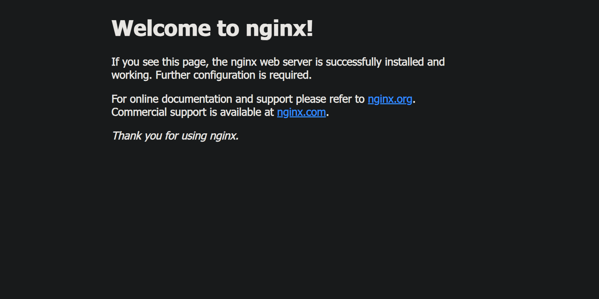
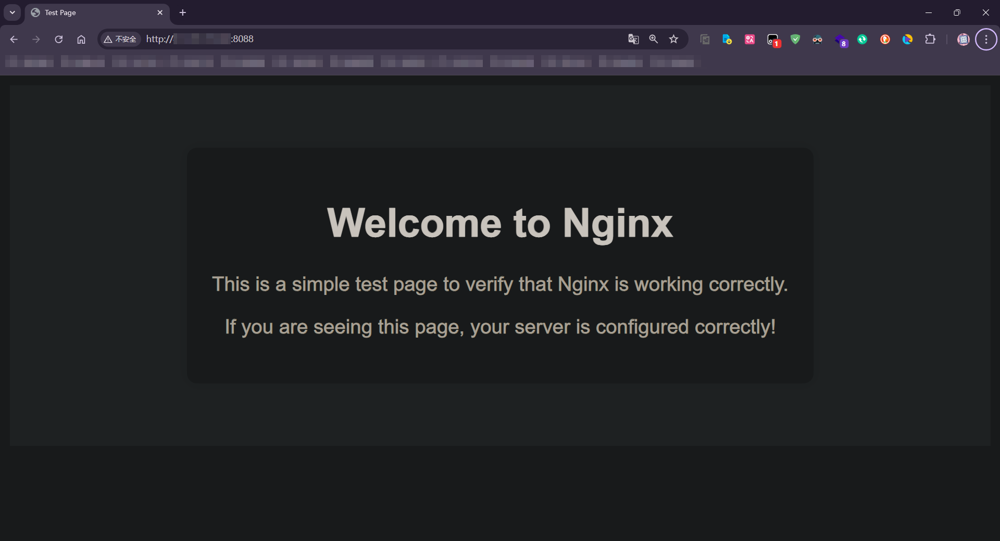
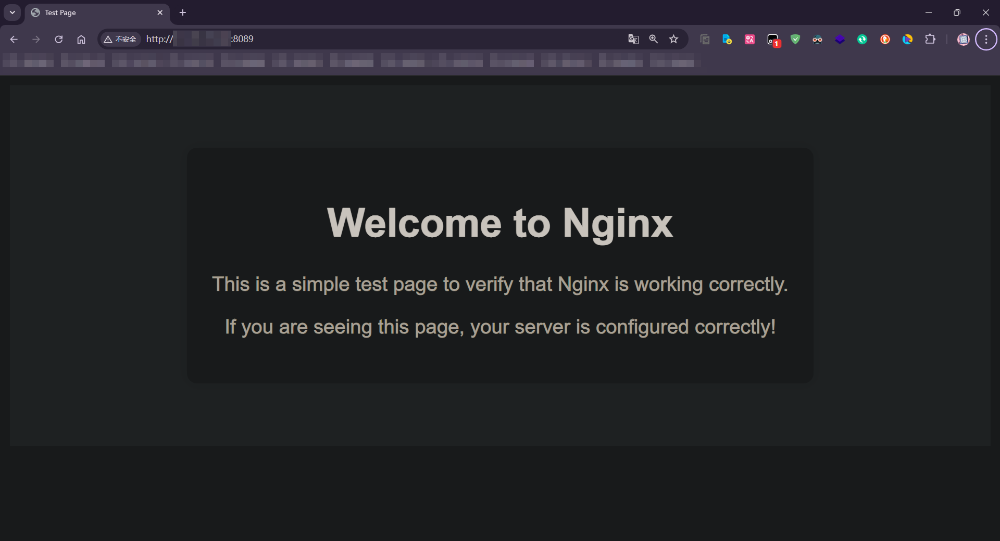
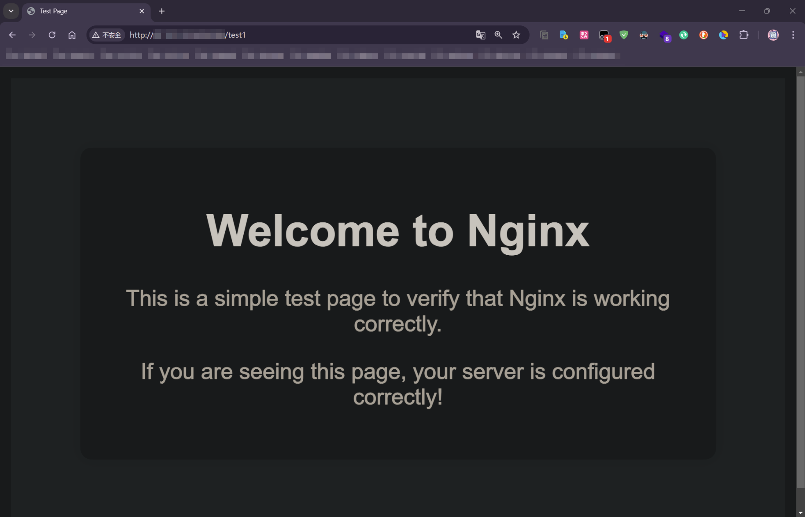
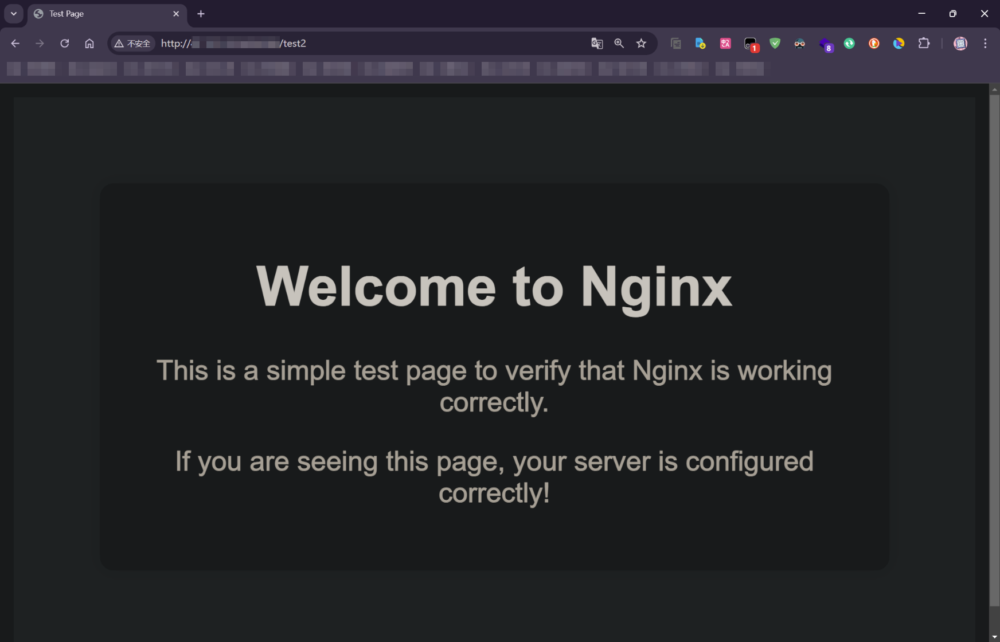
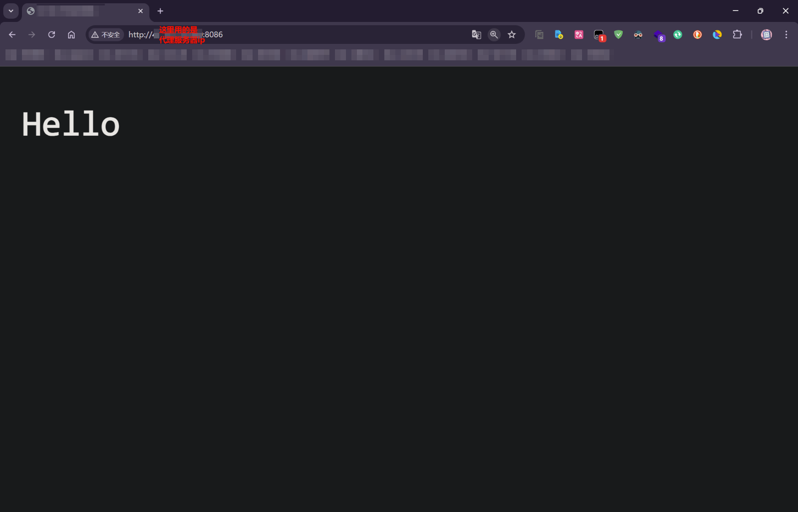
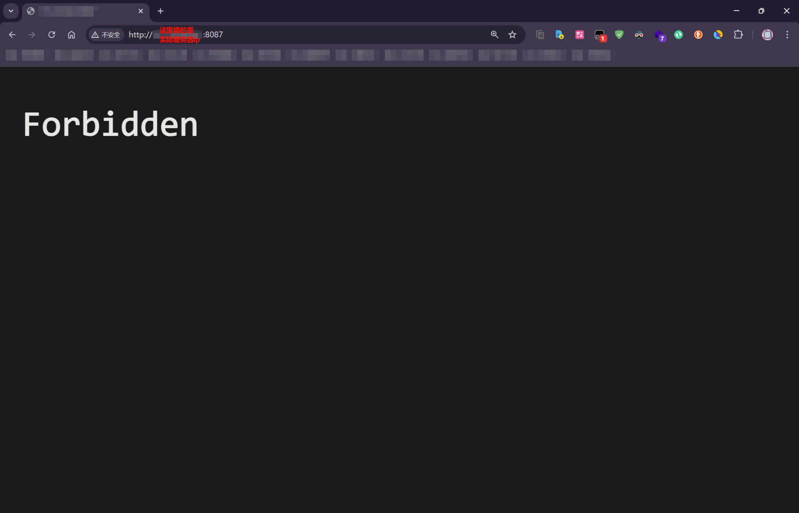

<style>
.heimu {
    position: relative;
    display: inline-block;
    color: transparent;
    text-decoration: none;
}
.heimu:: before {
    content: '';
    position: absolute;
    top: 0;
    left: 0;
    width: 100%;
    height: 100%;
    background-color: #333; /* 深色遮盖 */
    z-index: 1;
}
.heimu: hover:: before {
    background-color: transparent; /* 鼠标悬浮时移除深色遮盖 */
}
.heimu: hover {
    color: white ! important; /* 鼠标悬浮时显示白色文字 */
    text-shadow: none;
}
</style>


**如果本系列文章对您有帮助，可以 [star 一下我的 limou-learn-note](https://github.com/xiaogithubooo/LimouLearnNote)，求求惹(๑＞ ＜)☆♡~**

**叠甲：以下文章主要是依靠我的实际编码学习中总结出来的经验之谈，求逻辑自洽，不能百分百保证正确，有错误、未定义、不合适的内容请尽情指出！**

[TOC]

>   概要：...

>   资源：...

------

# 1.Nginx

`Nginx` 是一款自由、开源、高性能的 `HTTP` 服务器和反向代理服务器（正向代理代理客户端，反向代理代理服务端）。同时也是 一个 `IMAP, POP3, SMTP` 代理服务器。`Nginx` 可以作为一个 `HTTP` 服务器进行网站 的发布处理，也可以作为反向代理进行负载均衡的实现，这里展示关于 `Ubuntu` 下 `Nginx` 的使用。

>   注意：下列部分指令可能需要使用 `sudo` 权限，建议您全程带上 `sudo` 提升权限。

## 1.1.Nginx 的安装启动

```shell
# 安装和启动
# 安装 Nginx
apt install nginx -y

# 修改配置
$ vim /etc/nginx/sites-available/default
$ cat /etc/nginx/sites-available/default 
server {
        listen 80 default_server; # 修改为自己服务器上开放的端口号
        listen [::]:80 default_server;

        server_name 填您自己服务器的 ip 地址; # 修改自己服务器的 ip 地址

        root /usr/share/nginx/html; # 填写需要交给 nginx 托管的文件根目录
        
        index index.html index.htm index.nginx-debian.html;

        location / {
                try_files $uri $uri/ =404;
        }
}

# 启动 Nginx
$ systemctl start nginx
[root@alyubuntu cpu: 6.5% mem: 21.45% - ~] $ sudo systemctl status nginx
● nginx.service - A high performance web server and a reverse proxy server
     Loaded: loaded (/lib/systemd/system/nginx.service; enabled; vendor preset: enabled)
     Active: active (running) since Thu 2024-09-05 12:25:46 CST; 6s ago
       Docs: man:nginx(8)
    Process: 476705 ExecStartPre=/usr/sbin/nginx -t -q -g daemon on; master_process on; (code=exited, status=>
    Process: 476706 ExecStart=/usr/sbin/nginx -g daemon on; master_process on; (code=exited, status=0/SUCCESS)
   Main PID: 476707 (nginx)
      Tasks: 3 (limit: 4202)
     Memory: 3.3M
        CPU: 22ms
     CGroup: /system.slice/nginx.service
             ├─476707 "nginx: master process /usr/sbin/nginx -g daemon on; master_process on;"
             ├─476708 "nginx: worker process" "" "" "" "" "" "" "" "" "" "" "" "" "" "" "" "" "" "" "" "" "" >
             └─476709 "nginx: worker process" "" "" "" "" "" "" "" "" "" "" "" "" "" "" "" "" "" "" "" "" "" >

Sep 05 12:25:46 alyubuntu systemd[1]: Starting A high performance web server and a reverse proxy server...
Sep 05 12:25:46 alyubuntu systemd[1]: Started A high performance web server and a reverse proxy server.
```

然后就可以在浏览器中直接访问您的服务器。



## 1.2.Nginx 的相关目录

### 1.2.1.配置目录

上面我们简单配置了一个 `Nginx` 的配置文件，这里我们来深入学习这些配置语法，[相关的资料可以在 Nginx 官方文档中寻找](https://nginx.org/en/docs/)，这里我们 [跟着 Nginx 的新手教程来学习语法](https://nginx.org/en/docs/beginners_guide.html) 即可。

`Nginx` 文档里写的非常清楚，`Nginx` 由一个主进程和多个工作进程构成，内部采用事件驱动模型，什么叫事件驱动？这里其实就是指使用了多路转接的 `IO` 处理机制，也就是 `epoll()` 等接口。

知道大致的原理后，我们要添加配置或修改配置，应该知道配置文件的地址在哪里叭？

`Nginx` 及其模块的工作方式在配置文件中确定。默认情况下，配置文件名为 `nginx.conf` ，并放置在目录 `/usr/local/nginx/conf/` 或 `/etc/nginx/` 或 `/usr/local/etc/nginx/` 中。在我的 `Ubuntu20` 服务器中，这个目录就在 `/etc/nginx/` 下，我们就在这个目录下进行展开。

-   `/etc/nginx/sites-available/ (可用的服务)` 存放各个服务的配置文件
-   `/etc/nginx/sites-enabled/ (启用的服务)` 存放上一个目录中文件对应的符号链接

```shell
# 查看两个目录的内容
$ tree sites-available
sites-available
└── default

$ tree sites-enabled
sites-enabled
└── default -> /etc/nginx/sites-available/default
0 directories, 1 file
```

`/etc/nginx/sites-available/default` 是 `Nginx` 服务器的配置文件目录中的一个默认配置文件，这个文件提供一个默认的服务器配置，当您第一次安装 `Nginx` 时，它通常会自动生成并作为示例或模板，我们刚刚配置的就是这个文件。

为什么需要做一层链接隔离？主要是方便一些项目的快速启停部署，并且 `Nginx` 配置文件中有一个 `include` 指令，这个指令允许 `Nginx` 的配置文件进行模块化配置，将不同的虚拟主机放入同一个主 `Nging` 配置文件中进行统一管理（比如统一管理日志文件输出目录，除非个别主机做了个性化处理，因此 `Nginx` 其实也是有局部配置有限的概念的），在主配置文件中有以下这段代码。

```nginx
# 查看主配置文件中的 include 行的内容
$ cat nginx.conf | grep include
include /etc/nginx/modules-enabled/*.conf;
        include /etc/nginx/mime.types; # 这里都是一些 MIME 类型的映射
        include /etc/nginx/conf.d/*.conf; # 这里是一些 Nginx 的其他一些被拆分的配置
        include /etc/nginx/sites-enabled/*; # 重点看这里, 包含了我们需要启动的软链接
```

这样主配置就可以加载软连接对应的配置文件模块，部署多个服务。

>   补充：不过比较新版本的 `Nginx` 可以直接把配置文件放到 `/etc/nginx/conf.d/` 中，这样配置更加简单并且也方便，另外，这也是最通用方法，有的操作系统在不同版本下可能只有这一种设置方式。至于为什么会有两种配置，我找到 [一篇不算特别官方的文章](https://www.baeldung.com/linux/sites-available-sites-enabled-conf-d#header-318)，还有 [另外一篇个人博文](https://www.sunzhongwei.com/nginx-configuration-file-to-put-more-good-which-directories-sites-availableenabled-and-conf-d?from=random)，以及 [serverfault 上的讨论](https://serverfault.com/questions/527630/difference-in-sites-available-vs-sites-enabled-vs-conf-d-directories-nginx)，但是我觉得确实是有点道理的，有时间我看看文档验证一下。不过貌似最佳实践是使用 `/etc/nginx/conf.d/`，不过我觉得您两者都能理解是最好的。

### 1.2.2.日志目录

访问日志通常位于 `/var/log/nginx/access.log`，而错误日志通常位于 `/var/log/nginx/error.log`。

## 1.3.Nginx 的内部指令

要启动 `Nginx`，请运行 `nginx` 可执行文件，也就是 `nginx` 这个指令（不过上面我们使用的是 `systemd` 来进行托管的）。一旦 `nginx` 启动，可以通过调用带有 `-s` 参数的可执行文件来控制它。

```shell
# Nginx 的内部指令
$ nginx -s <signal> # 信号可以是以下之一
# 直接使用 nginx 什么都不带就按默认配置进行启动
# stop — 快速关闭
# quit — 优雅关闭
# reload — 重新加载配置文件, 这个过程中主进程会启动新的工作进程, 并向旧的工作进程发送消息, 请求它们关闭。否则主进程会回滚更改, 并继续使用旧的配置
# reopen — 重新打开日志文件
```

>   补充：还有一个常用指令就是 `sudo nginx -t` 可以检查配置文件是否存在语法问题，这个后面会用到。

## 1.4.Nginx 的配置结构

`Nginx` 配置文件由模块组成，这些模块由配置文件中指定的指令来控制。指令又分为简单指令和块指令。

-   简单指令由名称和用空格分隔的参数组成，并以分号 `;` 作为结束
-   块指令的结构则以一组大括号 `{` 和 `}` 包围作为结束。如果块指令可以在大括号内包含其他指令，则可以被称为上下文

而在 `Nginx` 中，在 `#` 符号之后的其余部分被视为注释。

## 1.5.Nginx 的主要用途

### 1.5.1.Nginx 的静态网站部署

一个重要的 `web` 服务器任务是提供文件（例如图像或静态 `HTML` 页面）。您将实现一个示例，根据请求，从不同的本地目录提供文件 `/data/www` （`HTML` 文件）和 `/data/images` （包含图像）。这将需要编辑配置文件，并在 `http` 块内设置一个服务器块，包含两个目录地址。

首先，创建 `~/data/www` 目录并将一个 `index.html` 文件放入其中，文件内容可以是任意文本，然后创建 `~/data/images` 目录并在其中放置一些图片。 

```html
<!-- index.html -->
<!DOCTYPE html>
<html lang="en">
<head>
    <meta charset="UTF-8">
    <meta name="viewport" content="width=device-width, initial-scale=1.0">
    <title>Test Page</title>
    <style>
        body {
            font-family: Arial, sans-serif;
            background-color: #f4f4f4;
            text-align: center;
            padding: 50px;
        }
        h1 {
            color: #333;
        }
        p {
            color: #666;
        }
        .container {
            background-color: white;
            padding: 20px;
            border-radius: 8px;
            box-shadow: 0 0 10px rgba(0, 0, 0, 0.1);
            display: inline-block;
        }
    </style>
</head>
<body>
    <div class="container">
        <h1>Welcome to Nginx</h1>
        <p>This is a simple test page to verify that Nginx is working correctly.</p>
        <p>If you are seeing this page, your server is configured correctly!</p>
    </div>
</body>
</html>

```

图片就放下面这两张图片把，分别命名为 `image1.jpg` 和 `image2.jpg` 再上传到服务器中。


接下来，打开配置文件，默认配置文件已经包含了几个 `server` 块的示例，大多数是被注释掉的。现在将所有这些块注释掉，并开始一个新的 `server` 块。

```shell
# 编写配置文件
http {
    server {
    }
}
```

通常配置文件可能包含几个由监听端口和服务器名称区分的 `server` 块（`server` 块可以看作是一台虚拟服务器主机），将以下 `location` 块添加到 `server` 块中。

```nginx
# 编写配置文件
server {
    # 配置 html 静态目录
    location / { # 所有以 / 开头的请求都被映射到 ~/data/www/ 目录中
        root /home/用户名/data/www;
    }

    # 配置 image 静态目录
    location /images/ { # 所有以 /images 开头的请求都被映射到 ~/data/images 目录中
        root /home/用户名/data;
    }
}
```

官网是这么直接进行配置，但是这个配置太过于简单，我们加一点料：

-   修改默认绑定的 `ip` 和默认指定的 `port`
-   修改不同错误码对应的响应网页
-   指定日志输出位置

```nginx
# 编写配置文件
server {
    # 绑定的 ip 和 port
    listen 您的开放port;
    server_name 您的公网ip; # 这里甚至可以配置域名(但是必须经过 DNS 解析)

    # 配置 html 静态目录
    location / { # 所有以 / 开头的请求都被映射到 ~/data/www/ 目录中
        root /home/用户名/data/www;
    }

    # 配置 image 静态目录
    location /images/ { # 所有以 /images 开头的请求都被映射到 ~/data/images 目录中
        root /home/用户名/data;
    }

    # 错误页面的配置
    error_page 404 /home/用户名/data/www/404.html;
    error_page 500 502 503 504 /home/用户名/data/www/50x.html;

    # 这里的 location = 表示精准匹配    
    location = /404.html {
        internal; # 设置 internal 可以确保上述路由只供 nginx 内部使用, 不会被用户直接访问(内部发生错误时才允许这些页面被用户看到)
    }

    # 这里的 location = 表示精准匹配    
    location = /50x.html {
        internal; # 设置 internal 可以确保上述路由只供 nginx 内部使用, 不会被用户直接访问(内部发生错误时才允许这些页面被用户看到)
    }
    
    # 配置访问日志
    access_log /home/用户名/data/www/access.log;

    # 配置错误日志
    error_log /home/用户名/data/www/error.log;
}
```

然后我们根据上述的文件模板，生成两份实际的配置文件，注意是两份，我希望教您配置一个 `Nginx` 部署多个服务（注意两个文件内的路径都需要填写具体的用户名，并且设置不同的端口，`ip` 可以填写为 `_` 表示允许任意人访问）。这两个文件 `test1.conf` 和 `test2.conf` 就配置到我们之前说的配置目录 `sites-available` 下吧，并且在 `sites-enabled` 中做个软连接。

```shell
# 开始部署多个虚拟主机
# 根据上述模板配置两个配置文件
$ cd /etc/nginx

$ sudo vim test1.conf
$ sudo vim test2.conf

# 创建符号链接
$ sudo ln -s /etc/nginx/sites-available/test1.conf /etc/nginx/sites-enabled/test1.conf
$ sudo ln -s /etc/nginx/sites-available/test2.conf /etc/nginx/sites-enabled/test2.conf

# 检查上述的创建结果
$ cd ..

$ tree sites-available
sites-available
├── default
├── test1.conf
└── test2.conf
0 directories, 3 files

$ tree sites-enabled
sites-enabled
├── default -> /etc/nginx/sites-available/default
├── test1.conf -> /etc/nginx/sites-available/test1.conf
└── test2.conf -> /etc/nginx/sites-available/test2.conf
0 directories, 3 files

# 检查服务器上是否有对应的实际资源
$ cd /home/您的用户名/data/www

$ ls
image1.jpg  image2.jpg  index.html

# 确保 Nginx 有权限访问该目录
$ sudo chmod 744 /home/ljp/data/www/*

# 修改启动用户, Nginx 默认的启动用户是 www-data, 这里修改配置为 root 比较简单点(理论上也可以直接使用该用户来启动 Nginx 的配置, 我没有试过, 您可以尝试一下, 毕竟这是一个 Nginx 下载的时候自动配置的账号)
$ cd /etc/nginx
$ head -n 2 /etc/nginx/nginx.conf
# user www-data; # 注释掉这个用户
user root; # 更换启动用户为 root

# 检查配置文件是否存在语法错误
$ sudo nginx -t
nginx: the configuration file /etc/nginx/nginx.conf syntax is ok
nginx: configuration file /etc/nginx/nginx.conf test is successful

# 配置文件中定义的日志文件无需创建, Nginx 会自动帮您创建好

# 重新启动 Nginx
$ sudo systemctl restart nginx

```

然后再使用浏览器进行查看，看看我们简单部署的 `index.html` 以及两张图片是否可以被访问。

>   补充：如果您是 `Centos` 一类的系统，并且查看错误日志出现权限问题，有可能是关于 `SELinux ` 的问题，您可以 [前往 stackoverflow 查看大家的讨论解决这个问题](https://stackoverflow.com/questions/31729212/nginx-root-index-html-forbidden-13-permission-denied)。若以上的解法均不可，则可以 [考虑看这一篇 csdn 博客的四种解法来解决](https://blog.csdn.net/onlysunnyboy/article/details/75270533)（我这里使用的就是里面的第一种解法）。






>   吐槽：另外，如果您传递的 `.jpg` 文件比较大，并且再仔细一点，就可以很明显看到一个现象，先请求的照片要优先被渲染，另外一张照片需要等待另外一张照片彻底渲染完毕后才可以进行渲染，我不太清楚这个是不是 `Nginx` 的多路转接造成的，以后再研究叭...

> 补充：如果您用过某些镜像网站，则会遇到下面这种资源页面，我写了一个类似的配置文件供您参考。下面的配置文件，配置了一个叫做 `taidiyun` 的项目网站，是我给 `10.41.1.3` 服务器中的 `lpx` 用户进行配置的。
>
> ```nginx
> # 配置资源静态网站, 并且配置一些 ip 屏蔽的配置
> server {
>     listen 8010;
>     server_name 10.41.1.3;
> 
>     autoindex on; # 启用目录列表
>     allow 10.41.128.57; # 添加允许的 IP 10.41.128.57
>     deny 10.0.0.0/8; # 屏蔽 10 开头的 IP 段(deny all 则可以屏蔽所有其他访问)
>     charset utf-8; # 保持终端字符集和这里一样即可(避免浏览器放回乱码)
> 
>     # 配置 html 静态目录, 使用 "/" 或者 "/taidiyun" 都可以访问静态资源
>     location / {
>         root /home/lpx/taidiyun;
>     }
> 
>     location /taidiyun {
>         root /home/lpx;
>     }
> 
>     # 重定向日志文件
>     access_log /home/lpx/access.log;
>     error_log /home/lpx/error.log;
> }
> 
> ```
>
> 这是一个最小示例，很多资源网站都是这么做的。

### 1.5.2.Nginx 的代理服务部署

只是配置静态网站的话，那么 `Nginx` 就会显得比较普通，实际上成为反向代理服务器才是 `Nginx` 最为出名的地方。这意味着客户端程序将请求先传递给被代理的服务器程序 `Nginx`，然后由代理服务器程序 `Nginx` 转交给真正的服务器程序，`Nginx` 从中获取响应后转发给客户端程序。

直接另起一个配置文件，把 `Nginx` 代理服务器的配置放入其中，我还特意准备了两台实际的服务器来做测试，一台是 `Ubuntu20(代理服务器)`，另外一台是 `Centos7(实际服务器)`。

从之前的经验来看，我们使用类似方式编写配置文件，并且将配置文件和对应软连接放到之前提到德两个目录中即可。不过由于我们是做代理服务器，因此还会添加一些还没怎么提及过的指令，这些指令会在注释中提及。

```nginx
# proxy_server.conf(代理服务器)
server {
    listen 8086;
    server_name 您代理服务器自己的公网ip;

    location / {
        proxy_pass http://实际服务器ip:8087/; # proxy_pass 其实就是把请求转发给别的服务器
    }

    location /test1 {
        proxy_pass http://127.0.0.1:8088/; # 代理之前配置的静态项目
    }
    
    location /test2 {
        proxy_pass http://127.0.0.1:8089/; # 代理之前配置的静态项目
    }
} # 整个配置文件相对于代理了三台服务器, 不过实际只是代理了一个远端服务器, 另外两个都是本地的

```

而我们的实际服务器采用 `Node.js` 来进行编写，这样编写的成本比较低，为了减少您的安装环境，您只需要使用 `sudo yum install node` 即可，然后使用 `node server.js` 即可运行实际服务器代码。

```js
const http = require('http');

const proxyIp = '填写您的代理服务器ip'; // 允许的代理服务器 IP 地址
const host = '0.0.0.0'; // 监听所有网络接口
const port = 8087;

const server = http.createServer((req, res) => {
    const clientIp = req.connection.remoteAddress;

    if (clientIp !== proxyIp) { // 如果请求的 ip 不是代理服务器就拒绝请求
        res.writeHead(403, {'Content-Type': 'text/plain'});
        res.end('Forbidden\n');
        return;
    }

    res.writeHead(200, {'Content-Type': 'text/plain'});
    res.end('Hello\n');
});

server.listen(port, host, () => {
    console.log(`Server running at http://${host}:${port}/`);
});

server.on('error', (err) => {
    console.error('Server error:', err);
});
```

好了，该有的都有了，打开两个服务器开始进行配置，先配置代理服务器叭~

```shell
# 代理服务器
$ sudo vim /etc/nginx/sites-available/proxy_server.conf

$ sudo ln -s /etc/nginx/sites-available/proxy_server.conf /etc/nginx/sites-enabled/proxy_server.conf

$ tree /etc/nginx/sites-available /etc/nginx/sites-enabled
/etc/nginx/sites-available
├── default
├── proxy_server.conf
├── test1.conf
└── test2.conf
/etc/nginx/sites-enabled
├── default -> /etc/nginx/sites-available/default
├── proxy_server.conf -> /etc/nginx/sites-available/proxy_server.conf
├── test1.conf -> /etc/nginx/sites-available/test1.conf
└── test2.conf -> /etc/nginx/sites-available/test2.conf

# 确保 Nginx 有权限访问该目录
$ sudo chmod 744 /home/ljp/data/www/*

# 确认启动用户为 root 而不是 Nginx 默认的启动用户 www-data
$ head -n 2 /etc/nginx/nginx.conf
# user www-data; # 注释掉这个用户
user root; # 更换启动用户为 root

# 检查配置文件是否存在语法错误
$ sudo nginx -t
nginx: the configuration file /etc/nginx/nginx.conf syntax is ok
nginx: configuration file /etc/nginx/nginx.conf test is successful

# 配置文件中定义的日志文件无需创建, Nginx 会自动帮您创建好

# 重新启动 Nginx
$ sudo systemctl restart nginx
```

```shell
# 实际服务器
# Centos7 的防火墙不是使用 ufw, 这里我给您留一个快速指引, 避免您去查阅某些文档的时间 hhhh
$ sudo systemctl status firewalld # 检查防火墙状态
$ sudo systemctl start firewalld # 如果防火墙没有运行就启动起来
$ sudo firewall-cmd --permanent --add-port=8087/tcp # 允许开放端口 8087
$ sudo firewall-cmd --reload # 重新加载防火墙规则
$ sudo firewall-cmd --list-ports # 验证端口是否开放

# 启动服务器
$ vim server.js 
$ node server.js 
Server running at http://0.0.0.0:8087/
```

可以看到，之前我们配置的项目也可以被正确访问（因为地址和之前不一样了），而且通过访问代理服务器得到了实际服务器的响应，并且其他机器是无法直接访问实际服务器的，我们的设置使得这种行为会返回 `403`，也就是 `禁止访问(Forbidden)` 的意思。









### 1.5.3.Nginx 的通用网关部署

`CGI(Common Gateway Interface, 通用网关接口)` 属于是一种比较老旧的技术设计了，`Fast-CGI` 是前者的改进，不过我暂时还没有体会到这种架构的好处，您可以简单看下下面文章临时了解以下，或者看看 `Nginx` 的官方文档，新手教程中最后一节就是，待补充...

-   https://blog.csdn.net/bigfaceCatzzZ/article/details/104660718

## 1.6.Nginx 的深入内容

好了，您一定大概了解到了 `Nginx` 的基本使用了，如果您希望再精进一步，可以 [尝试阅读 Nginx 的管理员指南文档](https://docs.nginx.com/nginx/admin-guide/) 获取更多的知识，待补充...

### 1.6.1.配置访问密码

https://blog.csdn.net/i12344/article/details/138459705

# 2.Tomcat

待补充...

------

>   结语：...

**如果本系列文章对您有帮助，可以 [star 一下我的 limou-learn-note](https://github.com/xiaogithubooo/LimouLearnNote)，求求惹(๑＞ ＜)☆♡~**
