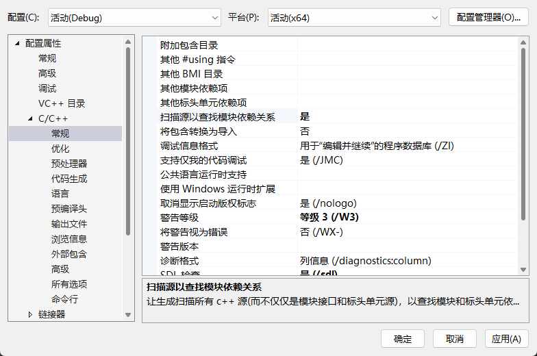

# 默认形参

```cpp
// 默认参数
#include <iostream>

void Func(int a, int b, int c = 10); // 必须是声明而不是定义, 并且默认值必须从后到前
void Func(int a, int b = 5, int c); // 并且不允许重写定义之前的定义过的默认值
void Func(int a = 0, int b, int c); // 所有的默认值会依照顺序依次传递下来
void Func(int a, int b, int c) {
	std::cout << a << " " << b << " " << c << std::endl;
}

int main() {
	Func();
	return 0;
}
```

# 成员指针

-   成员函数指针
-   成员变量指针

成员指针非常特殊，在某些场景下区别于其他指针。实际上成员变量指针（包括虚表成员变量指针和虚函数成员函数指针）并没有直接指向内存位置（或者说虚拟内存），而是表示在当前类中该字段的位置而已，是一个类似偏移量的东西，而成员函数指针是真的指向了内存地址。

>   注意：这里我们不加入 `static` 为讨论范围。

一般来说，成员指针无法脱离类的实例对象单独使用，但是如果您真的希望突破封装强制使用成员函数指针，则是很有可能的，但是请不要这么做。

```cpp
#include <iostream>

class Data {
public:
	void func() {
		std::cout << "Data::func()" << std::endl;
	}

	void f() {
		auto p = &Data::func; // 等价于 void (Data:: * p)() = &Data::func; 的写法
		(this->*p)(); // 这种写法也是支持的
	}
};

int main() {
	void(Data::*p)() = &Data::func;
	// 上面就可以取得成员函数指针存储到指针 p 中
	// 这里的 Data::*p 中的 Data:: 只是 Cpp 为了支持存储成员函数指针的一种语法而已
	// 实际的类型可以理解从 void (*p)() 变成了 void (Data::*p)()
	// 这也是为什么说成员指针比较特殊的一个例子

	Data d;
	(d.*p)(); // 语法规定 .* 必须作为一个整体来使用, 表示通过对象访问成员的操作
	return 0;
}

```

>   补充：我们之前提到过，`.*` 无法被重载，但是其实 `->*` 反倒能被重载，非常奇怪 hhhh

甚至也支持重载，只要区分好函数指针类型即可，非常好玩。

```cpp
#include <iostream>

class Data {
public:
	void func() {
		std::cout << "Data::func()" << std::endl;
	}

	void func(int num) {
		std::cout << "Data::func(int num)" << std::endl;
	}
};

void Function(Data& d, void (Data::*p)(int), int num) {
	(d.*p)(num); // 可以正确区分重载
}

int main() {
	Data d;
	Function(d, &Data::func, 1);
	return 0;
}

```

但是在有些情况下无法区分重载，一个典型的场景就是使用 `bind()` 的时候，因为 `bind()` 只需要传递函数的名字，无法确认是哪一个类型的重载版本，但是可以依靠 `static_cast<>()` 来明确类型，这种现象应该和 `bind()` 内部的实现有关。另外，使用 `std::invoke()` 也有类似的现象。

```cpp
#include <iostream>
#include <functional>

class Data {
public:
	void func() {
		std::cout << "Data::func()" << std::endl;
	}

	void func(int num) {
		std::cout << "Data::func(int num)" << std::endl;
	}
};

void Function(Data& d, void (Data::*p)(int), int num) {
	(d.*p)(num); // 可以正确区分重载
}

int main() {
	Data d;
	// auto n = std::bind(&Data::func, &d, 1); // 这种写法是无法通过编译的
	auto n = std::bind(static_cast<void(Data::*)(int)>(&Data::func), &d, 1); // 可以借助 static_cast<>() 来
	n();
	return 0;
}

```

```cpp
#include <iostream>
#include <functional>

class Data {
public:
    void func() {
        std::cout << "Data::func()" << std::endl;
    }

    void func(int num) {
        std::cout << "Data::func(int num)" << std::endl;
    }
};

int main() {
    Data d;
    std::invoke(static_cast<void(Data::*)(int)>(&Data::func), d, 1); // 这种情况也是类似 std::bind()
    return 0;
}

```

类似的成员变量指针也有的类似使用，我们这里简单使用一下，并且证明成员变量的确是某种偏移量。

```cpp
#include <iostream>
#include <functional>

class Data {
public:
    void func() {
        std::cout << "Data::func()" << std::endl;
    }

public:
    int a;
    int b;
    int c;
};

int main() {
    auto p1 = &Data::a;
    auto p2 = &Data::b;
    auto p3 = &Data::c;

    std::cout << *(reinterpret_cast<int*>(&p1)) << std::endl; // 0
    std::cout << *(reinterpret_cast<int*>(&p2)) << std::endl; // 4
    std::cout << *(reinterpret_cast<int*>(&p3)) << std::endl; // 8

    return 0;
}
```

# 自定义字面量

...

# 模块

>   警告：在使用模块之前，如果使用的是 `VS2022`，则还需要打开以下选项。
>
>   

模块解决了重复头文件包含步骤冗余的问题，提高了编译速度（宏防护符只能避免重复包含的结果，而无法解决重复替换的动作）。模块和命名空间是正交的，也就是互相独立不影响的，正常使用即可。模块文件通常有以下后缀：

*   `.ixx` 在 `Microsoft` 的 `MSVC` 编译器中常见
*   **`.mpp`** 一些编译器和开发者社区使用这个后缀
*   `.cppm` 这个后缀更符合 `C++` 文件的命名惯例，且被一些开发者所采用
*   仍然使用 `.cpp`，因为它们在很多方面与普通的 `Cpp` 源文件相似

模块使用起来非常简单，以下是简单的代码测试，使用 `export` 导出模块内容，使用 `import` 导入模块内容，使用 `export module ...` 声明一个模块文件，使用 `export import ...` 导出一个模块文件。

```cpp
// test_model.cppm
export module tese_model;

import <iostream>; // 等价于 #include <iostream>

int a = 10; // 对外隐藏对内可以使用

export namespace my_test {
void Func(int num) {
	std::cout << "Hello, C++20 and num = " << num << std::endl;
}

int b = a;
} // namespace my_test end
```

```cpp
// main.cpp
import tese_model; // 导入模块

int main() {
    my_test::Func(); // 使用模块中的函数
    return 0;
}
```

多个模块的请款下

```cpp
// a.cppm
export module A;

export char const* hello() { return "hello"; }
```

```cpp
// b.cppm
export module B;

export import A; // 导出别的模块
export char const* world() { return "world"; }
```

```cpp
// main.cpp
import <iostream>;
import B;

int main() {
    std::cout << hello() << ' ' << world() << '\n';
    return 0;
}
```

也可以结合命名空间和 `export{}` 序列写出更加简洁的代码。

```cpp
// test_model.cppm
export module tese_model;

import <iostream>;

int a = 10; // 对外隐藏对内可以使用

export namespace my_test {
void Func(int num) {
	std::cout << "Hello, C++20 and num = " << num << std::endl;
}

int b = a;
} // namespace my_test end
```

```cpp
// main.cpp
import tese_model;

int main() {
    my_test::Func(my_test::b); // 无法直接使用 a
    // Func(a); // 无法直接这么使用
    return 0;
}
```

```cpp
// a.cppm
export module A;

export char const* hello() { return "hello"; }
```

也可以做出类似 `include` 的声明定义分离的做法。

```cpp
// test.cppm(模块内容声明部分)
export module A;

export const char* Hello();
export const char* World();

```

```cpp
// test_lib_1.cppm(模块内容定义部分)
export module A;

export const char* Hello() { return "hello "; }

```

```cpp
// test_lib_2.cppm(模块内容定义部分)
export module A;

export const char* World() { return "world\n"; }

```

```cpp
// main.cpp(使用模块)
import <iostream>;
import A;

int main() {
    std::cout << Hello() << World();
    return 0;
}

```

一个模块声明可以拥有多个模块定义，这取决于您的使用。不过更加规范的写法，是使用模块分区。

```cpp
// test_lib_1.cppm(模块内容定义部分)
export module A:a;

export const char* Hello() { return "hello "; }

```

```cpp
// test_lib_2.cppm(模块内容定义部分)
export module A:b;

export const char* World() { return "world\n"; }

```

```cpp
// test.cppm(模块内容声明部分)
export module A;

export const char* Hello();
export const char* World();
 
import:a;
import:b;

```

```cpp
// main.cpp(使用模块)
import <iostream>;
import A;

int main() {
    std::cout << Hello() << World();
    return 0;
}

```

